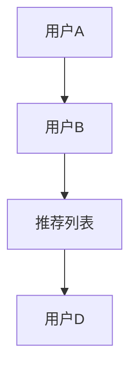
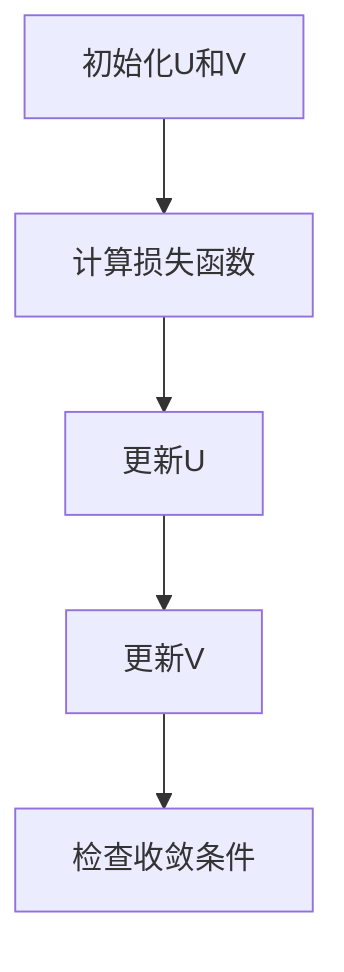
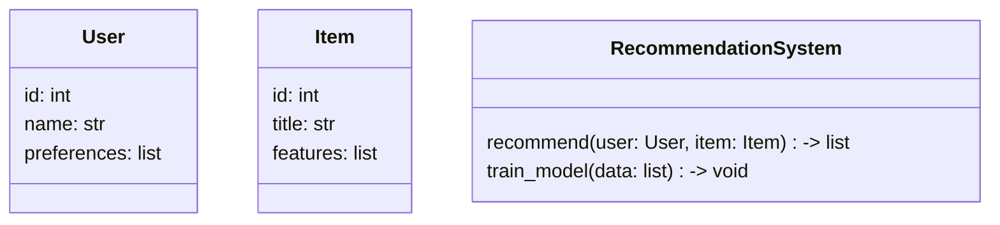
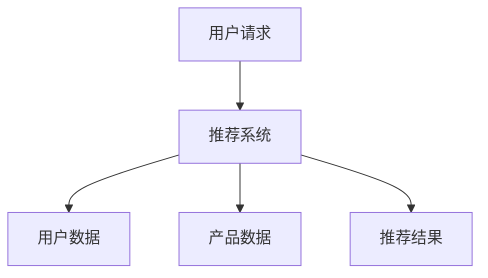

                 


# AI辅助产品推荐与个性化服务的算法与实现

## 关键词：AI推荐系统、个性化服务、协同过滤、矩阵分解、深度学习

## 摘要：  
本文详细探讨了AI在产品推荐和个性化服务中的应用，从推荐系统的背景、核心概念、算法原理到系统架构和项目实战，层层剖析，帮助读者全面理解AI辅助推荐的实现过程。文章结合理论与实践，通过具体案例分析和代码实现，深入讲解了协同过滤、矩阵分解等核心算法，并提供了系统设计与优化的思路。

---

# 第一部分: AI辅助推荐系统的背景与核心概念

## 第1章: 问题背景与核心概念

### 1.1 问题背景

#### 1.1.1 传统推荐系统面临的挑战
传统的推荐系统在面对海量数据时，常常面临以下挑战：
- 数据稀疏性：用户行为数据分布不均，导致推荐结果不够准确。
- 计算复杂度：大规模数据处理需要高效的算法支持。
- 用户偏好变化：用户的兴趣会随时间变化，推荐系统需要动态调整。

#### 1.1.2 AI技术如何解决推荐问题
人工智能技术，尤其是机器学习和深度学习，为推荐系统提供了强大的工具：
- **协同过滤**：基于用户行为数据，发现用户之间的相似性。
- **内容推荐**：通过产品属性提取特征，实现精准推荐。
- **混合推荐模型**：结合多种推荐方法，提升推荐效果。

#### 1.1.3 个性化服务的市场需求
个性化服务已经成为企业差异化竞争的关键，AI推荐系统能够：
- 提高用户满意度
- 增加用户粘性
- 提升转化率

### 1.2 问题描述

#### 1.2.1 产品推荐的核心问题
- 如何从海量产品中筛选出用户感兴趣的产品。
- 如何解决数据稀疏性问题，提升推荐准确性。

#### 1.2.2 个性化服务的定义与目标
个性化服务是指根据用户的行为、偏好和特征，提供定制化的产品或内容。其目标是：
- 提高用户体验
- 增加用户活跃度
- 实现精准营销

#### 1.2.3 问题解决的边界与外延
- **边界**：仅关注用户与产品的交互数据。
- **外延**：结合上下文信息（如时间、地点）提升推荐效果。

### 1.3 核心概念与组成

#### 1.3.1 推荐系统的组成要素
- **用户数据**：用户的点击、收藏、购买等行为数据。
- **产品数据**：产品的属性信息，如类别、价格、评价等。
- **推荐算法**：基于数据的推荐方法，如协同过滤、矩阵分解等。
- **推荐结果**：最终输出的推荐列表。

#### 1.3.2 个性化服务的实现流程
1. 数据采集：获取用户行为和产品信息。
2. 数据预处理：清洗和特征提取。
3. 模型训练：构建推荐算法。
4. 推荐生成：输出个性化推荐结果。
5. 效果评估：验证推荐效果。

#### 1.3.3 核心概念的结构化分析
推荐系统的核心是**用户-产品关系**，通过分析用户的偏好和产品的属性，构建用户和产品之间的关联模型。

---

## 第2章: 推荐系统的核心原理

### 2.1 推荐系统的类型

#### 2.1.1 基于协同过滤的推荐
协同过滤是一种基于用户相似性进行推荐的方法，分为**基于用户的协同过滤（UBCF）**和**基于物品的协同过滤（IBCF）**：
- **UBCF**：通过计算用户之间的相似性，将相似用户的偏好作为推荐依据。
- **IBCF**：通过计算物品之间的相似性，将相似物品的偏好作为推荐依据。

#### 2.1.2 基于内容的推荐
基于内容的推荐系统通过分析产品的属性特征，生成与用户兴趣匹配的产品推荐。例如，通过文本挖掘提取产品描述的关键词。

#### 2.1.3 混合推荐模型
混合推荐模型结合了协同过滤和内容推荐的优势，通过集成多种推荐方法，提升推荐效果。

### 2.2 核心概念对比分析

#### 2.2.1 不同推荐方法的对比表格
| 方法       | 优势                     | 劣势                     |
|------------|--------------------------|--------------------------|
| 协同过滤    | 数据稀疏性低             | 计算复杂度高             |
| 基于内容的推荐 | 特征提取精准             | 需要高质量的产品数据     |
| 混合推荐    | 结合多种方法，效果最佳     | 实现复杂度高             |

#### 2.2.2 推荐系统的ER实体关系图
```mermaid
er
actor: 用户
item: 产品
recommendation_system: 推荐系统
actor -[1..n]-> item
actor -[1..n]-> recommendation_system
recommendation_system -[1..n]-> item
```

### 2.3 本章小结
本章介绍了推荐系统的类型和核心概念，重点对比了协同过滤、基于内容的推荐和混合推荐模型的优缺点，并通过ER图展示了推荐系统的实体关系。

---

## 第3章: 协同过滤算法原理

### 3.1 协同过滤的数学模型

#### 3.1.1 用户相似度计算公式
$$相似度 = \frac{\sum (r_{u,i} - \bar{r_u})(r_{v,i} - \bar{r_v})}{\sqrt{\sum (r_{u,i} - \bar{r_u})^2} \sqrt{\sum (r_{v,i} - \bar{r_v})^2}}$$
其中：
- $r_{u,i}$ 表示用户u对物品i的评分
- $\bar{r_u}$ 表示用户u的平均评分

#### 3.1.2 基于用户的协同过滤流程图


#### 3.1.3 协同过滤的优缺点
- **优点**：简单易实现，计算用户相似性直观。
- **缺点**：计算复杂度高，难以处理大规模数据。

### 3.2 矩阵分解算法

#### 3.2.1 矩阵分解的基本原理
矩阵分解是一种将用户-产品评分矩阵分解为用户特征矩阵和产品特征矩阵的方法，常用算法包括SVD（奇异值分解）和ALS（交替最小二乘法）。

#### 3.2.2 矩阵分解的数学模型
$$X = U \cdot V^T$$
其中：
- $X$ 是用户-产品评分矩阵
- $U$ 是用户特征矩阵
- $V$ 是产品特征矩阵

#### 3.2.3 矩阵分解的优化过程


### 3.3 协同过滤算法实现代码

```python
import numpy as np

def user_based_collaborative_filtering(ratings, user_id, item_id):
    # 计算用户平均评分
    user_mean = ratings.groupby('user_id')['rating'].mean()
    item_mean = ratings.groupby('item_id')['rating'].mean()
    
    # 计算用户相似度矩阵
    similarity_matrix = ratings.pivot_table(index='user_id', columns='item_id', values='rating', fill_value=0)
    similarity_matrix = similarity_matrix.T.corr()
    
    # 根据相似度矩阵生成推荐列表
    user_ratings = similarity_matrix[user_id]
   推荐列表 = []
    for item in range(len(user_ratings)):
        if user_ratings[item] > 0 and item != user_id:
            推荐列表.append(item)
    return 推荐列表

# 示例数据
data = {
    'user_id': [1, 2, 3, 1, 2, 3],
    'item_id': [101, 101, 102, 102, 103, 103],
    'rating': [5, 4, 3, 2, 5, 4]
}
df = pd.DataFrame(data)
result = user_based_collaborative_filtering(df, 1, 101)
print("推荐列表:", result)
```

### 3.4 本章小结
本章详细讲解了协同过滤算法的数学模型和实现过程，并通过代码示例展示了如何基于用户相似性进行推荐。

---

## 第4章: 矩阵分解算法实现

### 4.1 矩阵分解的数学模型

#### 4.1.1 SVD分解
SVD是一种经典的矩阵分解方法，其核心思想是将用户-产品矩阵分解为两个低维矩阵，分别表示用户和产品的特征。

#### 4.1.2 ALS优化方法
ALS（Alternating Least Squares）是一种基于交替优化的矩阵分解方法，适用于大规模数据。

### 4.2 矩阵分解的实现代码

```python
from sklearn.decomposition import TruncatedSVD

def matrix_factorization(X, rank=5):
    # 初始化分解器
    svd = TruncatedSVD(n_components=rank)
    # 分解矩阵
    U = svd.fit_transform(X)
    V = svd.components_.T
    return U, V

# 示例数据
X = np.array([[4, 3, 0], [5, 0, 0], [1, 2, 0]], dtype='float64')
U, V = matrix_factorization(X, rank=2)
print("U矩阵:", U)
print("V矩阵:", V)
```

### 4.3 本章小结
本章介绍了矩阵分解的基本原理和实现方法，并通过代码示例展示了如何利用SVD和ALS进行推荐。

---

## 第5章: 系统分析与架构设计

### 5.1 问题场景介绍
个性化推荐系统需要解决以下问题：
- 如何高效处理大规模数据
- 如何实时生成推荐结果
- 如何保证推荐的准确性和多样性

### 5.2 系统功能设计

#### 5.2.1 领域模型设计


#### 5.2.2 系统架构设计


### 5.3 本章小结
本章通过领域模型和系统架构图展示了推荐系统的整体设计，并强调了模块划分和交互流程的重要性。

---

## 第6章: 项目实战与实现

### 6.1 环境安装

```bash
pip install numpy pandas scikit-learn
```

### 6.2 核心实现代码

```python
import pandas as pd
from sklearn.decomposition import TruncatedSVD

def main():
    # 示例数据加载
    data = {
        'user_id': [1, 2, 3, 1, 2, 3],
        'item_id': [101, 101, 102, 102, 103, 103],
        'rating': [5, 4, 3, 2, 5, 4]
    }
    df = pd.DataFrame(data)
    
    # 矩阵分解
    X = df.pivot_table(index='user_id', columns='item_id', values='rating', fill_value=0)
    X = X.T
    svd = TruncatedSVD(n_components=2)
    U = svd.fit_transform(X)
    V = svd.components_.T
    
    # 推荐结果
    user_id = 1
    user_feature = U[user_id]
   推荐列表 = []
    for item in range(len(V)):
        item_feature = V[item]
        similarity = np.dot(user_feature, item_feature)
        if similarity > 0.5:
            推荐列表.append(item)
    print("推荐列表:", 推荐列表)

if __name__ == "__main__":
    main()
```

### 6.3 本章小结
本章通过具体代码实现展示了如何构建一个简单的推荐系统，并分析了其实现过程和效果。

---

## 第7章: 总结与最佳实践

### 7.1 总结
- AI辅助推荐系统的核心是通过数据分析和算法优化，实现精准的个性化推荐。
- 协同过滤和矩阵分解是两种经典的推荐算法，各有优缺点。

### 7.2 最佳实践 Tips
1. **数据预处理**：清洗和特征提取是提升推荐效果的关键。
2. **模型优化**：结合多种推荐方法，提升推荐准确性和多样性。
3. **实时性优化**：采用分布式计算和缓存技术，提升推荐系统的响应速度。

### 7.3 未来趋势
- **深度学习推荐**：基于神经网络的推荐模型（如DeepFM）将成为主流。
- **实时推荐**：结合实时数据流，提升推荐的实时性和准确性。

### 7.4 扩展阅读
- 《推荐系统实践》
- 《机器学习实战》

---

通过本文的详细讲解，读者可以全面掌握AI辅助推荐系统的实现方法，并能够结合实际需求，设计和优化个性化推荐系统。

