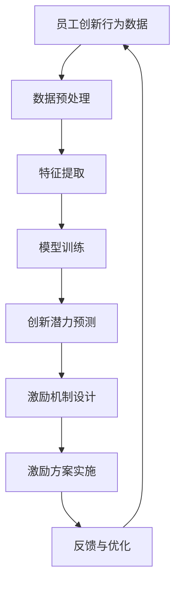
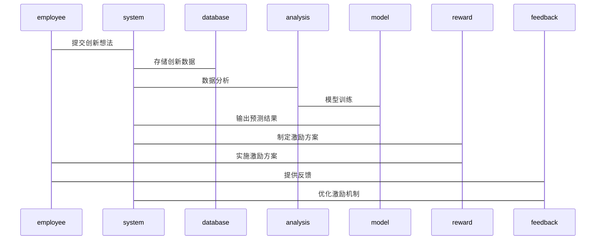

                 


# AI辅助企业创新文化培养：创新活动参与度分析与激励机制

## 关键词：AI、企业创新、参与度分析、激励机制、文化培养、数据分析、机器学习

## 摘要：  
本文探讨了如何利用人工智能技术辅助企业创新文化培养，重点分析了创新活动参与度的评估方法，并提出了一套基于AI的激励机制设计框架。通过数据驱动的方法，本文揭示了员工创新行为的内在规律，为企业构建智能化的创新管理体系提供了理论和实践指导。

---

# 第一章：企业创新文化与AI的结合

## 1.1 企业创新文化的定义与重要性

### 1.1.1 企业创新文化的定义  
企业创新文化是指企业在经营过程中形成的鼓励创新、包容失败、追求进步的文化氛围。它是企业持续发展的重要驱动力，能够激发员工的创造力和主动性。

### 1.1.2 创新文化在企业中的作用  
- 创新文化能够提升企业的核心竞争力。  
- 创新文化能够增强员工的归属感和幸福感。  
- 创新文化是企业应对市场变化的重要保障。  

### 1.1.3 AI在创新文化中的潜力  
- AI能够帮助企业高效分析创新数据。  
- AI能够为企业提供个性化的创新激励方案。  
- AI能够优化创新流程，提高创新效率。  

---

## 1.2 传统企业创新面临的挑战

### 1.2.1 创新资源分配不均的问题  
传统企业中，创新资源往往集中在少数人手中，导致创新潜力无法充分释放。  

### 1.2.2 员工创新积极性的激发难点  
员工缺乏明确的创新方向和激励机制，导致创新积极性不高。  

### 1.2.3 创新活动的评估与反馈机制缺失  
企业难以准确评估创新活动的效果，缺乏有效的反馈机制。  

---

## 1.3 AI技术对企业创新文化的推动作用

### 1.3.1 数据驱动的创新分析  
AI可以通过数据分析技术，帮助企业识别创新趋势和潜力点。  

### 1.3.2 AI辅助的创新激励机制  
AI可以根据员工的创新行为数据，制定个性化的激励方案。  

### 1.3.3 智能化的创新过程管理  
AI可以优化创新流程，提高创新效率，降低创新成本。  

---

# 第二章：创新活动参与度分析的核心概念

## 2.1 创新活动参与度的定义与维度

### 2.1.1 创新活动参与度的定义  
创新活动参与度是指员工在企业创新活动中表现出的积极性和贡献程度。  

### 2.1.2 参与度的维度分析  
- **行为维度**：员工参与创新活动的频率和深度。  
- **能力维度**：员工在创新活动中的专业能力和创新能力。  
- **态度维度**：员工对创新活动的态度和价值观。  

### 2.1.3 核心要素组成  
- **数据采集**：通过问卷、日志等方式获取员工创新行为数据。  
- **数据分析**：利用AI技术对数据进行挖掘和分析。  
- **结果反馈**：将分析结果反馈给员工和管理者。  

---

## 2.2 创新激励机制的原理

### 2.2.1 激励机制的基本原理  
激励机制是通过奖惩措施激发员工创新行为的过程。  

### 2.2.2 激励机制与创新活动的关系  
- 激励机制能够提高员工的创新积极性。  
- 激励机制能够增强员工的创新能力和创新成果。  

### 2.2.3 激励机制的分类与特点  
- **物质激励**：奖金、股权等。  
- **精神激励**：表彰、晋升等。  
- **目标激励**：设定明确的创新目标。  

---

## 2.3 创新活动参与度与激励机制的联系

### 2.3.1 参与度分析与激励机制的相互作用  
- 参与度分析为激励机制的设计提供数据支持。  
- 激励机制能够反过来影响员工的创新参与度。  

### 2.3.2 数据驱动的激励机制设计  
- 基于员工创新行为数据，制定个性化的激励方案。  
- 通过数据分析，优化激励机制的效果。  

### 2.3.3 智能化激励机制的优势  
- 智能化激励机制能够实时反馈员工的创新行为。  
- 智能化激励机制能够根据员工需求动态调整激励策略。  

---

# 第三章：创新活动参与度分析与激励机制的核心概念与联系

## 3.1 创新活动参与度分析的核心概念

### 3.1.1 数据驱动的分析方法  
- 利用AI技术对员工创新行为数据进行分析。  
- 通过数据挖掘技术发现创新趋势和潜力点。  

### 3.1.2 参与度分析的关键指标  
- 创新行为频率：员工参与创新活动的次数。  
- 创新成果质量：员工创新成果的影响力和价值。  
- 创新潜力预测：基于数据预测员工未来的创新潜力。  

### 3.1.3 分析模型的设计与选择  
- **回归分析**：预测创新行为的影响因素。  
- **聚类分析**：将员工分成不同的创新群体。  
- **时间序列分析**：分析创新行为的时间变化趋势。  

---

## 3.2 激励机制的核心概念

### 3.2.1 激励机制的设计原则  
- **公平性**：激励机制应公平合理。  
- **个性化**：激励机制应根据员工特点制定。  
- **动态性**：激励机制应根据情况变化调整。  

### 3.2.2 激励机制的实现方式  
- **积分制**：通过积分奖励员工创新行为。  
- **项目制**：将创新活动分解为具体项目，给予激励。  
- **反馈制**：及时反馈员工的创新成果和激励效果。  

---

## 3.3 创新活动参与度分析与激励机制的联系

### 3.3.1 数据分析与激励机制的双向作用  
- 数据分析为激励机制提供依据。  
- 激励机制促进数据分析的准确性。  

### 3.3.2 数据驱动的激励机制设计  
- 基于数据分析结果，制定激励策略。  
- 利用数据实时调整激励机制。  

### 3.3.3 智能化激励机制的优势  
- 智能化激励机制能够精准识别员工需求。  
- 智能化激励机制能够动态优化激励效果。  

---

## 3.4 创新活动参与度分析与激励机制的对比分析

### 3.4.1 概念对比表  

| 概念维度       | 创新活动参与度分析       | 激励机制设计       |
|----------------|--------------------------|--------------------|
| 核心目标       | 分析员工创新行为         | 激发员工创新行为   |
| 主要方法       | 数据分析、模型构建       | 奖励、反馈、目标设定 |
| 输出结果       | 创新行为报告、潜力预测   | 激励方案、反馈机制 |

---

## 3.5 创新活动参与度分析与激励机制的ER实体关系图

```mermaid
erDiagram
    employee {
        id
        name
        role
        innovation_score
    }
    innovation_activity {
        id
        employee_id
        activity_type
        timestamp
        score
    }
    innovation_project {
        id
        title
        leader_id
        start_date
        end_date
        status
    }
    reward {
        id
        employee_id
        reward_type
        amount
        reason
    }
```

---

## 3.6 创新活动参与度分析与激励机制的流程图



---

## 3.7 创新活动参与度分析与激励机制的数学模型

### 3.7.1 创新潜力预测模型

$$ \text{创新潜力} = \beta_0 + \beta_1 \times \text{创新行为频率} + \beta_2 \times \text{创新成果质量} + \epsilon $$

其中：
- $\beta_0$ 是截距项。  
- $\beta_1$ 和 $\beta_2$ 是回归系数。  
- $\epsilon$ 是误差项。  

### 3.7.2 激励效果评估模型

$$ \text{激励效果} = \alpha \times \text{激励强度} + \beta \times \text{激励方式} + \gamma \times \text{员工反馈} $$

---

## 3.8 创新活动参与度分析与激励机制的系统架构图


---

## 3.9 创新活动参与度分析与激励机制的系统流程图



---

## 3.10 创新活动参与度分析与激励机制的项目实战

### 3.10.1 环境安装

```bash
pip install numpy pandas scikit-learn matplotlib
```

### 3.10.2 核心代码实现

```python
import numpy as np
import pandas as pd
from sklearn.linear_model import LinearRegression

# 数据加载
data = pd.read_csv('innovation.csv')

# 特征提取
X = data[['behavior_frequency', '成果_quality']]
y = data['创新潜力']

# 模型训练
model = LinearRegression()
model.fit(X, y)

# 预测创新潜力
predicted = model.predict(X)

# 输出结果
print('回归系数:', model.coef_)
print('决定系数:', model.score(X, y))
```

### 3.10.3 项目总结

通过本项目，我们利用AI技术实现了创新活动参与度的分析与激励机制的设计，为企业构建智能化的创新管理体系提供了有力支持。

---

## 第四章：总结与最佳实践

### 4.1 总结

本文探讨了AI在企业创新文化培养中的应用，分析了创新活动参与度的评估方法，并提出了基于AI的激励机制设计框架。通过数据驱动的方法，本文为企业的创新管理提供了理论和实践指导。

### 4.2 最佳实践 tips

- **数据隐私**：在处理员工数据时，必须遵守相关法律法规，保护员工隐私。  
- **模型迭代**：定期更新模型，确保分析结果的准确性。  
- **员工反馈**：及时收集员工反馈，优化激励机制。  

### 4.3 拓展阅读

- **相关书籍**：《企业创新管理》、《人工智能与管理》  
- **学术论文**：搜索相关领域的最新研究成果。  

### 4.4 注意事项

- 创新文化培养是一个长期过程，需要企业的持续投入。  
- 激励机制设计应结合企业实际情况，避免一刀切。  

### 4.5 小结

通过本文的探讨，我们看到了AI在企业创新文化培养中的巨大潜力，但也需要在实践中不断探索和优化。未来，随着AI技术的不断发展，企业创新文化培养将更加智能化、个性化和高效化。

--- 

# END

