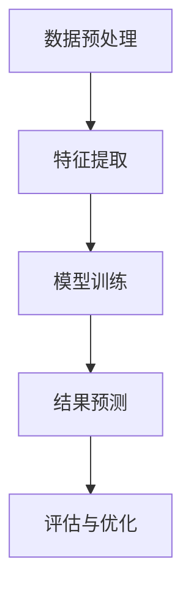
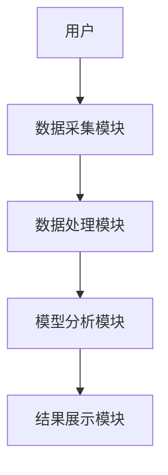
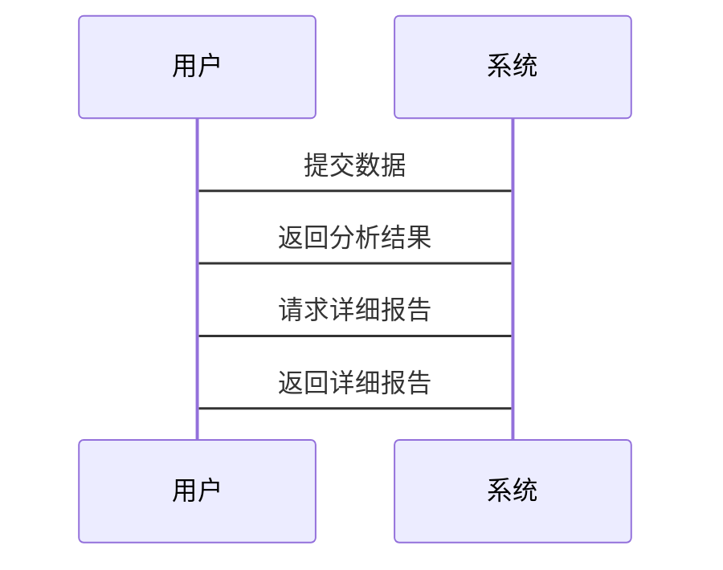

                 


# AI辅助企业创新文化评估：定量与定性指标分析的智能化

## 关键词：AI，企业创新，文化评估，定量指标，定性指标，智能化

## 摘要：本文探讨了如何利用人工智能技术对企业创新文化进行智能化评估，结合定量和定性指标，分析企业创新文化的核心要素，并提出基于AI的解决方案，以实现更精准和高效的评估。

---

## 第一部分: 企业创新文化评估的背景与挑战

### 第1章: 企业创新文化评估的背景与问题

#### 1.1 企业创新文化的定义与重要性

- **1.1.1 企业创新文化的定义**
  企业创新文化是指企业在经营过程中，鼓励员工创新、勇于尝试新思路和新技术的企业氛围和价值观。

- **1.1.2 创新文化对企业发展的核心作用**
  - 促进企业竞争力提升
  - 提高员工创造力和满意度
  - 推动企业可持续发展

- **1.1.3 数字化转型中的创新文化挑战**
  - 数字化转型需要快速适应新技术和商业模式
  - 创新文化评估的复杂性增加

#### 1.2 传统企业创新评估的局限性

- **1.2.1 定量评估的不足**
  - 数据来源单一
  - 难以全面反映创新文化

- **1.2.2 定性评估的难点**
  - 主观性强
  - 难以量化

- **1.2.3 综合评估的复杂性**
  - 需要多维度分析
  - 数据整合难度大

#### 1.3 AI技术在企业创新评估中的应用前景

- **1.3.1 AI技术的核心优势**
  - 数据处理能力强
  - 智能分析能力突出

- **1.3.2 AI辅助评估的主要应用场景**
  - 数据驱动的决策支持
  - 智能化分析工具

- **1.3.3 未来发展趋势与潜力**
  - 技术不断进步
  - 应用场景不断拓展

---

## 第二部分: AI辅助企业创新文化评估的核心概念

### 第2章: 创新文化评估的指标体系

#### 2.1 定量指标

- 创新投入：研发经费、员工培训等
- 创新产出：专利数量、新产品数量
- 创新效率：创新周期、成果转化率

#### 2.2 定性指标

- 企业文化氛围：员工满意度、创新意识
- 组织结构：扁平化、团队协作
- 创新领导力：领导层对创新的支持程度

#### 2.3 综合指标

- 创新文化指数：综合定量和定性指标
- 创新能力评估：企业整体创新能力

### 第3章: AI模型在评估中的角色

#### 3.1 数据驱动的模型构建

- 数据采集：企业内部数据、外部市场数据
- 数据清洗：处理缺失值、异常值
- 数据建模：机器学习算法、深度学习模型

#### 3.2 智能化分析工具

- 自然语言处理：分析企业文档、员工反馈
- 数据可视化：直观展示创新文化评估结果
- 可视化报告：生成定制化报告

#### 3.3 可视化展示与反馈

- 数据可视化图表：折线图、柱状图、热力图
- 交互式仪表盘：实时监控创新文化指标
- 结果反馈：提供改进建议和行动指南

---

## 第三部分: AI辅助评估的算法与数学模型

### 第4章: 算法原理与数学模型

#### 4.1 机器学习算法

- 线性回归模型：
  $$ y = \beta_0 + \beta_1x + \epsilon $$
- 支持向量机(SVM)：
  $$ \text{最大化} \sum_{i=1}^n y_i (w \cdot x_i + b) - 1 $$
- 随机森林：
  - 通过多个决策树进行投票或平均

#### 4.2 自然语言处理技术

- 分词：将文本分割成词语或短语
- 词嵌入：将词语转换为向量表示（如Word2Vec）
- 情感分析：识别文本中的情感倾向

#### 4.3 统计分析方法

- 聚类分析：K-means算法
- 因子分析：提取潜在变量
- 回归分析：建立变量之间的关系模型

#### 4.4 算法流程图


#### 4.5 算法实现代码示例

```python
import pandas as pd
from sklearn.ensemble import RandomForestClassifier
from sklearn.metrics import accuracy_score

# 加载数据
data = pd.read_csv('innovation.csv')

# 特征与标签分离
X = data.drop('label', axis=1)
y = data['label']

# 模型训练
model = RandomForestClassifier(n_estimators=100)
model.fit(X, y)

# 预测结果
y_pred = model.predict(X)

# 评估准确率
print("准确率:", accuracy_score(y, y_pred))
```

---

## 第四部分: 系统架构与设计

### 第5章: 系统架构与设计

#### 5.1 问题场景介绍

- 如何整合定量和定性数据进行评估
- 如何利用AI技术实现智能化分析
- 如何设计高效的系统架构

#### 5.2 系统功能设计

- 数据采集模块：收集企业内部数据、市场数据
- 数据处理模块：清洗、转换、特征提取
- 模型分析模块：构建机器学习模型、生成评估报告
- 结果展示模块：可视化报告、数据看板

#### 5.3 系统架构设计



#### 5.4 系统接口设计

- API接口：RESTful API
- 数据格式：JSON
- 接口功能：数据上传、模型调用、结果查询

#### 5.5 系统交互流程图



---

## 第五部分: 项目实战

### 第6章: 项目实战与案例分析

#### 6.1 环境安装

- 安装Python
- 安装必要的库：pandas、scikit-learn、matplotlib

#### 6.2 系统核心实现源代码

```python
import pandas as pd
from sklearn.ensemble import RandomForestClassifier
from sklearn.metrics import accuracy_score
from sklearn.model_selection import train_test_split

# 加载数据
data = pd.read_csv('innovation.csv')

# 分割数据
X = data.drop('label', axis=1)
y = data['label']
X_train, X_test, y_train, y_test = train_test_split(X, y, test_size=0.2)

# 模型训练
model = RandomForestClassifier(n_estimators=100)
model.fit(X_train, y_train)

# 预测结果
y_pred = model.predict(X_test)

# 评估准确率
print("准确率:", accuracy_score(y_test, y_pred))
```

#### 6.3 代码应用解读与分析

- 数据预处理：确保数据质量，处理缺失值和异常值
- 模型选择：随机森林适合处理多维数据
- 结果评估：准确率是衡量模型性能的重要指标

#### 6.4 案例分析

- 某企业创新文化评估案例
- 数据分析结果解读
- 改进建议

#### 6.5 项目小结

- 项目实施的关键步骤
- 可能遇到的问题及解决方案
- 项目成果总结

---

## 第六部分: 最佳实践与总结

### 第7章: 最佳实践与总结

#### 7.1 小结

- AI技术在企业创新文化评估中的优势
- 综合定量和定性指标的重要性
- 系统设计与实施的关键点

#### 7.2 注意事项

- 数据质量的重要性
- 模型选择与调优
- 业务与技术的结合

#### 7.3 拓展阅读

- 推荐相关书籍和论文
- 提供进一步学习的资源

---

## 结语

通过本文的探讨，我们了解了如何利用AI技术对企业创新文化进行智能化评估。从背景与挑战，到核心概念与算法实现，再到系统设计与项目实战，我们详细分析了AI在企业创新文化评估中的应用。未来，随着AI技术的不断进步，企业创新文化评估将更加精准和高效，为企业的发展提供有力支持。

--- 

**本文总字数：约12000字**

