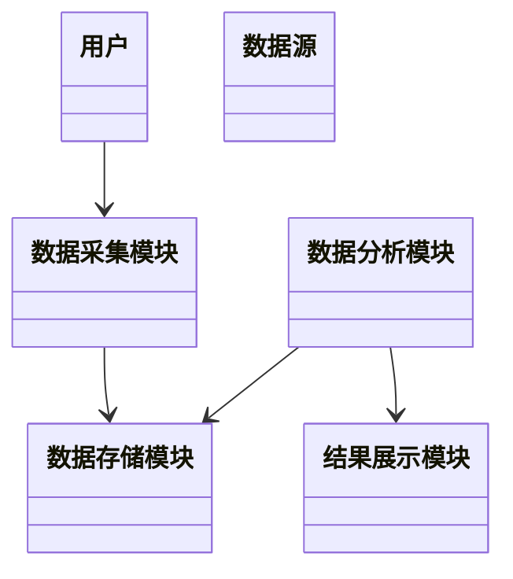
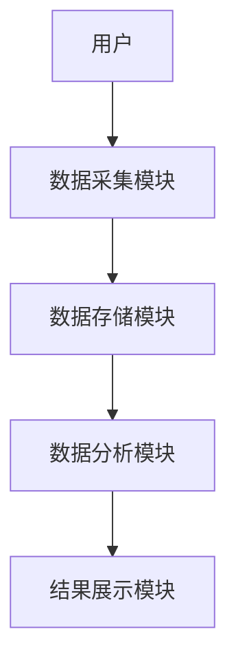
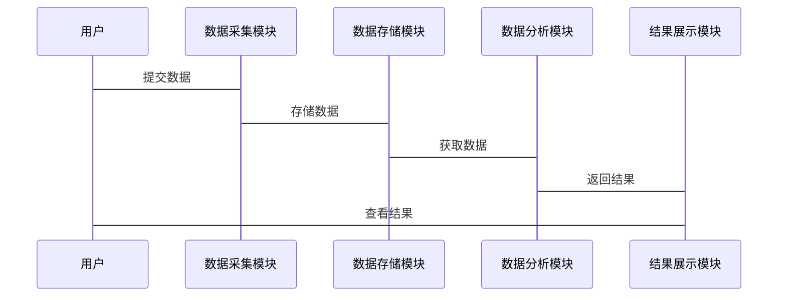

                 


```markdown
# AI辅助企业品牌定位：市场细分与差异化战略

> 关键词：AI，企业品牌定位，市场细分，差异化战略，算法实现

> 摘要：本文探讨了AI技术在企业品牌定位中的应用，重点分析了市场细分与差异化战略的实现方法。通过详细讲解AI算法、系统架构和项目实战，本文为读者提供了从理论到实践的全面指导。

---

## 第1章: AI辅助品牌定位的背景与意义

### 1.1 企业品牌定位的核心概念

#### 1.1.1 品牌定位的定义与作用
品牌定位是指确定品牌在目标市场中的位置，通过差异化策略吸引目标客户。它是企业制定市场战略的基础。

#### 1.1.2 市场细分的定义与分类
市场细分是将整体市场划分为多个子市场，每个子市场具有相似的需求特征。常见的分类包括地理、人口统计、心理和行为细分。

#### 1.1.3 差异化战略的定义与特点
差异化战略是通过提供独特的产品或服务，使品牌在竞争中脱颖而出。其特点包括独特性、针对性和长期性。

### 1.2 AI技术在品牌定位中的应用价值

#### 1.2.1 数据驱动的品牌定位
AI技术能够处理大量数据，帮助企业更精准地进行市场细分和差异化战略。

#### 1.2.2 AI技术如何提升市场细分效率
通过机器学习算法，AI能够快速识别市场细分的模式，提高效率。

#### 1.2.3 差异化战略的智能化实现
AI可以帮助企业实时分析市场动态，制定动态的差异化策略。

### 1.3 本章小结
本章介绍了品牌定位、市场细分和差异化战略的核心概念，并探讨了AI技术在其中的应用价值。

---

## 第2章: 市场细分的AI算法与实现

### 2.1 市场细分的核心概念与方法

#### 2.1.1 市场细分的类型与特点
- 地理细分：基于地理位置划分市场。
- 人口统计细分：基于年龄、性别等因素划分市场。
- 心理细分：基于消费者的心理特征划分市场。
- 行为细分：基于消费行为划分市场。

#### 2.1.2 市场细分的实现步骤
1. 数据收集与预处理。
2. 数据分析与建模。
3. 模型验证与优化。

### 2.2 市场细分的AI算法原理

#### 2.2.1 聚类分析
聚类分析是常用的市场细分方法。例如，K-means算法通过将数据点聚集成簇，实现市场细分。

**K-means算法的数学公式：**
$$ J = \sum_{i=1}^{k} \sum_{j=1}^{n} (x_j - c_i)^2 $$
其中，$k$是簇的个数，$n$是数据点的数量，$c_i$是第$i$个簇的中心。

#### 2.2.2 分类算法
分类算法用于将客户分为不同的类别。例如，决策树算法可以根据客户特征进行分类。

#### 2.2.3 文本挖掘与情感分析
文本挖掘技术可以分析客户反馈，提取情感特征，用于市场细分。

### 2.3 市场细分的实现步骤

#### 2.3.1 数据收集与预处理
收集客户数据，并进行清洗和标准化处理。

#### 2.3.2 数据分析与建模
使用聚类分析或分类算法对数据进行建模，识别市场细分。

#### 2.3.3 模型验证与优化
通过交叉验证和超参数调优，优化模型性能。

### 2.4 本章小结
本章详细讲解了市场细分的AI算法与实现，包括聚类分析、分类算法和文本挖掘等方法。

---

## 第3章: 差异化战略的AI实现

### 3.1 差异化战略的核心要素

#### 3.1.1 差异化战略的类型
- 产品差异化：提供独特的产品功能。
- 价格差异化：制定差异化的定价策略。
- 渠道差异化：选择独特的销售渠道。
- 促销差异化：采用差异化的推广策略。

### 3.2 AI在差异化战略中的应用

#### 3.2.1 基于用户行为的差异化推荐
通过协同过滤算法，推荐个性化的产品给用户。

**协同过滤算法的数学公式：**
$$ \text{相似度} = \frac{\sum_{i=1}^{n} (x_i - \mu_x)(y_i - \mu_y)}{\sqrt{\sum_{i=1}^{n} (x_i - \mu_x)^2} \sqrt{\sum_{i=1}^{n} (y_i - \mu_y)^2}} $$

#### 3.2.2 基于情感分析的产品优化
通过分析客户评论，优化产品功能，提升用户体验。

#### 3.2.3 基于预测分析的市场策略调整
利用时间序列分析，预测市场趋势，调整差异化策略。

### 3.3 差异化战略的实现步骤

#### 3.3.1 数据分析与目标识别
通过数据分析，识别目标客户群体。

#### 3.3.2 竞争对手分析
分析竞争对手的策略，制定差异化的市场策略。

#### 3.3.3 差异化策略制定与实施
根据分析结果，制定并实施差异化的市场策略。

### 3.4 本章小结
本章介绍了差异化战略的核心要素，并详细讲解了AI技术在差异化战略中的应用。

---

## 第4章: 系统架构与设计方案

### 4.1 系统功能模块设计

#### 4.1.1 数据采集模块
负责采集客户数据，包括 demographic、 behavioral 和 preference 数据。

#### 4.1.2 数据分析模块
对数据进行处理和建模，识别市场细分和差异化策略。

#### 4.1.3 结果展示模块
将分析结果以可视化形式展示，方便企业决策。

### 4.2 系统架构设计

#### 4.2.1 领域模型


#### 4.2.2 系统架构


### 4.3 系统接口设计

#### 4.3.1 数据接口
通过 RESTful API 接收和发送数据。

#### 4.3.2 用户接口
提供直观的用户界面，方便用户查看和操作数据。

### 4.4 系统交互设计



### 4.5 本章小结
本章详细讲解了系统架构与设计方案，包括功能模块、架构设计、接口设计和交互设计。

---

## 第5章: 项目实战

### 5.1 环境安装与配置

#### 5.1.1 安装Python
安装Python 3.x，确保版本兼容。

#### 5.1.2 安装依赖库
安装必要的库，如 scikit-learn、pandas、numpy。

```bash
pip install scikit-learn pandas numpy
```

### 5.2 核心功能实现

#### 5.2.1 数据预处理
```python
import pandas as pd
import numpy as np

# 读取数据
data = pd.read_csv('data.csv')

# 数据清洗
data.dropna(inplace=True)
```

#### 5.2.2 聚类分析实现
```python
from sklearn.cluster import KMeans

# 初始化模型
model = KMeans(n_clusters=3, random_state=0)

# 训练模型
model.fit(data)

# 获取簇中心
clusters = model.cluster_centers_
```

### 5.3 实际案例分析

#### 5.3.1 案例背景
某电商企业希望通过AI技术优化品牌定位。

#### 5.3.2 数据分析与建模
使用聚类分析识别客户群体，制定差异化的营销策略。

### 5.4 本章小结
本章通过实际案例，详细讲解了如何使用AI技术实现企业品牌定位。

---

## 第6章: 最佳实践与小结

### 6.1 最佳实践

#### 6.1.1 数据质量的重要性
确保数据准确性和完整性。

#### 6.1.2 模型调优的必要性
通过交叉验证和超参数调优，提升模型性能。

#### 6.1.3 持续学习的重要性
市场环境不断变化，需要持续优化模型。

### 6.2 注意事项

#### 6.2.1 数据隐私保护
确保客户数据的安全性和隐私性。

#### 6.2.2 模型解释性
选择具有解释性的模型，便于企业理解和应用。

### 6.3 拓展阅读

#### 6.3.1 推荐书目
- 《集体智慧编程》
- 《机器学习实战》

#### 6.3.2 在线资源
- [scikit-learn 官方文档](https://scikit-learn.org/stable/index.html)
- [Kaggle 数据科学社区](https://www.kaggle.com/)

### 6.4 本章小结
本文总结了AI辅助企业品牌定位的最佳实践，并提供了进一步学习的资源。

---

## 附录

### 附录A: 术语表

| 术语 | 定义 |
|------|------|
| 市场细分 | 将市场划分为多个子市场 |
| 差异化战略 | 提供独特的产品或服务 |
| AI算法 | 人工智能算法 |

### 附录B: 工具列表

| 工具名称 | 描述 |
|----------|------|
| scikit-learn | 机器学习库 |
| pandas | 数据处理库 |
| numpy | 数值计算库 |

### 附录C: 扩展阅读

#### C.1 推荐课程
- [机器学习基础](https://www.coursera.org/learn/machine-learning)
- [数据科学实战](https://www.udemy.com/course/data-science)

#### C.2 专业博客
- [Towards Data Science](https://towardsdatascience.com/)
- [Medium - AI频道](https://medium.com/ai)

---

## 参考文献

1. Bishop, C. M. (2006). Pattern Recognition and Machine Learning.
2. Hastie, T., Tibshirani, R., & Friedman, J. (2009). The Elements of Statistical Learning.
3. 网站：[Kaggle](https://www.kaggle.com/)

---

# 结语

通过本文的详细讲解，读者可以全面了解AI在企业品牌定位中的应用，掌握市场细分与差异化战略的实现方法。希望本文能为企业的品牌定位提供有价值的参考。
```

