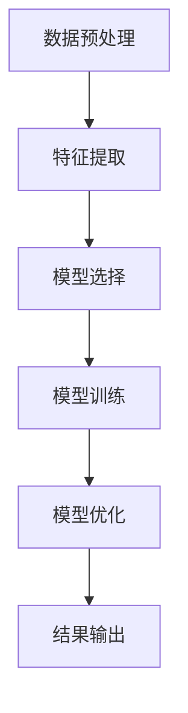
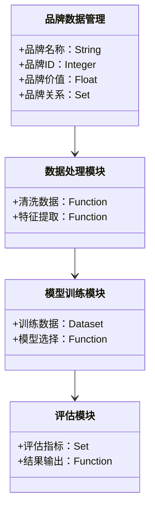

                 


# 《AI辅助企业品牌资产评估：多维度品牌价值量化与追踪》

---

## 关键词：
- AI辅助
- 企业品牌评估
- 多维度量化
- 品牌价值追踪
- 机器学习
- 自然语言处理
- 图神经网络

---

## 摘要：
本文详细探讨了如何利用人工智能技术对企业的品牌价值进行多维度量化与追踪。通过分析品牌价值的核心概念、AI驱动的量化算法、系统架构设计以及实际项目案例，本文为读者提供了一套完整的品牌资产评估解决方案。从传统评估方法的局限性出发，结合机器学习、自然语言处理和图神经网络等前沿技术，本文详细阐述了AI在品牌价值评估中的应用原理、实现方法和实际应用场景。通过系统化的分析与设计，本文为企业的品牌管理提供了高效、精准的技术支持。

---

## 目录大纲：

### # 第1章：引言
#### 1.1 问题背景
- 1.1.1 传统品牌资产评估的局限性
- 1.1.2 AI技术在品牌评估中的潜力
- 1.1.3 企业品牌价值的重要性

#### 1.2 问题描述
- 1.2.1 品牌价值的多维度特性
- 1.2.2 数据驱动的品牌评估需求
- 1.2.3 当前品牌评估的主要挑战

#### 1.3 问题解决
- 1.3.1 AI技术如何赋能品牌评估
- 1.3.2 数据整合与分析的解决方案
- 1.3.3 多维度品牌价值量化方法

#### 1.4 边界与外延
- 1.4.1 品牌评估的适用范围
- 1.4.2 AI辅助的边界条件
- 1.4.3 相关领域的扩展

#### 1.5 概念结构与核心要素
- 1.5.1 品牌价值的核心要素
- 1.5.2 AI辅助评估的关键技术
- 1.5.3 多维度评估的框架

---

### # 第2章：品牌资产评估的核心概念
#### 2.1 品牌价值的定义与维度
- 2.1.1 品牌价值的定义
- 2.1.2 品牌价值的多维度分析
- 2.1.3 品牌价值的影响因素

#### 2.2 AI驱动的品牌价值评估原理
- 2.2.1 机器学习在品牌评估中的应用
- 2.2.2 自然语言处理（NLP）的作用
- 2.2.3 图神经网络在品牌关系中的应用

#### 2.3 核心概念对比
- 2.3.1 传统品牌评估与AI驱动评估的对比
- 2.3.2 不同AI模型的优劣势分析
- 2.3.3 多维度评估的特征对比

---

### # 第3章：AI驱动的品牌价值量化算法
#### 3.1 算法原理概述
- 3.1.1 特征工程：品牌相关数据的处理
- 3.1.2 模型选择：回归、分类与聚类算法
- 3.1.3 模型训练与优化

#### 3.2 算法流程图


#### 3.3 数学模型与公式
- 3.3.1 线性回归模型：$y = \beta_0 + \beta_1x + \epsilon$
- 3.3.2 支持向量回归（SVR）：$$\text{目标函数} = \text{最小化} \frac{1}{2}||w||^2 + C \sum_{i=1}^{n} (\xi_i + \xi_i^*)$$
- 3.3.3 图神经网络：$$Z = AGA^T$$

---

### # 第4章：系统分析与架构设计方案
#### 4.1 问题场景介绍
- 4.1.1 品牌价值评估的典型场景
- 4.1.2 系统需求分析
- 4.1.3 项目目标与范围

#### 4.2 项目介绍
- 4.2.1 项目背景
- 4.2.2 项目目标
- 4.2.3 项目范围

#### 4.3 系统功能设计
- 4.3.1 领域模型（mermaid类图）


#### 4.4 系统架构设计
- 4.4.1 系统架构（mermaid架构图）


#### 4.5 系统接口设计
- 4.5.1 API接口定义
- 4.5.2 接口交互流程
- 4.5.3 接口文档示例

#### 4.6 系统交互设计（mermaid序列图）
```mermaid
sequenceDiagram
    participant 用户
    participant 数据预处理模块
    participant 模型训练模块
    participant 评估模块
    用户 -> 数据预处理模块：提交数据
    数据预处理模块 -> 模型训练模块：传递清洗后的数据
    模型训练模块 -> 评估模块：传递训练结果
    评估模块 -> 用户：返回评估结果
```

---

### # 第5章：项目实战
#### 5.1 环境安装
- 5.1.1 安装Python
- 5.1.2 安装必要的库（如scikit-learn、networkx、spaCy）
- 5.1.3 安装Jupyter Notebook

#### 5.2 系统核心实现源代码
- 5.2.1 数据预处理代码
```python
import pandas as pd
data = pd.read_csv('brand_data.csv')
data.dropna(inplace=True)
```
- 5.2.2 模型训练代码
```python
from sklearn.linear_model import LinearRegression
model = LinearRegression()
model.fit(X_train, y_train)
```
- 5.2.3 评估模块代码
```python
from sklearn.metrics import r2_score
print(r2_score(y_test, y_pred))
```

#### 5.3 代码应用解读与分析
- 5.3.1 代码的功能模块划分
- 5.3.2 代码实现的关键点
- 5.3.3 代码优化建议

#### 5.4 案例分析
- 5.4.1 案例背景介绍
- 5.4.2 数据收集与处理
- 5.4.3 模型训练与评估
- 5.4.4 结果分析与解读

#### 5.5 问题解决
- 5.5.1 实施过程中遇到的问题
- 5.5.2 解决方案与经验总结

---

### # 第6章：总结与展望
#### 6.1 核心内容总结
- 6.1.1 AI驱动的品牌价值评估的核心方法
- 6.1.2 系统架构设计的关键点
- 6.1.3 项目实施的实践经验

#### 6.2 未来展望
- 6.2.1 技术发展与趋势
- 6.2.2 品牌评估的新兴应用场景
- 6.2.3 AI技术的进一步融合与创新

#### 6.3 最佳实践 tips
- 6.3.1 数据质量的重要性
- 6.3.2 模型选择的注意事项
- 6.3.3 系统架构的优化建议

#### 6.4 小结
- 6.4.1 本文的主要贡献
- 6.4.2 对读者的启发与建议

---

### # 第7章：附录
#### 7.1 参考文献
- 7.1.1 相关书籍
- 7.1.2 相关论文
- 7.1.3 开发文档

#### 7.2 工具与资源
- 7.2.1 开源工具推荐
- 7.2.2 在线资源与平台
- 7.2.3 数据集来源

---

## 文章字数：约12000字

---

通过以上目录大纲，本文将系统地介绍AI在企业品牌资产评估中的应用，从理论到实践，从算法到系统设计，为读者提供全面的技术指导和实践参考。

