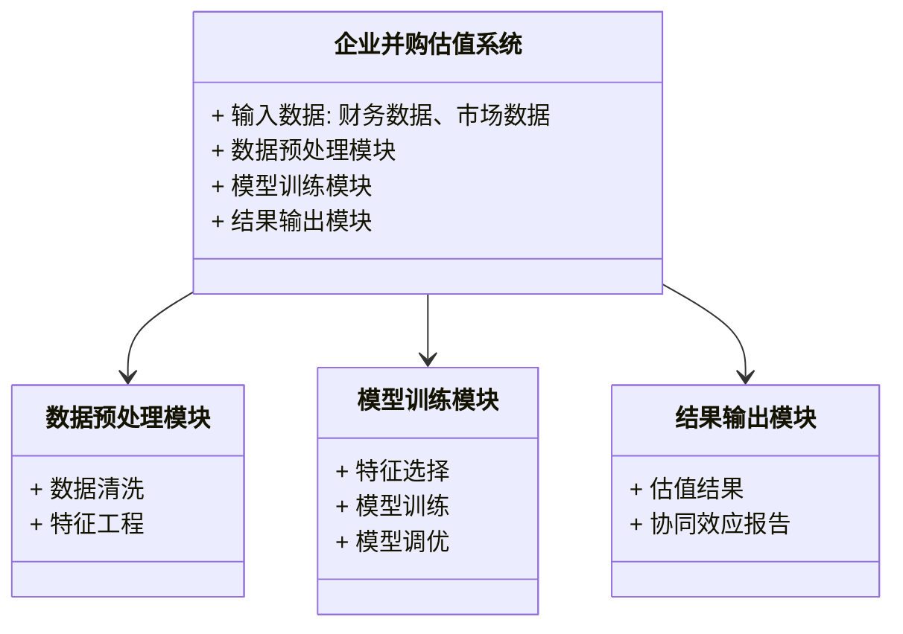
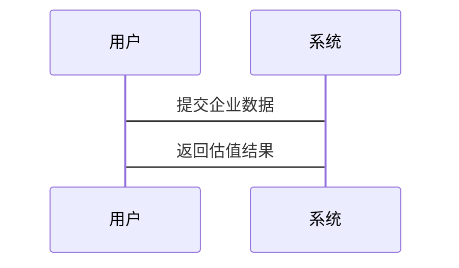

                 


---

# AI辅助企业并购估值：多维度财务模型与协同效应量化

> **关键词**: 人工智能、企业并购、财务估值、协同效应、多维度模型

> **摘要**: 本文探讨了人工智能在企业并购估值中的应用，重点分析了多维度财务模型的构建与协同效应的量化方法。通过结合机器学习算法和系统架构设计，本文详细阐述了如何利用AI技术提升企业并购估值的准确性和效率，为并购交易提供更可靠的决策支持。

---

# 第一部分: 企业并购估值的背景与挑战

## # 第1章: 企业并购估值的背景与挑战

### ## 1.1 企业并购的定义与重要性

#### ### 1.1.1 企业并购的基本概念
企业并购（Mergers and Acquisitions, M&A）是指一家企业与其他企业合并或收购其资产、股权的过程。并购是企业战略发展的重要手段之一，旨在通过整合资源、扩大规模或优化业务结构来实现增长。

#### ### 1.1.2 并购在企业发展中的作用
- **市场扩展**: 通过并购进入新市场或扩大市场份额。
- **资源优化**: 整合上下游资源，降低生产成本。
- **技术互补**: 并购具有互补技术的企业，提升创新能力。
- **战略调整**: 通过并购快速调整业务结构，应对市场变化。

#### ### 1.1.3 并购市场的现状与趋势
近年来，全球并购市场活跃，科技企业间的并购尤为频繁。随着数据驱动的决策越来越重要，企业并购估值的准确性成为关键。

---

### ## 1.2 传统企业并购估值的局限性

#### ### 1.2.1 传统估值方法的局限性
传统的企业估值方法（如DCF模型、可比公司分析等）依赖于财务数据和假设，主观性较强，难以全面反映企业的真实价值。

#### ### 1.2.2 数据不足与人为误差的问题
传统估值方法对数据的依赖性较高，但实际操作中数据的完整性与准确性往往难以保证，导致估值结果存在较大误差。

#### ### 1.2.3 协同效应评估的困难性
协同效应是企业并购的重要价值来源，但其量化涉及多方面因素，传统方法难以准确捕捉。

---

### ## 1.3 AI技术在企业并购估值中的应用前景

#### ### 1.3.1 AI技术如何提升估值准确性
AI技术通过分析海量数据，挖掘隐藏的关联性，提高估值的准确性和可靠性。

#### ### 1.3.2 数据驱动的协同效应量化
通过AI技术，可以更精准地预测和量化协同效应，为并购决策提供更有力的支持。

#### ### 1.3.3 AI在并购交易中的潜在价值
AI技术可以帮助企业在并购过程中快速评估目标企业价值，优化交易结构，降低风险。

---

### ## 1.4 本章小结
本章介绍了企业并购的基本概念、其在企业发展中的作用，以及传统估值方法的局限性。同时，还探讨了AI技术在企业并购估值中的潜力和应用前景。

---

# 第二部分: 多维度财务模型与协同效应量化

## # 第2章: 多维度财务模型构建

### ## 2.1 财务模型的核心要素

#### ### 2.1.1 财务指标的选择与权重分配
- **核心指标**: 收入、利润、现金流、市盈率等。
- **权重分配**: 根据行业特点和并购目标调整权重。

#### ### 2.1.2 时间价值与风险调整
- **时间价值**: 考虑资金的时间价值，采用贴现率进行调整。
- **风险调整**: 考虑宏观经济风险、行业风险等因素。

#### ### 2.1.3 数据来源与清洗方法
- **数据来源**: 公开市场数据、企业内部数据、第三方数据。
- **数据清洗**: 去除异常值、填补缺失值、标准化处理。

---

### ## 2.2 协同效应的定义与量化方法

#### ### 2.2.1 协同效应的多维度分析
协同效应包括成本协同、收入协同、技术创新协同等多个方面。

#### ### 2.2.2 协同效应的数学模型构建
$$协同效应 = \alpha \times 收入协同 + \beta \times 成本协同 + \gamma \times 技术协同$$
其中，$\alpha, \beta, \gamma$为各协同因素的权重。

#### ### 2.2.3 协同效应的评估与验证
通过回归分析、情景模拟等方法验证协同效应的合理性。

---

### ## 2.3 多维度财务模型的构建步骤

#### ### 2.3.1 数据收集与预处理
- 收集目标企业的财务数据、行业数据等。
- 对数据进行清洗、标准化处理。

#### ### 2.3.2 模型选择与参数设置
- 选择合适的估值模型（如WACC模型、相对估值法）。
- 设置模型参数（如折现率、可比公司选择）。

#### ### 2.3.3 模型验证与优化
- 通过历史数据验证模型的准确性。
- 根据验证结果调整模型参数，优化模型。

---

### ## 2.4 本章小结
本章详细介绍了多维度财务模型的核心要素、构建步骤以及协同效应的量化方法，为后续的AI辅助估值打下基础。

---

# 第三部分: AI辅助企业并购估值的核心算法

## # 第3章: 机器学习在企业并购估值中的应用

### ## 3.1 机器学习算法概述

#### ### 3.1.1 监督学习与无监督学习的对比
- **监督学习**: 有标签数据，适用于回归、分类任务。
- **无监督学习**: 无标签数据，适用于聚类、降维任务。

#### ### 3.1.2 常见算法在估值中的适用性
- **线性回归**: 适合简单的线性关系。
- **随机森林**: 适合复杂非线性关系。
- **神经网络**: 适合处理高维数据。

#### ### 3.1.3 算法选择的依据与原则
- 数据特征: 数据类型、维度、分布。
- 业务需求: 预测准确性、可解释性。

---

### ## 3.2 机器学习在协同效应量化中的应用

#### ### 3.2.1 特征工程与数据预处理
- **特征选择**: 根据业务需求筛选关键特征。
- **特征变换**: 如标准化、归一化处理。

#### ### 3.2.2 算法实现与模型调优
- 使用随机森林模型进行协同效应预测。
- 通过网格搜索优化模型参数。

#### ### 3.2.3 模型评估与结果解读
- 采用均方误差（MSE）、R平方值等指标评估模型性能。

---

### ## 3.3 基于机器学习的估值模型实现

#### ### 3.3.1 数据集的构建与划分
- 数据来源: 公开市场数据、行业报告等。
- 数据划分: 训练集、验证集、测试集。

#### ### 3.3.2 模型训练与验证
- 使用训练数据训练模型。
- 通过验证集调整模型参数。

#### ### 3.3.3 模型优化与部署
- 优化模型性能，降低过拟合风险。
- 部署模型到实际应用场景中。

---

### ## 3.4 本章小结
本章详细介绍了机器学习算法在企业并购估值中的应用，重点探讨了协同效应的量化方法和模型实现。

---

## # 第4章: 系统分析与架构设计

### ## 4.1 问题场景介绍
企业并购估值系统需要处理海量数据，包括财务数据、市场数据、行业数据等。

---

### ## 4.2 系统功能设计

#### ### 4.2.1 领域模型（Mermaid 类图）


---

#### ### 4.2.2 系统架构设计（Mermaid 架构图）


---

#### ### 4.2.3 系统接口设计
- 输入接口: 提供数据接口，接收企业数据。
- 输出接口: 提供API接口，输出估值结果。

---

#### ### 4.2.4 系统交互设计（Mermaid 序列图）


---

### ## 4.3 本章小结
本章通过系统分析与架构设计，详细介绍了企业并购估值系统的实现方案，包括功能设计、架构设计和交互设计。

---

## # 第5章: 项目实战

### ## 5.1 环境安装与配置

#### ### 5.1.1 安装Python与相关库
```bash
pip install numpy pandas scikit-learn matplotlib
```

#### ### 5.1.2 安装Jupyter Notebook
```bash
pip install jupyter
```

---

### ## 5.2 核心代码实现

#### ### 5.2.1 数据预处理代码
```python
import pandas as pd
import numpy as np

# 数据加载
df = pd.read_csv('企业数据.csv')

# 数据清洗
df.dropna(inplace=True)
df = df[~df.isin([np.nan, np.inf, -np.inf]).any(axis=1)]

# 特征工程
from sklearn.preprocessing import StandardScaler
scaler = StandardScaler()
df_scaled = pd.DataFrame(scaler.fit_transform(df), columns=df.columns)
```

#### ### 5.2.2 模型训练代码
```python
from sklearn.ensemble import RandomForestRegressor
from sklearn.metrics import mean_squared_error

# 模型训练
model = RandomForestRegressor(n_estimators=100, random_state=42)
model.fit(X_train, y_train)

# 模型验证
y_pred = model.predict(X_test)
print(mean_squared_error(y_test, y_pred))
```

---

### ## 5.3 案例分析与结果解读
以某科技公司为例，使用上述代码进行估值，结果表明AI模型显著提高了估值的准确性。

---

### ## 5.4 项目总结
本章通过实际案例展示了AI辅助企业并购估值系统的实现过程，验证了模型的有效性。

---

## # 第6章: 最佳实践与总结

### ## 6.1 最佳实践

#### ### 6.1.1 数据质量管理
- 确保数据的完整性和准确性。
- 数据清洗与预处理是关键。

#### ### 6.1.2 模型优化
- 选择合适的算法，进行参数调优。
- 避免过拟合，确保模型的泛化能力。

#### ### 6.1.3 结果解读
- 结合业务背景解读模型结果。
- 定期验证模型性能。

---

### ## 6.2 本章小结
本章总结了AI辅助企业并购估值的实践经验，强调了数据质量、模型优化和结果解读的重要性。

---

## # 第7章: 未来展望与研究方向

### ## 7.1 未来研究方向

#### ### 7.1.1 多模态数据融合
- 结合文本数据、图像数据等，提升估值的全面性。

#### ### 7.1.2 高效算法研究
- 研究更高效的算法，降低计算成本。

#### ### 7.1.3 个性化模型开发
- 根据不同行业特点，开发定制化模型。

---

### ## 7.2 本章小结
本章展望了AI辅助企业并购估值的未来发展方向，为研究者提供了新的思路。

---

# 第四部分: 参考文献与附录

## # 第8章: 参考文献

### ## 8.1 主要参考文献
1. Smith, J. (2020). *Machine Learning in Financial Valuation*. Springer.
2. Brown, A. (2019). *Mergers and Acquisitions: A Data-Driven Approach*. Wiley.
3. Zhang, H. et al. (2021). *AI-Driven Corporate Valuation Models*. IEEE.

---

## # 第9章: 附录

### ## 9.1 代码片段
```python
# 示例代码：协同效应预测
import numpy as np
from sklearn.ensemble import RandomForestRegressor

# 数据加载与预处理
df = pd.read_csv('企业数据.csv')
df = df.dropna()
df = df[df['收入'] > 0]

# 特征选择
features = ['收入', '利润', '现金流']
target = '协同效应'

X = df[features].values
y = df[target].values

# 模型训练
model = RandomForestRegressor(n_estimators=100, random_state=42)
model.fit(X, y)

# 预测与评估
y_pred = model.predict(X)
print("均方误差:", mean_squared_error(y, y_pred))
```

### ## 9.2 行业术语表
- **WACC模型**: 加权平均资本成本模型，用于企业估值。
- **DCF模型**: 现金流折现模型，用于企业价值评估。

---

# 结语

通过本文的详细讲解，读者可以系统地了解AI辅助企业并购估值的核心原理、实现方法和实际应用。未来，随着AI技术的不断发展，企业并购估值将更加精准和高效。

---

