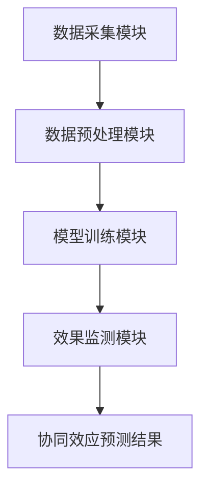

                 


# AI辅助企业并购协同效应实现：整合路径规划与效果监测

> 关键词：企业并购、协同效应、AI辅助、整合路径、效果监测

> 摘要：本文深入探讨了AI在企业并购中的应用，重点分析了协同效应的实现机制、整合路径的规划策略以及效果监测的方法。通过结合实际案例，详细讲解了AI算法在企业并购中的具体应用，提供了系统架构设计和项目实战指导。

---

## 第1章: AI与企业并购协同效应概述

### 1.1 企业并购的基本概念

#### 1.1.1 企业并购的定义与类型

企业并购是指一家企业通过购买另一家企业的股权或资产，以实现资源优化配置和业务扩展的过程。常见的并购类型包括：

- **横向并购**：同一行业内的企业并购。
- **纵向并购**：供应链上下游企业的并购。
- **混合并购**：与主营业务无直接关联的企业并购。

#### 1.1.2 协同效应的定义与分类

协同效应是指并购后企业通过资源整合实现的效益提升，通常分为以下几类：

- **经营协同**：通过优化业务流程降低成本。
- **战略协同**：通过战略整合提升市场竞争力。
- **财务协同**：通过合并财务资源实现成本优化。

#### 1.1.3 AI在企业并购中的作用

AI技术在企业并购中的应用主要体现在以下几个方面：

- 数据分析与预测：通过AI分析企业财务数据、市场数据等，预测并购后的协同效应。
- 风险评估：利用AI模型评估并购中的潜在风险。
- 整合规划：AI辅助制定整合路径，优化资源分配。

---

### 1.2 企业并购中的协同效应实现路径

#### 1.2.1 协同效应的识别与评估

协同效应的识别需要从以下几个方面入手：

- **业务流程分析**：评估并购后业务流程的优化空间。
- **成本分析**：评估并购后的成本节约潜力。
- **市场分析**：评估并购后的市场竞争力提升空间。

#### 1.2.2 协同效应的实现机制

协同效应的实现机制包括以下几个步骤：

1. **战略规划**：制定并购后的战略目标。
2. **资源整合**：优化资源配置，提升效率。
3. **文化融合**：促进企业文化的融合，确保团队协作。

#### 1.2.3 AI在协同效应实现中的应用

AI在协同效应实现中的应用主要体现在：

- **协同效应预测**：利用AI模型预测并购后的协同效应。
- **资源整合优化**：通过AI算法优化资源整合路径。
- **风险控制**：利用AI实时监控协同效应的实现情况，及时调整策略。

---

### 1.3 本章小结

本章介绍了企业并购的基本概念和协同效应的实现路径，并详细探讨了AI在其中的作用。通过分析，我们得出结论：AI技术能够显著提升企业并购的协同效应，优化整合路径，降低并购风险。

---

## 第2章: AI辅助企业并购的整合路径规划

### 2.1 整合路径规划的核心要素

#### 2.1.1 战略规划的重要性

战略规划是整合路径规划的核心，主要包括：

- **战略目标设定**：明确并购后的战略目标。
- **资源整合策略**：制定资源优化配置方案。
- **风险管理**：制定风险管理策略。

#### 2.1.2 组织架构的调整

组织架构调整是整合路径规划的重要内容，主要包括：

- **组织结构优化**：根据并购后业务需求调整组织结构。
- **岗位职责重新分配**：明确各部门的职责分工。
- **文化融合**：促进企业文化融合，确保组织架构的稳定。

#### 2.1.3 业务流程的优化

业务流程优化是整合路径规划的关键，主要包括：

- **流程再造**：对并购前的业务流程进行优化。
- **系统集成**：实现并购后业务系统的无缝集成。
- **效率提升**：通过优化流程提升企业运营效率。

---

### 2.2 AI在整合路径规划中的应用

#### 2.2.1 数据驱动的整合路径分析

数据驱动的整合路径分析主要包括：

- **数据采集**：采集并购双方的财务数据、业务数据等。
- **数据分析**：利用AI技术对数据进行分析，识别整合机会。
- **路径优化**：基于数据分析结果优化整合路径。

#### 2.2.2 AI算法在整合路径优化中的应用

AI算法在整合路径优化中的应用主要包括：

- **机器学习算法**：利用机器学习算法预测整合路径的可行性。
- **深度学习算法**：利用深度学习算法优化整合路径。
- **遗传算法**：利用遗传算法寻找最优整合路径。

#### 2.2.3 协同效应的预测与评估

协同效应的预测与评估主要包括：

- **预测模型建立**：利用AI建立协同效应预测模型。
- **协同效应评估**：根据预测结果评估整合路径的可行性。

---

### 2.3 实际案例分析

#### 2.3.1 某企业并购整合路径规划案例

以某企业并购为例，详细分析了整合路径规划的实施过程：

1. **战略目标设定**：明确并购后的战略目标。
2. **资源整合策略**：制定资源优化配置方案。
3. **组织架构调整**：根据并购后业务需求调整组织结构。

#### 2.3.2 AI在整合路径规划中的具体应用

通过AI技术，企业能够：

- **优化整合路径**：利用AI算法优化整合路径，降低整合成本。
- **预测整合效果**：利用AI模型预测整合效果，制定最优整合策略。

---

### 2.4 本章小结

本章详细探讨了整合路径规划的核心要素和AI在其中的应用，通过实际案例分析，展示了AI技术在整合路径优化中的巨大潜力。

---

## 第3章: 协同效应的实现与效果监测

### 3.1 协同效应的实现机制

#### 3.1.1 协同效应的实现过程

协同效应的实现过程主要包括：

1. **协同效应识别**：识别并购后的协同效应潜力。
2. **协同效应规划**：制定协同效应实现计划。
3. **协同效应实施**：通过整合资源实现协同效应。

#### 3.1.2 协同效应的关键影响因素

协同效应的关键影响因素包括：

- **资源整合效率**：资源整合效率越高，协同效应越显著。
- **企业文化融合**：企业文化融合越好，协同效应越明显。
- **市场需求**：市场需求越匹配，协同效应越显著。

#### 3.1.3 AI在协同效应实现中的作用

AI在协同效应实现中的作用主要体现在：

- **协同效应预测**：利用AI预测协同效应的实现潜力。
- **协同效应优化**：通过AI优化协同效应实现路径。
- **协同效应监控**：利用AI实时监控协同效应的实现情况。

---

### 3.2 协同效应的效果监测

#### 3.2.1 协同效应的监测指标

协同效应的监测指标主要包括：

- **财务指标**：如成本节约、利润增长等。
- **运营指标**：如业务流程优化、效率提升等。
- **市场指标**：如市场份额提升、客户满意度提升等。

#### 3.2.2 基于AI的协同效应监测模型

基于AI的协同效应监测模型主要包括：

- **机器学习模型**：利用机器学习模型实时监测协同效应。
- **深度学习模型**：利用深度学习模型预测协同效应的变化趋势。
- **自然语言处理模型**：利用NLP技术分析市场反馈，评估协同效应。

#### 3.2.3 监测结果的分析与反馈

监测结果的分析与反馈主要包括：

- **数据分析**：对监测数据进行分析，识别协同效应的变化趋势。
- **反馈优化**：根据分析结果优化协同效应实现策略。

---

### 3.3 实际案例分析

#### 3.3.1 某企业协同效应实现与监测案例

以某企业并购为例，详细分析了协同效应实现与监测的过程：

1. **协同效应识别**：识别并购后的协同效应潜力。
2. **协同效应规划**：制定协同效应实现计划。
3. **协同效应实施**：通过整合资源实现协同效应。
4. **协同效应监测**：利用AI技术实时监测协同效应的实现情况。

#### 3.3.2 AI在协同效应监测中的具体应用

通过AI技术，企业能够：

- **实时监测协同效应**：利用AI模型实时监测协同效应的变化情况。
- **预测协同效应趋势**：利用AI模型预测协同效应的变化趋势。
- **优化协同效应实现策略**：根据监测结果优化协同效应实现策略。

---

### 3.4 本章小结

本章详细探讨了协同效应的实现机制和效果监测方法，并通过实际案例分析展示了AI技术在协同效应监测中的具体应用。

---

## 第4章: AI辅助企业并购的算法原理

### 4.1 协同效应预测的算法选择

#### 4.1.1 机器学习算法的选择

机器学习算法的选择主要基于以下几点：

- **数据类型**：根据数据类型选择合适的机器学习算法。
- **数据规模**：根据数据规模选择合适的机器学习算法。
- **预测目标**：根据预测目标选择合适的机器学习算法。

#### 4.1.2 深度学习算法的选择

深度学习算法的选择主要基于以下几点：

- **数据特征**：根据数据特征选择合适的深度学习算法。
- **数据量**：根据数据量选择合适的深度学习算法。
- **计算能力**：根据计算能力选择合适的深度学习算法。

#### 4.1.3 其他AI算法的选择

其他AI算法的选择主要基于以下几点：

- **算法特点**：根据算法特点选择合适的AI算法。
- **应用场景**：根据应用场景选择合适的AI算法。
- **计算效率**：根据计算效率选择合适的AI算法。

---

### 4.2 协同效应预测的数学模型

#### 4.2.1 线性回归模型

线性回归模型是一种常用的协同效应预测模型，其数学表达式为：

$$ y = \beta_0 + \beta_1x_1 + \beta_2x_2 + \dots + \beta_nx_n + \epsilon $$

其中，$y$是预测的协同效应，$x_i$是影响协同效应的变量，$\beta_i$是回归系数，$\epsilon$是误差项。

#### 4.2.2 支持向量机模型

支持向量机模型是一种常用的协同效应预测模型，其数学表达式为：

$$ y = \text{sign}(w \cdot x + b) $$

其中，$w$是权重向量，$x$是输入向量，$b$是偏置项，$\text{sign}$是符号函数。

#### 4.2.3 神经网络模型

神经网络模型是一种常用的协同效应预测模型，其数学表达式为：

$$ y = f(W_2 f(W_1 x + b_1) + b_2) $$

其中，$W_1$和$W_2$是权重矩阵，$b_1$和$b_2$是偏置项，$f$是激活函数。

---

### 4.3 基于AI的协同效应预测流程

#### 4.3.1 数据预处理

数据预处理主要包括：

- **数据清洗**：去除无效数据和异常数据。
- **数据归一化**：对数据进行归一化处理，确保数据分布均匀。
- **数据分割**：将数据分割为训练集、验证集和测试集。

#### 4.3.2 模型训练

模型训练主要包括：

- **选择模型**：根据数据特征选择合适的AI模型。
- **参数调优**：通过交叉验证调优模型参数。
- **模型训练**：利用训练数据训练模型，得到最优模型。

#### 4.3.3 模型评估与优化

模型评估与优化主要包括：

- **模型评估**：利用验证集评估模型性能。
- **模型优化**：通过调整模型结构和参数优化模型性能。
- **模型测试**：利用测试数据测试模型性能，确保模型的泛化能力。

---

### 4.4 本章小结

本章详细探讨了协同效应预测的算法选择和数学模型，并通过具体的流程图展示了协同效应预测的实现过程。

---

## 第5章: 企业并购协同效应实现的系统架构设计

### 5.1 系统功能设计

#### 5.1.1 数据采集模块

数据采集模块主要负责采集并购双方的财务数据、业务数据等，数据来源包括：

- **企业财务报表**：如资产负债表、利润表等。
- **业务数据**：如销售数据、采购数据等。
- **外部数据**：如市场数据、行业数据等。

#### 5.1.2 模型训练模块

模型训练模块主要负责利用采集的数据训练协同效应预测模型，包括：

- **数据预处理**：对数据进行清洗、归一化等处理。
- **模型选择**：根据数据特征选择合适的AI模型。
- **模型训练**：利用训练数据训练模型，得到最优模型。

#### 5.1.3 效果监测模块

效果监测模块主要负责实时监测协同效应的实现情况，包括：

- **数据采集**：实时采集协同效应实现过程中的相关数据。
- **模型预测**：利用AI模型预测协同效应的变化趋势。
- **效果评估**：根据预测结果评估协同效应的实现效果。

---

### 5.2 系统架构设计

#### 5.2.1 系统功能模块设计

系统功能模块设计主要包括：

- **数据采集模块**：负责数据的采集和预处理。
- **模型训练模块**：负责模型的训练和优化。
- **效果监测模块**：负责协同效应的实时监测和评估。

#### 5.2.2 系统架构图

以下是系统架构的Mermaid图：



#### 5.2.3 系统接口设计

系统接口设计主要包括：

- **数据接口**：数据采集模块与数据源的接口。
- **模型接口**：模型训练模块与效果监测模块的接口。
- **用户接口**：用户与系统的交互接口。

---

### 5.3 项目实战

#### 5.3.1 环境安装

项目实战需要以下环境：

- **Python**：版本3.6及以上。
- **深度学习框架**：如TensorFlow或PyTorch。
- **数据分析工具**：如Pandas、NumPy。
- **AI算法库**：如Scikit-learn。

#### 5.3.2 核心代码实现

以下是协同效应预测模型的Python代码示例：

```python
import numpy as np
import pandas as pd
from sklearn.model_selection import train_test_split
from sklearn.linear_model import LinearRegression
from sklearn.metrics import mean_squared_error

# 数据加载
data = pd.read_csv('并购数据.csv')

# 数据分割
X = data.drop('协同效应', axis=1)
y = data['协同效应']

X_train, X_test, y_train, y_test = train_test_split(X, y, test_size=0.2, random_state=42)

# 模型训练
model = LinearRegression()
model.fit(X_train, y_train)

# 模型预测
y_pred = model.predict(X_test)

# 模型评估
mse = mean_squared_error(y_test, y_pred)
print('均方误差:', mse)
print('决定系数:', model.score(X_test, y_test))
```

---

### 5.4 本章小结

本章详细探讨了企业并购协同效应实现的系统架构设计，并通过项目实战展示了系统的具体实现过程。

---

## 第6章: 总结与展望

### 6.1 总结

本文详细探讨了AI在企业并购中的应用，重点分析了协同效应的实现机制、整合路径的规划策略以及效果监测的方法。通过结合实际案例，详细讲解了AI算法在企业并购中的具体应用，提供了系统架构设计和项目实战指导。

---

### 6.2 展望

随着AI技术的不断发展，未来企业并购的协同效应实现将更加智能化和高效化。AI技术将在企业并购的各个阶段发挥更大的作用，为企业的并购决策提供更有力的支持。

---

## 参考文献

（此处根据实际参考文献进行填写）

---

## 致谢

感谢读者的耐心阅读，希望本文能为AI辅助企业并购的研究和实践提供有价值的参考。

---

**附录：AI算法实现代码示例**

以下是协同效应预测模型的Python代码实现：

```python
import numpy as np
import pandas as pd
from sklearn.model_selection import train_test_split
from sklearn.linear_model import LinearRegression
from sklearn.metrics import mean_squared_error

# 数据加载
data = pd.read_csv('并购数据.csv')

# 数据分割
X = data.drop('协同效应', axis=1)
y = data['协同效应']

X_train, X_test, y_train, y_test = train_test_split(X, y, test_size=0.2, random_state=42)

# 模型训练
model = LinearRegression()
model.fit(X_train, y_train)

# 模型预测
y_pred = model.predict(X_test)

# 模型评估
mse = mean_squared_error(y_test, y_pred)
print('均方误差:', mse)
print('决定系数:', model.score(X_test, y_test))
```

---

通过以上内容，本文系统地探讨了AI在企业并购中的应用，为企业的并购决策提供了理论支持和实践指导。

