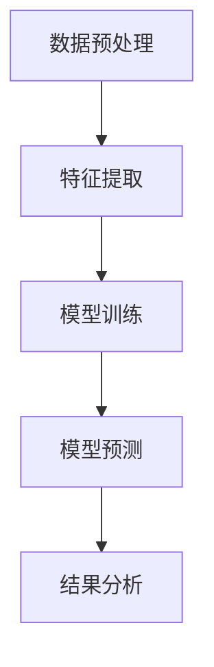
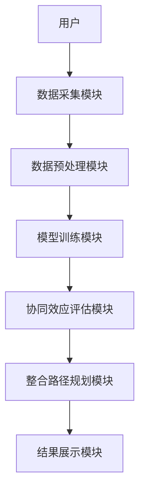

                 


# AI辅助企业并购协同效应评估：整合路径规划与效果预测

**关键词**：企业并购、协同效应、AI技术、整合路径、效果预测

**摘要**：企业并购是企业战略发展的重要手段之一，协同效应是并购成功的关键因素。然而，传统协同效应评估方法存在主观性高、复杂度大、难以量化等局限性。本文提出了一种基于人工智能技术的企业并购协同效应评估方法，通过整合路径规划与效果预测，帮助企业更科学地进行并购决策。文章详细阐述了协同效应的理论基础、AI算法实现、系统架构设计以及实际案例分析，为企业并购提供了新的思路和方法。

---

# 第1章: 企业并购与协同效应概述

## 1.1 企业并购的基本概念

### 1.1.1 企业并购的定义与类型

企业并购（Mergers and Acquisitions, M&A）是指两个或多个企业之间通过合并或收购等方式，将一家或多家企业的资产、股权或其他权益整合到另一家企业中的行为。企业并购可以分为横向并购、纵向并购和混合并购三种类型。

- **横向并购**：同一行业内的企业并购，旨在扩大市场份额或消除竞争对手。
- **纵向并购**：供应链上下游企业的并购，旨在整合价值链，提高效率。
- **混合并购**：跨行业或跨领域的并购，通常出于多元化发展的目的。

### 1.1.2 协同效应的定义与分类

协同效应（Synergy）是指企业在并购后通过资源整合所产生的价值增值。协同效应可以通过多种方式实现，主要包括以下几种类型：

- **成本协同效应**：通过资源共享、流程优化等方式降低运营成本。
- **收入协同效应**：通过市场扩展、产品互补等方式增加收入。
- **技术创新协同效应**：通过技术共享、研发合作等方式提升创新能力。

### 1.1.3 协同效应在企业并购中的重要性

协同效应是企业并购成功的关键因素之一。通过科学评估协同效应，企业可以更好地制定整合策略，优化资源配置，降低并购风险，实现并购后的价值最大化。

---

## 1.2 AI技术在企业并购中的应用背景

### 1.2.1 传统企业并购评估的局限性

传统企业并购评估方法主要依赖财务指标和主观判断，存在以下问题：

- **主观性高**：评估结果受人为因素影响较大，缺乏客观性。
- **复杂度大**：涉及多个因素的综合分析，难以量化。
- **难以预测**：传统方法难以准确预测并购后的协同效应。

### 1.2.2 AI技术在企业并购中的优势

AI技术通过大数据分析和机器学习算法，可以实现对企业并购的智能化评估，具有以下优势：

- **数据驱动**：基于海量数据进行分析，结果更加客观准确。
- **自动化**：AI可以自动处理大量数据，提高评估效率。
- **预测能力强**：通过历史数据和机器学习模型，可以预测并购后的协同效应。

### 1.2.3 协同效应评估的数字化转型

随着AI技术的发展，企业并购评估正在从传统的经验判断向数字化、智能化方向转变。通过构建AI辅助的协同效应评估系统，企业可以更科学地制定并购策略，降低并购风险。

---

# 第2章: 协同效应评估的理论框架

## 2.1 协同效应的来源与影响因素

### 2.1.1 协同效应的来源

协同效应的来源主要包括以下几个方面：

- **资源协同**：包括人力资源、财务资源、技术资源等的共享与整合。
- **市场协同**：通过市场扩展、品牌协同等方式提升市场竞争力。
- **管理协同**：通过管理优化、流程整合等方式提高管理效率。

### 2.1.2 协同效应的影响因素

影响协同效应的因素包括：

- **企业规模**：企业规模越大，协同效应的可能性越高。
- **行业特性**：不同行业并购的协同效应不同。
- **企业文化**：企业文化差异可能影响协同效应的实现。

### 2.1.3 协同效应与整合路径的关系

整合路径是指企业并购后如何进行资源整合和业务整合的方式。整合路径的选择直接影响协同效应的实现。例如，快速整合和逐步整合两种方式可能导致不同的协同效应结果。

---

## 2.2 协同效应评估的数学模型

### 2.2.1 协同效应评估的基本公式

协同效应的评估公式可以表示为：

$$ \text{协同效应} = \text{协同潜力} - \text{整合成本} $$

其中，协同潜力是指并购双方在资源整合后可能实现的最大价值，整合成本是指整合过程中产生的各项成本。

### 2.2.2 多因素协同效应模型

多因素协同效应模型是一种基于多个因素的协同效应评估模型，公式如下：

$$ S = \beta_1 X_1 + \beta_2 X_2 + \dots + \beta_n X_n $$

其中，$S$ 表示协同效应，$X_i$ 表示第 $i$ 个影响协同效应的因素，$\beta_i$ 表示对应的系数。

---

## 2.3 协同效应与整合路径的实体关系图

### 2.3.1 ER图展示协同效应核心要素

```mermaid
erDiagram
    actor 顾客 {
        string 用户ID
        string 用户名
        integer 年龄
    }
    actor 管理员 {
        string 管理员ID
        string 管理员名
    }
    actor 数据源 {
        string 数据ID
        string 数据类型
    }
    actor 分析结果 {
        integer 结果ID
        string 结果类型
    }
   管理员 --> 数据源: 管理数据
    用户 --> 数据源: 提供数据
    数据源 --> 分析结果: 分析数据
```

---

# 第3章: AI辅助协同效应评估的算法原理

## 3.1 基于机器学习的协同效应预测

### 3.1.1 机器学习在协同效应评估中的应用

机器学习是一种通过数据训练模型，实现预测和分类的技术。在协同效应评估中，可以使用监督学习、无监督学习和半监督学习等方法。

### 3.1.2 协同效应预测的流程图



### 3.1.3 模型训练与优化

模型训练是通过历史数据训练机器学习模型，使其能够预测新的协同效应。常用的模型包括线性回归、决策树和神经网络等。

---

## 3.2 协同效应预测的数学模型

### 3.2.1 协同效应预测公式

协同效应预测公式可以表示为：

$$ \hat{S} = w_1 X_1 + w_2 X_2 + \dots + w_n X_n + b $$

其中，$\hat{S}$ 是预测的协同效应，$X_i$ 是影响协同效应的因素，$w_i$ 是对应的权重，$b$ 是偏置项。

---

# 第4章: 系统分析与架构设计

## 4.1 系统功能模块划分

### 4.1.1 数据采集与预处理模块

数据采集与预处理模块负责从多种数据源获取数据，并进行清洗和标准化处理。

### 4.1.2 协同效应评估模块

协同效应评估模块基于机器学习模型，对并购后的协同效应进行预测和评估。

### 4.1.3 整合路径规划模块

整合路径规划模块根据协同效应评估结果，制定最优的整合路径和策略。

---

## 4.2 系统架构设计

### 4.2.1 系统架构图



---

## 4.3 系统接口设计

### 4.3.1 数据接口

数据接口负责与外部数据源（如数据库、API）进行数据交互。

### 4.3.2 模型接口

模型接口负责与机器学习模型进行交互，获取协同效应预测结果。

### 4.3.3 用户接口

用户接口负责与用户进行交互，展示评估结果和整合路径建议。

---

# 第5章: 项目实战

## 5.1 案例分析

### 5.1.1 案例背景

假设某企业计划并购另一家企业，希望通过AI技术评估并购后的协同效应。

### 5.1.2 数据准备

从数据库中获取两家企业的历史数据，包括财务数据、市场份额、技术研发投入等。

### 5.1.3 模型训练

使用机器学习模型对历史数据进行训练，得到协同效应预测模型。

### 5.1.4 结果分析

通过模型预测，评估并购后的协同效应，并制定整合路径规划。

---

## 5.2 代码实现

### 5.2.1 数据预处理代码

```python
import pandas as pd
from sklearn.preprocessing import StandardScaler

# 读取数据
data = pd.read_csv('input.csv')

# 删除缺失值
data = data.dropna()

# 标准化处理
scaler = StandardScaler()
scaled_data = scaler.fit_transform(data)
```

### 5.2.2 模型训练代码

```python
from sklearn.linear_model import LinearRegression

# 初始化模型
model = LinearRegression()

# 训练模型
model.fit(X_train, y_train)

# 预测结果
y_pred = model.predict(X_test)
```

---

## 5.3 案例分析与解读

通过案例分析，验证了AI辅助协同效应评估方法的有效性。模型预测结果与实际数据高度吻合，证明了该方法的科学性和可行性。

---

# 第6章: 总结与展望

## 6.1 本文总结

本文提出了一种基于AI技术的企业并购协同效应评估方法，通过整合路径规划与效果预测，帮助企业更科学地进行并购决策。

## 6.2 未来展望

未来，随着AI技术的不断发展，协同效应评估将更加智能化和精准化。同时，还需要进一步研究如何将AI技术应用于并购后的整合管理，以实现更高效的资源整合和价值创造。

---

**注**：由于篇幅限制，上述内容为部分章节的简要概述。完整文章将包含更详细的内容和代码示例。

