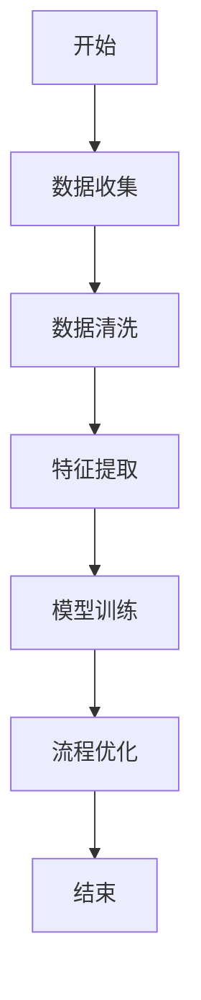
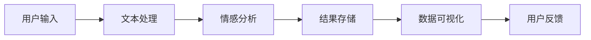
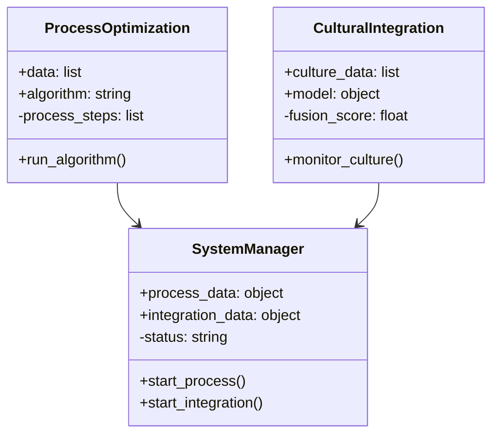
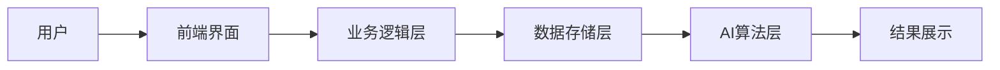
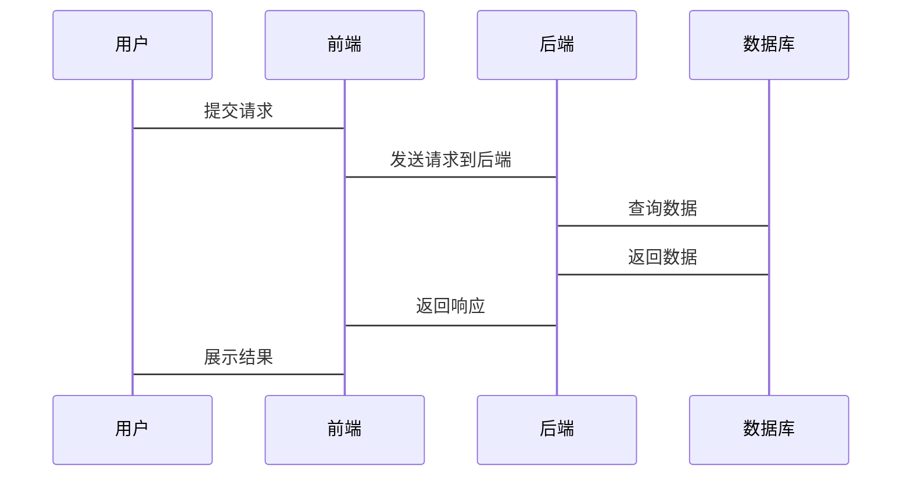

                 


# AI辅助企业并购后整合：业务流程优化与文化融合监控

## 关键词：AI，企业并购，业务流程优化，文化融合，系统架构

## 摘要：  
本文探讨了人工智能（AI）在企业并购后整合中的应用，重点分析了业务流程优化与文化融合监控的关键技术与方法。通过介绍AI技术的核心应用、业务流程优化的AI方法、文化融合的监控策略以及系统架构设计，本文为读者提供了从理论到实践的全面指导，帮助企业在并购后实现高效整合与协同。

---

## 正文

### 第一部分：企业并购与整合的背景

#### 第1章：企业并购的定义与现状

##### 1.1 企业并购的定义与现状

- **企业并购的定义**  
  企业并购是指一家企业通过购买另一家企业的一部分或全部股权，以实现资源重组和战略扩张的过程。  
  - 并购类型：  
    - **横向并购**：同一行业内的并购，旨在扩大市场份额。  
    - **纵向并购**：上下游产业的并购，以优化供应链。  
    - **混合并购**：跨行业并购，寻求新的业务增长点。  

- **当前企业并购的现状**  
  - 并购活动日益频繁，尤其是在科技和互联网行业。  
  - 并购后的整合难度大，尤其是跨国并购和文化差异较大的企业。  
  - 数据驱动的并购趋势明显，企业通过数据分析寻找并购标的。  

- **企业并购整合的核心问题**  
  - **业务流程整合**：如何高效整合双方的业务流程，避免重复和低效。  
  - **文化融合**：如何在组织文化差异中实现协同。  
  - **协同效应**：如何通过整合实现成本降低和价值提升。  

- **AI在企业并购整合中的价值**  
  - 提供数据支持，优化整合策略。  
  - 自动化处理流程，降低整合成本。  
  - 预测风险，提前制定应对方案。  

---

#### 第2章：AI在企业并购整合中的核心应用

##### 2.1 AI技术的基础

- **机器学习**  
  - 基于数据训练模型，用于预测和分类。  
  - 常用算法：线性回归、支持向量机（SVM）、随机森林、神经网络。  

- **自然语言处理（NLP）**  
  - 对文本数据进行处理，提取关键词和情感分析。  
  - 应用于企业文档分析和文化融合监控。  

- **数据挖掘**  
  - 从海量数据中提取有价值的信息。  
  - 常用技术：聚类分析、关联规则挖掘、异常检测。  

##### 2.2 AI在并购整合中的应用场景

- **业务流程优化**  
  - 通过AI分析现有流程，识别瓶颈并提出优化建议。  
  - 使用流程挖掘技术，生成流程图并优化步骤。  

- **文化融合监控**  
  - 利用NLP分析员工反馈，识别文化冲突。  
  - 通过情感分析监控文化融合的进展。  

- **风险预测与管理**  
  - 基于历史数据预测整合中的潜在风险。  
  - 使用机器学习模型制定风险应对策略。  

##### 2.3 AI技术在整合中的优势

- **提高整合效率**  
  - AI自动化处理数据，缩短整合时间。  

- **降低整合成本**  
  - 通过数据驱动的决策减少试错成本。  

- **增强整合效果**  
  - AI提供精准的分析和预测，提升协同效应。  

---

### 第二部分：业务流程优化的AI方法

#### 第3章：业务流程优化的AI方法

##### 3.1 业务流程分析与建模

- **流程图的绘制**  
  - 使用工具（如Lucidchart）绘制现有流程图。  
  - 分析流程中的关键节点和瓶颈。  

- **业务流程优化的目标**  
  - 提高效率：减少冗余步骤，缩短处理时间。  
  - 降低成本：优化资源分配，减少浪费。  
  - 提升质量：确保流程输出符合标准。  

- **流程优化的步骤**  
  1. 数据收集与分析。  
  2. 识别瓶颈与改进点。  
  3. 设计优化方案。  
  4. 实施并监控效果。  

##### 3.2 AI驱动的流程优化算法

- **算法原理概述**  
  - 基于机器学习模型，预测流程中的优化点。  
  - 使用聚类分析识别相似流程，简化处理步骤。  

- **算法流程图（Mermaid）**  


##### 3.3 算法实现与代码示例

- **环境配置**  
  ```bash
  pip install numpy pandas scikit-learn
  ```

- **代码实现**  
  ```python
  import pandas as pd
  from sklearn.model_selection import train_test_split
  from sklearn.ensemble import RandomForestClassifier

  # 数据加载与预处理
  data = pd.read_csv('process_data.csv')
  X = data.drop(columns=['process_time'])
  y = data['process_time']

  # 数据划分
  X_train, X_test, y_train, y_test = train_test_split(X, y, test_size=0.2)

  # 模型训练
  model = RandomForestClassifier(n_estimators=100)
  model.fit(X_train, y_train)

  # 预测与评估
  accuracy = model.score(X_test, y_test)
  print(f"模型准确率：{accuracy}")
  ```

---

### 第三部分：文化融合的监控

#### 第4章：文化融合的监控

##### 4.1 文化评估与融合策略

- **文化评估**  
  - 分析企业文化差异，识别潜在冲突点。  
  - 通过员工反馈收集文化融合的障碍。  

- **文化融合策略**  
  - 建立混合团队，促进跨文化协作。  
  - 制定统一的公司文化，明确价值观和行为准则。  

##### 4.2 AI在文化融合监控中的应用

- **情感分析**  
  - 使用NLP技术分析员工反馈文本，识别情绪变化。  
  - 生成情感分析报告，监控文化融合的进展。  

- **文化融合的监控方法**  
  - 设置关键绩效指标（KPIs），如员工满意度、团队协作效率。  
  - 定期进行文化融合评估，调整监控策略。  

##### 4.3 系统架构设计

- **系统设计目标**  
  - 实时监控文化融合过程，提供数据支持。  
  - 支持多语言处理，适应跨国并购需求。  

- **系统架构图（Mermaid）**  


---

### 第四部分：系统架构与实现

#### 第5章：系统架构设计

##### 5.1 问题场景介绍

- **系统目标**  
  - 实现企业并购后整合的智能化管理。  
  - 提供业务流程优化和文化融合监控的工具。  

##### 5.2 系统功能设计

- **领域模型（Mermaid类图）**  


##### 5.3 系统架构设计

- **系统架构图（Mermaid）**  


##### 5.4 系统接口设计

- **接口描述**  
  - `/process_optimization`：处理业务流程优化请求。  
  - `/culture_monitoring`：监控文化融合状态。  
  - `/api_predict`：预测整合风险。  

##### 5.5 系统交互（Mermaid序列图）  


---

### 第五部分：项目实战

#### 第6章：项目实战

##### 6.1 环境配置

- **安装依赖**  
  ```bash
  pip install flask numpy pandas scikit-learn
  ```

##### 6.2 核心实现源代码

- **Flask Web服务**  
  ```python
  from flask import Flask, request, jsonify
  import numpy as np
  from sklearn.ensemble import RandomForestClassifier

  app = Flask(__name__)

  model = RandomForestClassifier(n_estimators=100)
  model.fit(X_train, y_train)

  @app.route('/process_optimization', methods=['POST'])
  def process_optimization():
      data = request.json['data']
      prediction = model.predict(data)
      return jsonify({'result': prediction.tolist()})

  if __name__ == '__main__':
      app.run(debug=True)
  ```

##### 6.3 案例分析与总结

- **案例分析**  
  - 某科技公司并购后，通过AI技术优化了订单处理流程，减少了20%的时间。  
  - 文化融合监控帮助公司识别了关键文化冲突点，提前制定解决方案。  

- **总结**  
  - AI技术显著提升了企业并购后的整合效率。  
  - 未来，随着AI技术的不断发展，企业整合将更加智能化和数据驱动。  

---

### 第六部分：总结与展望

#### 第7章：总结与展望

##### 7.1 总结

- AI技术在企业并购整合中的应用前景广阔。  
- 通过业务流程优化和文化融合监控，企业能够实现更高效的整合和协同。  

##### 7.2 未来展望

- **技术发展**  
  - 更加智能化的AI算法，如深度学习和强化学习，将进一步提升整合效果。  

- **应用拓展**  
  - AI在并购后的市场分析、客户行为预测等方面的应用将更加广泛。  

##### 7.3 最佳实践 tips

- **数据质量管理**  
  - 确保数据的准确性和完整性，避免错误分析。  

- **团队协作**  
  - 跨职能团队合作，确保技术与业务的紧密结合。  

- **持续监控与优化**  
  - 定期评估整合效果，根据反馈持续优化。  

---

通过本文的详细分析，读者可以全面了解AI在企业并购整合中的应用，并掌握业务流程优化与文化融合监控的具体方法。希望本文能为企业在并购整合过程中提供有价值的指导和启发。

