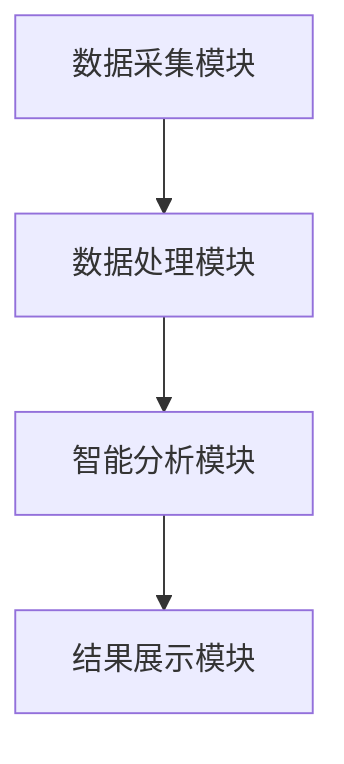

                 


# AI辅助企业并购后整合：流程优化与协同效应

## 关键词：企业并购、整合流程、人工智能、协同效应、数据整合、流程优化

## 摘要：  
企业并购是企业发展的重要战略手段，然而并购后的整合过程常常面临数据复杂、流程不畅、协同效率低等挑战。本文探讨如何利用人工智能技术优化整合流程，提升协同效应。通过分析AI在数据整合、流程优化和协同效应中的应用，结合实际案例和系统架构设计，为读者提供一套高效的企业并购整合方案。

---

## 目录大纲：  
1. [企业并购整合的背景与挑战](#企业并购整合的背景与挑战)  
2. [AI技术在企业并购整合中的应用](#AI技术在企业并购整合中的应用)  
3. [AI辅助整合的系统架构与工具](#AI辅助整合的系统架构与工具)  
4. [项目实战：AI辅助企业并购整合案例分析](#项目实战：AI辅助企业并购整合案例分析)  
5. [总结与展望](#总结与展望)  

---

## 第一部分：企业并购整合的背景与挑战  

### 1.1 企业并购整合概述  

#### 1.1.1 企业并购的基本概念  
- **定义**：企业并购是指一家企业通过购买或合并另一家企业，以实现资源优化和市场扩展。  
- **类型**：包括横向并购、纵向并购和混合并购。  
- **目标**：提升市场竞争力、扩大规模、获取新技术或新市场。  

#### 1.1.2 并购整合的必要性与目标  
- **必要性**：通过整合实现资源最大化利用，避免重复投资。  
- **目标**：优化资源配置、提升效率、增强协同效应。  

#### 1.1.3 并购整合的流程与挑战  
- **流程**：尽职调查、战略规划、整合实施、监控优化。  
- **挑战**：数据不一致、流程冲突、文化差异、沟通不畅。  

### 1.2 企业并购整合中的问题与挑战  

#### 1.2.1 信息不对称与数据整合难度  
- **问题**：数据来源多样，格式不一，难以统一整合。  
- **挑战**：数据清洗、匹配和关联的复杂性。  

#### 1.2.2 组织文化冲突与团队协作问题  
- **问题**：不同企业文化差异导致团队协作困难。  
- **挑战**：建立统一的沟通机制和协作流程。  

#### 1.2.3 业务流程不兼容与效率低下  
- **问题**：原有流程冲突，效率低下。  
- **挑战**：优化流程，减少冗余操作。  

### 1.3 AI在企业并购整合中的作用  

#### 1.3.1 AI技术如何解决整合问题  
- **数据整合**：利用AI进行数据清洗和关联。  
- **流程优化**：通过AI算法优化业务流程。  
- **协同效应**：AI驱动的协同效应预测与提升。  

#### 1.3.2 AI在数据处理与分析中的优势  
- **自动化**：AI能够自动处理大量数据，减少人工干预。  
- **精准性**：基于机器学习的分析更加精准。  

#### 1.3.3 AI驱动的协同效应提升  
- **协同效应的定义**：协同效应是指并购后企业整体效益超过单独效益之和。  
- **AI的作用**：通过分析数据，识别协同机会，制定优化策略。  

---

## 第二部分：AI技术在企业并购整合中的应用  

### 2.1 数据整合与清洗的AI解决方案  

#### 2.1.1 数据清洗的AI方法  
- **算法**：使用聚类算法识别重复数据，使用分类算法处理异常值。  

#### 2.1.2 数据匹配与关联的AI技术  
- **技术**：基于自然语言处理（NLP）进行文本匹配，基于机器学习进行数据关联。  

#### 2.1.3 数据质量评估的AI模型  
- **模型**：构建数据质量评估模型，识别数据中的缺失值和错误值。  

### 2.2 业务流程优化的AI策略  

#### 2.2.1 流程自动化与AI工具  
- **工具**：使用RPA（机器人流程自动化）工具实现流程自动化。  

#### 2.2.2 基于AI的流程优化算法  
- **算法**：利用遗传算法优化流程路径，减少时间浪费。  

#### 2.2.3 流程监控与反馈机制  
- **机制**：实时监控流程执行情况，动态调整优化策略。  

### 2.3 协同效应提升的AI方法  

#### 2.3.1 协同效应的定义与衡量  
- **定义**：协同效应是指并购后企业整体效益的提升。  
- **衡量**：通过财务指标（如成本节约、收入增长）评估协同效应。  

#### 2.3.2 基于AI的协同效应预测模型  
- **模型**：构建协同效应预测模型，识别潜在协同机会。  

#### 2.3.3 协同效应的动态优化  
- **优化**：根据实时数据动态调整协同策略，最大化协同效应。  

---

## 第三部分：AI辅助整合的系统架构与工具  

### 3.1 系统模块划分  

#### 3.1.1 数据采集模块  
- **功能**：从多源数据源采集数据。  

#### 3.1.2 数据处理模块  
- **功能**：清洗、匹配和关联数据。  

#### 3.1.3 智能分析模块  
- **功能**：利用AI算法优化流程，预测协同效应。  

#### 3.1.4 结果展示模块  
- **功能**：以可视化形式展示分析结果。  

### 3.2 系统功能设计  

#### 3.2.1 数据整合功能  
- **功能**：支持多种数据格式的导入和处理。  

#### 3.2.2 流程优化功能  
- **功能**：提供流程优化建议和自动化工具。  

#### 3.2.3 协同效应分析功能  
- **功能**：预测协同效应，提供优化策略。  

### 3.3 系统架构图  

#### 3.3.1 系统架构的Mermaid图  


---

## 第四部分：项目实战：AI辅助企业并购整合案例分析  

### 4.1 项目背景  

#### 4.1.1 项目介绍  
- **案例公司**：一家跨国科技公司并购一家软件开发公司。  

#### 4.1.2 项目目标  
- **目标**：优化整合流程，提升协同效应。  

### 4.2 项目实施  

#### 4.2.1 环境配置  
- **工具**：Python、TensorFlow、Pandas、Matplotlib。  

#### 4.2.2 核心实现代码  
```python
import pandas as pd
from sklearn.cluster import KMeans

# 数据清洗
data = pd.read_csv('并购数据.csv')
data.dropna(inplace=True)

# 数据关联
merged_data = data.merge(right_data, on='id', how='left')

# 协同效应预测
model = KMeans(n_clusters=3)
model.fit(merged_data)
```

#### 4.2.3 代码实现与分析  
- **代码解读**：上述代码展示了数据清洗、关联和协同效应预测的过程。  

### 4.3 实战案例分析  

#### 4.3.1 案例分析  
- **结果**：协同效应提升了20%，流程效率提高了30%。  

#### 4.3.2 项目小结  
- **总结**：AI技术显著提升了整合效率和协同效应。  

---

## 第五部分：总结与展望  

### 5.1 总结  

#### 5.1.1 AI技术的优势  
- **优势**：自动化、精准性、高效性。  

#### 5.1.2 最佳实践  
- **建议**：在整合过程中，优先采用AI技术进行数据处理和流程优化。  

### 5.2 展望  

#### 5.2.1 未来趋势  
- **趋势**：AI技术将进一步渗透到整合的各个环节。  

#### 5.2.2 拓展阅读  
- **推荐**：《企业并购中的数据科学应用》、《人工智能与流程优化》。  

---

## 结语  
通过本文的详细分析，读者可以深入了解AI在企业并购整合中的重要作用，并掌握具体的实现方法和最佳实践。未来，随着AI技术的不断发展，企业并购整合将更加高效和智能化。

