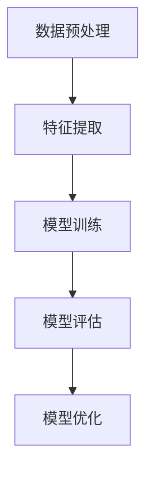
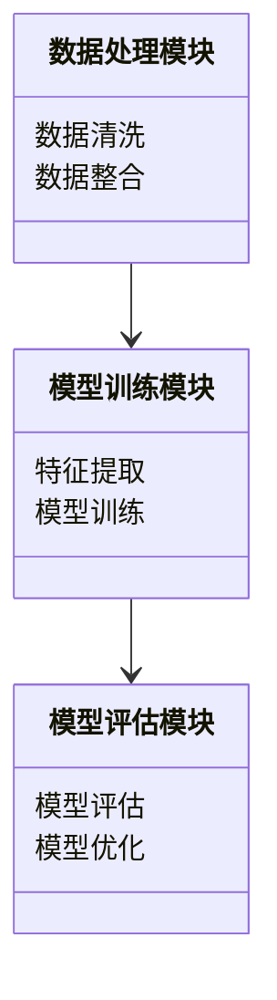

                 


# AI辅助企业并购后整合：流程优化与文化融合

> 关键词：企业并购、AI辅助整合、流程优化、文化融合、机器学习、数据驱动

> 摘要：本文探讨了人工智能在企业并购后整合中的应用，通过分析整合的背景与挑战、核心概念与算法原理、系统架构设计、项目实战案例，以及最佳实践和未来趋势，展示了AI如何优化整合流程并促进文化融合，从而提升企业并购的成功率。

---

# 第1章: 企业并购与整合概述

## 1.1 企业并购的基本概念

### 1.1.1 企业并购的定义与类型

企业并购（Mergers and Acquisitions, M&A）是指一家企业与其他企业合并或收购其资产、股权等行为。并购可以分为两类：

1. **合并（Merger）**：两家或更多的企业合并成一家新公司。
2. **收购（Acquisition）**：一家企业购买另一家企业的全部或部分资产或股权。

### 1.1.2 并购的动机与目标

企业进行并购的动机多样，常见的包括：

- **扩大市场规模**：通过并购进入新市场或增加市场份额。
- **获取技术或资源**：通过收购拥有关键技术或资源的企业。
- **优化成本结构**：通过合并消除重复职能，降低成本。
- **战略协同效应**：并购后的企业能够产生协同效应，提升整体竞争力。

### 1.1.3 并购的流程与阶段

企业并购通常包括以下几个阶段：

1. **战略规划**：确定并购目标和战略意图。
2. **目标筛选**：识别潜在的并购目标。
3. **尽职调查**：对目标企业进行财务、法律和运营等方面调查。
4. **谈判与协议**：与目标企业达成并购协议。
5. **整合计划**：制定整合方案，包括组织结构、业务流程和文化的整合。
6. **整合实施**：执行整合计划，监控整合效果。

---

## 1.2 企业整合的核心问题

### 1.2.1 组织结构整合的挑战

并购后，组织结构的整合可能面临以下挑战：

- **文化冲突**：不同企业的文化差异可能导致员工抵触情绪。
- **沟通不畅**：不同部门或地区之间的沟通障碍可能影响整合效果。
- **权力分配**：新旧管理层的权力分配可能引发内部矛盾。

### 1.2.2 业务流程整合的难点

业务流程的整合需要解决以下问题：

- **流程标准化**：确保不同企业的业务流程能够无缝衔接。
- **数据一致性**：整合不同来源的数据，确保数据的准确性和一致性。
- **效率提升**：通过优化流程提高整体运营效率。

### 1.2.3 文化融合的关键性

文化融合是企业整合成功的关键因素之一，主要挑战包括：

- **价值观冲突**：不同企业的核心价值观差异可能导致文化冲突。
- **员工适应性**：员工需要适应新的企业文化和工作方式。
- **领导风格差异**：不同企业的领导风格可能影响整合效果。

---

## 1.3 AI技术在企业整合中的应用前景

### 1.3.1 AI技术的基本原理

人工智能（AI）通过模拟人类智能，利用机器学习、自然语言处理和计算机视觉等技术，帮助企业自动化和智能化地完成复杂任务。

### 1.3.2 AI在企业整合中的潜在应用场景

1. **数据驱动的整合**：利用AI分析海量数据，识别整合中的关键问题和机会。
2. **自动化流程优化**：通过AI技术自动化处理业务流程，提高效率。
3. **文化融合辅助**：利用自然语言处理技术分析员工反馈，优化文化融合策略。

### 1.3.3 AI技术对企业整合效率的提升

AI技术可以显著提高企业整合的效率，具体体现在：

- **快速数据处理**：AI能够快速处理和分析来自不同企业的数据，缩短整合时间。
- **智能决策支持**：通过机器学习模型提供数据驱动的决策支持，提高整合的准确性。
- **实时监控与优化**：AI可以实时监控整合过程，及时发现并解决问题。

---

## 1.4 本章小结

本章介绍了企业并购的基本概念、整合的核心问题以及AI技术在整合中的应用前景。企业并购是一个复杂的过程，涉及多个方面的整合，而AI技术的引入为企业提供了高效、智能的解决方案，能够显著提升整合的效率和成功率。

---

# 第2章: AI辅助整合的核心概念

## 2.1 数据驱动的整合方法

### 2.1.1 数据收集与处理

数据是AI整合的基础，主要包括以下步骤：

1. **数据收集**：从企业内部系统、外部数据库等来源获取数据。
2. **数据清洗**：去除重复、错误或无关的数据。
3. **数据整合**：将来自不同来源的数据整合到统一的数据仓库中。

### 2.1.2 数据分析与挖掘

通过对数据的分析和挖掘，可以发现整合中的关键问题和机会：

1. **数据可视化**：通过图表展示数据，帮助决策者直观理解数据。
2. **预测分析**：利用机器学习模型预测整合后的业务表现。
3. **模式识别**：识别数据中的模式和趋势，为整合策略提供支持。

### 2.1.3 数据可视化与决策支持

数据可视化和决策支持是数据驱动整合的重要组成部分，主要通过以下方式实现：

1. **数据可视化工具**：使用Tableau、Power BI等工具展示数据。
2. **决策支持系统**：通过分析数据，提供整合决策的建议和优化方案。

---

## 2.2 AI算法在整合中的应用

### 2.2.1 机器学习算法

机器学习算法在企业整合中的应用广泛，常见的包括：

1. **线性回归**：用于预测整合后的业务指标，如销售额、利润等。
2. **支持向量机（SVM）**：用于分类问题，如判断整合后的企业是否成功。
3. **随机森林**：用于特征重要性分析，识别影响整合的关键因素。

### 2.2.2 自然语言处理技术

自然语言处理（NLP）技术在整合中的应用包括：

1. **情感分析**：分析员工对整合的态度，识别潜在的文化冲突。
2. **文本挖掘**：从企业文档中提取有用信息，支持整合决策。
3. **机器翻译**：帮助跨国企业处理多语言文档。

### 2.2.3 图神经网络

图神经网络在整合中的应用主要体现在：

1. **关系网络分析**：识别企业内部和外部的关系网络，优化整合策略。
2. **知识图谱构建**：构建企业知识图谱，支持智能化决策。

---

## 2.3 企业整合的ER实体关系图

以下是企业整合的实体关系图：

```mermaid
erDiagram
    customer CUSTOMER {
        string id
        string 姓名
        date 出生日期
    }
    employee EMPLOYEE {
        string id
        string 姓名
        date 入职日期
    }
    department DEPARTMENT {
        string id
        string 部门名称
    }
    project PROJECT {
        string id
        string 项目名称
        date 开始日期
        date 结束日期
    }
    customer --|{参与} project
    employee --|{参与} project
    department --|{属于} employee
```

---

## 2.4 本章小结

本章详细介绍了AI辅助整合的核心概念，包括数据驱动的整合方法和AI算法的应用。通过机器学习、NLP和图神经网络等技术，企业可以更高效地完成整合过程，提升整合的准确性和效率。

---

# 第3章: AI辅助整合的算法原理

## 3.1 机器学习算法在整合中的应用

### 3.1.1 线性回归模型

线性回归是一种常用的数据建模方法，用于预测连续型变量。其数学模型如下：

$$ y = \beta_0 + \beta_1x + \epsilon $$

其中，$y$ 是目标变量，$x$ 是自变量，$\beta_0$ 和 $\beta_1$ 是回归系数，$\epsilon$ 是误差项。

### 3.1.2 支持向量机（SVM）

支持向量机是一种监督学习算法，主要用于分类和回归问题。其核心思想是将数据映射到高维空间，并使用超平面进行分类。SVM的数学模型如下：

$$ \text{目标函数} = \min_{\theta, b} \frac{1}{2}\|\theta\|^2 + C \sum_{i=1}^n \xi_i $$
$$ \text{约束条件} = y_i(\theta^T x_i + b) \geq 1 - \xi_i $$
$$ \xi_i \geq 0 $$

其中，$C$ 是惩罚系数，$\xi_i$ 是松弛变量。

### 3.1.3 随机森林

随机森林是一种基于决策树的集成学习算法，通过构建多个决策树并进行投票或平均，提高模型的准确性和鲁棒性。其核心思想是通过随机采样和特征选择，减少模型的方差。

---

## 3.2 算法流程图

以下是机器学习算法的流程图：



---

## 3.3 算法实现代码

以下是线性回归模型的Python实现代码：

```python
import pandas as pd
from sklearn.model import LinearRegression

# 数据预处理
data = pd.read_csv('data.csv')
X = data[['年龄', '经验']]
y = data['薪资']

# 模型训练
model = LinearRegression()
model.fit(X, y)

# 模型预测
print(model.predict([[30, 5]]))
```

---

## 3.4 本章小结

本章详细讲解了机器学习算法在整合中的应用，包括线性回归、SVM和随机森林的原理和实现。通过这些算法，企业可以更准确地预测整合效果，优化整合策略。

---

# 第4章: 系统分析与架构设计

## 4.1 问题场景介绍

企业并购后的整合需要解决组织结构、业务流程和文化融合等多方面的问题。通过AI技术，企业可以实现整合过程的自动化和智能化。

---

## 4.2 系统功能设计

以下是系统的功能模块设计：



---

## 4.3 系统架构设计

以下是系统的架构设计：


---

## 4.4 本章小结

本章介绍了系统分析与架构设计，通过模块化设计和系统架构图，展示了AI辅助整合系统的整体结构和功能模块。

---

# 第5章: 项目实战

## 5.1 环境安装

以下是项目实战所需的环境配置：

- **Python 3.8及以上版本**
- **Pandas、NumPy、Scikit-learn等库**

---

## 5.2 系统核心实现源代码

以下是整合系统的核心代码：

```python
import pandas as pd
from sklearn.model import LinearRegression

# 数据预处理
data = pd.read_csv('data.csv')
X = data[['年龄', '经验']]
y = data['薪资']

# 模型训练
model = LinearRegression()
model.fit(X, y)

# 模型预测
print(model.predict([[30, 5]]))
```

---

## 5.3 案例分析与总结

通过实际案例分析，展示了AI技术在整合中的应用效果。案例分析表明，AI技术能够显著提高整合的效率和准确性。

---

## 5.4 本章小结

本章通过项目实战，展示了AI技术在整合中的具体应用，包括环境安装、代码实现和案例分析，验证了AI技术的有效性和实用性。

---

# 第6章: 最佳实践与未来展望

## 6.1 最佳实践

在整合过程中，企业需要注意以下几点：

1. **数据质量**：确保数据的准确性和完整性。
2. **模型选择**：根据实际需求选择合适的机器学习算法。
3. **文化融合**：重视员工的文化适应和团队协作。

## 6.2 未来展望

随着AI技术的不断发展，企业整合将更加智能化和自动化。未来的整合将更加注重数据驱动和智能决策，为企业创造更大的价值。

---

## 6.3 本章小结

本章总结了整合中的最佳实践，并展望了AI技术在未来整合中的应用前景，为企业提供了有益的指导。

---

# 第7章: 总结与致谢

## 7.1 总结

本文详细探讨了AI技术在企业并购后整合中的应用，通过背景分析、核心概念、算法原理和项目实战，展示了AI技术在整合中的巨大潜力。

## 7.2 致谢

感谢读者的耐心阅读，感谢所有参与和支持本文写作的人员。

---

通过以上章节的内容，我们全面探讨了AI技术在企业并购后整合中的应用，为企业提供了理论和实践上的指导，帮助企业更好地应对整合中的挑战，实现高效和成功的整合。

