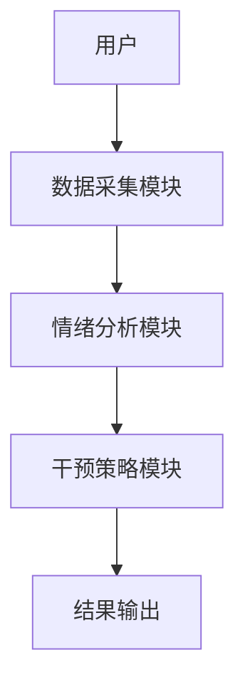

                 


# AI辅助企业并购后文化整合：员工情绪分析与干预策略

> 关键词：AI，企业并购，文化整合，员工情绪分析，干预策略，深度学习

> 摘要：随着企业并购活动的日益频繁，文化整合成为决定并购成功与否的关键因素。本文探讨如何利用人工智能技术进行员工情绪分析，制定有效的干预策略，助力企业并购后的文化整合。通过分析员工情绪，企业能够及时识别文化冲突，优化整合策略，提升并购成功率。

---

# 第一章: 企业并购与文化整合的背景与挑战

## 1.1 企业并购的背景与特点

企业并购（Mergers and Acquisitions, M&A）是企业扩展的重要方式之一。随着全球化和市场竞争的加剧，企业通过并购获取资源、技术、市场和人才成为常见策略。然而，并购不仅仅是资产的合并，更是文化和组织的整合。

### 1.1.1 并购的定义与分类
- **定义**：企业并购是指一家企业购买或合并另一家企业，以实现资源优化和战略目标。
- **分类**：
  - **横向并购**：同一行业内的并购。
  - **纵向并购**：上下游产业的并购。
  - **混合并购**：跨行业并购。

### 1.1.2 并购的动机与目标
- **动机**：扩大市场份额、获取技术优势、降低运营成本。
- **目标**：实现协同效应，提升企业竞争力。

### 1.1.3 并购中的文化整合挑战
- 文化差异可能导致员工抵触，影响团队协作。
- 企业文化冲突可能影响企业战略的执行。

## 1.2 企业并购中的文化整合问题

### 1.2.1 文化差异对企业绩效的影响
- 不同的企业文化可能导致管理风格冲突。
- 员工价值观差异影响团队合作。

### 1.2.2 文化整合中的主要挑战
- 企业文化的兼容性问题。
- 员工情绪管理不当引发的冲突。

### 1.2.3 文化整合的必要性与关键性
- 文化整合是并购成功的关键因素。
- 员工情绪管理是文化整合的重要环节。

## 1.3 员工情绪分析在文化整合中的作用

### 1.3.1 员工情绪对企业文化整合的影响
- 员工情绪稳定有助于文化融合。
- 情绪波动可能引发文化冲突。

### 1.3.2 员工情绪分析的定义与目标
- **定义**：通过技术手段分析员工情绪状态。
- **目标**：识别情绪问题，制定干预策略。

### 1.3.3 员工情绪分析的技术与方法
- 利用自然语言处理（NLP）技术分析文本数据。
- 通过机器学习模型预测员工情绪。

## 1.4 本章小结

---

# 第二章: 员工情绪分析的核心概念与方法

## 2.1 情绪分析的定义与分类

### 2.1.1 情绪分析的定义
- 情绪分析是通过技术手段识别文本中的情感倾向。

### 2.1.2 情绪分析的分类与应用场景
- **分类**：
  - 正面情绪、负面情绪、中性情绪。
  - 情绪强度：情绪的强烈程度。
- **应用场景**：
  - 企业并购中的文化整合。
  - 员工满意度调查。

### 2.1.3 情绪分析的关键指标
- 情绪强度、情绪类型、情绪分布。

## 2.2 文本挖掘与自然语言处理在情绪分析中的应用

### 2.2.1 文本挖掘的基本原理
- 从文本数据中提取有用信息。

### 2.2.2 自然语言处理技术在情绪分析中的作用
- **分词**：将文本分解为词语。
- **词性标注**：识别词语的词性。
- **情感分类**：基于词语和句子的情感倾向进行分类。

### 2.2.3 常用的情绪分析工具与平台
- **工具**：NLTK、Spacy。
- **平台**：Twitter情感分析API。

## 2.3 基于AI的情绪分析方法

### 2.3.1 传统机器学习方法
- **算法**：支持向量机（SVM）、随机森林（Random Forest）。
- **流程**：数据预处理、特征提取、模型训练。

### 2.3.2 深度学习方法
- **模型**：卷积神经网络（CNN）、循环神经网络（RNN）。
- **流程**：数据预处理、模型构建、训练与调优。

### 2.3.3 混合方法与优化策略
- 结合传统机器学习和深度学习的优势。

## 2.4 本章小结

---

# 第三章: 员工情绪与企业绩效的关系

## 3.1 员工情绪对企业绩效的影响

### 3.1.1 积极情绪对企业绩效的促进作用
- **积极情绪**：提高工作效率，增强团队协作。
- **案例**：员工情绪稳定的企业并购后表现优于情绪不稳定的竞争对手。

### 3.1.2 消极情绪对企业绩效的负面影响
- **消极情绪**：降低工作效率，引发内部冲突。
- **案例**：并购后因文化冲突导致员工流失率上升。

### 3.1.3 情绪稳定性与企业绩效的关系
- 情绪稳定的员工表现更优。

## 3.2 情绪反馈在文化整合中的作用

### 3.2.1 情绪反馈的采集与分析方法
- **数据来源**：员工反馈、社交媒体数据、会议记录。
- **分析方法**：情感分析、主题建模。

### 3.2.2 情绪反馈的动态调整机制
- 定期收集反馈，及时调整文化整合策略。

## 3.3 基于情绪分析的企业文化整合策略

### 3.3.1 情绪分析驱动的文化整合框架
- **步骤**：
  1. 数据采集。
  2. 情绪分析。
  3. 制定干预策略。
  4. 实施与评估。

### 3.3.2 情绪分析结果的可视化与解读
- 使用图表展示情绪分布，便于管理层理解。

### 3.3.3 情绪分析在文化整合中的应用案例
- 某企业并购后通过情绪分析优化整合策略，显著提升员工满意度。

## 3.4 本章小结

---

# 第四章: 并购后文化整合的AI辅助策略

## 4.1 并购后文化整合的关键环节

### 4.1.1 文化冲突的识别与评估
- **方法**：基于情绪分析识别潜在冲突。
- **工具**：自然语言处理技术。

### 4.1.2 文化整合的干预策略
- **策略**：制定沟通计划、培训计划、激励计划。

## 4.2 AI辅助文化整合的实现方案

### 4.2.1 数据采集与处理
- **数据源**：员工反馈、社交媒体、内部沟通记录。
- **数据预处理**：去噪、分词、标注。

### 4.2.2 情绪分类模型的构建与优化
- **模型选择**：深度学习模型（LSTM）。
- **优化策略**：调整超参数、引入迁移学习。

### 4.2.3 干预策略的动态调整
- 根据实时情绪数据优化整合策略。

## 4.3 本章小结

---

# 第五章: 系统架构与算法实现

## 5.1 系统架构设计

### 5.1.1 系统功能模块
- 数据采集模块、情绪分析模块、干预策略模块。

### 5.1.2 系统架构图


### 5.1.3 接口设计与交互流程
- **接口**：API接口实现模块间的通信。
- **交互流程**：用户提交数据，系统处理并输出结果。

## 5.2 算法实现细节

### 5.2.1 情绪分类算法
- **算法选择**：LSTM。
- **数学模型**：
  - 输入层：词嵌入。
  - LSTM层：捕捉序列信息。
  - 全连接层：输出情绪类别。

### 5.2.2 情绪分类的数学公式
```latex
$$
\text{LSTM单元} = \text{Forget gate} \times \text{输入} + \text{Input gate} \times \text{隐藏层状态}
$$
```

## 5.3 本章小结

---

# 第六章: 项目实战与案例分析

## 6.1 项目背景与目标

### 6.1.1 项目背景
- 某企业并购后面临文化整合问题。

### 6.1.2 项目目标
- 分析员工情绪，制定干预策略。

## 6.2 项目实施过程

### 6.2.1 环境搭建
- **工具**：Python、TensorFlow、NLTK。
- **数据集**：员工反馈文本数据。

### 6.2.2 核心代码实现
```python
import numpy as np
from tensorflow.keras import layers

model = tf.keras.Sequential()
model.add(layers.Embedding(input_dim=词汇表大小, output_dim=嵌入维度))
model.add(layers.LSTM(units=128, return_sequences=True))
model.add(layers.Dense(units=3, activation='softmax'))
model.compile(optimizer='adam', loss='sparse_categorical_crossentropy', metrics=['accuracy'])
```

## 6.3 案例分析

### 6.3.1 案例背景
- 企业A并购企业B，员工情绪分析显示负面情绪较高。

### 6.3.2 分析结果与策略制定
- 制定沟通计划，增强员工参与感。
- 提供培训，提升员工技能。

## 6.4 本章小结

---

# 第七章: 最佳实践与总结

## 7.1 最佳实践

### 7.1.1 数据采集的注意事项
- 确保数据的代表性和真实性。

### 7.1.2 模型优化的技巧
- 调整超参数，引入迁移学习。

## 7.2 总结与展望

### 7.2.1 本章总结
- AI技术在企业并购后文化整合中的重要作用。

### 7.2.2 未来展望
- 情感分析技术的进一步优化。
- AI在文化整合中的更多应用。

## 7.3 本章小结

---

# 参考文献

（此处列出相关参考文献，如书籍、论文、技术文档等。）

---

通过以上章节的详细分析，本文系统地探讨了AI在企业并购后文化整合中的应用，从理论到实践，为企业的文化整合提供了新的思路和方法。

