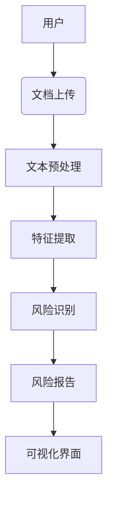
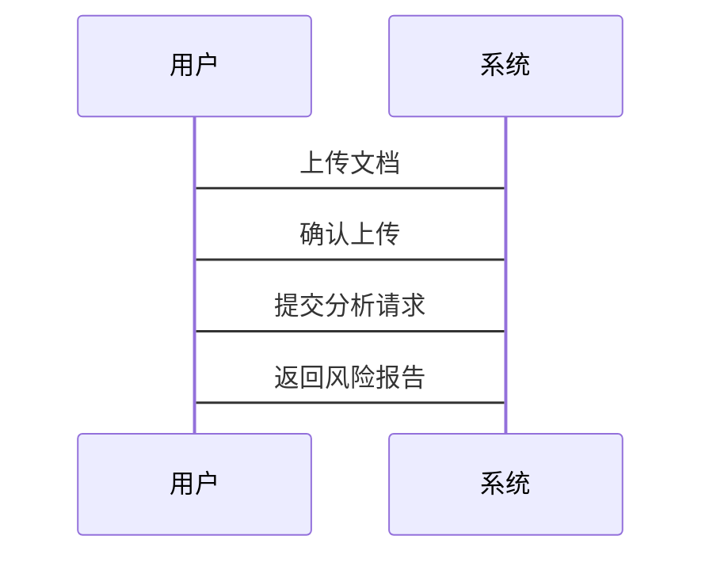

                 


# AI辅助企业并购尽职调查：自动化文档分析与风险识别

> 关键词：AI，企业并购，尽职调查，文档分析，风险识别，自然语言处理（NLP），法律文本分析

> 摘要：随着企业并购活动的日益频繁，传统的尽职调查方法逐渐暴露出效率低、成本高、风险识别不全面等缺陷。本文深入探讨了如何利用人工智能（AI）和自然语言处理（NLP）技术，实现企业并购过程中文档分析与风险识别的自动化。通过分析AI技术的核心算法、系统架构设计及实际案例，本文详细阐述了AI在企业并购尽职调查中的应用价值和实现路径，为企业及相关从业者提供了理论参考和实践指导。

---

# 第一部分: 引言

## 第1章: 企业并购与尽职调查的背景

### 1.1 企业并购的重要性
#### 1.1.1 企业并购的定义与类型
企业并购（Mergers and Acquisitions, M&A）是指两个或多个企业之间的合并或收购行为。常见的并购类型包括横向并购、纵向并购和混合并购。并购活动是企业扩展市场份额、优化资源配置、增强竞争力的重要手段。

#### 1.1.2 并购过程中的关键环节
企业并购的整个流程包括以下几个关键环节：
1. **战略规划**：明确并购目标和战略意图。
2. **目标筛选**：选择合适的并购目标。
3. **尽职调查**：对目标企业进行全面的调查，包括财务、法律、运营等方面。
4. **估值与谈判**：评估目标企业价值，进行谈判并确定交易条件。
5. **整合与实施**：完成并购后的业务整合。

#### 1.1.3 尽职调查的核心作用
尽职调查是企业并购过程中至关重要的一环，其主要目的是：
- 评估目标企业的财务状况、法律风险、经营状况等。
- 发现潜在问题并制定应对策略。
- 为并购决策提供数据支持。

### 1.2 AI技术在企业并购中的应用
#### 1.2.1 AI技术对企业并购的潜在价值
AI技术可以通过自动化处理和数据分析，显著提高企业并购的效率和准确性。例如，AI可以自动分析大量文档，识别潜在风险点，帮助并购方做出更明智的决策。

#### 1.2.2 AI在尽职调查中的优势
1. **高效性**：AI可以快速处理大量文档，显著缩短尽职调查的时间。
2. **准确性**：通过机器学习算法，AI可以发现人工审查难以察觉的潜在问题。
3. **可扩展性**：AI技术可以同时处理多个项目，支持大规模的并购活动。

#### 1.2.3 当前AI技术在企业并购中的应用现状
目前，AI技术在企业并购中的应用还处于起步阶段，但已经展现出巨大的潜力。例如，一些企业已经在使用AI进行财务数据分析和法律文本挖掘。

### 1.3 本书的目标与结构
#### 1.3.1 本书的核心目标
本书旨在探讨AI技术在企业并购尽职调查中的应用，重点分析文档分析和风险识别的核心算法和实现方法。

#### 1.3.2 本书的章节安排
本书分为以下几个部分：
1. **引言**：介绍企业并购和尽职调查的背景。
2. **AI与NLP基础**：讲解AI和NLP的基本概念和技术。
3. **法律文本分析与风险识别**：探讨如何利用NLP技术进行法律文本分析和风险识别。
4. **核心算法与实现**：详细分析AI和NLP的核心算法及其在文档分析中的应用。
5. **系统架构设计**：介绍AI辅助尽职调查系统的架构设计和实现方案。
6. **项目实战**：通过实际案例，展示AI技术在企业并购中的应用。
7. **总结与展望**：总结本书的核心内容，并展望未来的发展方向。

#### 1.3.3 本书的适用读者
本书适用于以下读者：
- 企业并购领域的从业者，包括并购律师、财务顾问、项目经理等。
- 对AI和NLP技术感兴趣的IT工程师和数据科学家。
- 对企业并购和风险管理感兴趣的学生和研究人员。

---

# 第二部分: AI与NLP基础

## 第2章: 自然语言处理（NLP）基础

### 2.1 NLP的基本概念
#### 2.1.1 什么是自然语言处理
自然语言处理（NLP）是人工智能的一个分支，旨在让计算机能够理解、分析和生成人类语言。NLP的核心任务包括文本分类、信息提取、机器翻译、问答系统等。

#### 2.1.2 NLP的核心任务与技术
1. **文本预处理**：包括分词、停用词处理、词干提取等。
2. **词向量表示**：如Word2Vec、GloVe等。
3. **文本分类**：如情感分析、主题分类。
4. **信息提取**：如命名实体识别（NER）、关系抽取。
5. **文本生成**：如基于Transformer的模型（GPT、BERT等）。

#### 2.1.3 NLP在企业并购中的应用潜力
NLP技术可以应用于企业并购的多个环节，例如：
- **合同分析**：自动识别合同中的关键条款和潜在风险。
- **财务报表分析**：从财务文本中提取关键数据，评估企业价值。
- **新闻分析**：通过分析新闻报道，识别与并购相关的机会或风险。

### 2.2 文本预处理技术
#### 2.2.1 分词与词干提取
分词是将文本分割成词语的过程，词干提取则是去除词语的派生形式，保留其核心词干。例如，将“processing”提取为“process”。

#### 2.2.2 停用词处理
停用词是指在文本中没有实际意义的词语，例如“and”、“is”、“the”等。停用词处理可以减少文本的冗余信息，提高后续处理的效率。

#### 2.2.3 词向量表示
词向量表示是将词语转换为向量形式，以便计算机能够处理。常用的词向量模型包括Word2Vec和GloVe。例如，使用Word2Vec将“猫”表示为一个向量。

### 2.3 文本相似度计算
#### 2.3.1 余弦相似度
余弦相似度是一种常用的文本相似度计算方法，公式如下：
$$ \text{余弦相似度} = \frac{\vec{A} \cdot \vec{B}}{|\vec{A}| |\vec{B}|} $$
其中，$\vec{A}$和$\vec{B}$是两个文本的向量表示。

#### 2.3.2 Word Mover's Distance
Word Mover's Distance（WMD）是一种基于词向量的文本相似度计算方法，适用于短文本的比较。

#### 2.3.3 使用预训练模型计算相似度
使用预训练的模型（如BERT、RoBERTa）可以更准确地计算文本相似度。例如，可以使用模型的嵌入层输出向量，计算文本的余弦相似度。

### 2.4 文本分类与主题建模
#### 2.4.1 文本分类的基本概念
文本分类是将文本划分为不同类别的过程。例如，将企业并购相关的新闻文章分为“正面”、“负面”或“中性”。

#### 2.4.2 主题建模（如LDA）
主题建模（Latent Dirichlet Allocation, LDA）是一种常用的文本分析方法，可以识别文本中的主题分布。例如，可以将企业并购相关的文档分为“财务风险”、“市场机会”等主题。

#### 2.4.3 在企业文档分析中的应用
文本分类和主题建模可以应用于企业文档分析，例如：
- 分类财务报告的类型。
- 识别合同中的关键条款。

---

## 第3章: 法律文本分析与风险识别

### 3.1 法律文本分析的挑战
#### 3.1.1 法律文本的特点
法律文本通常具有高度的正式性和复杂性，包含大量的专业术语和复杂的法律结构。例如，合同中的“不可抗力”条款。

#### 3.1.2 文本分析中的难点
- 法律文本的复杂性使得自动化分析难度较高。
- 法律术语的多样性需要特定的词典支持。
- 法律文本的语义理解需要结合上下文。

#### 3.1.3 如何提高法律文本分析的准确性
- 使用专业的法律词典和知识库。
- 结合法律专家的知识进行模型训练。
- 使用深度学习模型（如BERT）进行语义分析。

### 3.2 法律文本分析的核心任务
#### 3.2.1 合同条款识别
合同条款识别是指从合同文本中提取关键条款，例如：
- 付款条款。
- 保密条款。
- 不可抗力条款。

#### 3.2.2 风险识别
风险识别是指通过分析法律文本，识别潜在的法律风险。例如：
- 合同中的连带责任条款。
- 无效合同条款。

#### 3.2.3 文本摘要
文本摘要是将法律文本压缩为简短的摘要，便于快速阅读和理解。例如，将一份长合同摘要为几句话，概括其主要内容。

### 3.3 基于NLP的法律文本分析方法
#### 3.3.1 基于规则的分析方法
基于规则的分析方法通过预定义的规则进行文本分析。例如，使用正则表达式提取合同中的日期。

#### 3.3.2 基于机器学习的分析方法
基于机器学习的分析方法通过训练模型进行文本分析。例如，使用支持向量机（SVM）进行合同条款分类。

#### 3.3.3 基于深度学习的分析方法
基于深度学习的分析方法使用神经网络模型（如BERT）进行文本分析。例如，使用BERT进行合同条款的语义理解。

---

## 第4章: 核心算法与实现

### 4.1 文本预处理算法
#### 4.1.1 分词算法
常用的分词算法包括：
1. **基于词典的分词**：如jieba。
2. **基于统计的分词**：如Snowball。

#### 4.1.2 停用词处理算法
停用词处理算法包括：
1. **基于词典的停用词过滤**：使用标准停用词表。
2. **基于频率的停用词过滤**：去除出现频率过低的词语。

### 4.2 特征提取算法
#### 4.2.1 词袋模型（Bag of Words, BoW）
词袋模型将文本表示为一个词语的频率向量。例如，将“猫喜欢狗”表示为一个向量，其中“猫”的频率为1，“喜欢”的频率为1，“狗”的频率为1。

#### 4.2.2 TF-IDF（Term Frequency-Inverse Document Frequency）
TF-IDF是一种常用的文本特征提取方法，公式如下：
$$ \text{TF-IDF}(t, d) = \text{TF}(t, d) \times \text{IDF}(t, D) $$
其中，TF是词语$t$在文档$d$中的频率，IDF是词语$t$在整个语料库$D$中的倒置频率。

#### 4.2.3 Word2Vec
Word2Vec是一种常用的词向量表示方法，通过训练词嵌入模型，将词语表示为低维向量。例如，使用Word2Vec将“猫”表示为一个100维的向量。

### 4.3 文本分类算法
#### 4.3.1 支持向量机（SVM）
支持向量机是一种常用的文本分类算法，适用于小规模数据集。例如，可以使用SVM对财务报告进行分类。

#### 4.3.2 随机森林（Random Forest）
随机森林是一种基于树的分类算法，适用于高维数据。例如，可以使用随机森林对法律文本进行分类。

#### 4.3.3 神经网络（如RNN、LSTM）
神经网络是一种基于深度学习的分类算法，适用于长文本分析。例如，可以使用LSTM对合同文本进行分类。

---

## 第5章: 系统架构设计

### 5.1 系统功能设计
#### 5.1.1 文档上传与处理
用户可以通过系统上传文档，系统自动进行文本预处理和特征提取。

#### 5.1.2 风险识别与报告生成
系统可以自动识别文档中的风险点，并生成风险报告。例如，识别合同中的连带责任条款，并生成风险提示。

#### 5.1.3 可视化分析
系统可以提供可视化界面，帮助用户直观理解文档内容。例如，使用图表展示合同条款的分布情况。

### 5.2 系统架构图
以下是系统的架构设计图：



### 5.3 接口设计
系统需要提供以下接口：
1. **文档上传接口**：用于接收用户上传的文档。
2. **文本分析接口**：用于进行文本预处理和特征提取。
3. **风险识别接口**：用于识别文档中的风险点。
4. **报告生成接口**：用于生成风险报告。

### 5.4 交互流程
以下是系统的交互流程图：



---

## 第6章: 项目实战

### 6.1 环境安装
#### 6.1.1 安装Python
安装Python 3.x版本。

#### 6.1.2 安装NLP库
安装常用的NLP库，例如：
- `jieba`：中文分词工具。
- `spacy`：英文分词工具。
- `scikit-learn`：机器学习库。
- `transformers`：预训练模型库。

### 6.2 核心功能实现
#### 6.2.1 文本预处理
实现文本预处理功能，包括分词和停用词处理。

```python
import jieba
from sklearn.feature_extraction.text import TfidfVectorizer

# 分词
def chinese_word_segmentation(text):
    return jieba.lcut(text)

# 停用词处理
stopwords = set(["的", "了", "在", "是"])
def remove_stopwords(words, stopwords):
    return [word for word in words if word not in stopwords]
```

#### 6.2.2 模型训练
训练文本分类模型，例如使用TF-IDF和SVM进行分类。

```python
from sklearn.feature_extraction.text import TfidfVectorizer
from sklearn.svm import SVC

# 文本预处理
def preprocess(text):
    words = chinese_word_segmentation(text)
    filtered_words = remove_stopwords(words, stopwords)
    return " ".join(filtered_words)

# 特征提取
vectorizer = TfidfVectorizer()
X = vectorizer.fit_transform(processed_texts)

# 模型训练
model = SVC()
model.fit(X, labels)
```

#### 6.2.3 风险识别
实现法律文本的风险识别功能，例如识别合同中的风险条款。

```python
from transformers import pipeline

# 使用预训练模型进行风险识别
classifier = pipeline("text-classification", model="bert-base-uncased")
result = classifier(text)[0]["label"]
```

### 6.3 案例分析
以一份合同为例，展示系统的实际应用。

---

## 第7章: 总结与展望

### 7.1 项目总结
通过本项目，我们成功实现了AI辅助企业并购尽职调查系统，展示了AI技术在文档分析和风险识别中的应用潜力。

### 7.2 最佳实践
1. **数据质量**：确保训练数据的质量和多样性。
2. **模型调优**：通过交叉验证和网格搜索优化模型性能。
3. **用户体验**：设计友好的可视化界面，提高用户体验。

### 7.3 未来展望
随着AI技术的不断发展，企业并购的自动化和智能化水平将进一步提高。未来的研究方向包括：
- 更高效的文本分析算法。
- 更智能的风险识别模型。
- 更广泛的应用场景。

---

通过以上章节的详细讲解，我们全面介绍了AI辅助企业并购尽职调查的核心技术与实现方法，为读者提供了理论与实践相结合的指导。

