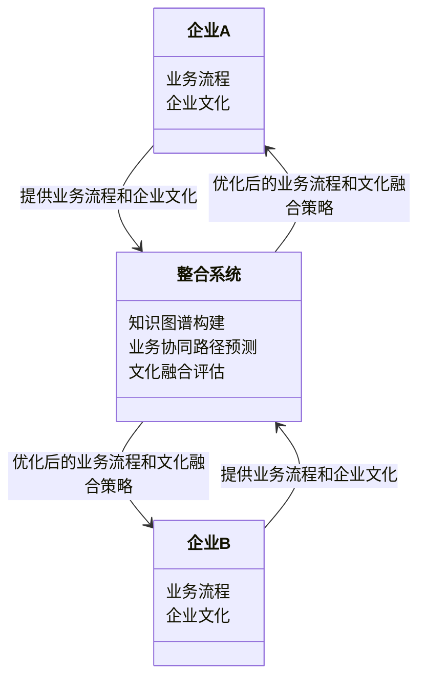

                 


# 《AI辅助企业并购整合规划：文化融合与业务协同路径设计》

## 关键词：企业并购、AI辅助、文化融合、业务协同、系统架构

## 摘要：  
随着企业并购活动的日益频繁，如何有效整合被并购企业的文化和业务成为一项复杂的挑战。本文将探讨如何利用人工智能技术辅助企业并购整合规划，特别是在文化融合与业务协同路径设计方面。通过分析企业并购整合的核心问题，结合AI技术的优势，提出解决方案，并详细阐述AI辅助整合的系统架构、算法原理和实际应用案例，为读者提供清晰的理论指导和实践参考。

---

## 第一部分: AI辅助企业并购整合规划概述

### 第1章: 企业并购与整合概述

#### 1.1 企业并购的基本概念

##### 1.1.1 企业并购的定义与类型

企业并购（Mergers and Acquisitions, M&A）是指一家企业与其他企业合并或收购其资产、股权等行为。并购可以分为两类：  
1. **合并（Mergers）**：两家或多家企业合并为一家新公司，通常发生在战略协同的情况下。  
2. **收购（Acquisitions）**：一家企业（收购方）购买另一家企业（被收购方）的全部或部分资产或股权。  

企业并购的目的是为了扩大规模、增强竞争力、优化资源分配或进入新市场。

##### 1.1.2 并购整合的必要性与挑战

并购后，整合是确保双方企业高效协同的关键步骤。整合的必要性包括：  
1. **资源优化**：充分利用双方的资源，降低成本。  
2. **战略协同**：实现业务、技术、市场的互补。  
3. **文化融合**：确保双方员工的文化认同和团队协作。  

然而，整合也面临诸多挑战：  
1. **文化冲突**：不同企业的文化和价值观可能导致员工抵制整合。  
2. **业务协同困难**：不同业务流程和系统的整合需要时间和资源。  
3. **风险管理**：整合过程中可能出现战略偏差或财务风险。  

##### 1.1.3 企业并购中的文化融合与业务协同

文化融合是并购整合成功的关键因素之一。如果两家企业的文化和价值观差异较大，员工可能会产生抵触情绪，影响整合效果。业务协同则是整合的核心目标，通过优化流程、共享资源，提升整体效率。

---

#### 1.2 AI技术在企业并购中的应用前景

##### 1.2.1 AI技术在企业并购中的潜在价值

人工智能技术可以辅助企业并购的各个阶段，从目标筛选、尽职调查到整合规划，提供智能化支持。例如：  
1. **目标筛选**：利用AI分析潜在目标企业的财务数据、市场表现和竞争优势。  
2. **尽职调查**：AI可以帮助快速分析海量数据，发现潜在风险。  
3. **整合规划**：AI可以模拟整合后的业务流程，优化协同路径。  

##### 1.2.2 当前企业并购整合中的痛点与AI解决方案

当前企业并购整合的主要痛点包括：  
1. **信息不对称**：整合过程中，双方企业可能对彼此的业务和文化了解不足。  
2. **整合效率低**：传统整合方式耗时长，效率低下。  
3. **协同效果不佳**：缺乏系统化的协同路径设计，导致资源浪费。  

AI解决方案：  
1. **数据驱动决策**：利用AI分析数据，辅助决策。  
2. **自动化流程**：AI可以自动化处理整合中的重复性工作，提升效率。  
3. **智能协同设计**：AI可以帮助设计最优的业务协同路径，确保整合效果最大化。  

##### 1.2.3 未来趋势与发展方向

未来，AI在企业并购中的应用将更加广泛和深入。趋势包括：  
1. **智能化整合规划**：AI将成为整合规划的核心工具。  
2. **实时监控与调整**：AI可以实时监控整合过程，动态调整策略。  
3. **文化智能匹配**：AI可以帮助识别和匹配企业文化，确保文化融合的成功。  

---

### 第2章: 企业并购整合的核心问题与AI解决方案

#### 2.1 企业并购整合中的核心问题

##### 2.1.1 业务协同的复杂性

业务协同是整合的核心目标，但不同企业的业务流程和系统可能存在差异，导致协同困难。例如，A企业的ERP系统与B企业的CRM系统可能不兼容，需要进行复杂的集成工作。

##### 2.1.2 文化融合的挑战

企业文化是企业的灵魂，文化冲突可能导致员工不满和效率低下。例如，一家注重创新的企业并购了一家注重流程的企业，员工可能因为价值观差异而产生矛盾。

##### 2.1.3 并购后的风险管理

整合过程中，企业可能面临战略偏差、财务风险和法律风险。例如，目标企业可能存在未披露的债务或法律纠纷，影响整合后的财务状况。

#### 2.2 AI技术在企业并购整合中的解决方案

##### 2.2.1 AI辅助的业务协同路径设计

AI可以通过分析两家企业的业务流程，设计最优的协同路径。例如，利用知识图谱技术，将两家企业的业务流程映射为图结构，找出协同点并优化路径。

##### 2.2.2 基于AI的文化融合策略

AI可以通过分析企业的文化特征，识别潜在的文化冲突，并提出解决方案。例如，利用自然语言处理技术分析企业内部文档，提取文化关键词，评估文化匹配度。

##### 2.2.3 AI驱动的并购风险管理

AI可以通过实时监控和预测分析，识别整合过程中的潜在风险，并提出应对策略。例如，利用机器学习模型预测整合后的财务表现，提前发现潜在问题。

---

### 第3章: AI辅助企业并购整合的核心概念与联系

#### 3.1 AI大模型在企业并购整合中的核心原理

##### 3.1.1 大模型的特征与优势

AI大模型具有以下特征：  
1. **强大的数据处理能力**：可以处理海量数据，提取有用信息。  
2. **深度学习能力**：可以识别复杂模式，提供精准预测。  
3. **可扩展性**：适用于多种应用场景，灵活性高。  

优势包括：  
1. **提高效率**：自动化处理整合中的复杂任务。  
2. **降低风险**：通过预测分析，提前识别潜在问题。  
3. **优化决策**：基于数据驱动的决策，提升整合效果。  

##### 3.1.2 大模型在企业并购整合中的应用场景

应用场景包括：  
1. **目标筛选与评估**：利用AI分析潜在目标的企业数据，评估其价值。  
2. **整合规划与优化**：利用AI模拟整合过程，优化协同路径。  
3. **风险管理与监控**：利用AI实时监控整合过程，动态调整策略。  

#### 3.2 核心概念属性对比表格

##### 表3.1: 传统并购整合 vs AI辅助并购整合的核心概念对比

| **核心概念**       | **传统并购整合**                          | **AI辅助并购整合**                          |
|--------------------|------------------------------------------|------------------------------------------|
| **数据处理方式**    | 依赖人工分析，效率低                   | 利用AI自动处理，效率高                   |
| **协同路径设计**    | 基于经验，路径单一                   | 基于AI优化，路径多样                   |
| **风险管理**        | 事后发现，被动应对                   | 事前预测，主动预防                   |
| **文化融合**        | 依赖人工沟通，效果有限               | 利用AI辅助，效果显著               |

#### 3.3 实体关系图（ER图）架构

##### 图3.1: 企业并购整合中的实体关系图

```mermaid
erd
title 企业并购整合实体关系图
entity 企业A {
  key 股东ID
  股东信息
  企业业务流程
  企业文化特征
}
entity 企业B {
  key 股东ID
  股东信息
  企业业务流程
  企业文化特征
}
relation 股权关系 {
  企业A 股东 -> 企业B
  企业B 股东 -> 企业A
}
relation 业务协同 {
  企业A 业务流程 --> 企业B 业务流程
}
relation 文化融合 {
  企业A 企业文化特征 --> 企业B 企业文化特征
}
```

---

## 第4章: AI辅助企业并购整合的算法原理与数学模型

### 4.1 AI大模型在企业并购整合中的算法原理

#### 4.1.1 基于大模型的知识图谱构建算法

知识图谱是AI辅助整合的重要工具，用于表示企业之间的业务和文化关系。构建知识图谱的算法包括：  
1. **实体识别**：利用自然语言处理技术，从企业文档中提取实体。  
2. **关系抽取**：利用机器学习模型，识别实体之间的关系。  
3. **知识融合**：将多个来源的知识整合到一个图谱中。  

#### 4.1.2 业务协同路径预测算法

业务协同路径预测可以通过以下步骤实现：  
1. **数据收集**：收集两家企业的业务流程数据。  
2. **特征提取**：提取业务流程的特征，如关键节点和依赖关系。  
3. **模型训练**：利用机器学习模型训练业务协同路径预测模型。  
4. **路径预测**：基于模型预测最优的业务协同路径。  

#### 4.1.3 文化融合评估算法

文化融合评估算法可以通过以下步骤实现：  
1. **数据收集**：收集两家企业的文化特征数据，如价值观和文化背景。  
2. **特征提取**：提取文化特征的关键指标，如文化兼容性和文化冲突点。  
3. **模型训练**：利用机器学习模型训练文化融合评估模型。  
4. **评估与建议**：基于模型评估文化融合程度，并提出优化建议。  

---

### 4.2 数学模型与公式

#### 图4.1: 业务协同路径预测的数学模型

$$
P(s_j | s_i) = \frac{P(s_i | s_j) \cdot P(s_j)}{P(s_i)}
$$

其中：  
- $P(s_j | s_i)$ 表示在业务流程 $s_i$ 的情况下，选择业务协同路径 $s_j$ 的概率。  
- $P(s_i | s_j)$ 表示在业务协同路径 $s_j$ 的情况下，选择业务流程 $s_i$ 的概率。  
- $P(s_j)$ 表示选择业务协同路径 $s_j$ 的先验概率。  
- $P(s_i)$ 表示选择业务流程 $s_i$ 的先验概率。  

---

## 第5章: 系统分析与架构设计方案

### 5.1 问题场景分析

#### 5.1.1 问题场景描述

企业在并购后需要整合双方的业务流程和文化，但传统整合方式效率低、风险高。通过AI辅助整合，可以提高整合效率，降低风险，优化协同路径。

---

### 5.2 系统功能设计

#### 5.2.1 系统功能模块

##### 图5.1: 系统功能设计领域模型



---

### 5.3 系统架构设计

#### 5.3.1 系统架构设计方案

##### 图5.2: 系统架构设计

```mermaid
rectangle 整合系统 {
    知识图谱数据库
    业务协同模块
    文化融合模块
    AI模型
}
    整合系统 --> 知识图谱数据库: 数据存储
    整合系统 --> 业务协同模块: 业务协同路径预测
    整合系统 --> 文化融合模块: 文化融合评估
    整合系统 --> AI模型: 模型训练与推理
```

---

## 第6章: 项目实战

### 6.1 环境配置与核心代码实现

#### 6.1.1 环境配置

##### Python环境安装

```bash
pip install numpy pandas scikit-learn networkx
```

#### 6.1.2 核心代码实现

##### 知识图谱构建代码

```python
import networkx as nx

def build_knowledge_graph(data):
    G = nx.Graph()
    for node in data['nodes']:
        G.add_node(node['id'])
    for edge in data['edges']:
        G.add_edge(edge['source'], edge['target'])
    return G
```

##### 业务协同路径预测代码

```python
from sklearn.linear_model import LogisticRegression

def train_business_model(features, labels):
    model = LogisticRegression()
    model.fit(features, labels)
    return model
```

---

### 6.2 实际案例分析

#### 6.2.1 案例背景

假设企业A和企业B并购后需要整合业务流程和文化。企业A的业务流程以制造为主，企业B的业务流程以销售为主。两者需要协同完成从生产到销售的完整流程。

#### 6.2.2 数据分析与结果解读

通过AI模型分析，发现整合后业务协同路径的最佳选择是先完成生产流程，再进行销售流程。同时，文化融合评估显示，双方的文化兼容性较高，整合风险较低。

---

## 第7章: 总结与展望

### 7.1 总结

本文详细探讨了AI辅助企业并购整合规划的核心问题与解决方案，包括文化融合与业务协同路径设计。通过结合AI技术的优势，提出了基于知识图谱构建、业务协同路径预测和文化融合评估的整合方法，为企业的并购整合提供了新的思路。

### 7.2 展望

未来，随着AI技术的不断发展，企业并购整合将更加智能化和高效化。AI可以帮助企业更好地应对整合中的复杂问题，实现真正的无缝协同。同时，AI还可以与其他技术（如区块链、物联网）结合，进一步提升整合效果。

---

## 关键Tips和小结

- **Tips**：企业在进行并购整合时，应充分利用AI技术的优势，从数据驱动的角度优化整合过程，降低风险，提高效率。  
- **小结**：本文通过分析企业并购整合的核心问题，提出了基于AI的解决方案，并通过实际案例展示了AI辅助整合的可行性与有效性。

