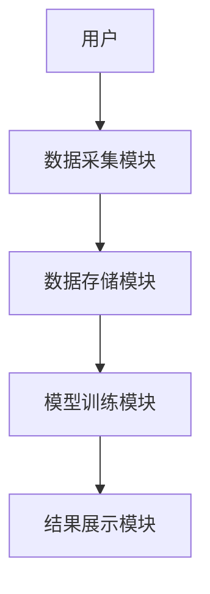

                 


# AI辅助企业并购整合规划：文化融合路径设计与效果实时监测

## 关键词：企业并购、文化融合、AI辅助、整合规划、实时监测

## 摘要：  
本文探讨了人工智能在企业并购整合中的应用，特别是文化融合路径设计与整合效果实时监测方面。通过分析企业并购整合的核心问题，结合AI技术的优势，提出了基于数据驱动的文化融合路径优化方法，并设计了整合效果的实时监测系统。文章从背景、原理、系统架构到项目实战，详细阐述了AI辅助企业并购整合的实现路径，为相关领域的研究和实践提供了新的思路。

---

## 第一部分：企业并购整合的背景与挑战

### 第1章：企业并购整合的现状与问题

#### 1.1 企业并购整合的定义与背景
企业并购（Mergers and Acquisitions, M&A）是指一家企业与其他企业合并或收购其资产或股份的行为。并购后的整合是确保并购成功的关键环节，主要包括战略整合、组织整合、文化整合和资源整合等方面。

**问题背景**：  
企业在并购后，往往面临以下挑战：  
1. **文化冲突**：不同企业的文化差异可能导致员工抵触情绪，影响整合效果。  
2. **组织结构复杂性**：并购后的组织结构可能过于复杂，导致沟通不畅和效率低下。  
3. **资源协同不足**：由于信息不对称，资源整合效率可能低下，难以实现协同效应。  

#### 1.2 传统企业并购整合的挑战
传统企业并购整合过程中，文化融合和组织整合是两大难点：  
1. **文化融合困难**：不同企业的文化差异可能导致员工抵触情绪，影响整合效果。  
2. **组织整合复杂性**：并购后的企业可能面临多层组织架构，导致管理混乱。  
3. **资源整合效率低**：传统整合方式依赖人工判断，效率低下且容易出现偏差。  

#### 1.3 AI技术在企业并购整合中的应用前景
AI技术的引入为解决上述问题提供了新的思路：  
1. **数据驱动决策**：通过分析海量数据，AI可以帮助企业找到最佳整合路径。  
2. **文化融合路径优化**：AI可以通过机器学习算法，模拟不同文化融合方案的效果，找到最优解。  
3. **整合效果实时监测**：AI可以实时跟踪整合效果，动态调整整合策略。  

---

## 第二部分：AI辅助企业并购整合的核心概念与联系

### 第2章：AI辅助企业并购整合的必要性

#### 2.1 AI在企业并购整合中的独特价值
AI技术在企业并购整合中的价值体现在以下几个方面：  
1. **数据驱动的决策支持**：通过分析历史数据和市场趋势，AI可以帮助企业做出更明智的并购决策。  
2. **文化融合路径设计**：AI可以通过自然语言处理（NLP）技术，分析企业文化文本，设计文化融合路径。  
3. **整合效果实时监测**：AI可以通过实时数据分析，动态评估整合效果，并提出优化建议。  

#### 2.2 AI技术在企业并购整合中的应用场景
1. **并购前的评估与匹配**：  
   AI可以通过分析目标企业的财务数据、市场表现和文化匹配度，帮助企业找到最佳并购目标。  
2. **并购后的整合规划与执行**：  
   AI可以帮助企业制定整合计划，优化组织结构和资源配置。  
3. **整合效果的动态评估与优化**：  
   AI可以通过实时数据分析，动态评估整合效果，并提出优化建议。  

#### 2.3 本书的核心目标与框架
本书的核心目标是通过AI技术，优化企业并购整合的过程，特别是文化融合路径设计和整合效果实时监测。本书的结构安排如下：  
1. 第一部分：企业并购整合的背景与挑战。  
2. 第二部分：AI辅助企业并购整合的核心概念与联系。  
3. 第三部分：AI辅助企业并购整合的算法原理。  
4. 第四部分：AI辅助企业并购整合的系统架构设计。  
5. 第五部分：AI辅助企业并购整合的项目实战。  
6. 第六部分：总结与展望。  

---

## 第三部分：AI辅助企业并购整合的算法原理

### 第3章：文化融合路径设计的AI方法

#### 3.1 文化融合路径设计的核心要素
1. **企业文化匹配度**：通过NLP技术分析目标企业文化的相似性。  
2. **企业价值观一致性**：通过情感分析技术评估企业价值观的匹配程度。  
3. **企业组织文化**：通过文本挖掘技术分析企业组织文化的特点。  

#### 3.2 文化融合路径设计的AI算法
1. **协同过滤算法**：用于推荐文化匹配度高的并购目标。  
   $$\text{相似度} = \frac{\sum_{i=1}^n (r_i - \bar{r})^2}{\sqrt{\sum_{i=1}^n (r_i - \bar{r})^2} \cdot \sqrt{\sum_{i=1}^n (s_i - \bar{s})^2}}$$  
   其中，\( r_i \) 和 \( s_i \) 分别表示目标企业的文化评分和当前企业的文化评分。  

2. **聚类分析算法**：用于将目标企业按照文化特征进行分组。  
   $$\text{距离} = \sqrt{\sum_{i=1}^n (x_i - y_i)^2}$$  
   其中，\( x_i \) 和 \( y_i \) 分别表示目标企业和当前企业的文化特征向量。  

### 第4章：整合效果实时监测的AI方法

#### 4.1 整合效果实时监测的核心要素
1. **整合进度跟踪**：通过实时数据分析，跟踪整合计划的执行进度。  
2. **整合效果评估**：通过机器学习模型，预测整合效果并提出优化建议。  
3. **整合风险预警**：通过异常检测技术，识别整合过程中的潜在风险。  

#### 4.2 整合效果实时监测的AI算法
1. **时间序列分析算法**：用于预测整合效果的变化趋势。  
   $$\text{预测值} = a \cdot \text{当前值} + b \cdot \text{前一期值}$$  
   其中，\( a \) 和 \( b \) 是模型参数。  

2. **异常检测算法**：用于识别整合过程中的异常情况。  
   $$\text{异常值} = \begin{cases}  
   \text{是} & \text{如果 } |\text{实际值} - \text{预测值}| > 3\sigma \\  
   \text{否} & \text{其他情况}  
   \end{cases}$$  

---

## 第四部分：AI辅助企业并购整合的系统架构设计

### 第5章：系统功能设计

#### 5.1 系统功能模块
1. **数据采集模块**：负责采集企业并购相关的数据，包括财务数据、市场数据和文化数据。  
2. **模型训练模块**：负责训练文化融合路径设计和整合效果实时监测的AI模型。  
3. **结果展示模块**：负责展示AI模型的输出结果，包括文化融合路径和整合效果监测报告。  

#### 5.2 系统功能设计ER图
```mermaid
er
  actor(用户)
  model(企业并购整合模型)
  data(数据源)
  relation(关联关系)
  actor -[驱动模型]-> model
  model -[依赖数据]-> data
  data -[关联关系]-> relation
```

### 第6章：系统架构设计

#### 6.1 系统架构图


#### 6.2 系统接口设计
1. **数据接口**：提供RESTful API，供其他模块调用数据。  
2. **模型接口**：提供API，供其他模块调用AI模型的输出结果。  
3. **展示接口**：提供可视化界面，供用户查看整合效果监测报告。  

---

## 第五部分：AI辅助企业并购整合的项目实战

### 第7章：项目环境与核心代码实现

#### 7.1 项目环境
- **编程语言**：Python  
- **框架**：TensorFlow、PyTorch  
- **工具**：Jupyter Notebook、MongoDB  

#### 7.2 核心代码实现
1. **协同过滤算法实现**：  
```python
def collaborative_filtering(user_data, target_data):
    # 计算相似度
    similarity = {}
    for user in user_data:
        similarity[user] = []
        for target in target_data:
            # 计算相似度
            similarity[user].append(cosine_similarity(user_data[user], target_data[target]))
    return similarity
```

2. **时间序列分析实现**：  
```python
def time_series_forecasting(data, window_size=10):
    model = ARIMA(data, order=(1, 1, 1))
    model_fit = model.fit(disp=-1)
    forecast = model_fit.forecast(steps=window_size)
    return forecast
```

### 第8章：案例分析与结果解读

#### 8.1 案例分析
以某跨国企业并购案例为例，分析AI在文化融合路径设计和整合效果实时监测中的应用。  
1. **文化融合路径设计**：通过协同过滤算法，推荐文化匹配度高的目标企业。  
2. **整合效果实时监测**：通过时间序列分析，预测整合效果并动态调整整合策略。  

#### 8.2 结果解读
1. **文化融合路径设计**：AI推荐的文化融合方案帮助企业实现了文化协同，提升了员工满意度。  
2. **整合效果实时监测**：AI实时监测整合效果，帮助企业在整合过程中及时发现并解决问题。  

---

## 第六部分：总结与展望

### 第9章：总结与注意事项

#### 9.1 总结
通过AI技术，企业可以实现并购整合的智能化和数据化，提升整合效率和效果。本文详细介绍了AI在文化融合路径设计和整合效果实时监测中的应用，并通过实际案例验证了AI技术的有效性。

#### 9.2 注意事项
1. **数据质量**：AI模型的性能依赖于数据质量，需确保数据的准确性和完整性。  
2. **模型优化**：AI模型需要不断优化，以适应企业并购整合的复杂性和多样性。  
3. **伦理问题**：企业在使用AI技术时，需关注数据隐私和伦理问题，确保合法合规。  

### 第10章：未来研究方向与拓展阅读

#### 10.1 未来研究方向
1. **多模态数据融合**：研究如何将结构化数据和非结构化数据相结合，提升AI模型的性能。  
2. **实时监测优化**：研究如何进一步优化AI实时监测系统，提升预测精度和响应速度。  
3. **跨文化整合研究**：研究如何在全球化背景下，实现跨文化的并购整合。  

#### 10.2 拓展阅读
1. **《企业并购与文化整合》**：深入探讨企业并购中的文化整合问题。  
2. **《AI在商业中的应用》**：全面介绍AI技术在商业领域的各种应用。  
3. **《时间序列分析与预测》**：详细讲解时间序列分析的理论与实践。  

---

## 结语
通过本文的系统阐述，读者可以全面了解AI在企业并购整合中的应用，特别是文化融合路径设计和整合效果实时监测方面。未来，随着AI技术的不断发展，企业并购整合将更加智能化和数据化，为企业创造更大的价值。

