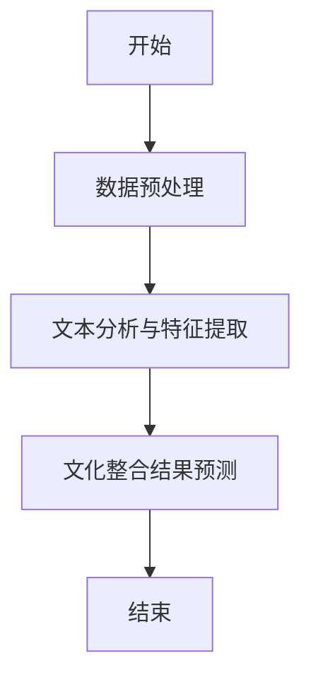
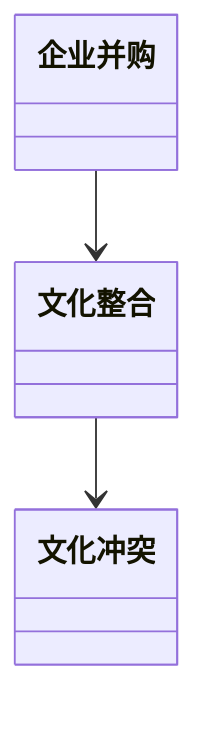
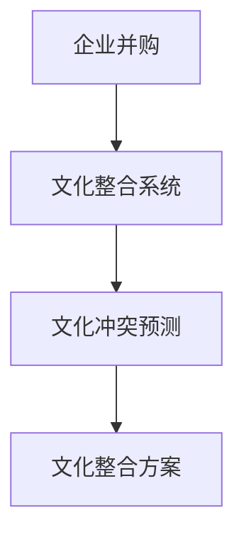
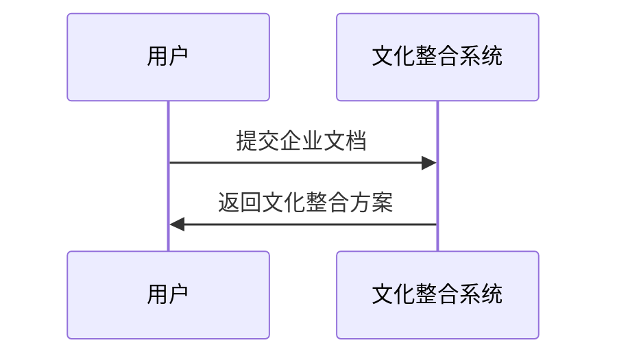

                 


# AI辅助企业并购文化整合：减少冲突

---

## 关键词：
AI技术、企业并购、文化整合、文化冲突、自然语言处理、系统架构

---

## 摘要：
本文探讨了人工智能（AI）在企业并购中的应用，特别是如何通过AI技术辅助文化整合来减少文化冲突。文章从背景介绍、核心概念与联系、算法原理、系统架构设计、项目实战等方面展开，详细分析了AI在文化整合中的作用，并通过实际案例展示了其应用效果。通过本文，读者可以全面了解AI在企业并购文化整合中的潜力和实现方式。

---

## 第一部分：背景介绍

### 第1章：企业并购与文化整合的背景

#### 1.1 企业并购的基本概念
- **1.1.1 企业并购的定义与类型**
  - 企业并购（Mergers and Acquisitions, M&A）是指两个或多个企业之间的合并或收购行为。常见的并购类型包括横向并购、纵向并购和混合并购。
  - 横向并购：同一行业内的企业合并，旨在扩大市场份额。
  - 纵向并购：产业链上下游的企业合并，以增强控制力。
  - 混合并购：跨行业企业合并，寻求多元化发展。

- **1.1.2 并购的动机与目标**
  - 动机：企业并购的主要动机包括扩大规模、获取技术、进入新市场、优化资源等。
  - 目标：通过并购实现战略目标，如提升竞争力、增强市场地位等。

- **1.1.3 并购中的文化整合问题**
  - 文化整合是企业并购后整合过程中最关键的部分，直接影响并购的成功与否。
  - 不同企业文化差异可能导致冲突，如管理风格、工作习惯、价值观等。

#### 1.2 文化整合的重要性
- **1.2.1 文化冲突对企业并购的影响**
  - 文化冲突可能导致员工士气低落、工作效率下降，甚至引发人才流失。
  - 严重的企业文化冲突可能导致并购失败，如“蛇吞象”效应。

- **1.2.2 文化整合对并购成功的贡献**
  - 成功的文化整合有助于建立统一的企业文化，增强员工归属感。
  - 通过文化整合，企业可以更好地协调资源，提升整体效率。

- **1.2.3 文化整合的挑战与解决方案**
  - 挑战：企业文化差异、管理层支持不足、员工抵触情绪等。
  - 解决方案：引入AI技术辅助文化整合，通过数据分析和预测模型优化整合过程。

#### 1.3 AI在文化整合中的作用
- **1.3.1 AI技术如何辅助文化整合**
  - AI可以通过自然语言处理（NLP）分析企业文档，识别文化差异。
  - 通过机器学习模型预测文化冲突，并提出解决方案。

- **1.3.2 AI在文化整合中的优势与局限性**
  - 优势：高效、精准、数据驱动。
  - 局限性：依赖数据质量，可能无法捕捉到隐性文化因素。

- **1.3.3 AI辅助文化整合的未来趋势**
  - 结合区块链技术，确保数据安全与隐私。
  - 更加智能化，实现个性化文化整合方案。

---

## 第二部分：文化整合的核心概念与联系

### 第2章：文化整合的核心概念

#### 2.1 文化整合的原理
- **2.1.1 文化整合的基本原理**
  - 文化整合是指将两个或多个企业的文化要素有机结合，形成新的企业文化。
  - 整合过程包括识别、分析、评估和融合四个阶段。

- **2.1.2 文化整合的关键要素**
  - 企业愿景、使命、核心价值观。
  - 组织结构、管理风格、沟通方式。
  - 企业规章制度、绩效考核机制。

- **2.1.3 文化整合的阶段模型**
  - 震荡期：企业并购后，员工可能对新文化感到不适应。
  - 碰撞期：文化差异引发冲突，员工士气低落。
  - 整合期：通过调整和优化，实现文化融合。
  - 成熟期：形成新的企业文化，员工适应并积极参与。

#### 2.2 AI与文化整合的关系
- **2.2.1 AI如何影响文化整合的流程**
  - 数据收集：通过NLP技术分析企业文档、员工反馈等数据。
  - 数据分析：利用机器学习模型识别文化差异，预测冲突点。
  - 数据优化：根据分析结果，提出文化整合方案。

- **2.2.2 AI在文化整合中的应用场景**
  - 企业并购前的文化评估。
  - 并购后的文化融合管理。
  - 员工文化适应性培训。

- **2.2.3 AI对文化整合效果的提升作用**
  - 提高文化整合的效率和精准度。
  - 降低文化冲突的风险。
  - 优化企业文化设计。

#### 2.3 文化整合的核心要素对比
- **2.3.1 企业文化的对比分析**
  - 企业A：强调创新和冒险，文化氛围宽松。
  - 企业B：强调规范和秩序，文化氛围严谨。

- **2.3.2 员工价值观的对比分析**
  - 员工A：重视工作与生活平衡，倾向于灵活工作时间。
  - 员工B：重视职业发展，倾向于固定工作时间。

- **2.3.3 组织结构的对比分析**
  - 组织A：扁平化结构，决策速度快。
  - 组织B：层级分明，决策流程长。

---

## 第三部分：AI辅助文化整合的算法原理

### 第3章：AI算法在文化整合中的应用

#### 3.1 自然语言处理（NLP）模型
- **3.1.1 NLP模型的基本原理**
  - NLP模型通过分析文本数据，提取关键词、主题和情感倾向。
  - 常用的NLP模型包括TF-IDF、LDA、Word2Vec等。

- **3.1.2 NLP模型在文化整合中的应用**
  - 分析企业文档，识别文化关键词。
  - 比较企业文化差异，生成文化整合建议。

- **3.1.3 常见NLP模型的优缺点**
  - TF-IDF：简单高效，但无法捕捉语义信息。
  - LDA：主题模型，适合分析企业文化主题。
  - Word2Vec：词向量模型，适合处理大规模文本数据。

#### 3.2 文化整合的算法流程
- **3.2.1 数据预处理**
  - 清洗数据：去除噪声，如停用词、标点符号。
  - 分词：将文本分割成词语或短语。

- **3.2.2 文本分析与特征提取**
  - 主题建模：使用LDA提取企业文化主题。
  - 词向量表示：将词语转换为向量表示。

- **3.2.3 文化整合结果预测**
  - 使用机器学习模型预测文化冲突点。
  - 根据预测结果，生成文化整合方案。

#### 3.3 算法流程图


---

## 第四部分：文化整合的系统分析与架构设计

### 第4章：系统架构设计

#### 4.1 问题场景介绍
- 企业并购后，需要整合企业文化，减少文化冲突。
- 传统方法依赖人工分析，效率低且主观性强。

#### 4.2 系统功能设计
- **领域模型**


- **系统架构**


- **系统接口设计**
  - 输入接口：企业文档、员工反馈。
  - 输出接口：文化整合方案、文化冲突预警。

- **系统交互**


---

## 第五部分：项目实战

### 第5章：系统实现与案例分析

#### 5.1 环境安装
- 安装Python环境，如Anaconda。
- 安装NLP库，如NLTK、spaCy。
- 安装机器学习库，如Scikit-learn。

#### 5.2 核心实现代码
- 文化差异分析代码
```python
from sklearn.feature_extraction.text import TfidfVectorizer
from sklearn.decomposition import LatentDirichletAllocation

# 示例数据：企业文档
corpus = ["企业文化1 企业文化2", "企业使命 企业愿景"]

# 使用TF-IDF提取关键词
vectorizer = TfidfVectorizer()
X = vectorizer.fit_transform(corpus)

# 使用LDA提取主题
lda = LatentDirichletAllocation(n_components=2)
lda.fit(X)
```

- 文化冲突预测代码
```python
from sklearn.svm import SVC
from sklearn.metrics import accuracy_score

# 示例数据：企业文化特征
X_train = [[1, 0], [0, 1], [0.5, 0.5]]
y_train = [0, 1, 2]

# 训练SVM模型
model = SVC()
model.fit(X_train, y_train)

# 预测文化冲突
X_test = [[0.6, 0.4]]
y_pred = model.predict(X_test)
print(y_pred)
```

#### 5.3 案例分析与解读
- 案例背景：企业A和企业B并购后，发现管理风格差异较大。
- 数据分析：NLP模型识别出企业A强调创新，企业B强调规范。
- 解决方案：结合双方文化，设计混合型管理模式。

#### 5.4 项目小结
- 通过AI技术辅助文化整合，企业能够更高效地识别文化差异，预测文化冲突。
- 实际案例证明，AI辅助文化整合可以显著降低文化冲突风险，提升并购成功率。

---

## 第六部分：总结与展望

### 6.1 总结
- AI技术在企业并购文化整合中的应用前景广阔。
- 通过NLP和机器学习模型，企业可以更精准地识别文化差异，优化整合方案。
- 文化整合的成功不仅依赖于技术，还需要管理层的高度重视和员工的积极参与。

### 6.2 展望
- 结合区块链技术，确保文化整合数据的安全与隐私。
- 开发更加智能化的文化整合系统，实现个性化整合方案。
- 推动AI技术在企业并购中的广泛应用，提升并购成功率。

---

## 最佳实践 Tips：
- 在企业并购前，进行充分的文化评估，识别潜在的文化冲突点。
- 引入AI技术辅助文化整合，通过数据分析优化整合过程。
- 加强员工文化适应性培训，减少文化冲突带来的负面影响。
- 定期评估文化整合效果，及时调整整合策略。

---

## 小结：
通过本文的详细讲解，读者可以全面了解AI在企业并购文化整合中的应用，并掌握相关技术实现方法。未来，随着AI技术的不断发展，文化整合将更加智能化、个性化，为企业并购的成功奠定坚实基础。

--- 

**温馨提示：** 本文内容基于AI技术的实际应用案例，旨在为企业并购中的文化整合提供参考。如需进一步探讨或实践，欢迎留言交流。

