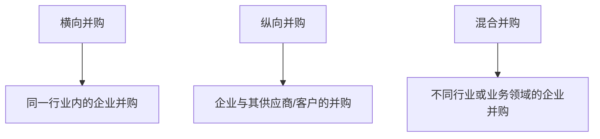
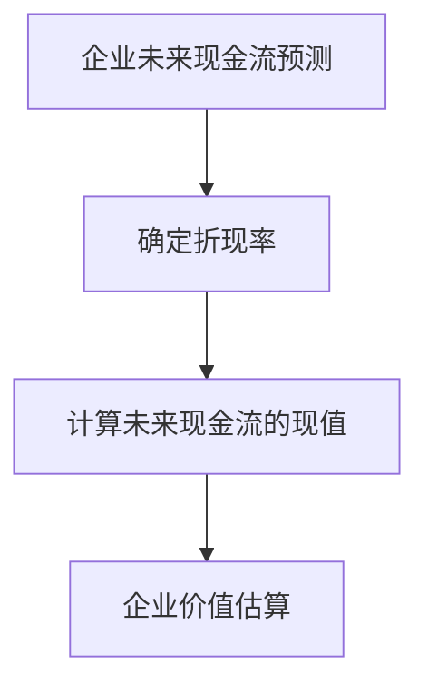
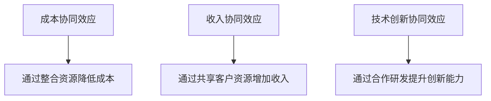

                 

# 第1章: 企业并购与估值概述

## 1.1 企业并购的基本概念

### 1.1.1 企业并购的定义与类型

企业并购（Mergers and Acquisitions，简称M&A）是指一家企业（收购方）购买另一家企业（目标企业）的全部或部分股权，以实现资源优化配置、扩大市场份额或提升竞争力等目标。企业并购可以分为以下几种类型：

1. **横向并购（Horizontal Mergers）**：同一行业内的企业之间的并购，目的是扩大市场份额或消除竞争。
2. **纵向并购（Vertical Mergers）**：企业与其供应商或客户的并购，目的是整合供应链或分销渠道。
3. **混合并购（Mixed Mergers）**：不同行业或业务领域的企业之间的并购，目的是多元化经营或开拓新市场。

图1.1展示了企业并购的三种主要类型：

### 1.1.2 企业并购的动机与目标

企业进行并购的动机多种多样，主要包括以下几种：

1. **增长性动机**：通过并购扩大规模或进入新市场。
2. **成本协同动机**：通过整合资源降低成本。
3. **战略防御动机**：为了防止被竞争对手收购或削弱竞争优势。
4. **技术或知识协同动机**：通过并购获取关键技术或管理经验。

### 1.1.3 企业并购的流程与挑战

企业并购的流程一般包括以下几个阶段：

1. **战略规划与目标筛选**：明确并购目标和筛选潜在标的。
2. **尽职调查**：对目标企业进行财务、法律和业务上的详细调查。
3. **估值与谈判**：对目标企业进行估值，并与卖方进行价格谈判。
4. **交易执行**：完成交割、整合资源和业务。
5. **整合与监控**：整合双方的业务、文化和资源，监控整合效果。

并购过程中面临的主要挑战包括信息不对称、估值误差、整合风险等。

---

## 1.2 估值在企业并购中的重要性

### 1.2.1 估值的基本概念与方法

企业估值是指对目标企业的价值进行评估的过程，是企业并购的核心环节之一。常见的企业估值方法包括：

1. ** discounted cash flow (DCF) 模型**：基于未来现金流的现值计算企业价值。
2. **EV/EBITDA 倍数法**：通过目标企业EBITDA与可比公司的EV/EBITDA倍数进行比较，估算企业价值。
3. **relative valuation**：通过与可比公司的市场数据进行比较，估算企业价值。

图1.2展示了DCF模型的基本流程：

### 1.2.2 传统估值方法的局限性

传统估值方法虽然在一定程度上能够反映企业的价值，但也存在一些局限性：

1. **假设的敏感性**：DCF模型依赖于对未来现金流的预测，而这些预测往往存在较大的主观性和不确定性。
2. **忽略协同效应**：传统估值方法通常不考虑并购后的协同效应，可能导致低估或高估目标企业的价值。
3. **市场波动的影响**：市场环境的变化可能会影响可比公司的估值，从而影响相对估值法的准确性。

### 1.2.3 AI技术在估值中的潜力与优势

随着AI技术的发展，其在企业估值中的应用越来越广泛。AI可以通过以下方式提升估值的准确性：

1. **大数据分析**：利用机器学习算法分析海量数据，发现传统方法难以识别的模式和趋势。
2. **动态调整模型**：AI可以根据实时数据动态调整估值模型，减少人为误差。
3. **协同效应预测**：通过自然语言处理（NLP）和机器学习模型，AI可以预测并购后的协同效应，并将其纳入估值模型。

---

## 1.3 多维度财务模型与协同效应分析

### 1.3.1 多维度财务模型的定义

多维度财务模型是一种基于多个维度（如财务、运营、市场等）对企业价值进行评估的模型。与传统估值方法相比，多维度模型更加注重数据的多样性和模型的动态性，能够更好地反映企业的实际价值。

### 1.3.2 协同效应的定义与分类

协同效应是指并购后双方资源整合所产生的额外价值。协同效应可以分为以下几种类型：

1. **成本协同效应**：通过整合供应链、减少重复员工等方式降低成本。
2. **收入协同效应**：通过共享客户资源、开拓新市场等方式增加收入。
3. **技术创新协同效应**：通过共享技术资源、合作研发等方式提升创新能力。

图1.3展示了协同效应的主要类型：

### 1.3.3 协同效应对企业价值的影响

协同效应能够显著提升企业价值，但其量化和实现存在一定的难度。AI技术可以通过以下方式帮助量化协同效应：

1. **数据驱动的预测**：通过分析历史数据和市场趋势，AI可以预测协同效应的实现情况。
2. **动态调整模型**：AI可以根据协同效应的实现情况动态调整估值模型，确保企业价值的准确评估。

---

## 1.4 本章小结

本章主要介绍了企业并购的基本概念、估值的重要性以及多维度财务模型与协同效应分析的核心内容。企业并购是企业战略发展的重要手段，而估值是并购决策的核心环节。传统估值方法存在一定的局限性，而AI技术的引入为企业估值提供了新的思路和方法。多维度财务模型和协同效应分析是提升企业估值准确性的重要手段，也是未来企业并购估值的发展方向。

---

接下来，我们将在第2章详细探讨AI技术在企业并购估值中的应用背景。

