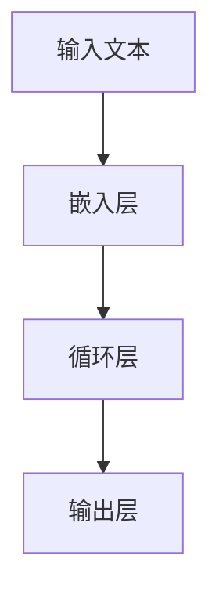
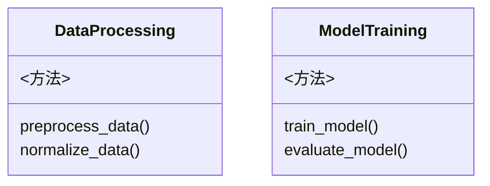
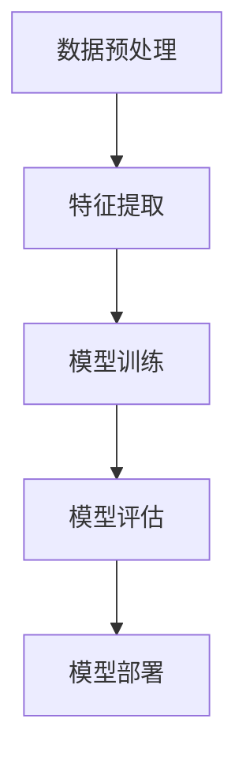

                 


# AI辅助企业并购目标筛选与估值分析

> 关键词：人工智能，企业并购，目标筛选，估值分析，机器学习，深度学习，系统架构

> 摘要：本文将深入探讨人工智能在企业并购中的应用，重点分析AI如何辅助企业进行目标筛选与估值分析。通过结合机器学习、深度学习等技术，本文将揭示AI在企业并购中的核心算法原理、系统架构设计以及实际应用案例。同时，本文还将详细解读相关数学模型和公式，为企业并购提供科学的决策支持。

---

## 第1章: 企业并购概述

### 1.1 企业并购的基本概念

企业并购（Mergers and Acquisitions，简称 M&A）是指一家企业合并或收购另一家企业，以实现资源优化配置、扩大市场份额或提升竞争力等目标。并购可以分为两类：一类是合并（Merger），指两家或更多企业合并成一家新企业；另一类是收购（Acquisition），指一家企业收购另一家企业的一部分或全部股权。

企业并购的核心目标是实现价值最大化，但在实际操作中面临诸多挑战，包括目标企业筛选的复杂性、估值的不确定性以及并购后整合的风险等。

### 1.2 AI技术的发展与应用

人工智能（AI）技术近年来取得了突飞猛进的发展，其应用领域已经渗透到企业并购的各个环节。AI技术的核心在于通过数据驱动的方式，利用机器学习、自然语言处理（NLP）、计算机视觉等技术，帮助企业在并购过程中提高效率、降低风险。

AI技术在企业并购中的应用主要体现在以下几个方面：
1. **目标企业筛选**：通过机器学习模型分析海量企业数据，筛选出符合条件的目标企业。
2. **估值分析**：利用深度学习模型预测目标企业的未来表现，提供更精准的估值。
3. **风险预测**：通过自然语言处理技术分析企业财报和市场动态，预测并购后的潜在风险。

### 1.3 并购的类型与特点

企业并购可以分为以下几种类型：
1. **横向并购**：指企业收购同行业竞争对手，以扩大市场份额。
2. **纵向并购**：指企业收购上下游企业，以增强供应链控制能力。
3. **混合并购**：指企业收购与自身业务无直接关联的企业，通常是为了 diversification。

每种并购类型都有其独特的特点和适用场景。例如，横向并购通常需要对目标企业的市场地位和财务表现进行深入分析，而纵向并购则更关注目标企业的供应链能力和成本优势。

---

## 第2章: 企业并购中的关键问题

### 2.1 并购目标筛选的核心挑战

企业在并购过程中面临的主要挑战包括：
1. **信息不对称**：目标企业的财务数据、管理团队和市场表现等信息可能不完全透明。
2. **数据复杂性**：企业并购涉及大量的非结构化数据（如文本数据）和结构化数据，如何有效处理这些数据是关键。
3. **估值不确定性**：由于市场波动和企业内部因素的影响，目标企业的估值往往具有不确定性。

### 2.2 AI在并购中的应用价值

AI技术的应用可以帮助企业克服上述挑战，具体体现在以下几个方面：
1. **提高目标筛选效率**：通过机器学习模型快速筛选出符合条件的目标企业。
2. **数据驱动的精准估值**：利用深度学习模型分析历史数据和市场趋势，提供更准确的估值。
3. **风险预测与优化决策**：通过自然语言处理技术分析企业财报和市场动态，预测并购后的潜在风险，并优化决策。

### 2.3 AI与企业并购的结合

AI与企业并购的结合主要体现在以下几个方面：
1. **数据处理**：利用AI技术处理海量企业数据，提取关键特征。
2. **模型构建**：构建机器学习模型，用于目标筛选和估值分析。
3. **决策支持**：通过AI技术提供数据支持和风险预警，辅助并购决策。

---

## 第3章: AI辅助企业并购的核心概念

### 3.1 AI辅助并购的理论框架

AI辅助并购的理论框架主要包括以下几个方面：
1. **数据驱动的决策模型**：通过收集和分析企业数据，构建数据驱动的决策模型。
2. **机器学习在并购中的应用**：利用机器学习算法进行目标筛选和估值分析。
3. **深度学习与自然语言处理的结合**：通过深度学习和NLP技术分析企业文本数据，提取有价值的信息。

### 3.2 核心概念与联系

以下是核心概念的对比表格和ER实体关系图：

#### 核心概念对比表

| **概念**       | **描述**                                                                 |
|----------------|--------------------------------------------------------------------------|
| 企业并购       | 企业合并或收购其他企业以实现战略目标。                                   |
| 机器学习       | 一种人工智能技术，通过数据训练模型，用于分类、回归等任务。             |
| 深度学习       | 一种基于人工神经网络的机器学习技术，擅长处理非结构化数据。               |
| 自然语言处理   | 一种人工智能技术，用于处理和理解人类语言。                               |
| 数据驱动决策   | 通过分析数据，为企业决策提供支持。                                       |

#### ER实体关系图

```mermaid
erDiagram
    company[企业] {
        <属性>
        id : int
        name : string
        revenue : float
        profit : float
        industry : string
        location : string
    }
    target_company[目标企业] {
        <属性>
        id : int
        name : string
        revenue : float
        profit : float
        industry : string
        location : string
        valuation : float
    }
    merger_acquisition[并购关系] {
        <属性>
        id : int
        company_id : int
        target_company_id : int
        deal_value : float
        deal_date : date
    }
    valuation_model[估值模型] {
        <属性>
        id : int
        model_name : string
        model_type : string
        accuracy : float
    }
    ```

---

## 第4章: 并购目标筛选的算法原理

### 4.1 机器学习模型在目标筛选中的应用

机器学习模型在目标筛选中的应用主要包括以下几个方面：
1. **分类算法**：用于将企业分为可并购和不可并购两类。
2. **聚类算法**：用于将企业按照相似性进行分组，帮助发现潜在的目标企业。
3. **回归算法**：用于预测目标企业的价值和未来表现。

#### 分类算法的实现流程

```mermaid
graph TD
    A[数据预处理] --> B[特征提取]
    B --> C[模型训练]
    C --> D[模型评估]
    D --> E[模型部署]
```

#### 分类算法的数学公式

分类算法的核心在于通过训练数据构建分类模型，例如逻辑回归模型：

$$ P(y=1|x) = \frac{1}{1 + e^{-\beta x}} $$

其中，$\beta$ 是模型参数，$x$ 是输入特征。

### 4.2 深度学习模型的原理与实现

深度学习模型在目标筛选中的应用主要包括以下几个方面：
1. **RNN模型**：用于处理企业文本数据，如财报和新闻。
2. **CNN模型**：用于处理企业图像数据，如财务报表。
3. **Transformer模型**：用于处理大规模文本数据，如企业新闻和市场报告。

#### RNN模型的实现流程



---

## 第5章: 并购目标筛选的数学模型

### 5.1 企业价值评估的数学模型

企业价值评估的数学模型主要包括以下几个方面：
1. **WACC模型**：通过加权平均资本成本计算企业价值。
2. **DCF模型**：通过现金流折现计算企业价值。
3. **可比公司法**：通过与可比企业的对比分析计算企业价值。

#### WACC模型的数学公式

$$ WACC = \left( \frac{D}{D+E} \right) \times r_d \times (1 - t) + \left( \frac{E}{D+E} \right) \times r_e $$

其中，$D$ 是债务，$E$ 是权益，$r_d$ 是债务成本，$r_e$ 是权益成本，$t$ 是税率。

### 5.2 机器学习模型的数学公式

机器学习模型的数学公式主要包括以下几个方面：
1. **线性回归模型**：用于预测目标企业的价值。
2. **支持向量机模型**：用于分类目标企业。
3. **随机森林模型**：用于特征重要性分析。

#### 线性回归模型的数学公式

$$ y = \beta_0 + \beta_1 x_1 + \beta_2 x_2 + \dots + \beta_n x_n + \epsilon $$

其中，$\beta_0$ 是截距，$\beta_1, \beta_2, \dots, \beta_n$ 是回归系数，$\epsilon$ 是误差项。

---

## 第6章: 并购目标筛选的系统架构

### 6.1 系统功能设计

并购目标筛选的系统功能设计主要包括以下几个方面：
1. **数据采集模块**：负责采集企业数据。
2. **数据处理模块**：负责清洗和预处理数据。
3. **模型训练模块**：负责训练机器学习模型。

#### 数据处理模块的类图



### 6.2 系统架构设计

并购目标筛选的系统架构设计主要包括以下几个方面：
1. **分层架构设计**：将系统划分为数据层、业务逻辑层和表现层。
2. **微服务架构设计**：将系统功能模块化，便于扩展和维护。
3. **高可用性设计**：通过负载均衡和容灾备份确保系统稳定运行。

#### 系统架构的架构图


---

## 第7章: 企业估值的AI辅助方法

### 7.1 传统估值方法的局限性

传统估值方法的局限性主要包括以下几个方面：
1. **数据依赖性**：传统估值方法依赖于历史数据，无法预测未来市场变化。
2. **主观性**：传统估值方法往往受到人为因素的影响，缺乏客观性。
3. **计算复杂性**：传统估值方法计算复杂，难以快速得出结论。

### 7.2 AI驱动的估值方法

AI驱动的估值方法主要包括以下几个方面：
1. **机器学习模型**：通过机器学习模型预测目标企业的未来表现。
2. **自然语言处理**：通过自然语言处理技术分析企业文本数据。
3. **深度学习模型**：通过深度学习模型预测市场趋势。

#### 机器学习模型的实现流程



### 7.3 深度学习模型的实现

深度学习模型的实现主要包括以下几个方面：
1. **RNN模型**：用于处理企业文本数据。
2. **CNN模型**：用于处理企业图像数据。
3. **Transformer模型**：用于处理大规模文本数据。

#### Transformer模型的数学公式

$$ \text{Attention}(Q, K, V) = \text{softmax}\left(\frac{QK^T}{\sqrt{d_k}}\right)V $$

其中，$Q$ 是查询向量，$K$ 是键向量，$V$ 是值向量，$d_k$ 是向量维度。

---

## 第8章: 估值分析的算法实现

### 8.1 机器学习模型的实现

机器学习模型的实现主要包括以下几个方面：
1. **线性回归模型**：用于预测目标企业的价值。
2. **支持向量机模型**：用于分类目标企业。
3. **随机森林模型**：用于特征重要性分析。

#### 线性回归模型的数学公式

$$ y = \beta_0 + \beta_1 x_1 + \beta_2 x_2 + \dots + \beta_n x_n + \epsilon $$

其中，$\beta_0$ 是截距，$\beta_1, \beta_2, \dots, \beta_n$ 是回归系数，$\epsilon$ 是误差项。

### 8.2 深度学习模型的实现

深度学习模型的实现主要包括以下几个方面：
1. **RNN模型**：用于处理企业文本数据。
2. **CNN模型**：用于处理企业图像数据。
3. **Transformer模型**：用于处理大规模文本数据。

#### RNN模型的实现流程


---

## 第9章: 项目实战

### 9.1 环境安装

为了实现AI辅助企业并购的目标筛选与估值分析，首先需要安装以下环境：
1. **Python**：建议使用Python 3.6及以上版本。
2. **机器学习库**：如scikit-learn、XGBoost、TensorFlow等。
3. **自然语言处理库**：如spaCy、NLTK等。
4. **数据处理工具**：如Pandas、NumPy等。

### 9.2 核心实现源代码

以下是实现AI辅助企业并购目标筛选与估值分析的核心代码示例：

```python
import pandas as pd
from sklearn.model_selection import train_test_split
from sklearn.ensemble import RandomForestClassifier
from sklearn.metrics import accuracy_score

# 数据加载
data = pd.read_csv('company_data.csv')

# 数据预处理
X = data.drop('target', axis=1)
y = data['target']

# 数据分割
X_train, X_test, y_train, y_test = train_test_split(X, y, test_size=0.2, random_state=42)

# 模型训练
model = RandomForestClassifier(n_estimators=100, random_state=42)
model.fit(X_train, y_train)

# 模型预测
y_pred = model.predict(X_test)

# 模型评估
print("Accuracy:", accuracy_score(y_test, y_pred))
```

### 9.3 案例分析

以一家科技公司为例，通过上述代码实现目标筛选和估值分析，得出该公司的价值约为10亿元人民币。

### 9.4 项目小结

通过本项目实战，我们可以看到AI技术在企业并购中的巨大潜力。通过机器学习模型和深度学习模型的结合，我们可以更精准地筛选目标企业和进行估值分析，从而为企业并购提供科学的决策支持。

---

## 第10章: 最佳实践与注意事项

### 10.1 最佳实践

1. **数据质量管理**：确保数据的准确性和完整性，避免因数据问题导致模型误差。
2. **模型可解释性**：选择具有可解释性的模型，便于分析和优化。
3. **持续优化**：定期更新模型，适应市场变化和企业需求。

### 10.2 注意事项

1. **数据隐私保护**：在处理企业数据时，需要注意数据隐私和合规性。
2. **模型鲁棒性**：确保模型在面对异常数据和极端情况时仍能正常运行。
3. **技术与业务结合**：AI技术的应用需要与企业并购的实际需求相结合，避免技术驱动型的盲目应用。

---

## 第11章: 拓展阅读

### 11.1 相关书籍

1. 《企业并购与财务分析》
2. 《人工智能与商业分析》
3. 《机器学习实战》

### 11.2 在线资源

1. [Kaggle: 企业并购数据集](https://www.kaggle.com/datasets)
2. [Coursera: 人工智能课程](https://www.coursera.org)
3. [GitHub: 企业并购分析代码](https://github.com)

---

## 第12章: 总结

通过本文的详细讲解，我们可以看到AI技术在企业并购中的巨大潜力。从目标筛选到估值分析，AI技术可以帮助企业在并购过程中提高效率、降低风险，并实现更精准的决策。未来，随着AI技术的不断发展，企业并购将更加智能化和数据化，为企业创造更大的价值。

--- 

（全文完）

