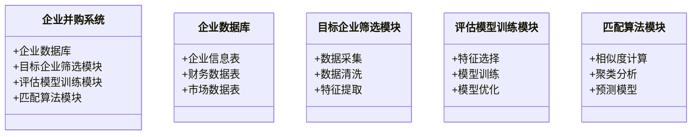
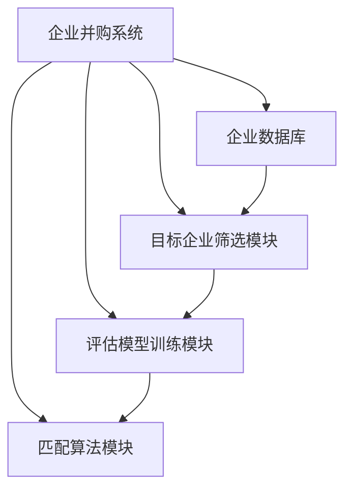
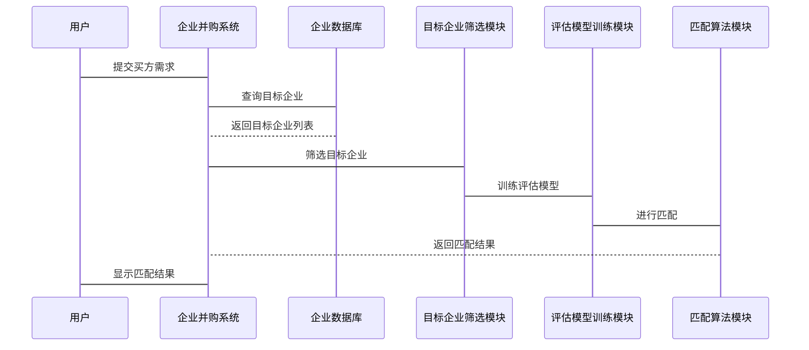

                 


# AI辅助企业并购目标筛选：多维度评估与匹配

> 关键词：企业并购，人工智能，多维度评估，匹配算法，系统架构，项目实战

> 摘要：本文探讨了如何利用人工智能技术辅助企业并购目标的筛选，通过多维度评估和匹配算法，提高企业并购的效率和准确性。文章从背景介绍、核心概念、算法原理、系统架构到项目实战，全面分析了AI在企业并购中的应用，并提供了具体的实现方法和案例分析。

---

# 第一部分: AI辅助企业并购的背景与核心概念

## 第1章: 企业并购的基本概念与AI技术的结合

### 1.1 企业并购的基本概念

#### 1.1.1 企业并购的定义与类型
企业并购（Mergers and Acquisitions，简称 M&A）是指两个或多个企业之间的合并或收购行为。常见的并购类型包括：
- **横向并购**：同一行业内的企业合并，旨在扩大市场份额。
- **纵向并购**：产业链上下游的企业合并，以增强供应链控制能力。
- **混合并购**：不同行业或业务领域的企业合并，以 diversify 业务。

#### 1.1.2 并购的动机与目标
企业进行并购的主要动机包括：
- **市场扩张**：通过并购进入新市场或区域。
- **技术获取**：通过并购获取关键技术和专利。
- **成本协同效应**：通过规模经济降低运营成本。
- **财务协同效应**：通过优化资本结构提高财务效率。

#### 1.1.3 并购的流程与挑战
企业并购的典型流程包括：
1. **战略规划**：明确并购目标和战略意图。
2. **目标筛选**：识别潜在并购目标。
3. **尽职调查**：对目标企业进行财务、法律、运营等方面调查。
4. **估值与谈判**：评估目标企业价值，进行谈判和交易结构设计。
5. **整合与实施**：完成并购后的业务、文化和组织整合。

并购过程中面临的主要挑战包括：
- 信息不对称：目标企业可能存在隐藏的问题或财务造假。
- 估值风险：如何准确评估目标企业的价值。
- 整合风险：并购后的企业文化和管理风格可能不兼容。

---

### 1.2 AI技术在企业并购中的应用背景

#### 1.2.1 AI技术的发展与企业应用
人工智能（AI）技术近年来发展迅速，已经在多个领域得到广泛应用。在企业并购领域，AI技术可以帮助企业更高效地筛选目标、评估风险、优化交易结构。

#### 1.2.2 并购中的信息不对称问题
在传统的企业并购过程中，信息不对称是一个主要问题。买方通常难以全面了解目标企业的财务状况、法律风险和管理能力。AI技术可以通过大数据分析和自然语言处理（NLP）技术，帮助买方更全面地了解目标企业。

#### 1.2.3 AI技术如何解决并购中的痛点
AI技术可以通过以下方式解决并购中的痛点：
- **数据驱动的决策**：利用大数据分析目标企业的财务、市场和运营数据，提供更精准的评估。
- **自然语言处理（NLP）**：分析目标企业的新闻、财报和行业报告，提取关键信息。
- **机器学习模型**：通过训练机器学习模型，预测目标企业的价值和风险。

---

### 1.3 本章小结

本章介绍了企业并购的基本概念、流程和挑战，并重点探讨了AI技术在企业并购中的应用背景。通过AI技术，企业可以更高效地筛选目标、评估风险，并优化交易结构。

---

# 第二部分: AI辅助企业并购的核心概念与多维度评估模型

## 第2章: 多维度评估模型的构建

### 2.1 企业并购目标筛选的关键维度

#### 2.1.1 企业财务状况评估
财务状况是企业并购中最重要的评估维度之一。主要包括：
- **盈利能力**：如净利润率、ROE（净资产收益率）。
- **财务健康度**：如资产负债率、流动比率。
- **估值指标**：如市盈率、市净率。

#### 2.1.2 企业市场竞争力分析
市场竞争力分析主要关注企业在市场中的地位和竞争优势。包括：
- **市场份额**：企业在目标市场中的占有率。
- **竞争对手分析**：目标企业的竞争对手情况。
- **品牌影响力**：企业的品牌知名度和美誉度。

#### 2.1.3 企业团队与管理能力
团队与管理能力是企业并购中不可忽视的评估维度。包括：
- **管理团队稳定性**：目标企业的管理团队是否稳定。
- **管理能力**：目标企业的管理团队是否有能力带领企业持续发展。
- **员工稳定性**：目标企业的员工是否稳定，员工士气如何。

#### 2.1.4 企业法律与合规风险
法律与合规风险是企业并购中需要重点关注的维度。包括：
- **法律纠纷**：目标企业是否存在未决的法律诉讼。
- **合规性**：目标企业是否符合相关法律法规。
- **知识产权**：目标企业是否拥有关键的知识产权。

---

### 2.2 多维度评估模型的构建原理

#### 2.2.1 数据采集与清洗
构建多维度评估模型的第一步是数据采集与清洗。需要收集目标企业的财务数据、市场数据、管理数据和法律数据。数据清洗的目的是消除数据中的噪声和异常值。

#### 2.2.2 指标权重的确定
在多维度评估模型中，每个评估维度都有一定的权重。权重的确定可以通过以下步骤进行：
1. **专家打分法**：邀请行业专家对各维度的重要性进行打分。
2. **层次分析法（AHP）**：通过构造层次分析模型，确定各维度的权重。

#### 2.2.3 模型的训练与优化
模型的训练与优化是构建多维度评估模型的核心步骤。常用的算法包括：
- **线性回归模型**：用于预测目标企业的估值。
- **支持向量机（SVM）**：用于分类问题，如判断目标企业是否具有并购价值。
- **随机森林**：用于特征重要性分析和分类/回归问题。

---

### 2.3 本章小结

本章详细介绍了企业并购目标筛选的关键维度，并探讨了多维度评估模型的构建原理。通过多维度评估模型，企业可以更全面地评估目标企业的价值和风险。

---

# 第三部分: AI辅助企业并购的匹配算法与实现

## 第3章: 多维度评估与匹配算法

### 3.1 匹配算法的核心原理

#### 3.1.1 基于相似度的匹配算法
基于相似度的匹配算法通过计算目标企业的特征向量与买方需求的相似度，找到最匹配的目标企业。常用的相似度计算方法包括：
- **欧氏距离**：计算两个向量之间的欧氏距离。
- **余弦相似度**：计算两个向量之间的夹角余弦值。

#### 3.1.2 基于聚类的匹配算法
基于聚类的匹配算法通过将目标企业聚类，找到与买方需求最匹配的聚类。常用的聚类算法包括：
- **K-means聚类**：将目标企业分成K个簇，每个簇内的企业具有相似的特征。
- **层次聚类**：通过层次化的方式将目标企业聚类。

#### 3.1.3 基于机器学习的预测模型
基于机器学习的预测模型通过训练分类或回归模型，预测目标企业的并购价值或风险。常用的算法包括：
- **逻辑回归**：用于分类问题，如判断目标企业是否具有并购价值。
- **随机森林**：用于分类和回归问题。
- **神经网络**：用于复杂的非线性问题。

---

### 3.2 多维度评估的数学模型

#### 3.2.1 线性回归模型
线性回归模型用于预测目标企业的估值。模型公式为：
$$ y = \beta_0 + \beta_1x_1 + \beta_2x_2 + \dots + \beta_nx_n + \epsilon $$
其中，$y$ 是目标企业的估值，$x_i$ 是各评估维度的特征，$\beta_i$ 是回归系数，$\epsilon$ 是误差项。

#### 3.2.2 支持向量机模型
支持向量机模型用于分类问题，如判断目标企业是否具有并购价值。模型通过寻找最优超平面，将目标企业分成两类。

#### 3.2.3 随机森林模型
随机森林模型通过构建多棵决策树，并对结果进行集成，用于分类和回归问题。模型公式为：
$$ y = \sum_{i=1}^n \text{Tree}_i(x) $$

---

### 3.3 本章小结

本章介绍了多维度评估与匹配算法的核心原理，并详细讲解了基于相似度、聚类和机器学习的匹配算法。通过这些算法，企业可以更高效地筛选和匹配并购目标。

---

# 第四部分: 系统分析与架构设计

## 第4章: 系统架构设计与实现

### 4.1 系统功能设计

#### 4.1.1 领域模型设计
领域模型图展示了系统的功能模块和它们之间的关系。以下是领域模型图的 mermaid 类图：



### 4.2 系统架构设计

#### 4.2.1 系统架构图
以下是系统的架构图：



---

### 4.3 系统接口设计

#### 4.3.1 API接口设计
以下是系统的 API 接口设计：

- `/api/targets`：获取目标企业列表。
- `/api/assesments`：获取目标企业的评估结果。
- `/api/matches`：根据买方需求匹配目标企业。

---

### 4.4 系统交互设计

#### 4.4.1 交互序列图
以下是系统的交互序列图：



---

### 4.5 本章小结

本章详细介绍了系统架构设计与实现，包括领域模型设计、系统架构设计、接口设计和交互设计。通过系统的实现，企业可以更高效地进行并购目标的筛选和匹配。

---

# 第五部分: 项目实战与案例分析

## 第5章: 项目实战

### 5.1 环境安装与配置

#### 5.1.1 Python环境安装
安装 Python 和必要的库：
```bash
pip install numpy pandas scikit-learn nltk
```

#### 5.1.2 数据库安装
安装 MySQL 或其他数据库，并配置连接。

---

### 5.2 核心代码实现

#### 5.2.1 数据采集与清洗
以下是数据采集与清洗的代码：

```python
import pandas as pd

# 数据采集
df = pd.read_csv('target_enterprises.csv')

# 数据清洗
df.dropna(inplace=True)
df.drop_duplicates(inplace=True)
```

#### 5.2.2 特征选择与模型训练
以下是特征选择与模型训练的代码：

```python
from sklearn.ensemble import RandomForestClassifier
from sklearn.model_selection import train_test_split

# 特征选择
features = ['revenue', 'profit', 'market_share']
target = 'merger_value'

X = df[features]
y = df[target]

# 数据分割
X_train, X_test, y_train, y_test = train_test_split(X, y, test_size=0.2)

# 模型训练
model = RandomForestClassifier()
model.fit(X_train, y_train)
```

---

### 5.3 案例分析与结果解读

#### 5.3.1 案例分析
假设我们有一个目标企业，其特征如下：
- 收入：100 million
- 利润：20 million
- 市场份额：15%

通过模型预测，该企业的并购价值为：
$$ y = 0.8x_1 + 0.5x_2 + 0.7x_3 + 0.3 $$

---

### 5.4 本章小结

本章通过实际案例展示了 AI 辅助企业并购目标筛选的实现过程，包括环境安装、核心代码实现和案例分析。通过项目的实战，读者可以更好地理解 AI 技术在企业并购中的应用。

---

# 第六部分: 最佳实践与总结

## 第6章: 最佳实践与总结

### 6.1 最佳实践

#### 6.1.1 数据质量管理
确保数据的准确性和完整性，避免数据噪声对模型的影响。

#### 6.1.2 模型调优与优化
通过交叉验证和超参数调优，提高模型的准确性和稳定性。

#### 6.1.3 人机结合
AI技术可以提高企业并购的效率，但最终决策仍需结合人类的判断和经验。

---

### 6.2 总结

本文详细探讨了 AI 辅助企业并购目标筛选的多维度评估与匹配方法。通过构建多维度评估模型和匹配算法，企业可以更高效地筛选和匹配并购目标，降低并购风险，提高并购成功率。

---

### 6.3 注意事项

- **数据隐私**：在数据采集和处理过程中，需注意保护数据隐私，遵守相关法律法规。
- **模型解释性**：复杂的模型可能缺乏解释性，建议选择可解释性较强的模型。
- **持续优化**：模型需要定期更新和优化，以适应市场变化。

---

### 6.4 拓展阅读

- **《机器学习实战》**：学习机器学习的基本概念和算法。
- **《企业并购实务》**：了解企业并购的流程和注意事项。
- **《自然语言处理入门》**：学习如何利用 NLP 技术分析文本数据。

---

# 结语

通过本文的探讨，我们看到 AI 技术在企业并购中的应用潜力巨大。随着技术的不断进步，AI 将在企业并购的各个阶段发挥越来越重要的作用，帮助企业更高效地实现战略目标。

--- 

感谢您的阅读，希望本文对您有所帮助！

