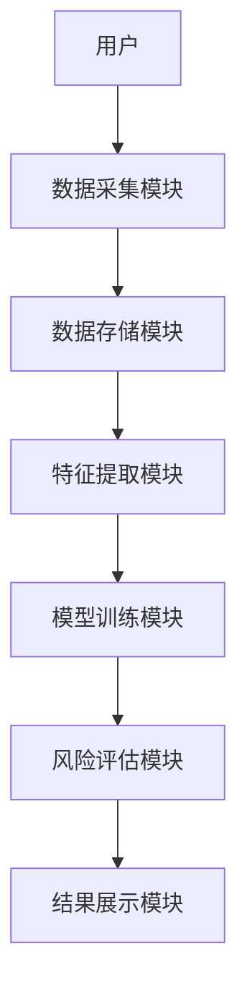

                 


# AI辅助企业并购风险评估与缓解策略

> 关键词：AI技术，企业并购，风险评估，风险管理，人工智能，机器学习

> 摘要：企业并购是企业发展的重要战略之一，然而并购过程中涉及的复杂性和不确定性使得风险评估成为一项极具挑战性的任务。随着人工智能（AI）技术的迅速发展，AI在企业并购中的应用逐渐成为可能。本文将详细探讨AI在企业并购风险评估中的核心作用，分析其算法原理、系统架构设计以及实际应用案例，并提出相应的缓解策略，为企业在并购过程中降低风险提供有力的技术支持。

---

# 第一部分: 企业并购与AI辅助概述

## 第1章: 企业并购的基本概念

### 1.1 企业并购的定义与分类

#### 1.1.1 企业并购的定义

企业并购（Mergers and Acquisitions, M&A）是指一家企业与其他企业（目标公司）合并或收购其资产、股权或业务的行为。并购可以是横向并购、纵向并购或混合并购，旨在优化资源分配、扩大市场份额或提升竞争力。

#### 1.1.2 并购的类型

- **横向并购（Horizontal Mergers）**：同一行业内的企业并购，旨在扩大市场份额或消除竞争。
- **纵向并购（Vertical Mergers）**：上下游企业之间的并购，以优化供应链或垂直整合。
- **混合并购（Diversification Mergers）**：与企业现有业务无直接关联的并购，通常用于多元化发展。

#### 1.1.3 并购的主要动机与目标

- **市场扩展**：扩大市场占有率或进入新市场。
- **成本节约**：通过规模经济或协同效应降低成本。
- **技术获取**：获取关键技术或专利。
- **财务优化**：通过并购优化资产负债表，提升股东价值。

### 1.2 AI在企业并购中的作用

#### 1.2.1 AI技术在并购中的应用领域

- **数据挖掘与分析**：通过AI技术分析目标企业的财务数据、市场表现、客户信息等。
- **风险预测**：利用机器学习模型预测并购后的潜在风险。
- **尽职调查**：AI辅助自动化完成尽职调查，识别潜在问题。
- **协同效应评估**：通过AI分析并购后的协同效应。

#### 1.2.2 AI如何提升并购效率

- **自动化数据处理**：AI能够快速处理大量非结构化数据，如新闻报道、社交媒体信息等。
- **精准匹配**：通过AI算法匹配潜在并购目标，提高效率。
- **实时监控**：AI可以实时监控市场动态，捕捉并购机会。

#### 1.2.3 AI在风险评估中的独特优势

- **数据处理能力**：AI能够处理海量数据，发现传统方法难以察觉的模式和风险。
- **动态调整**：AI模型可以实时更新，适应市场变化。
- **预测准确性**：通过机器学习模型，AI能够提供更精准的风险评估结果。

## 第2章: AI辅助企业并购的背景与趋势

### 2.1 企业并购的传统挑战

#### 2.1.1 信息不对称问题

并购过程中，买方与卖方之间存在信息不对称，买方难以全面了解目标企业的财务状况、市场表现和潜在风险。

#### 2.1.2 并购后的整合风险

并购后的整合过程复杂，涉及文化冲突、组织结构调整、业务流程整合等问题，可能导致并购失败。

#### 2.1.3 市场波动与不确定性

市场环境的不确定性（如经济波动、政策变化）增加了并购的复杂性和风险。

### 2.2 AI技术的发展与应用潜力

#### 2.2.1 大数据时代的AI技术进步

随着大数据技术的发展，AI在数据处理、模式识别和预测分析方面的能力显著提升，为并购风险评估提供了新的工具。

#### 2.2.2 AI在企业决策中的应用案例

- **亚马逊收购Whole Foods**：利用AI分析零售数据，评估整合后的协同效应。
- **谷歌收购DeepMind**：通过AI技术评估目标公司的技术潜力和市场前景。

#### 2.2.3 并购领域的AI技术发展趋势

- **智能化**：AI技术将进一步智能化，能够自动识别和评估并购风险。
- **实时化**：AI系统能够实时监控市场动态，提供动态风险评估。
- **个性化**：AI可以根据企业的具体需求，提供定制化的并购策略。

### 2.3 AI辅助并购的现状与挑战

#### 2.3.1 当前AI在并购中的应用现状

- **数据驱动的决策**：部分企业在并购过程中开始采用AI技术进行数据驱动的决策。
- **试点应用**：许多企业将AI技术应用于并购的某些环节，如尽职调查和风险评估。
- **技术整合**：部分企业开始尝试将AI技术与企业内部系统整合，实现全流程自动化。

#### 2.3.2 技术与数据的局限性

- **数据质量**：AI模型的准确性依赖于数据质量，低质量数据可能导致错误的评估结果。
- **模型泛化能力**：AI模型在不同行业和场景中的泛化能力有限，需要针对具体场景进行调整。
- **数据隐私**：并购涉及大量敏感数据，如何保护数据隐私是一个重要挑战。

#### 2.3.3 企业对AI辅助并购的接受度分析

- **技术接受度**：企业对AI技术的接受度逐渐提高，特别是在数据驱动的决策领域。
- **文化适应性**：企业内部文化对AI技术的适应性不同，部分企业可能需要较长时间的调整。
- **成本效益**：企业在采用AI技术时，需要考虑投入成本与预期收益的平衡。

---

# 第二部分: AI辅助并购风险评估的核心概念

## 第3章: 并购风险评估模型

### 3.1 并购风险的定义与分类

#### 3.1.1 并购风险的定义

并购风险是指并购过程中或并购后可能对企业价值、市场表现或财务状况产生负面影响的不确定性。

#### 3.1.2 并购风险的主要类型

- **财务风险**：包括目标企业财务状况不佳、债务负担过重等。
- **市场风险**：包括目标企业所在行业的市场波动风险。
- **整合风险**：包括组织文化冲突、业务整合困难等。
- **法律风险**：包括目标企业存在法律纠纷或合规问题。

#### 3.1.3 各类风险的特征与影响

- **财务风险**：可能导致企业利润下降、负债增加。
- **市场风险**：可能导致企业市场份额下降或收入减少。
- **整合风险**：可能导致企业内部管理混乱、效率低下。
- **法律风险**：可能导致企业面临法律诉讼或罚款。

### 3.2 基于AI的风险评估模型

#### 3.2.1 传统风险评估模型的局限性

- **数据依赖性**：传统模型依赖于少量的结构化数据，难以捕捉非结构化信息。
- **主观性**：传统模型的评估结果受到评估人员主观判断的影响。
- **静态性**：传统模型难以动态调整，无法适应市场变化。

#### 3.2.2 基于机器学习的AI模型

- **监督学习**：利用历史数据训练模型，预测并购风险。
- **无监督学习**：通过聚类分析发现潜在风险。
- **半监督学习**：结合有监督和无监督学习，提升模型的泛化能力。

#### 3.2.3 深度学习模型的应用

- **神经网络**：用于处理复杂的非结构化数据，如文本和图像。
- **卷积神经网络（CNN）**：用于处理图像数据，识别潜在风险。
- **循环神经网络（RNN）**：用于处理序列数据，预测市场趋势。

### 3.3 AI模型的核心要素

#### 3.3.1 数据来源与特征提取

- **数据来源**：包括财务报表、市场数据、新闻报道、社交媒体等。
- **特征提取**：通过自然语言处理（NLP）技术提取文本特征，通过统计方法提取数值特征。

#### 3.3.2 模型训练与优化

- **训练数据**：使用历史并购案例数据训练模型，确保数据的代表性和多样性。
- **模型优化**：通过交叉验证、网格搜索等方法优化模型参数。
- **评估指标**：使用准确率、召回率、F1分数等指标评估模型性能。

#### 3.3.3 风险预测与评估标准

- **风险评分**：通过模型预测目标企业的风险评分，评分越高，风险越大。
- **风险分类**：将目标企业分为高风险、中风险和低风险类别。

---

## 第4章: AI辅助并购风险评估的算法原理

### 4.1 机器学习算法在风险评估中的应用

#### 4.1.1 线性回归与逻辑回归

- **线性回归**：用于预测连续型变量，如目标企业的未来利润。
- **逻辑回归**：用于分类问题，如预测并购成功的概率。

#### 4.1.2 支持向量机（SVM）

- **SVM**：用于分类问题，能够处理非线性可分数据。

#### 4.1.3 随机森林与梯度提升树

- **随机森林**：通过集成学习提高模型的准确性和鲁棒性。
- **梯度提升树（如XGBoost、LightGBM）**：用于分类和回归问题，能够处理大规模数据。

### 4.2 深度学习模型的原理与优势

#### 4.2.1 神经网络的基本结构

- **输入层**：接收输入数据。
- **隐藏层**：通过非线性变换提取特征。
- **输出层**：产生最终的预测结果。

#### 4.2.2 卷积神经网络（CNN）与循环神经网络（RNN）

- **CNN**：适用于处理图像数据，通过卷积操作提取空间特征。
- **RNN**：适用于处理序列数据，如时间序列或文本。

#### 4.2.3 Transformer架构的应用

- **Transformer**：通过自注意力机制捕捉数据中的长距离依赖关系，广泛应用于自然语言处理领域。

### 4.3 基于AI的风险评估流程

#### 4.3.1 数据预处理与特征工程

- **数据清洗**：处理缺失值、异常值。
- **特征提取**：提取关键特征，如财务指标、市场指标、文本特征等。
- **数据标准化**：将数据标准化或归一化，确保模型的收敛性。

#### 4.3.2 模型训练与调参

- **训练数据**：使用历史并购案例数据训练模型。
- **参数调整**：通过网格搜索或随机搜索优化模型参数。
- **模型评估**：使用验证集评估模型性能，调整超参数。

#### 4.3.3 风险预测与评估

- **预测结果**：通过模型预测目标企业的风险评分或分类结果。
- **结果解释**：结合特征重要性分析，解释预测结果的原因。

---

## 第5章: 系统架构设计与实现

### 5.1 系统功能设计

#### 5.1.1 系统功能模块

- **数据采集模块**：从多种数据源采集并购相关数据。
- **特征提取模块**：提取目标企业的特征，如财务指标、市场指标、文本特征等。
- **模型训练模块**：训练AI模型，优化模型参数。
- **风险评估模块**：基于训练好的模型，评估目标企业的并购风险。
- **结果展示模块**：以可视化的方式展示风险评估结果。

#### 5.1.2 系统功能流程

1. 数据采集模块从多种数据源（如财务报表、新闻、社交媒体等）采集数据。
2. 特征提取模块对采集到的数据进行预处理和特征提取。
3. 模型训练模块利用特征数据训练AI模型，优化模型参数。
4. 风险评估模块基于训练好的模型评估目标企业的并购风险。
5. 结果展示模块以图表、报告等形式展示风险评估结果。

### 5.2 系统架构设计

#### 5.2.1 系统架构图



#### 5.2.2 系统接口设计

- **数据接口**：与数据源（如数据库、API）对接，获取并购相关数据。
- **模型接口**：与其他系统（如企业内部系统）对接，提供风险评估服务。

#### 5.2.3 系统交互流程

1. 用户通过数据接口上传目标企业的数据。
2. 数据采集模块从数据源获取数据。
3. 数据存储模块将数据存储到数据库中。
4. 特征提取模块从数据库中提取特征。
5. 模型训练模块基于特征数据训练AI模型。
6. 风险评估模块利用训练好的模型评估目标企业的并购风险。
7. 结果展示模块将风险评估结果以可视化的方式展示给用户。

---

## 第6章: 项目实战与案例分析

### 6.1 项目背景与目标

#### 6.1.1 项目背景

假设某企业计划并购一家科技公司，希望通过AI技术评估并购风险。

#### 6.1.2 项目目标

- **风险评估**：利用AI技术评估并购后的潜在风险。
- **决策支持**：为企业的并购决策提供数据支持。

### 6.2 环境安装与配置

#### 6.2.1 环境要求

- **操作系统**：Linux/Windows/MacOS
- **Python版本**：Python 3.6+
- **依赖库**：scikit-learn、XGBoost、Keras、TensorFlow、自然语言处理库（如spaCy、NLTK）

#### 6.2.2 安装步骤

```bash
pip install scikit-learn
pip install xgboost
pip install keras
pip install tensorflow
pip install spacy
pip install nltk
```

### 6.3 核心代码实现

#### 6.3.1 数据预处理代码

```python
import pandas as pd
import numpy as np
from sklearn.model_selection import train_test_split
from sklearn.preprocessing import StandardScaler

# 加载数据
data = pd.read_csv('并购数据.csv')

# 数据清洗
data.dropna(inplace=True)
data = data.replace({np.nan: 0})

# 特征提取
X = data.drop('目标变量', axis=1)
y = data['目标变量']

# 数据标准化
scaler = StandardScaler()
X_scaled = scaler.fit_transform(X)

# 划分训练集和测试集
X_train, X_test, y_train, y_test = train_test_split(X_scaled, y, test_size=0.2, random_state=42)
```

#### 6.3.2 模型训练代码

```python
from sklearn.ensemble import RandomForestClassifier
from sklearn.metrics import accuracy_score, classification_report

# 初始化模型
model = RandomForestClassifier(n_estimators=100, max_depth=10, random_state=42)

# 训练模型
model.fit(X_train, y_train)

# 预测测试集
y_pred = model.predict(X_test)

# 评估模型
print("准确率:", accuracy_score(y_test, y_pred))
print("分类报告:", classification_report(y_test, y_pred))
```

#### 6.3.3 风险评估代码

```python
import joblib
import pandas as pd
import numpy as np

# 加载模型
model = joblib.load('并购风险模型.pkl')

# 数据预处理
new_data = pd.read_csv('目标企业数据.csv')
new_data.dropna(inplace=True)
new_data = new_data.replace({np.nan: 0})
new_X = new_data.drop('目标变量', axis=1)
new_X_scaled = scaler.transform(new_X)

# 预测风险
y_pred = model.predict(new_X_scaled)

# 输出结果
print("并购风险预测结果:", y_pred)
```

### 6.4 实际案例分析

#### 6.4.1 案例背景

某科技公司计划并购一家软件开发公司，希望通过AI技术评估并购风险。

#### 6.4.2 数据收集与处理

- **财务数据**：包括收入、利润、负债等。
- **市场数据**：包括市场份额、竞争对手分析等。
- **文本数据**：包括新闻报道、社交媒体评论等。

#### 6.4.3 风险评估结果

- **高风险**：目标企业存在较高的财务风险和整合风险。
- **中风险**：目标企业市场表现不佳，但财务状况稳定。
- **低风险**：目标企业财务状况良好，市场前景乐观。

---

## 第7章: 总结与展望

### 7.1 总结

本文详细探讨了AI在企业并购风险评估中的应用，分析了AI技术的核心算法、系统架构设计以及实际应用案例。通过AI技术，企业可以更准确地评估并购风险，优化并购决策，降低并购失败的可能性。

### 7.2 展望

未来，随着AI技术的不断发展，AI在企业并购中的应用将更加广泛和深入。可能的发展方向包括：

- **多模态数据融合**：结合文本、图像、语音等多种数据源，提升风险评估的准确性。
- **实时风险监控**：通过实时数据流处理技术，动态监控并购风险。
- **智能化决策支持**：结合自然语言处理和知识图谱技术，提供智能化的并购决策支持。

---

# 结语

企业并购是企业发展的重要战略，而并购风险的评估与缓解是并购成功的关键。通过AI技术的应用，企业可以更高效、更准确地评估并购风险，降低并购失败的可能性。未来，随着AI技术的不断进步，其在企业并购中的应用将更加广泛和深入，为企业创造更大的价值。

