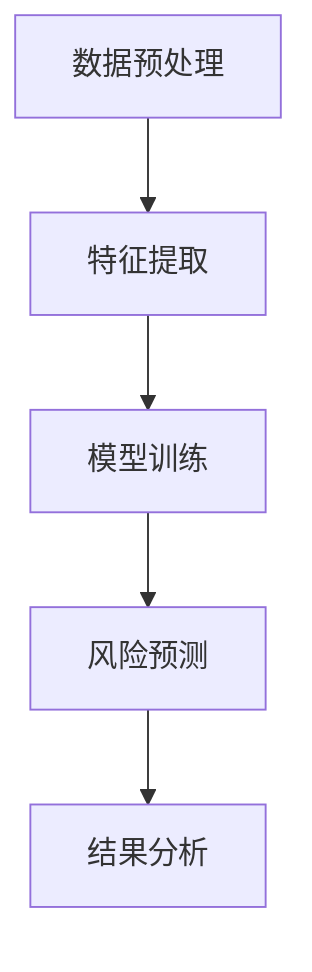
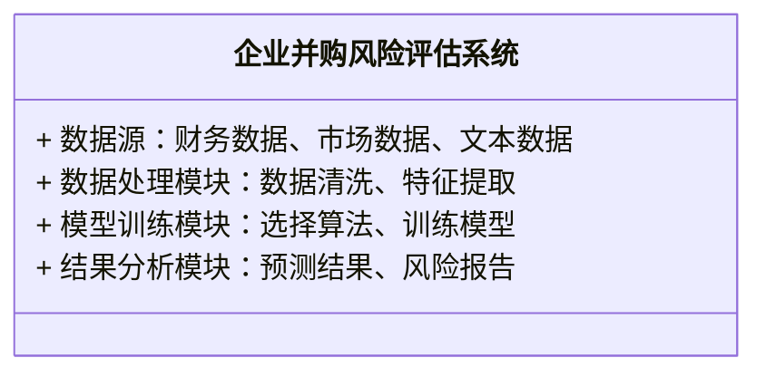
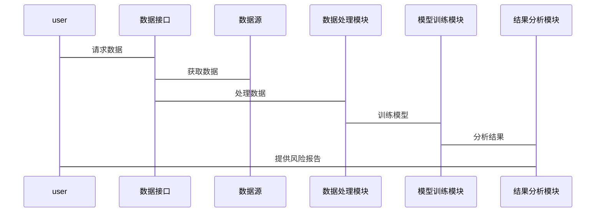

                 


# AI辅助企业并购风险评估：全面识别与量化风险

> 关键词：企业并购，AI，风险评估，机器学习，自然语言处理

> 摘要：本文详细探讨了利用人工智能技术辅助企业并购风险评估的全过程，从核心概念到算法原理，再到系统架构设计和项目实战，结合实际案例分析，全面解析如何利用AI技术有效识别和量化并购过程中的各类风险，为企业并购决策提供科学依据。

---

# 第1章：企业并购风险评估的背景与挑战

## 1.1 企业并购的定义与分类

### 1.1.1 企业并购的基本定义

企业并购（Mergers and Acquisitions，简称M&A）是指两个或多个企业之间通过合并或收购的方式，将两个或多个独立的企业结合成一个企业。并购是企业扩展和重组的重要手段，通常分为两类：**合并（Merger）**和**收购（Acquisition）**。合并是指两个或多个企业通过协议合并成一个新的企业，而收购则是指一家企业通过购买另一家企业的股权或资产，将其完全或部分吸收。

### 1.1.2 并购的类型与特点

| 并购类型 | 定义 | 特点 |
|----------|------|------|
| 横向并购 | 同行业竞争对手之间的并购 | 旨在扩大市场份额，降低成本 |
| 纵向并购 | 上下游企业之间的并购 | 旨在控制供应链，提高效率 |
| 混合并购 | 与企业无直接关联的业务并购 | 通常用于多元化经营 |

### 1.1.3 并购的动机与目标

企业进行并购的主要动机包括：

1. **市场扩展**：通过并购进入新市场或扩大市场份额。
2. **资源获取**：获取技术、专利、人力资源等。
3. **成本协同**：通过规模效应降低成本。
4. **战略调整**：调整企业战略，优化资产结构。

---

## 1.2 企业并购中的风险类型

### 1.2.1 市场风险

市场风险主要指并购后企业所处的市场环境变化带来的风险，包括经济波动、行业竞争加剧等。例如，全球经济下行可能导致被并购企业的收入下降，从而影响并购后的整体业绩。

### 1.2.2 财务风险

财务风险包括并购过程中产生的债务风险、汇率风险以及整合后的财务协同效应未能实现的风险。例如，杠杆收购可能导致高负债率，增加企业的财务负担。

### 1.2.3 战略风险

战略风险主要指并购后的战略整合风险，包括企业战略目标不一致、管理整合困难等。例如，两家具有不同企业文化的公司合并后，可能因管理冲突导致战略目标未能实现。

### 1.2.4 法律风险

法律风险包括并购过程中涉及的反垄断审查、知识产权纠纷、合同履行风险等。例如，跨国并购可能面临不同国家的法律法规差异，增加法律风险。

---

## 1.3 并购风险评估的重要性

### 1.3.1 并购失败的常见原因

根据统计，超过50%的并购交易未能达到预期目标，主要失败原因包括：

1. **协同效应未能实现**：并购后未能实现预期的协同效应。
2. **管理整合困难**：企业文化和管理风格差异导致整合失败。
3. **信息不对称**：收购方对目标企业的真实情况了解不足。

### 1.3.2 风险评估在并购决策中的作用

风险评估能够帮助企业在并购决策中：

1. **识别潜在风险**：提前发现并购中的潜在风险。
2. **制定应对策略**：根据风险情况制定相应的风险管理策略。
3. **优化决策**：通过风险评估优化并购决策，降低并购失败的概率。

### 1.3.3 数字化风险评估的必要性

随着大数据和人工智能技术的发展，传统的基于经验的并购风险评估方法逐渐被数据驱动的数字化评估方法取代。数字化风险评估能够通过分析大量历史数据，发现潜在风险因素，提高风险评估的准确性和效率。

---

## 1.4 本章小结

本章从企业并购的基本概念入手，详细介绍了并购的类型与特点，分析了并购过程中的主要风险类型，并阐述了风险评估在并购决策中的重要性。通过本章的学习，读者可以了解企业并购的基本知识，以及并购风险评估的必要性。

---

# 第2章：AI技术在风险评估中的应用

## 2.1 人工智能的基本概念

### 2.1.1 人工智能的定义与特点

人工智能（Artificial Intelligence，AI）是指由人创造的能够模拟人类智能的系统或机器。人工智能具有以下特点：

1. **学习能力**：通过数据和经验不断优化性能。
2. **推理能力**：能够进行逻辑推理和问题解决。
3. **自适应能力**：能够根据环境变化调整行为。

### 2.1.2 机器学习与深度学习的区别

| 特性 | 机器学习 | 深度学习 |
|------|----------|----------|
| 数据需求 | 需要大量特征工程 | 需要大量标注数据 |
| 模型复杂度 | 模型相对简单 | 模型复杂，参数多 |
| 应用场景 | 适合中小规模数据 | 适合大规模数据 |

### 2.1.3 自然语言处理（NLP）的作用

自然语言处理（NLP）是人工智能的一个重要分支，主要用于处理和理解人类语言。在企业并购风险评估中，NLP可以用于分析目标企业的公开文本信息，如财务报告、新闻报道等，提取关键信息。

---

## 2.2 企业并购风险评估的核心要素

### 2.2.1 数据来源与特征

并购风险评估的数据来源主要包括：

1. **财务数据**：包括收入、利润、负债等。
2. **市场数据**：包括行业趋势、竞争情况等。
3. **文本数据**：包括企业公告、新闻报道等。

### 2.2.2 风险评估模型的构建

构建风险评估模型需要经历以下几个步骤：

1. **数据清洗**：去除无效数据，处理缺失值。
2. **特征提取**：从数据中提取有用的特征。
3. **模型训练**：使用机器学习算法训练模型。
4. **模型验证**：通过测试数据验证模型的准确性。

### 2.2.3 模型的可解释性与鲁棒性

模型的可解释性是指模型能够解释其预测结果的能力。鲁棒性是指模型在面对数据噪声和异常值时的稳定性。在企业并购风险评估中，模型的可解释性和鲁棒性非常重要，因为决策者需要理解模型的预测结果，并能够应对突发情况。

---

## 2.3 AI在企业并购中的具体应用

### 2.3.1 数据清洗与特征提取

数据清洗是机器学习模型训练前的重要步骤，主要包括：

1. **去除重复数据**：确保数据唯一性。
2. **处理缺失值**：根据具体情况填充或删除缺失值。
3. **标准化处理**：将数据标准化到统一范围内。

特征提取是通过选择或创建有用的特征来提高模型性能。例如，可以通过NLP技术从文本数据中提取情感特征。

### 2.3.2 风险预测模型的训练

训练风险预测模型需要选择合适的算法，并进行参数调优。例如，可以使用随机森林算法进行分类，预测并购成功的概率。

### 2.3.3 模型的验证与优化

通过交叉验证和网格搜索等方法，优化模型的参数，提高模型的准确性和稳定性。

---

# 第3章：企业并购风险评估的数学模型与算法原理

## 3.1 风险评估的数学模型

### 3.1.1 线性回归模型

线性回归模型用于预测连续型变量，例如企业的销售收入。其数学公式为：

$$ y = \beta_0 + \beta_1 x_1 + \beta_2 x_2 + \dots + \beta_n x_n $$

其中，$y$ 是目标变量，$x_i$ 是特征变量，$\beta_i$ 是回归系数。

### 3.1.2 支持向量机（SVM）

支持向量机用于分类问题，其核心思想是通过找到一个超平面，将数据点分为两类。SVM的数学公式为：

$$ y = \text{sign}(w \cdot x + b) $$

其中，$w$ 是权重向量，$x$ 是输入向量，$b$ 是偏置项。

### 3.1.3 随机森林与梯度提升树

随机森林是一种基于决策树的集成学习方法，其数学公式为：

$$ y = \text{sign}\left(\sum_{i=1}^{n} \text{Tree}(x_i)\right) $$

其中，$n$ 是决策树的数量。

---

## 3.2 算法原理与流程图

以下是并购风险评估的算法流程图：



---

## 3.3 算法实现与代码示例

以下是使用随机森林算法进行并购风险预测的Python代码示例：

```python
import pandas as pd
from sklearn.ensemble import RandomForestClassifier
from sklearn.metrics import accuracy_score

# 加载数据
data = pd.read_csv('并购数据.csv')
X = data.drop('风险标签', axis=1)
y = data['风险标签']

# 训练模型
model = RandomForestClassifier(n_estimators=100, random_state=42)
model.fit(X, y)

# 预测结果
y_pred = model.predict(X)

# 计算准确率
accuracy = accuracy_score(y, y_pred)
print(f'准确率: {accuracy}')
```

---

## 3.4 本章小结

本章详细介绍了企业并购风险评估的数学模型与算法原理，包括线性回归、支持向量机、随机森林和梯度提升树等算法，并通过流程图和代码示例，展示了如何利用这些算法进行风险预测。

---

# 第4章：系统分析与架构设计方案

## 4.1 问题场景介绍

企业并购风险评估系统需要解决以下问题：

1. **数据获取**：如何获取高质量的并购数据？
2. **数据处理**：如何清洗和处理复杂的数据？
3. **模型训练**：如何选择和训练合适的模型？
4. **结果分析**：如何解释和应用模型的预测结果？

---

## 4.2 项目介绍

本项目旨在开发一个基于AI的企业并购风险评估系统，通过整合多种数据源，利用机器学习算法，帮助企业识别和量化并购过程中的各类风险。

---

## 4.3 系统功能设计

### 4.3.1 领域模型

以下是企业并购风险评估的领域模型：



---

## 4.4 系统架构设计

以下是系统架构设计图：


---

## 4.5 系统接口设计

系统接口主要包括：

1. **数据接口**：与数据源对接，获取并购数据。
2. **模型接口**：与机器学习框架对接，训练模型。
3. **用户接口**：提供给用户使用的Web界面。

---

## 4.6 系统交互设计

以下是系统交互图：



---

## 4.7 本章小结

本章从系统架构设计的角度，详细介绍了企业并购风险评估系统的功能模块、数据流程和系统架构。通过本章的学习，读者可以了解如何将AI技术应用于实际的企业并购风险评估系统中。

---

# 第5章：项目实战

## 5.1 环境安装

以下是项目实战所需的环境配置：

1. **Python**：安装Python 3.8或更高版本。
2. **Jupyter Notebook**：用于数据处理和模型训练。
3. **Scikit-learn**：安装机器学习库。
4. **Pandas**：安装数据处理库。
5. **Mermaid**：安装图表生成工具。

---

## 5.2 系统核心实现源代码

以下是并购风险评估系统的核心代码：

```python
import pandas as pd
from sklearn.ensemble import RandomForestClassifier
from sklearn.metrics import accuracy_score

# 加载数据
data = pd.read_csv('并购数据.csv')
X = data.drop('风险标签', axis=1)
y = data['风险标签']

# 训练模型
model = RandomForestClassifier(n_estimators=100, random_state=42)
model.fit(X, y)

# 预测结果
y_pred = model.predict(X)

# 计算准确率
accuracy = accuracy_score(y, y_pred)
print(f'准确率: {accuracy}')
```

---

## 5.3 代码应用解读与分析

以上代码实现了一个基于随机森林算法的并购风险预测系统，通过训练模型，预测并购成功的概率，并计算模型的准确率。通过调整模型参数和优化算法，可以进一步提高模型的性能。

---

## 5.4 实际案例分析

以某公司并购案例为例，分析并购风险：

1. **数据获取**：获取目标企业的财务数据、市场数据和文本数据。
2. **数据处理**：清洗数据，提取特征。
3. **模型训练**：训练随机森林模型，预测并购成功的概率。
4. **结果分析**：根据预测结果，制定相应的风险管理策略。

---

## 5.5 本章小结

本章通过实际案例，详细展示了如何利用AI技术进行企业并购风险评估。通过代码实现和案例分析，读者可以掌握如何将理论应用于实际。

---

# 第6章：总结与展望

## 6.1 本章总结

本文详细探讨了AI技术在企业并购风险评估中的应用，从核心概念到算法原理，再到系统架构设计和项目实战，全面解析了如何利用AI技术识别和量化并购风险。通过实际案例分析，展示了AI技术在并购风险评估中的巨大潜力。

---

## 6.2 未来展望

随着AI技术的不断发展，企业并购风险评估将更加智能化和精准化。未来的研究方向包括：

1. **模型优化**：研究更高效的算法，提高模型的准确性和可解释性。
2. **数据融合**：结合多源数据，提高风险评估的全面性。
3. **实时监控**：实现并购风险的实时监控和预警。

---

## 6.3 最佳实践Tips

1. **数据质量**：数据质量是并购风险评估的核心，确保数据的准确性和完整性。
2. **模型选择**：根据具体场景选择合适的算法，避免盲目使用复杂模型。
3. **结果解读**：理解模型的预测结果，避免误用AI技术。

---

## 6.4 本章小结

通过本章的总结与展望，读者可以了解本文的主要内容和未来研究方向，为后续的研究和实践提供参考。

---

# 结语

企业并购是企业发展的重要手段，而并购风险评估是并购成功的关键。通过本文的探讨，读者可以了解如何利用AI技术全面识别与量化并购风险，为企业并购决策提供科学依据。未来，随着AI技术的不断发展，企业并购风险评估将更加智能化和精准化，为企业创造更大的价值。

--- 

**感谢您的耐心阅读！如果对您有所帮助，请点赞支持！**

