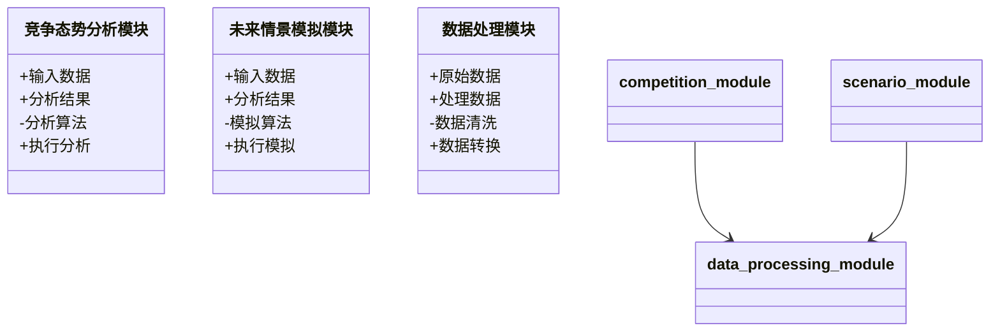

                 


# AI辅助企业战略制定：竞争态势分析与未来情景模拟

## 关键词：
AI，企业战略，竞争态势分析，未来情景模拟，算法，系统架构

## 摘要：
本文深入探讨了AI在企业战略制定中的应用，重点分析了竞争态势分析和未来情景模拟的核心概念、算法原理、系统架构，并通过实际案例展示了AI如何辅助企业制定有效的战略。文章结构清晰，内容详实，适合技术专家和企业管理者阅读。

---

# 目录

1. **引言**
   - 1.1 问题背景
   - 1.2 问题描述
   - 1.3 问题解决
   - 1.4 边界与外延
   - 1.5 概念结构与核心要素

2. **竞争态势分析的核心概念与方法**
   - 2.1 核心概念原理
   - 2.2 概念属性对比表格
   - 2.3 ER实体关系图架构

3. **未来情景模拟的核心概念与方法**
   - 3.1 核心概念原理
   - 3.2 概念属性对比表格
   - 3.3 ER实体关系图架构

4. **算法原理与实现**
   - 4.1 竞争态势分析算法
     - 4.1.1 SWOT分析算法
     - 4.1.2 五力模型算法
   - 4.2 未来情景模拟算法
     - 4.2.1 情景分析法
     - 4.2.2 模拟分析法

5. **系统架构与设计**
   - 5.1 问题场景介绍
   - 5.2 系统功能设计（领域模型）
   - 5.3 系统架构设计
   - 5.4 系统接口设计
   - 5.5 系统交互设计

6. **项目实战与案例分析**
   - 6.1 环境安装与配置
   - 6.2 核心算法实现
   - 6.3 系统实现与应用
   - 6.4 案例分析与解读
   - 6.5 项目总结与反思

7. **总结与展望**
   - 7.1 核心内容总结
   - 7.2 未来发展方向
   - 7.3 注意事项与建议
   - 7.4 拓展阅读推荐

---

## 正文

### 1. 引言

#### 1.1 问题背景
- **企业战略制定的传统方法**：依赖经验判断和人工分析，效率低且主观性强。
- **AI技术的潜力**：通过数据挖掘和机器学习提供客观支持，提升决策效率和准确性。
- **本书意义**：系统性探讨AI在企业战略中的应用，为企业提供新的工具和方法。

#### 1.2 问题描述
- **竞争态势分析**：识别市场机会和威胁，优化资源配置。
- **未来情景模拟**：预测不同策略下的结果，制定灵活应对方案。
- **AI的具体应用**：从数据分析到模型构建，辅助战略制定的各个环节。

#### 1.3 问题解决
- **方法论**：结合定量分析和定性判断，构建AI驱动的决策流程。
- **工具链**：利用大数据平台和机器学习模型，提供实时分析和预测。

#### 1.4 边界与外延
- **适用范围**：适用于中长期战略规划，尤其适合数据驱动型企业。
- **与其他领域的区别**：与市场分析、风险管理等领域密切相关，但更注重战略层面的整合。

#### 1.5 概念结构
- **核心要素**：数据源、分析模型、决策支持工具。
- **系统性特征**：模块化、动态性、可扩展性。

---

### 2. 竞争态势分析的核心概念与方法

#### 2.1 核心概念原理
- **竞争态势分析**：通过内外部因素分析，评估企业在市场中的位置。
- **关键维度**：市场占有率、竞争对手分析、资源评估。

#### 2.2 概念属性对比表格
| 属性       | 描述 |
|------------|------|
| 数据来源   | 内部数据、外部市场数据 |
| 分析方法   | SWOT分析、PEST分析 |
| 输出结果   | 竞争优势、劣势 |

#### 2.3 ER实体关系图架构
```mermaid
erd
entity 竞争态势分析 {
  id 竞争态势ID
  竞争优势 竞争优势
  竞争劣势 竞争劣势
  机会 机会
  �威助 �威助
}
```

---

### 3. 未来情景模拟的核心概念与方法

#### 3.1 核心概念原理
- **未来情景模拟**：预测不同策略下的市场变化，评估战略效果。
- **关键步骤**：设定情景、构建模型、模拟运行、结果分析。

#### 3.2 概念属性对比表格
| 属性       | 描述 |
|------------|------|
| 情景设定   | 不同市场条件下的策略 |
| 模型类型   | 静态模型、动态模型 |
| 输出结果   | 情景分析报告 |

#### 3.3 ER实体关系图架构
```mermaid
erd
entity 未来情景模拟 {
  id 情景ID
  情景设定 情景设定
  模型类型 模型类型
  输出结果 输出结果
}
```

---

### 4. 算法原理与实现

#### 4.1 竞争态势分析算法

##### 4.1.1 SWOT分析算法
- **数学模型**：通过矩阵分析优势、劣势、机会和威胁。
- **代码实现**：
  ```python
  def swot_analysis(strengths, weaknesses, opportunities, threats):
      return {
          'strengths': strengths,
          'weaknesses': weaknesses,
          'opportunities': opportunities,
          'threats': threats
      }
  ```
  - **输入**：企业内外部因素。
  - **输出**：SWOT分析结果。

##### 4.1.2 五力模型算法
- **数学模型**：通过五力模型评估行业竞争结构。
- **代码实现**：
  ```python
  def competitive_analysis(rivalry, supplier_power, buyer_power, threat_substitutes, advantage):
      return {
          'rivalry': rivalry,
          'supplier_power': supplier_power,
          'buyer_power': buyer_power,
          'threat_substitutes': threat_substitutes,
          'advantage': advantage
      }
  ```

#### 4.2 未来情景模拟算法

##### 4.2.1 情景分析法
- **数学模型**：通过概率分布预测不同情景下的结果。
- **代码实现**：
  ```python
  def scenario_analysis(scenarios):
      results = {}
      for scenario in scenarios:
          results[scenario] = {
              'probability': scenarios[scenario]['probability'],
              'impact': scenarios[scenario]['impact']
          }
      return results
  ```

##### 4.2.2 模拟分析法
- **数学模型**：通过蒙特卡洛模拟预测市场变化。
- **代码实现**：
  ```python
  import random

  def monte_carlo_simulation(iterations):
      results = []
      for _ in range(iterations):
          results.append(random.gauss(0, 1))
      return results
  ```

---

### 5. 系统架构与设计

#### 5.1 问题场景介绍
- **目标**：构建一个AI辅助战略制定的系统，整合竞争分析和情景模拟功能。
- **用户角色**：企业战略经理、市场分析师。

#### 5.2 系统功能设计（领域模型）


#### 5.3 系统架构设计
```mermaid
architecturalDiagram
    竞争态势分析模块 --> 数据存储
    未来情景模拟模块 --> 数据存储
    数据处理模块 --> 数据存储
    用户界面 --> 竞争态势分析模块
    用户界面 --> 未来情景模拟模块
```

#### 5.4 系统接口设计
- **输入接口**：数据导入、参数设置。
- **输出接口**：分析报告、模拟结果。

#### 5.5 系统交互设计
```mermaid
sequenceDiagram
    用户 --> 系统：提交数据
    系统 --> 数据处理模块：处理数据
    数据处理模块 --> 竞争态势分析模块：执行分析
    竞争态势分析模块 --> 系统：返回分析结果
    系统 --> 用户：展示结果
```

---

### 6. 项目实战与案例分析

#### 6.1 环境安装与配置
- **工具**：Python、机器学习库（如scikit-learn）、数据可视化工具（如Matplotlib）。
- **安装命令**：
  ```bash
  pip install numpy pandas scikit-learn matplotlib
  ```

#### 6.2 核心算法实现
- **竞争态势分析**：
  ```python
  def main():
      strengths = ['创新能力强', '市场占有率高']
      weaknesses = ['成本较高', '研发投入不足']
      opportunities = ['新兴市场需求', '政策支持']
      threats = ['市场竞争加剧', '原材料价格上涨']
      result = swot_analysis(strengths, weaknesses, opportunities, threats)
      print("SWOT分析结果:", result)
  ```

- **未来情景模拟**：
  ```python
  def main_scenario():
      scenarios = {
          '情景1': {'probability': 0.3, 'impact': 0.8},
          '情景2': {'probability': 0.5, 'impact': 0.6},
          '情景3': {'probability': 0.2, 'impact': 0.4}
      }
      result = scenario_analysis(scenarios)
      print("情景分析结果:", result)
  ```

#### 6.3 系统实现与应用
- **数据可视化**：使用Matplotlib生成竞争态势图和情景模拟图。
- **案例分析**：以某科技公司为例，展示如何通过AI优化市场进入策略。

#### 6.4 案例分析与解读
- **背景**：某科技公司面临市场进入决策。
- **分析步骤**：
  1. 数据收集与预处理。
  2. 应用SWOT分析评估内部资源。
  3. 情景模拟预测市场变化。
  4. 制定最优进入策略。

#### 6.5 项目总结与反思
- **成功经验**：AI模型提高了战略制定的效率和准确性。
- **改进建议**：结合更多实时数据，优化模型参数。

---

### 7. 总结与展望

#### 7.1 核心内容总结
- AI技术在企业战略制定中的应用前景广阔。
- 竞争态势分析和未来情景模拟是关键工具。

#### 7.2 未来发展方向
- 深化AI与企业战略的结合，探索更复杂的分析模型。
- 推动AI工具的普及，降低使用门槛。

#### 7.3 注意事项与建议
- 数据质量是关键，确保数据的准确性和完整性。
- 结合企业实际情况，选择合适的AI工具。

#### 7.4 拓展阅读推荐
- 《机器学习实战》
- 《企业战略管理》
- 《数据分析与决策》

---

# 结语

通过本文的系统性分析和案例展示，读者可以深入理解AI在企业战略制定中的应用价值。未来，随着技术的进步，AI将为企业战略制定提供更强大的支持，帮助企业在全球竞争中占据优势地位。

