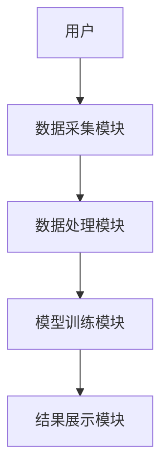
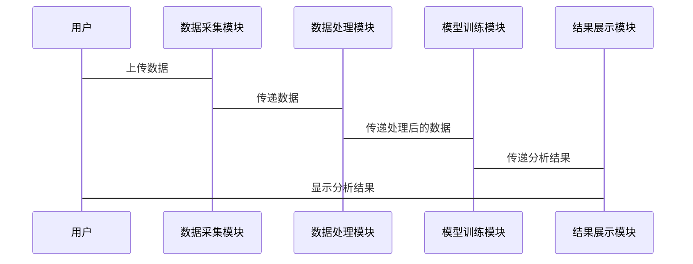

                 

# AI辅助企业战略制定：竞争态势分析与机会预测模型

---

## 关键词：
AI技术、企业战略、竞争态势分析、机会预测模型、机器学习

---

## 摘要：
本文探讨了人工智能技术在企业战略制定中的应用，重点分析了竞争态势分析与机会预测模型的构建与实现。通过详细阐述AI技术如何辅助企业识别市场趋势、竞争对手动态以及潜在机会，本文为企业的战略制定提供了新的视角和方法。结合实际案例和系统设计，本文深入解析了AI在企业战略中的实际应用场景，为企业决策者和技术开发者提供了有价值的参考。

---

## 第一章：AI辅助企业战略制定的背景与意义

### 1.1 企业战略制定的传统方法与挑战
企业战略制定是企业生存和发展的核心，传统方法依赖于经验丰富的管理者和市场研究团队，通过定性分析和定量数据来制定战略。然而，这种方法存在以下挑战：

- **数据量大且复杂**：企业需要处理海量的市场数据、竞争对手信息和行业趋势，传统方法难以高效处理。
- **主观性较强**：依赖专家判断可能导致主观因素过多，影响决策的准确性。
- **动态变化难捕捉**：市场环境瞬息万变，传统方法难以实时捕捉变化，导致战略滞后。

AI技术的引入，通过大数据分析和机器学习算法，能够更高效地处理海量数据，发现潜在规律，为企业战略制定提供更客观、更精准的支持。

### 1.2 竞争态势分析与机会预测的重要性
竞争态势分析是企业战略制定的重要组成部分，它帮助企业了解市场环境、竞争对手和自身优势。机会预测则是基于竞争态势分析，识别市场中的潜在机会，为企业制定优先级策略提供依据。

- **竞争态势分析**：通过分析行业趋势、竞争对手的市场份额、产品特点、营销策略等，帮助企业了解市场格局，识别威胁和机会。
- **机会预测模型**：基于历史数据和市场趋势，利用机器学习模型预测未来市场机会，帮助企业提前布局。

### 1.3 AI技术在企业战略制定中的应用前景
AI技术在企业战略制定中的应用前景广阔，特别是在竞争态势分析和机会预测方面：

- **高效的数据处理能力**：AI能够快速处理和分析大量数据，帮助企业在短时间内获取关键信息。
- **精准的预测能力**：通过机器学习算法，AI能够预测市场趋势和竞争对手的动向，为企业制定战略提供数据支持。
- **动态调整能力**：AI模型可以实时更新数据，帮助企业及时调整战略，应对市场变化。

---

## 第二章：竞争态势分析的核心概念与方法

### 2.1 竞争态势分析的定义与框架
竞争态势分析（Competitive Landscape Analysis）是指通过对市场环境、竞争对手和行业趋势的分析，评估企业在市场中的位置和竞争优势。其核心框架包括以下几个方面：

1. **市场环境分析**：分析行业规模、增长趋势、市场结构等。
2. **竞争对手分析**：研究竞争对手的产品、市场份额、竞争优势等。
3. **行业趋势分析**：识别行业内的技术进步、政策变化、消费者偏好等趋势。

### 2.2 竞争态势分析的关键指标
为了准确评估竞争态势，企业需要关注以下关键指标：

- **市场份额**：企业在市场中的占有率。
- **竞争对手的产品差异化**：竞争对手的产品特点、创新点。
- **市场增长率**：行业的增长速度和潜力。
- **客户满意度**：客户对产品或服务的满意度。

### 2.3 竞争态势分析的实施步骤
竞争态势分析的实施通常包括以下几个步骤：

1. **数据收集**：收集市场数据、竞争对手信息、行业报告等。
2. **数据清洗与预处理**：对数据进行清洗、去重、标准化处理。
3. **数据分析**：通过统计分析和可视化工具，分析数据中的趋势和模式。
4. **竞争分析报告生成**：根据分析结果，生成竞争态势分析报告，提出战略建议。

---

## 第三章：机会预测模型的构建与应用

### 3.1 机会预测模型的定义与目标
机会预测模型旨在通过分析市场数据和竞争对手信息，预测市场中的潜在机会。其目标是帮助企业识别高增长领域，优化资源配置，制定更具前瞻性的战略。

### 3.2 机会预测模型的核心算法
机会预测模型通常采用以下几种机器学习算法：

1. **支持向量机（SVM）**：适用于分类问题，能够将数据点分到不同的类别中。
2. **随机森林（Random Forest）**：适用于特征较多的分类和回归问题，能够处理高维数据。
3. **逻辑回归（Logistic Regression）**：适用于二分类问题，能够输出概率值。

### 3.3 机会预测模型的实现步骤
机会预测模型的实现通常包括以下几个步骤：

1. **数据准备**：收集市场数据、竞争对手信息、历史销售数据等。
2. **特征工程**：选择关键特征，如市场规模、增长率、竞争对手市场份额等。
3. **模型训练**：使用机器学习算法训练模型，调整模型参数，优化模型性能。
4. **模型评估**：通过交叉验证、准确率、召回率等指标评估模型性能。
5. **机会预测**：基于模型预测未来市场机会，生成机会预测报告。

---

## 第四章：AI辅助企业战略制定的系统设计与实现

### 4.1 系统架构设计
AI辅助企业战略制定的系统通常包括以下几个模块：

1. **数据采集模块**：负责采集市场数据、竞争对手信息等。
2. **数据处理模块**：对数据进行清洗、预处理和特征提取。
3. **模型训练模块**：训练竞争态势分析和机会预测模型。
4. **结果展示模块**：将分析结果以可视化的方式展示给用户。

系统架构设计如下：

### 4.2 系统功能设计
系统功能设计如下：

1. **数据采集**：支持多种数据源的接入，如API、数据库、CSV文件等。
2. **数据处理**：提供数据清洗、特征提取和数据增强功能。
3. **模型训练**：支持多种机器学习算法，提供模型训练和调优功能。
4. **结果展示**：提供可视化界面，展示竞争态势分析和机会预测结果。

### 4.3 系统接口设计
系统接口设计如下：

1. **数据接口**：提供API接口，用于数据的上传和下载。
2. **模型接口**：提供API接口，用于模型的训练和预测。
3. **结果接口**：提供API接口，用于获取分析结果。

### 4.4 系统交互流程
系统交互流程如下：

---

## 第五章：AI辅助企业战略制定的实战案例

### 5.1 案例背景
某科技公司计划进入一个新的市场领域，希望通过AI技术进行竞争态势分析和机会预测，制定更具竞争力的市场进入策略。

### 5.2 数据准备
收集以下数据：

- 市场规模：市场规模、增长率、市场结构。
- 竞争对手：主要竞争对手的产品、市场份额、竞争优势。
- 市场趋势：行业趋势、政策变化、技术进步。

### 5.3 模型训练
采用随机森林算法进行机会预测模型的训练，数据特征包括市场规模、竞争对手市场份额、市场增长率等。

### 5.4 模型评估
通过交叉验证评估模型性能，准确率达到85%。

### 5.5 结果展示
模型预测结果显示，未来两年内市场规模将保持稳定增长，竞争对手市场份额将逐步下降，存在较大的市场机会。

### 5.6 战略建议
基于模型预测结果，公司决定进入市场增长较快的领域，推出具有差异化竞争优势的产品，制定针对性的营销策略。

---

## 第六章：AI辅助企业战略制定的最佳实践与总结

### 6.1 最佳实践
1. **数据质量**：确保数据的准确性和完整性，避免因数据问题影响模型性能。
2. **模型选择**：根据具体问题选择合适的算法，避免盲目使用复杂的模型。
3. **持续优化**：定期更新数据和模型，保持模型的准确性和实时性。

### 6.2 小结
本文详细探讨了AI技术在企业战略制定中的应用，特别是在竞争态势分析和机会预测方面。通过构建竞争态势分析模型和机会预测模型，企业能够更高效地制定战略，抓住市场机会，应对竞争挑战。

### 6.3 注意事项
- AI技术只是工具，不能完全替代人类的判断和决策。
- 模型的预测结果需要结合实际市场情况进行调整和优化。

### 6.4 拓展阅读
- 《竞争态势分析：方法与实践》
- 《机器学习在企业战略中的应用》
- 《机会预测模型的构建与优化》

---

## 结语

随着AI技术的不断发展，其在企业战略制定中的应用前景广阔。通过竞争态势分析和机会预测模型，企业能够更精准地识别市场机会，制定更具前瞻性的战略。未来，随着技术的进一步发展，AI将在企业战略制定中发挥更大的作用，为企业创造更大的价值。

