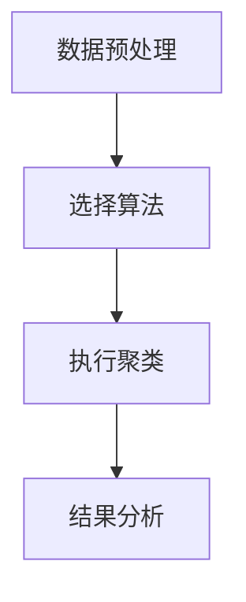
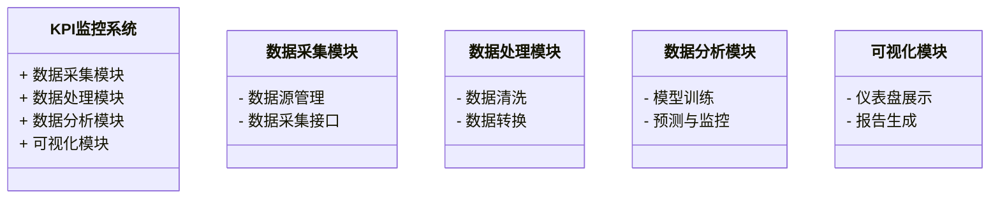
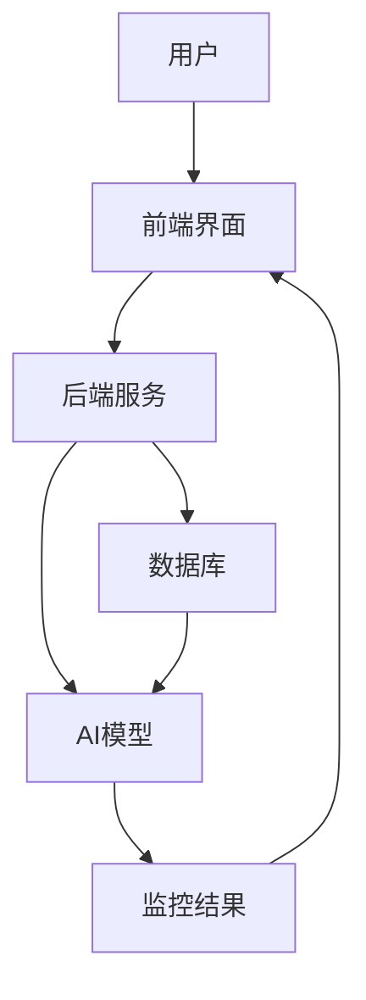
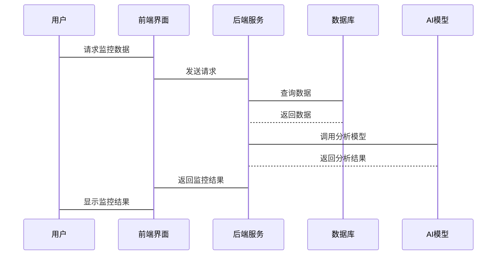

                 


```markdown
# AI辅助企业战略执行：KPI监控与调整

> 关键词：AI，KPI监控，战略执行，企业绩效，数据分析

> 摘要：随着企业竞争的加剧，如何高效监控和调整KPI成为企业战略执行的关键。本文深入探讨AI在KPI监控与调整中的应用，结合实际案例，详细分析算法原理、系统设计和项目实现，为企业提供实用的解决方案。

---

## 第一部分: AI与企业战略执行的背景

### 第1章: AI与企业战略执行概述

#### 1.1 企业战略执行的重要性

##### 1.1.1 企业战略执行的定义
企业战略执行是指将企业战略目标转化为具体行动的过程，确保战略目标的实现。它涉及资源分配、团队协作和绩效评估等多个方面。

##### 1.1.2 战略执行在企业管理中的作用
- 战略执行是企业实现目标的核心环节。
- 良好的战略执行能够提高企业的竞争力。
- 战略执行不善可能导致资源浪费和目标偏离。

##### 1.1.3 AI在企业战略执行中的潜力
- AI能够提高战略执行的效率和准确性。
- 通过数据分析，AI可以帮助企业做出更明智的决策。
- AI可以实时监控战略执行的进度，及时调整策略。

#### 1.2 KPI监控与调整的核心概念

##### 1.2.1 KPI的定义与分类
KPI（关键绩效指标）是衡量企业战略执行效果的重要指标。KPI可以分为财务类、客户类、内部流程类和创新与学习类。

##### 1.2.2 KPI在企业战略执行中的地位
KPI是企业战略执行的量化表现，是评估战略执行效果的重要工具。

##### 1.2.3 KPI监控与调整的挑战
- 数据的多样性和复杂性
- 监控系统的实时性和准确性
- 调整策略的及时性和有效性

#### 1.3 AI辅助KPI监控的优势

##### 1.3.1 AI在数据处理中的优势
- 处理海量数据的能力
- 自动化数据清洗和预处理
- 高效的数据分析能力

##### 1.3.2 AI在预测与优化中的作用
- 通过机器学习算法预测KPI的趋势
- 利用优化算法调整KPI目标
- 提供数据驱动的决策支持

##### 1.3.3 AI在实时监控中的应用
- 实时数据分析和反馈
- 自动化警报和通知
- 动态调整监控策略

#### 1.4 本章小结

##### 1.4.1 核心概念回顾
- 企业战略执行的重要性
- KPI监控与调整的核心概念
- AI在KPI监控中的优势

##### 1.4.2 未来发展趋势
- AI技术的不断进步将推动KPI监控的智能化
- 数据分析的深度和广度将不断提升
- KPI监控与调整将更加实时化和个性化

---

## 第二部分: KPI监控与调整的理论基础

### 第2章: KPI监控的理论框架

#### 2.1 KPI监控的定义与分类

##### 2.1.1 KPI监控的定义
KPI监控是指通过收集和分析数据，评估企业绩效指标的实现情况，并根据分析结果进行调整的过程。

##### 2.1.2 KPI监控的分类
- **财务类KPI**：如净利润率、投资回报率等。
- **客户类KPI**：如客户满意度、客户保留率等。
- **内部流程类KPI**：如生产效率、订单处理时间等。
- **创新与学习类KPI**：如研发投入、员工培训率等。

##### 2.1.3 各类KPI监控的特点
- **财务类KPI**：数据易于获取，但可能缺乏灵活性。
- **客户类KPI**：能够反映客户满意度，但数据收集成本较高。
- **内部流程类KPI**：有助于优化内部流程，但可能难以直接反映外部绩效。
- **创新与学习类KPI**：能够反映企业的创新能力，但数据难以量化。

#### 2.2 KPI监控的数学模型

##### 2.2.1 KPI监控的基本模型
基本模型包括数据收集、数据分析和结果反馈三个阶段。

##### 2.2.2 基于AI的KPI监控模型
- **数据预处理**：清洗数据，处理缺失值和异常值。
- **特征提取**：通过PCA等方法提取关键特征。
- **模型训练**：使用机器学习算法（如随机森林、神经网络）训练模型。
- **预测与监控**：根据模型预测KPI的趋势，并实时监控实际数据。

##### 2.2.3 模型的优缺点分析
- **优点**：能够处理海量数据，提高预测准确性。
- **缺点**：模型的复杂性可能导致解释性差，且需要大量的数据支持。

#### 2.3 KPI监控的数据采集与预处理

##### 2.3.1 数据采集方法
- **数据库查询**：从企业数据库中提取数据。
- **API接口**：通过API获取实时数据。
- **文件导入**：从CSV、Excel等文件中导入数据。

##### 2.3.2 数据预处理步骤
- **清洗数据**：处理缺失值、重复值和异常值。
- **数据转换**：将数据转换为适合分析的格式。
- **数据标准化**：对数据进行标准化处理，确保不同数据源的可比性。

##### 2.3.3 数据清洗与标准化
- **数据清洗**：删除或填充缺失值，处理异常值。
- **数据标准化**：将数据缩放到统一的范围内，通常使用标准化或归一化方法。

#### 2.4 KPI监控的可视化

##### 2.4.1 数据可视化工具
- **Tableau**：强大的数据可视化工具，适合生成各种图表。
- **Power BI**：微软的商业智能工具，支持数据可视化和分析。
- **Matplotlib**：Python的可视化库，适合编程人员使用。

##### 2.4.2 KPI监控的可视化方法
- **趋势图**：显示KPI随时间的变化趋势。
- **柱状图**：比较不同时间段或不同部门的KPI表现。
- **仪表盘**：综合展示多个KPI的实时数据。

##### 2.4.3 可视化在战略执行中的作用
- **实时监控**：通过可视化工具实时查看KPI的动态。
- **趋势分析**：通过历史数据发现KPI的变化趋势。
- **决策支持**：可视化数据为企业战略调整提供依据。

#### 2.5 本章小结

##### 2.5.1 理论框架总结
- KPI监控的定义与分类
- KPI监控的数学模型
- 数据采集与预处理方法
- 数据可视化工具与方法

##### 2.5.2 数据处理的关键点
- 数据清洗与预处理的重要性
- 数据可视化在战略执行中的作用

---

## 第三部分: AI算法在KPI监控中的应用

### 第3章: 常见AI算法与KPI监控

#### 3.1 回归分析在KPI预测中的应用

##### 3.1.1 线性回归模型
- **简单线性回归**：$y = \beta_0 + \beta_1x + \epsilon$
- **多元线性回归**：$y = \beta_0 + \beta_1x_1 + \beta_2x_2 + \dots + \beta_nx_n + \epsilon$

##### 3.1.2 逻辑回归模型
- **逻辑回归公式**：$P(y=1|x) = \frac{e^{\beta_0 + \beta_1x}}{1 + e^{\beta_0 + \beta_1x}}$

##### 3.1.3 回归分析的数学公式
$$y = \beta_0 + \beta_1x + \epsilon$$

##### 3.1.4 回归分析在KPI预测中的应用
- **预测销售额**：通过历史销售数据预测未来销售额。
- **预测客户满意度**：通过客户反馈数据预测客户满意度。

#### 3.2 聚类分析在KPI监控中的应用

##### 3.2.1 K-means聚类算法
- **K-means算法步骤**：
  1. 随机选择K个初始质心。
  2. 计算每个数据点到质心的距离，将数据点分配到最近的质心所在簇。
  3. 重新计算每个簇的质心。
  4. 重复步骤2和3，直到质心不再变化。

##### 3.2.2 层次聚类算法
- **层次聚类步骤**：
  1. 将每个数据点视为一个簇。
  2. 计算两个簇之间的距离，合并距离最近的两个簇。
  3. 重复步骤2，直到所有数据点合并成一个簇。

##### 3.2.3 聚类分析的流程图


##### 3.2.4 聚类分析在KPI监控中的应用
- **客户分群**：根据客户行为数据将客户分成不同的群体，制定针对性的营销策略。
- **产品分类**：根据产品性能数据将产品分成不同的类别，优化库存管理。

#### 3.3 强化学习在KPI调整中的应用

##### 3.3.1 强化学习的基本概念
- **强化学习**：通过智能体与环境的交互，学习最优策略，以最大化累积奖励。

##### 3.3.2 强化学习在KPI调整中的应用
- **动态调整KPI目标**：根据实时数据调整KPI目标，确保战略执行的灵活性。
- **优化资源分配**：通过强化学习算法优化资源分配，提高KPI的实现效率。

##### 3.3.3 强化学习的数学公式
$$Q(s, a) = Q(s, a) + \alpha [r + \max_{a'} Q(s', a') - Q(s, a)]$$

#### 3.4 其他AI算法的应用

##### 3.4.1 支持向量机（SVM）
- **SVM用于分类**：将数据点分为两类，用于分类KPI的实现情况。
- **SVM用于回归**：通过支持向量回归模型预测KPI的趋势。

##### 3.4.2 神经网络
- **神经网络用于KPI预测**：通过多层感知机（MLP）模型预测KPI的未来趋势。
- **卷积神经网络（CNN）**：用于图像数据的KPI分析，如产品质量监控。

#### 3.5 本章小结

##### 3.5.1 常见AI算法的应用
- 回归分析：预测KPI的趋势
- 聚类分析：发现KPI的潜在模式
- 强化学习：动态调整KPI目标

##### 3.5.2 算法选择的关键点
- 数据类型与算法匹配
- 模型的复杂性与数据量的匹配
- 业务需求与算法目标的匹配

---

## 第四部分: 系统设计与实现

### 第4章: 系统设计与架构方案

#### 4.1 问题场景介绍

##### 4.1.1 项目背景
- 某企业希望利用AI技术监控和调整KPI，提升战略执行效率。

##### 4.1.2 项目目标
- 实现KPI的实时监控
- 提供数据驱动的决策支持
- 动态调整KPI目标

#### 4.2 系统功能设计

##### 4.2.1 领域模型设计


##### 4.2.2 系统架构设计


##### 4.2.3 系统接口设计
- **前端接口**：提供用户交互界面，展示KPI监控结果。
- **后端接口**：处理用户请求，调用AI模型进行分析。
- **数据库接口**：存储和管理数据，支持数据查询和更新。

#### 4.3 系统交互设计

##### 4.3.1 系统交互流程图


#### 4.4 本章小结

##### 4.4.1 系统设计的关键点
- 系统架构的合理性
- 功能模块的划分
- 系统接口的设计

##### 4.4.2 系统实现的优势
- 高效的数据处理能力
- 强大的数据分析能力
- 用户友好的可视化界面

---

## 第五部分: 项目实战

### 第5章: 项目实战与案例分析

#### 5.1 项目环境安装

##### 5.1.1 环境要求
- 操作系统：Windows/Mac/Linux
- Python版本：3.6+
- 必要的Python库：numpy, pandas, scikit-learn, matplotlib, seaborn

##### 5.1.2 安装步骤
```bash
pip install numpy pandas scikit-learn matplotlib seaborn
```

#### 5.2 系统核心实现源代码

##### 5.2.1 数据预处理代码
```python
import pandas as pd
import numpy as np

# 读取数据
data = pd.read_csv('kpi_data.csv')

# 处理缺失值
data = data.dropna()

# 处理异常值
z_scores = (data - data.mean()).std()
data = data[(z_scores < 3).all(axis=1)]
```

##### 5.2.2 模型训练代码
```python
from sklearn.model import LinearRegression
from sklearn.metrics import mean_squared_error

# 训练线性回归模型
model = LinearRegression()
model.fit(X_train, y_train)

# 预测结果
y_pred = model.predict(X_test)

# 计算均方误差
mse = mean_squared_error(y_test, y_pred)
print('均方误差:', mse)
```

##### 5.2.3 可视化代码
```python
import matplotlib.pyplot as plt
import seaborn as sns

# 绘制趋势图
plt.figure(figsize=(10,6))
sns.lineplot(x='时间', y='KPI值', data=data)
plt.title('KPI趋势图')
plt.show()
```

#### 5.3 代码应用解读与分析

##### 5.3.1 数据预处理代码解读
- **数据读取**：从CSV文件中读取KPI数据。
- **缺失值处理**：删除包含缺失值的行。
- **异常值处理**：使用Z-score方法检测并删除异常值。

##### 5.3.2 模型训练代码解读
- **数据分割**：将数据分为训练集和测试集。
- **模型训练**：使用线性回归模型训练数据。
- **模型预测**：使用训练好的模型预测测试数据。
- **模型评估**：计算均方误差，评估模型的预测精度。

##### 5.3.3 可视化代码解读
- **趋势图绘制**：使用Seaborn库绘制KPI随时间的变化趋势。
- **图表展示**：通过Matplotlib展示图表，直观反映KPI的变化情况。

#### 5.4 案例分析与详细讲解

##### 5.4.1 案例背景
某企业希望通过AI技术监控和调整KPI，以提高战略执行效率。

##### 5.4.2 数据准备
- 数据来源：企业内部数据库
- 数据清洗：处理缺失值和异常值
- 数据转换：将数据转换为适合模型训练的格式

##### 5.4.3 模型训练
- 选择线性回归模型
- 训练模型，评估模型性能
- 根据评估结果调整模型参数

##### 5.4.4 实施结果
- 成功预测KPI的趋势
- 实现KPI的实时监控
- 动态调整KPI目标，提高战略执行效率

#### 5.5 本章小结

##### 5.5.1 项目实施的关键点
- 数据预处理的重要性
- 模型选择与调优
- 可视化结果的展示

##### 5.5.2 案例分析的启示
- AI技术在KPI监控中的巨大潜力
- 数据质量对模型性能的影响
- 可视化在结果展示中的作用

---

## 第六部分: 最佳实践与小结

### 第6章: 最佳实践与总结

#### 6.1 最佳实践

##### 6.1.1 数据处理
- 确保数据的完整性和准确性
- 选择合适的预处理方法
- 定期更新和维护数据

##### 6.1.2 模型选择
- 根据业务需求选择合适的算法
- 通过交叉验证评估模型性能
- 定期重新训练模型，确保模型的有效性

##### 6.1.3 可视化
- 使用直观的图表展示数据
- 定期更新可视化结果
- 根据用户需求定制可视化界面

#### 6.2 小结

##### 6.2.1 核心要点回顾
- AI在KPI监控与调整中的应用
- 数据处理、模型训练和结果可视化的实现
- 项目实战中的经验与教训

##### 6.2.2 未来趋势
- AI技术的不断进步将推动KPI监控的智能化
- 数据分析的深度和广度将不断提升
- KPI监控与调整将更加实时化和个性化

#### 6.3 注意事项

##### 6.3.1 数据隐私与安全
- 确保数据的安全性，防止数据泄露
- 遵守相关法律法规，保护用户隐私

##### 6.3.2 模型解释性
- 提高模型的解释性，便于业务人员理解
- 使用可解释性模型，如线性回归、决策树等

##### 6.3.3 系统维护
- 定期更新系统，确保系统的稳定性
- 及时修复系统漏洞，防止系统崩溃

#### 6.4 拓展阅读

##### 6.4.1 推荐书籍
- 《机器学习实战》
- 《深度学习》
- 《数据分析与数据挖掘实用技术》

##### 6.4.2 推荐在线资源
- [Kaggle](https://www.kaggle.com/)
- [Coursera](https://www.coursera.org/)
- [Udemy](https://www.udemy.com/)

---

## 结语

通过本文的详细讲解，我们深入探讨了AI在企业战略执行中的应用，特别是KPI监控与调整的实现。从理论基础到实际案例，我们展示了如何利用AI技术提升企业的绩效管理能力。未来，随着AI技术的不断发展，KPI监控与调整将更加智能化和精准化，为企业战略执行提供更有力的支持。
```

