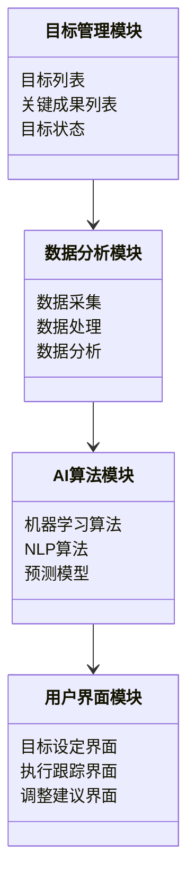
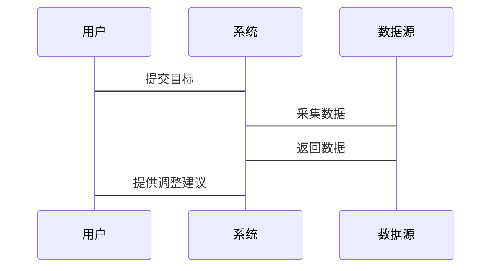

                 


# AI辅助企业战略执行：OKR自动化跟踪与动态调整

## 关键词：AI，OKR，企业战略，目标管理，动态调整，自动化跟踪，机器学习

## 摘要：  
在当今快速变化的商业环境中，企业战略执行的效率和准确性变得尤为重要。OKR（目标与关键成果）作为一种高效的目标管理方法，结合人工智能技术，能够实现自动化跟踪与动态调整，从而提升企业战略执行的效果。本文将深入探讨AI在OKR管理中的应用，分析其技术实现、系统架构以及实际案例，为企业提供一种创新的目标管理解决方案。

---

## 第一部分: AI辅助企业战略执行的背景与概念

### 第1章: OKR与AI的结合概述

#### 1.1 企业战略执行的挑战
- **1.1.1 传统企业战略执行的痛点**  
  传统的企业战略执行往往依赖于人工制定和跟踪目标，这种方式存在效率低、灵活性差、数据支持不足等问题。尤其是在复杂多变的市场环境中，静态的目标管理难以适应快速变化的需求。

- **1.1.2 OKR的定义与核心要素**  
  OKR（Objective and Key Results）是一种目标设定方法，由目标（Objective）和关键成果（Key Results）组成。目标是定性的、高层次的，而关键成果是定量的、可衡量的成果。OKR的特点包括简洁性、聚焦性和可衡量性。

- **1.1.3 AI在企业战略执行中的作用**  
  AI技术能够通过数据驱动的方式，帮助企业在目标制定、跟踪和调整过程中实现自动化和智能化，从而提高战略执行的效率和效果。

#### 1.2 AI辅助OKR的核心价值
- **1.2.1 提高目标执行效率**  
  AI可以通过自动化跟踪和数据分析，快速识别目标执行中的问题，并提供改进建议，从而提高目标执行的效率。

- **1.2.2 实现目标的动态调整**  
  AI能够根据实时数据和市场变化，动态调整OKR，使其更好地适应企业战略的变化。

- **1.2.3 数据驱动的决策支持**  
  AI通过分析大量数据，为企业提供数据支持的决策依据，帮助企业在目标管理中做出更明智的决策。

#### 1.3 本书的目标与结构
- **1.3.1 本书的核心目标**  
  本书旨在探讨AI在OKR管理中的应用，分析其技术实现和系统架构，并通过实际案例展示其在企业战略执行中的价值。

- **1.3.2 本书的章节安排**  
  本书分为五大部分：背景介绍、技术实现、系统架构、项目实战和最佳实践。

- **1.3.3 读者对象与预期收获**  
  本书适合企业管理人员、技术团队以及对OKR和AI感兴趣的读者。通过阅读本书，读者可以掌握AI辅助OKR管理的核心技术，并能够将其应用于实际的企业战略执行中。

---

## 第二部分: AI辅助OKR的技术实现

### 第2章: OKR的定义与实施框架

#### 2.1 OKR的基本概念
- **2.1.1 目标（Objective）的定义与特点**  
  目标是高层次的、定性的，通常以“实现什么”为目标。例如，目标可以是“提高客户满意度”。

- **2.1.2 关键成果（Key Results）的定义与分类**  
  关键成果是可衡量的、具体的成果，通常以百分比或数量的形式表示。例如，关键成果可以是“客户满意度达到90%”。

- **2.1.3 OKR与KPI的区别与联系**  
  OKR更注重目标的设定和实现，而KPI更注重绩效的评估。OKR可以作为KPI的一种补充，帮助企业在战略层面进行目标管理。

#### 2.2 OKR的实施框架
- **2.2.1 OKR的制定流程**  
  包括目标设定、关键成果定义、目标分解和责任分配等步骤。

- **2.2.2 OKR的执行与跟踪**  
  通过定期会议和数据分析，跟踪目标的执行情况，并根据实际情况进行调整。

- **2.2.3 OKR的评估与优化**  
  对目标的实现情况进行评估，并根据评估结果优化目标设定和执行策略。

#### 2.3 企业战略与OKR的关系
- **2.3.1 OKR作为企业战略的执行工具**  
  OKR是企业战略执行的重要工具，能够帮助企业在复杂环境中高效实现战略目标。

- **2.3.2 OKR与企业愿景的协同**  
  OKR需要与企业愿景和长期目标保持一致，确保战略执行的连贯性和一致性。

- **2.3.3 OKR在不同层级的应用**  
  OKR不仅适用于企业层面，还可以应用于部门、团队和个人目标的管理。

### 第3章: AI在企业战略执行中的应用

#### 3.1 AI技术的基本概念
- **3.1.1 人工智能的核心技术**  
  包括机器学习、深度学习、自然语言处理（NLP）、计算机视觉等。

- **3.1.2 机器学习与深度学习的区别**  
  机器学习是一种通过数据训练模型的技术，深度学习是机器学习的一种特殊形式，通常用于处理非结构化数据。

- **3.1.3 自然语言处理（NLP）的应用**  
  NLP可以用于文本分析、情感分析、信息提取等任务。

#### 3.2 AI在OKR跟踪中的应用场景
- **3.2.1 自动化目标分解**  
  AI可以根据企业的战略目标，自动分解成可执行的关键成果。

- **3.2.2 数据驱动的目标调整**  
  AI可以通过数据分析，识别目标执行中的问题，并提出调整建议。

- **3.2.3 预测与风险评估**  
  AI可以基于历史数据和市场趋势，预测目标实现的可能性，并评估潜在风险。

#### 3.3 AI辅助OKR的优势
- **3.3.1 提高执行效率**  
  AI可以通过自动化工具，减少人工干预，提高目标执行的效率。

- **3.3.2 实现动态调整**  
  AI可以根据实时数据，动态调整目标，确保目标与企业战略保持一致。

- **3.3.3 数据驱动的决策支持**  
  AI可以通过数据分析，提供数据支持的决策依据，帮助企业在目标管理中做出更明智的决策。

---

## 第三部分: AI辅助OKR的技术实现

### 第4章: OKR自动化跟踪的算法原理

#### 4.1 基于机器学习的目标跟踪算法
- **4.1.1 算法原理概述**  
  通过机器学习模型，对目标执行过程中的数据进行分析，预测目标的实现情况。

- **4.1.2 算法实现步骤**  
  包括数据收集、特征提取、模型训练和预测等步骤。

- **4.1.3 算法的优缺点分析**  
  优点是高效、准确，缺点是需要大量的数据支持，并且模型的更新和维护需要一定的技术门槛。

#### 4.2 基于NLP的目标分解算法
- **4.2.1 NLP在目标分解中的应用**  
  通过自然语言处理技术，将高层次的目标分解成具体的、可执行的关键成果。

- **4.2.2 算法实现流程**  
  包括文本预处理、关键词提取、句法分析等步骤。

- **4.2.3 算法的性能评估**  
  通过准确率、召回率等指标，评估算法的性能。

#### 4.3 基于预测模型的目标调整算法
- **4.3.1 预测模型的构建**  
  通过历史数据，构建预测模型，预测目标的实现情况。

- **4.3.2 目标调整的实现**  
  根据预测结果，调整目标，并生成调整建议。

- **4.3.3 算法的适用场景**  
  适用于目标执行过程中数据充足、变化相对稳定的场景。

---

## 第四部分: 系统分析与架构设计方案

### 第5章: AI辅助OKR系统的架构设计

#### 5.1 问题场景介绍
- **5.1.1 企业的目标管理需求**  
  企业需要高效、动态的目标管理工具，以应对快速变化的市场环境。

- **5.1.2 传统OKR管理的局限性**  
  传统OKR管理依赖人工操作，效率低、灵活性差。

#### 5.2 项目介绍
- **5.2.1 项目目标**  
  构建一个基于AI的OKR管理系统，实现目标的自动化跟踪与动态调整。

- **5.2.2 项目范围**  
  包括目标设定、执行跟踪、数据分析和目标调整等功能。

#### 5.3 系统功能设计
- **5.3.1 领域模型设计**  
  使用Mermaid绘制领域模型类图，展示系统的主要实体和它们之间的关系。



- **5.3.2 系统架构设计**  
  使用Mermaid绘制系统架构图，展示系统的整体架构和模块之间的关系。

```mermaid
container 系统架构 {
    数据库
    接口服务
    Web界面
}
    数据库 --> 接口服务
    接口服务 --> Web界面
```

- **5.3.3 系统接口设计**  
  使用Mermaid绘制系统接口设计图，展示系统的主要接口及其交互方式。



- **5.3.4 系统交互设计**  
  使用Mermaid绘制系统交互序列图，展示用户与系统之间的交互流程。

---

## 第五部分: 项目实战

### 第6章: AI辅助OKR系统的实现

#### 6.1 环境安装
- **6.1.1 系统环境要求**  
  需要安装Python、TensorFlow、Scikit-learn等工具。

- **6.1.2 数据库安装**  
  使用MySQL或MongoDB等数据库存储目标数据。

#### 6.2 系统核心实现
- **6.2.1 目标设定模块**  
  提供用户界面，让用户输入目标和关键成果。

- **6.2.2 数据采集模块**  
  从企业系统中采集目标执行的相关数据。

- **6.2.3 数据分析模块**  
  使用机器学习算法，分析数据并生成目标调整建议。

- **6.2.4 用户界面模块**  
  提供直观的界面，展示目标执行情况和调整建议。

#### 6.3 代码实现与解读
- **6.3.1 代码示例**  
  使用Python代码实现目标跟踪算法。

```python
import numpy as np
from sklearn.linear_model import LinearRegression

# 数据准备
X = np.array([1, 2, 3, 4, 5]).reshape(-1, 1)
y = np.array([2, 4, 5, 4, 6])

# 模型训练
model = LinearRegression()
model.fit(X, y)

# 预测
new_X = np.array([6]).reshape(-1, 1)
print(model.predict(new_X))  # 输出预测结果
```

- **6.3.2 代码解读**  
  以上代码展示了如何使用机器学习算法进行目标跟踪。首先，数据被准备并输入模型，然后模型进行训练，最后进行预测。

#### 6.4 实际案例分析
- **6.4.1 案例背景**  
  某企业希望提高客户满意度，设定目标为“客户满意度达到90%”。

- **6.4.2 数据分析与调整**  
  系统通过数据分析，发现当前客户满意度为85%，并预测未来3个月内可以提升至90%。如果预测结果不达预期，系统会自动调整关键成果。

#### 6.5 项目小结
- **6.5.1 项目成果**  
  成功实现了一个基于AI的OKR管理系统，能够自动化跟踪目标并动态调整关键成果。

- **6.5.2 项目经验**  
  在项目实施过程中，需要注意数据质量和模型的可解释性，确保系统的稳定性和可靠性。

---

## 第六部分: 最佳实践与小结

### 第7章: 最佳实践与总结

#### 7.1 最佳实践
- **7.1.1 数据质量管理**  
  确保数据的准确性和完整性，是AI辅助OKR系统成功的关键。

- **7.1.2 模型的可解释性**  
  在选择模型时，需要考虑模型的可解释性，以便更好地理解预测结果。

- **7.1.3 系统的可扩展性**  
  设计系统的可扩展性，以便在未来业务需求变化时，能够轻松扩展功能。

#### 7.2 小结
- **7.2.1 AI辅助OKR的核心价值**  
  AI技术能够提高目标管理的效率和准确性，实现动态调整，为企业战略执行提供有力支持。

- **7.2.2 未来的发展方向**  
  随着AI技术的不断进步，未来的OKR管理系统将更加智能化和个性化，能够更好地适应企业的多样化需求。

---

## 参考文献
- 书籍和论文参考文献
- 网站和工具参考文献
- 其他参考资料

---

通过以上内容，我们全面探讨了AI辅助企业战略执行的核心技术与实现方案，为企业提供了基于OKR的自动化目标管理解决方案。希望本文能够为读者提供有价值的参考，帮助企业在复杂多变的商业环境中实现高效的战略执行。

