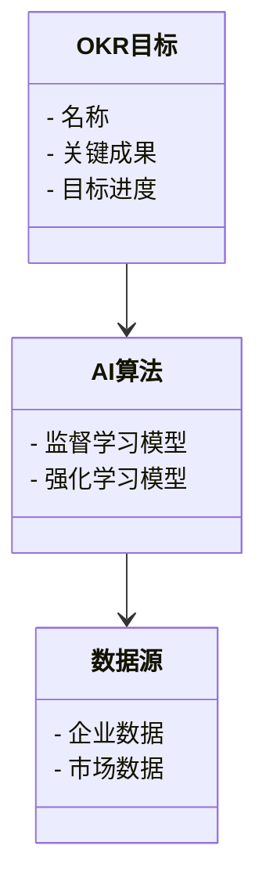
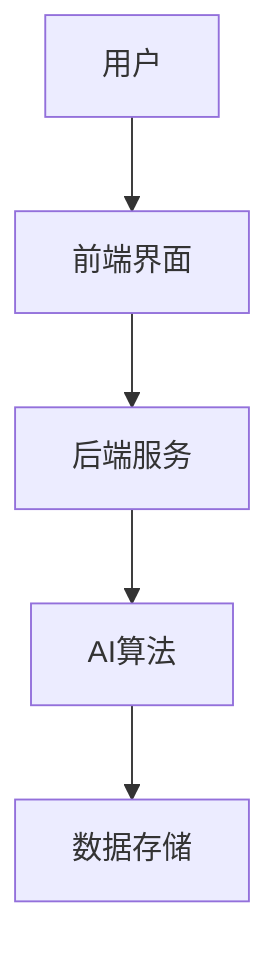
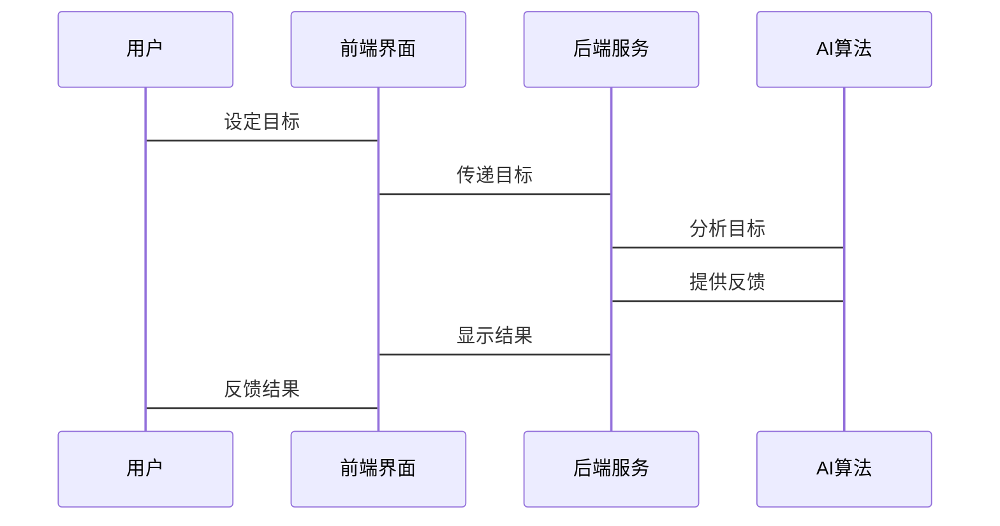

                 


# AI辅助企业战略执行：OKR自动化跟踪与动态调整系统

> 关键词：AI辅助、企业战略执行、OKR、动态调整、自动化跟踪

> 摘要：本文探讨了如何利用人工智能技术辅助企业战略执行，特别是在OKR（目标与关键成果）管理中的应用。文章详细分析了OKR的核心概念、AI在OKR管理中的应用、基于机器学习和自然语言处理的算法实现，以及系统架构设计和项目实战案例。通过本文，读者将深入了解如何利用AI技术实现OKR的自动化跟踪与动态调整，从而提升企业战略执行的效率和效果。

---

# 第1章: 企业战略执行的背景与挑战

## 1.1 企业战略执行的现状与问题

企业战略执行是企业管理的核心任务之一。然而，传统的战略执行方式存在以下痛点：

- **目标设定缺乏科学性**：传统目标设定往往依赖于主观判断，缺乏数据支持，可能导致目标设定不合理。
- **目标跟踪效率低下**：传统目标跟踪依赖人工记录和分析，效率低下，且容易遗漏关键信息。
- **目标调整不够及时**：在复杂多变的商业环境中，目标可能需要频繁调整，但传统方法难以实现快速响应。

OKR（目标与关键成果）作为一种目标管理方法，以其简洁性和灵活性著称，成为现代企业管理中的重要工具。然而，OKR的实施仍然面临动态调整的挑战，尤其是在复杂的企业环境中，如何实现OKR的自动化跟踪与动态调整成为亟待解决的问题。

## 1.2 AI技术对企业战略执行的赋能

人工智能技术的快速发展为企业战略执行提供了新的可能性。AI可以通过以下方式赋能企业战略执行：

- **数据驱动的目标设定**：AI可以利用企业内外部数据，分析市场趋势和内部资源，帮助制定更科学的目标。
- **实时跟踪与分析**：AI可以实时监控关键成果的实现情况，提供实时反馈和建议。
- **动态调整与优化**：AI可以通过机器学习算法，根据实时数据动态调整目标，确保目标与企业战略保持一致。

AI与OKR的结合，不仅提高了目标管理的效率，还实现了目标的动态优化，为企业在复杂环境中灵活应对提供了有力支持。

## 1.3 本章小结

本章通过分析企业战略执行的现状与挑战，提出了OKR作为一种有效的目标管理方法，并探讨了AI技术在OKR管理中的应用潜力。通过AI技术的赋能，企业可以实现OKR的自动化跟踪与动态调整，从而提升战略执行的效率和效果。

---

# 第2章: OKR与AI的结合

## 2.1 OKR的核心概念与特点

### 2.1.1 OKR的定义与核心要素

OKR（目标与关键成果）是一种目标设定方法，由目标（Objective）和关键成果（Key Results）组成。目标是对结果的期望，而关键成果是实现目标的具体指标。OKR的核心要素包括：

- **目标（Objective）**：清晰、可衡量的目标，通常以动词开头，描述期望的结果。
- **关键成果（Key Results）**：衡量目标实现程度的具体指标，通常是定量的。

### 2.1.2 OKR与KPI的区别与联系

- **区别**：OKR注重目标的设定与跟踪，而KPI（关键绩效指标）注重绩效的评估与考核。OKR更灵活，强调挑战性，而KPI更注重可衡量性。
- **联系**：OKR可以作为KPI的补充，帮助企业在战略层面设定更具挑战性的目标。

### 2.1.3 OKR在企业管理中的优势

- **灵活性**：OKR可以根据企业战略的变化快速调整。
- **透明性**：OKR公开透明，有助于企业内部沟通与协作。
- **激励性**：OKR的挑战性目标可以激发员工的积极性。

## 2.2 AI在OKR管理中的应用

### 2.2.1 AI如何辅助目标设定

AI可以通过分析企业内外部数据，提供目标设定的建议。例如，利用自然语言处理技术分析市场报告，提取关键信息，帮助制定更具前瞻性的目标。

### 2.2.2 AI如何跟踪关键成果

AI可以通过机器学习算法，实时监控关键成果的实现情况。例如，利用时间序列分析预测关键成果的实现进度，及时发现偏差并提出调整建议。

### 2.2.3 AI如何实现动态调整

AI可以通过强化学习算法，根据实时数据动态调整OKR。例如，根据市场变化自动调整目标，确保目标与企业战略保持一致。

## 2.3 OKR与AI结合的必要性

### 2.3.1 提高目标管理的效率

AI可以通过自动化手段，减少人工干预，提高目标管理的效率。

### 2.3.2 实现目标的动态优化

AI可以通过机器学习算法，实时优化目标，确保目标与企业战略保持一致。

### 2.3.3 促进企业文化的变革

AI辅助OKR管理可以促进企业文化的变革，例如增强透明度、鼓励创新和协作。

## 2.4 本章小结

本章详细介绍了OKR的核心概念与特点，并探讨了AI在OKR管理中的应用。通过AI技术，企业可以实现OKR的自动化跟踪与动态调整，从而提高目标管理的效率和效果。

---

# 第3章: AI辅助OKR管理的核心算法与实现

## 3.1 机器学习在OKR管理中的应用

### 3.1.1 机器学习的基本概念

机器学习是一种人工智能技术，通过数据训练模型，使其能够从数据中学习并做出预测或决策。

### 3.1.2 机器学习在目标设定中的应用

利用机器学习算法，可以根据历史数据和市场趋势，预测未来的业务目标，帮助制定更具前瞻性的目标。

### 3.1.3 机器学习在目标跟踪中的应用

利用监督学习算法，可以通过历史数据训练模型，预测目标的实现进度，及时发现偏差。

## 3.2 自然语言处理在OKR管理中的应用

### 3.2.1 NLP的基本概念

自然语言处理（NLP）是一种人工智能技术，用于理解和处理人类语言。

### 3.2.2 NLP在目标理解中的应用

利用NLP技术，可以分析文本数据，提取关键信息，帮助制定更具战略性的目标。

### 3.2.3 NLP在目标调整中的应用

利用NLP技术，可以分析员工反馈和市场趋势，提出目标调整的建议。

## 3.3 基于强化学习的动态调整算法

### 3.3.1 强化学习的基本概念

强化学习是一种机器学习技术，通过智能体与环境的交互，学习最优策略。

### 3.3.2 强化学习在目标优化中的应用

利用强化学习算法，可以根据实时数据动态调整目标，确保目标与企业战略保持一致。

### 3.3.3 动态调整算法的实现流程

1. 初始化目标和关键成果。
2. 实时监控关键成果的实现情况。
3. 根据实时数据，动态调整目标。

## 3.4 算法实现的数学模型

### 3.4.1 监督学习模型

$$ y = \theta x + \beta $$

其中，$y$ 是目标实现进度，$\theta$ 是模型参数，$x$ 是输入数据，$\beta$ 是截距。

### 3.4.2 强化学习模型

$$ Q(s, a) = r + \gamma \max_{a'} Q(s', a') $$

其中，$Q$ 是价值函数，$s$ 是当前状态，$a$ 是动作，$r$ 是奖励，$\gamma$ 是折扣因子，$s'$ 是下一个状态。

---

# 第4章: AI辅助OKR管理的系统架构设计

## 4.1 问题场景介绍

在企业战略执行中，OKR管理需要实现目标的自动化跟踪与动态调整。为此，我们需要设计一个基于AI的OKR管理平台。

## 4.2 系统功能设计

### 4.2.1 领域模型



### 4.2.2 系统架构



### 4.2.3 系统接口设计

- **用户接口**：提供OKR管理的界面，包括目标设定、跟踪和调整。
- **数据接口**：与企业数据源对接，获取必要的数据支持。

### 4.2.4 系统交互



## 4.3 本章小结

本章通过设计一个基于AI的OKR管理平台，详细介绍了系统的功能模块、架构设计和交互流程。通过该平台，企业可以实现OKR的自动化跟踪与动态调整。

---

# 第5章: AI辅助OKR管理的项目实战

## 5.1 环境安装

为了实现AI辅助OKR管理，需要安装以下环境：

- **Python**：3.8及以上版本
- **TensorFlow**：2.0及以上版本
- **自然语言处理库**：如spaCy
- **数据可视化库**：如Matplotlib

## 5.2 系统核心实现源代码

### 5.2.1 监督学习模型实现

```python
import tensorflow as tf
import numpy as np

# 定义模型
model = tf.keras.Sequential([
    tf.keras.layers.Dense(64, activation='relu'),
    tf.keras.layers.Dense(1, activation='sigmoid')
])

# 编译模型
model.compile(optimizer='adam', loss='binary_crossentropy', metrics=['accuracy'])

# 训练模型
model.fit(x_train, y_train, epochs=10, batch_size=32)
```

### 5.2.2 强化学习算法实现

```python
import numpy as np

class AI-Agent:
    def __init__(self, state_space, action_space):
        self.state_space = state_space
        self.action_space = action_space
        self.value_function = np.zeros(state_space)

    def act(self, state):
        # 根据价值函数选择动作
        return np.argmax(self.value_function[state])

    def update(self, state, action, reward):
        # 更新价值函数
        self.value_function[state] = reward + 0.9 * self.value_function[state]
```

## 5.3 实际案例分析

以某互联网企业为例，利用AI辅助OKR管理，实现了目标的动态调整。通过监督学习算法，预测目标的实现进度；通过强化学习算法，动态调整目标，确保目标与企业战略保持一致。

## 5.4 本章小结

本章通过实际案例分析，详细展示了AI辅助OKR管理的实现过程。通过代码实现和案例分析，读者可以深入了解如何将理论应用于实践。

---

# 第6章: AI辅助OKR管理的最佳实践

## 6.1 小结

通过本文的分析，AI辅助OKR管理不仅可以提高目标管理的效率，还可以实现目标的动态优化，为企业在复杂环境中灵活应对提供了有力支持。

## 6.2 注意事项

- **数据质量**：AI算法的效果依赖于数据质量，需要确保数据的准确性和完整性。
- **模型选择**：根据具体场景选择合适的AI算法，避免盲目应用。
- **系统安全**：确保系统的安全性和稳定性，防止数据泄露和系统崩溃。

## 6.3 拓展阅读

- 《机器学习实战》
- 《自然语言处理入门》
- 《OKR：如何使用谷歌方法实现目标》

## 6.4 本章小结

本章总结了AI辅助OKR管理的优势和注意事项，并提供了拓展阅读的方向，帮助读者进一步深入研究。

---

# 第7章: 未来趋势与挑战

## 7.1 未来发展趋势

- **AI算法的优化**：随着算法的优化，AI辅助OKR管理的效果将更加显著。
- **多模态数据的融合**：利用多模态数据，如文本、图像、语音等，实现更加智能化的目标管理。
- **边缘计算的应用**：通过边缘计算，实现目标管理的实时性和高效性。

## 7.2 挑战与应对策略

- **数据隐私问题**：需要制定数据隐私保护政策，确保数据的安全性。
- **模型的可解释性**：需要提高模型的可解释性，确保决策的透明性。
- **技术与业务的结合**：需要加强技术与业务的结合，确保AI技术的有效应用。

## 7.3 本章小结

本章分析了AI辅助OKR管理的未来发展趋势和面临的挑战，并提出了应对策略，为读者提供了未来研究和实践的方向。

---

# 附录

## 附录A: 常用工具与库

- **Python**：编程语言
- **TensorFlow**：深度学习框架
- **spaCy**：自然语言处理库
- **Matplotlib**：数据可视化库

## 附录B: 参考文献

- 《机器学习实战》
- 《自然语言处理入门》
- 《OKR：如何使用谷歌方法实现目标》

---

通过本文的详细分析，读者可以全面了解AI辅助企业战略执行的实现方法和应用前景。希望本文能够为企业的OKR管理提供有价值的参考和启发。

