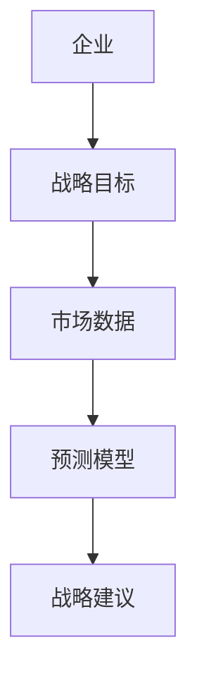
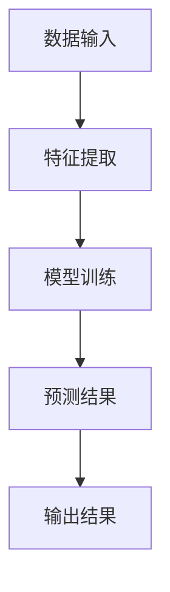

                 


# AI辅助企业战略规划：大数据分析与预测模型

## 关键词：
- AI辅助企业战略规划
- 大数据分析
- 预测模型
- 机器学习
- 企业决策优化

## 摘要：
本文详细探讨了人工智能如何辅助企业战略规划，通过大数据分析和预测模型的应用，为企业提供数据驱动的决策支持。文章从背景介绍、核心概念、算法原理、系统架构、项目实战到最佳实践，全面解析AI在企业战略规划中的应用，帮助企业提升战略决策的科学性和准确性。

---

## 第一部分：背景介绍

### 第1章：AI辅助企业战略规划的背景

#### 1.1 问题背景
企业战略规划是企业在复杂多变的市场环境中制定长期发展目标和策略的过程。传统方法依赖于经验判断和市场调研，存在数据量不足、分析深度有限、预测准确性低等问题。在大数据时代，企业面临海量数据，如何高效利用这些数据成为关键。

#### 1.2 问题描述
企业在制定战略规划时，常常面临以下挑战：
- 数据来源分散，难以整合。
- 数据量大，分析复杂度高。
- 市场变化快，预测模型需要动态调整。

#### 1.3 问题解决
AI技术的引入为企业提供了新的解决方案。通过大数据分析和预测模型，企业可以更高效地处理数据，提取有价值的信息，构建精准的预测模型，辅助战略决策。

#### 1.4 边界与外延
AI辅助企业战略规划的应用范围包括市场预测、风险评估、资源优化等领域。与其他管理方法的区别在于，AI依赖数据驱动，而非传统的经验判断。

#### 1.5 核心要素组成
- 数据来源与处理
- 模型构建与优化
- 结果分析与应用

---

## 第二部分：核心概念与联系

### 第2章：核心概念与联系

#### 2.1 核心概念原理
AI技术通过机器学习算法处理大数据，构建预测模型，辅助企业制定战略规划。大数据分析包括数据清洗、特征提取和数据建模，预测模型则基于这些数据进行预测和优化。

#### 2.2 概念属性特征对比表格
| 概念       | 数据驱动 | 自动化 | 可扩展性 |
|------------|----------|--------|----------|
| AI技术     | 高       | 高     | 高       |
| 大数据分析 | 高       | 中     | 中       |
| 预测模型   | 中       | 高     | 中       |

#### 2.3 ER实体关系图


---

## 第三部分：算法原理讲解

### 第3章：算法原理与实现

#### 3.1 算法原理
常用的算法包括线性回归、决策树和随机森林。

**线性回归公式：**
$$y = \beta_0 + \beta_1x + \epsilon$$

**决策树**：通过特征分裂构建树状结构，用于分类和回归。

**随机森林**：通过集成多个决策树提高模型鲁棒性。

#### 3.2 Mermaid流程图


#### 3.3 Python代码示例
```python
import pandas as pd
from sklearn.model_selection import train_test_split
from sklearn.linear_model import LinearRegression
from sklearn.tree import DecisionTreeRegressor
from sklearn.ensemble import RandomForestRegressor

# 加载数据
data = pd.read_csv('data.csv')
X = data[['feature1', 'feature2']]
y = data['target']

# 数据分割
X_train, X_test, y_train, y_test = train_test_split(X, y, test_size=0.2, random_state=42)

# 线性回归模型
lr_model = LinearRegression()
lr_model.fit(X_train, y_train)
print("Linear Regression R²:", lr_model.score(X_test, y_test))

# 决策树模型
dt_model = DecisionTreeRegressor()
dt_model.fit(X_train, y_train)
print("Decision Tree R²:", dt_model.score(X_test, y_test))

# 随机森林模型
rf_model = RandomForestRegressor()
rf_model.fit(X_train, y_train)
print("Random Forest R²:", rf_model.score(X_test, y_test))
```

---

## 第四部分：系统分析与架构设计

### 第4章：系统分析与架构设计

#### 4.1 系统功能设计
- 数据采集模块：收集市场数据。
- 数据处理模块：清洗和特征提取。
- 模型构建模块：训练预测模型。
- 结果分析模块：输出战略建议。

#### 4.2 系统架构设计
```mermaid
graph LR
    Client[客户端] --> API Gateway[网关]
    API Gateway --> Service1[数据处理]
    Service1 --> Service2[模型训练]
    Service2 --> Service3[结果分析]
    Service3 --> Database[数据库]
```

---

## 第五部分：项目实战

### 第5章：项目实战

#### 5.1 环境安装
- 安装Python和相关库：
  ```bash
  pip install numpy pandas scikit-learn
  ```

#### 5.2 核心代码实现
```python
import pandas as pd
from sklearn.ensemble import RandomForestRegressor
from sklearn.metrics import mean_squared_error

# 加载数据
data = pd.read_csv('data.csv')

# 特征工程
# 假设我们有一些特征，如销售额、广告投入等
features = data[['sales', 'advertising']]
target = data['revenue']

# 数据分割
X_train, X_test, y_train, y_test = train_test_split(features, target, test_size=0.2, random_state=42)

# 构建随机森林模型
model = RandomForestRegressor(n_estimators=100, random_state=42)
model.fit(X_train, y_train)

# 预测
y_pred = model.predict(X_test)

# 评估
print('均方误差:', mean_squared_error(y_test, y_pred))
print('R²:', model.score(X_test, y_test))
```

#### 5.3 案例分析
通过分析某零售企业的销售数据，构建预测模型，帮助企业预测未来销售额，优化库存管理和营销策略。

---

## 第六部分：最佳实践和小结

### 第6章：最佳实践和小结

#### 6.1 小结
AI辅助企业战略规划通过大数据分析和预测模型，显著提升了决策的科学性和准确性。企业应结合自身特点，选择合适的算法和模型，确保数据质量和模型优化。

#### 6.2 注意事项
- 数据质量：确保数据准确性和完整性。
- 模型选择：根据业务需求选择合适的算法。
- 持续优化：定期更新模型，适应市场变化。

#### 6.3 拓展阅读
- 推荐阅读《机器学习实战》和《大数据分析与应用》。

---

以上是《AI辅助企业战略规划：大数据分析与预测模型》的详细目录和内容概述。通过系统介绍AI技术、大数据分析和预测模型的应用，帮助企业提升战略规划的效率和准确性，为企业在大数据时代提供有力支持。

