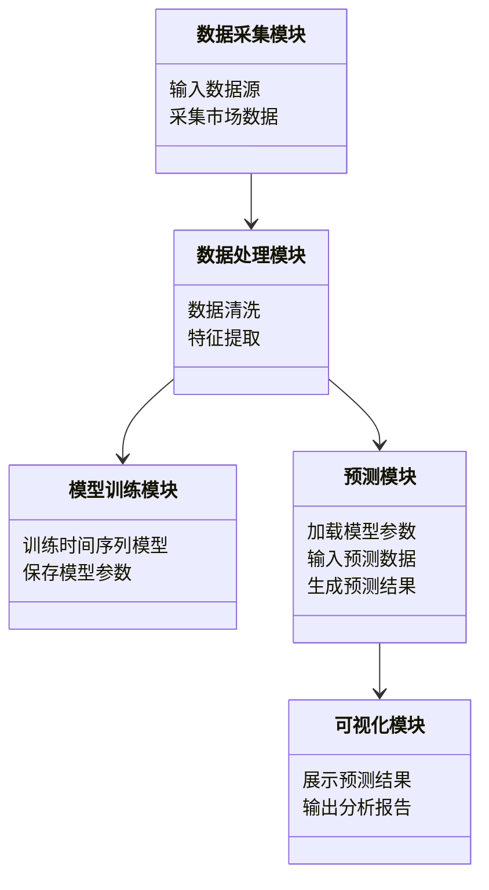
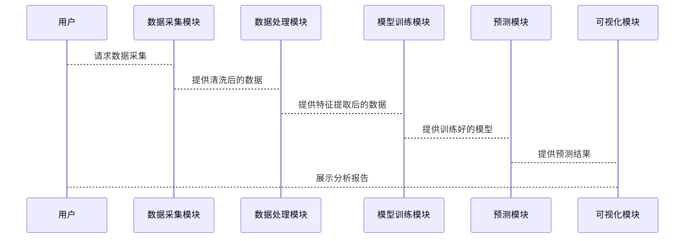

                 


# AI辅助企业战略规划：市场趋势分析与预测

## 关键词：AI技术，企业战略规划，市场趋势分析，预测模型，时间序列分析，机器学习，深度学习

## 摘要：  
本文将探讨如何利用人工智能技术辅助企业进行战略规划，特别是市场趋势分析与预测。通过对市场数据的深度挖掘和分析，AI能够帮助企业识别潜在的市场机会与风险，优化资源配置，制定更具前瞻性的战略决策。本文将从AI辅助市场趋势分析的核心概念、算法原理、系统架构设计，到实际项目实战，全面解析AI如何赋能企业战略规划。

---

## # 第1章: AI辅助企业战略规划的背景与意义

### ## 1.1 企业战略规划的核心要素

#### ### 1.1.1 企业战略规划的定义与目标  
企业战略规划是企业在复杂多变的市场环境中，为实现长期发展目标而制定的一系列战略性的决策和行动计划。它通常包括市场定位、产品开发、资源分配、风险管理等方面的内容。  

#### ### 1.1.2 市场趋势分析在企业战略中的重要性  
市场趋势分析是企业战略规划的基础，它帮助企业识别行业动态、竞争对手行为、消费者需求变化等关键信息，从而制定更具前瞻性的战略。  

#### ### 1.1.3 AI技术对企业战略规划的变革作用  
AI技术通过快速处理海量数据、发现数据中的隐藏模式，为企业提供更精准的市场洞察和预测，从而优化战略规划的效率和效果。

---

### ## 1.2 AI技术在市场趋势分析中的应用背景

#### ### 1.2.1 数据爆炸时代的市场分析挑战  
随着数据量的指数级增长，传统的市场分析方法难以应对数据的复杂性和实时性要求，企业需要更高效的技术手段来处理和分析数据。  

#### ### 1.2.2 传统市场分析方法的局限性  
传统市场分析方法依赖人工经验，存在耗时长、效率低、精度不足等问题，难以满足现代企业的快速决策需求。  

#### ### 1.2.3 AI技术如何解决市场分析难题  
AI技术通过自动化数据处理、机器学习算法和深度学习模型，能够快速识别市场趋势、预测市场走向，为企业提供实时、精准的市场洞察。

---

### ## 1.3 本书的核心目标与内容框架

#### ### 1.3.1 本书的核心目标  
本书旨在通过系统化的理论分析和实践案例，帮助读者理解AI技术在市场趋势分析与预测中的应用，掌握AI辅助企业战略规划的核心方法论。  

#### ### 1.3.2 本书的主要内容框架  
- 第一部分：AI辅助企业战略规划的背景与意义  
- 第二部分：AI辅助市场趋势分析的核心概念与联系  
- 第三部分：AI辅助市场趋势分析的算法原理  
- 第四部分：AI辅助市场趋势分析的系统架构设计  
- 第五部分：AI辅助市场趋势分析的项目实战  
- 第六部分：总结与展望  

#### ### 1.3.3 本书的读者群体与适用场景  
本书适合企业战略管理者、数据科学家、市场分析师以及对AI技术感兴趣的读者阅读，尤其适用于希望将AI技术应用于市场趋势分析的企业。  

---

## # 第2章: AI辅助市场趋势分析的核心概念与联系

### ## 2.1 数据、模型与算法的关系

#### ### 2.1.1 数据的定义与分类  
数据是市场趋势分析的基础，通常包括结构化数据（如销售数据、用户行为数据）和非结构化数据（如文本、图像）。  

#### ### 2.1.2 模型的定义与类型  
模型是对数据的抽象和简化，用于描述市场趋势的变化规律。常见的模型包括统计模型、机器学习模型和深度学习模型。  

#### ### 2.1.3 算法的定义与应用场景  
算法是实现模型的具体方法，如时间序列分析、回归分析、随机森林等。不同算法适用于不同的市场趋势分析场景。

---

### ## 2.2 市场趋势分析的核心要素

#### ### 2.2.1 时间序列分析的基本概念  
时间序列分析是市场趋势分析的核心方法之一，它通过研究时间数据的变化规律，预测未来的市场走势。  

#### ### 2.2.2 市场数据的特征提取  
特征提取是将原始数据转化为更有意义的特征，如均值、方差、趋势、周期性等，以便更好地进行市场趋势预测。  

#### ### 2.2.3 趋势预测的数学模型  
趋势预测的数学模型包括线性回归、指数平滑法、ARIMA（自回归积分滑动平均模型）等。

---

### ## 2.3 AI辅助市场趋势分析的系统架构

#### ### 2.3.1 系统架构的组成与功能  
AI辅助市场趋势分析系统通常包括数据采集模块、数据处理模块、模型训练模块、预测模块和结果可视化模块。  

#### ### 2.3.2 数据流与信息流的交互关系  
数据流从数据源流向数据处理模块，再流向模型训练模块，最终生成预测结果并反馈给用户。信息流则通过可视化模块展示预测结果和分析报告。

#### ### 2.3.3 系统的输入输出接口设计  
系统的输入包括市场数据、模型参数，输出包括预测结果、分析报告和可视化图表。  

---

## # 第3章: AI辅助市场趋势分析的算法原理

### ## 3.1 时间序列分析的基本原理

#### ### 3.1.1 时间序列数据的特点  
时间序列数据具有趋势性、周期性、随机性等特点，需要通过特定的算法进行建模和预测。  

#### ### 3.1.2 时间序列分解模型  
时间序列分解模型将数据分解为趋势、周期、季节性和随机性四个部分，以便更好地理解数据的变化规律。  

#### ### 3.1.3 时间序列预测的数学公式  
时间序列预测的数学公式通常包括线性回归、ARIMA模型等，具体公式如下：  
$$ y_t = \alpha + \beta t + \epsilon_t $$  

---

### ## 3.2 常见的时间序列预测算法

#### ### 3.2.1 简单平均法  
简单平均法是将历史数据的平均值作为未来预测值，适用于数据波动较小的场景。  

#### ### 3.2.2 指数平滑法  
指数平滑法通过赋予近期数据更大的权重，实现对市场趋势的动态预测。  

#### ### 3.2.3 ARIMA模型  
ARIMA模型是一种广泛应用于时间序列预测的统计模型，通过自回归和滑动平均的组合，实现对市场趋势的精准预测。  

---

## # 第4章: AI辅助市场趋势分析的系统架构设计

### ## 4.1 问题场景介绍  
本章将通过一个具体的企业市场趋势分析项目，介绍AI辅助市场趋势分析系统的应用场景和目标。  

### ## 4.2 项目介绍  
项目目标是利用AI技术对企业市场数据进行分析，预测未来的市场趋势，帮助企业制定更科学的战略决策。  

### ## 4.3 系统功能设计

#### ### 4.3.1 领域模型（Mermaid类图）  


---

### ## 4.4 系统架构设计（Mermaid架构图）


---

### ## 4.5 系统接口设计  
系统接口设计包括数据输入接口、模型调用接口和结果输出接口。  

### ## 4.6 系统交互设计（Mermaid序列图）



---

## # 第5章: AI辅助市场趋势分析的项目实战

### ## 5.1 环境安装与数据准备  
本项目需要安装Python、NumPy、Pandas、Scikit-learn等库，数据来源可以是公开数据集或企业内部数据。  

### ## 5.2 系统核心实现源代码

#### ### 5.2.1 数据预处理代码  
```python
import pandas as pd
import numpy as np

# 加载数据
data = pd.read_csv('market_data.csv')

# 数据清洗
data.dropna(inplace=True)
data = data[~data['date'].isna()]
data['date'] = pd.to_datetime(data['date'])
data.set_index('date', inplace=True)

# 特征提取
data['month'] = data.index.month
data['year'] = data.index.year
data['trend'] = data['value'].rolling(3).mean()
```

#### ### 5.2.2 模型训练代码  
```python
from statsmodels.tsa.arima.model import ARIMA

# 训练ARIMA模型
model = ARIMA(data['value'], order=(5, 1, 0))
model_fit = model.fit()

# 保存模型参数
model_fit.save('market_trend_model.pkl')
```

#### ### 5.2.3 预测与可视化代码  
```python
import matplotlib.pyplot as plt

# 加载模型
model_fit = ARIMA.load('market_trend_model.pkl')

# 预测未来12个月的市场趋势
forecast = model_fit.forecast(steps=12)

# 可视化预测结果
plt.figure(figsize=(12, 6))
plt.plot(data['value'], label='历史数据')
plt.plot(forecast, label='预测数据')
plt.xlabel('时间')
plt.ylabel('市场趋势值')
plt.legend()
plt.show()
```

---

### ## 5.3 项目小结  
通过本项目，我们可以看到AI技术在市场趋势分析中的强大能力，同时也需要注意模型的泛化能力和数据质量对预测结果的影响。

---

## # 第6章: 总结与展望

### ## 6.1 本章总结  
本文全面介绍了AI辅助企业战略规划的核心概念、算法原理和系统架构设计，通过实际项目案例展示了AI技术在市场趋势分析中的应用。  

### ## 6.2 未来展望  
随着AI技术的不断发展，市场趋势分析将更加精准和实时化，未来可以结合更多领域知识，如自然语言处理和知识图谱，进一步提升市场预测的准确性。  

### ## 6.3 最佳实践Tips  
- 数据质量是市场趋势分析的核心，确保数据的完整性和准确性。  
- 在选择算法时，需要根据具体场景和数据特点进行选择，避免盲目使用复杂模型。  
- 定期对模型进行更新和优化，以适应市场的变化。  

---

## 关键词：AI技术，企业战略规划，市场趋势分析，预测模型，时间序列分析，机器学习，深度学习  

## 本文链接：  
[点击此处阅读完整文章](#)

