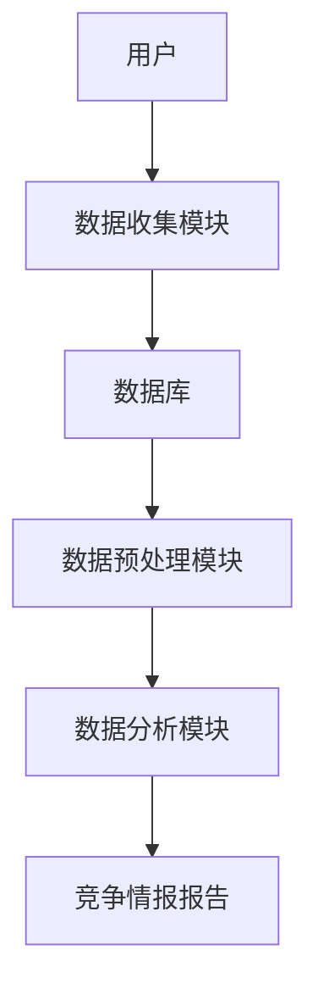
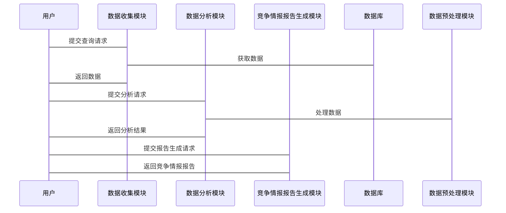

                 


# AI辅助企业竞争情报分析：自动化数据收集与洞察生成

## 关键词：AI，竞争情报分析，数据收集，洞察生成，自然语言处理，机器学习，企业战略

## 摘要：本文探讨了人工智能在企业竞争情报分析中的应用，重点介绍如何利用AI技术实现数据收集和洞察生成的自动化。通过分析核心概念、技术基础、系统设计和项目实战，详细阐述了AI在竞争情报分析中的优势和实现过程，为企业提供了一种高效、智能的竞争情报分析方法。

---

## 第1章: 竞争情报分析与AI的结合

### 1.1 竞争情报分析的背景与重要性

#### 1.1.1 竞争情报的定义
竞争情报（Competitive Intelligence, CI）是指通过合法手段收集、分析和利用竞争者的相关信息，以支持企业战略决策的过程。它帮助企业了解市场动态、竞争对手的策略、行业趋势等，从而制定更具竞争力的商业策略。

#### 1.1.2 竞争情报在企业中的作用
- **支持战略决策**：通过了解竞争对手的动向，企业可以制定更有效的市场进入策略、产品开发计划等。
- **优化资源配置**：竞争情报帮助企业识别市场机会和威胁，优化资源分配，提高效率。
- **提升竞争优势**：通过分析竞争对手的弱点，企业可以制定针对性的策略，提升自身竞争优势。

#### 1.1.3 竞争情报分析的流程与方法
- **数据收集**：通过公开信息、行业报告、新闻媒体等多种渠道收集竞争对手的相关信息。
- **数据整理与分析**：对收集到的数据进行清洗、分类和分析，提取关键信息。
- **洞察生成**：基于分析结果，生成具有战略意义的洞察，为企业决策提供支持。

### 1.2 AI在竞争情报分析中的应用

#### 1.2.1 AI技术的基本概念
人工智能（Artificial Intelligence, AI）是指模拟人类智能的计算机系统，能够执行如学习、推理、问题解决等任务。AI的核心技术包括自然语言处理（NLP）、机器学习（Machine Learning）、数据挖掘等。

#### 1.2.2 AI在竞争情报分析中的优势
- **高效性**：AI能够快速处理大量数据，显著提高数据收集和分析的效率。
- **准确性**：通过机器学习算法，AI能够从大量数据中发现潜在模式和趋势，提高分析结果的准确性。
- **自动化**：AI可以实现数据收集、处理和分析的自动化，减少人工干预，降低成本。

#### 1.2.3 AI与传统竞争情报分析的结合
- **数据收集自动化**：AI可以通过爬虫技术自动收集竞争对手的网站信息、社交媒体数据等。
- **自然语言处理**：NLP技术可以帮助分析非结构化数据，如新闻文章、社交媒体帖子等，提取关键信息。
- **机器学习模型**：机器学习算法可以用于预测竞争对手的市场行为，识别市场趋势。

### 1.3 企业竞争情报分析的自动化需求

#### 1.3.1 数据收集的自动化
- **数据源多样性**：企业需要从多种来源收集数据，包括竞争对手的官方网站、社交媒体、新闻网站等。
- **数据格式多样性**：数据可能以文本、图像、表格等多种形式存在，需要进行结构化处理。
- **实时性要求**：竞争情报分析需要实时或近实时的数据更新，以应对快速变化的市场环境。

#### 1.3.2 数据处理的自动化
- **数据清洗**：AI可以帮助去除噪声数据，确保数据的准确性和一致性。
- **数据分类**：通过机器学习算法，AI可以自动将数据分类，便于后续分析。
- **数据整合**：将来自不同来源的数据整合到一个统一的数据仓库中，便于分析。

#### 1.3.3 洞察生成的自动化
- **模式识别**：机器学习算法可以识别数据中的模式和趋势，帮助发现竞争对手的策略变化。
- **预测分析**：通过时间序列分析等方法，AI可以预测竞争对手的未来行为。
- **报告生成**：AI可以自动生成竞争情报分析报告，提供直观的可视化结果。

---

## 第2章: AI辅助竞争情报分析的核心概念

### 2.1 竞争情报分析的背景介绍

#### 2.1.1 竞争情报的定义与分类
- **定义**：竞争情报是指企业在竞争环境中收集、分析和利用的信息，以支持战略决策。
- **分类**：根据信息来源和用途，竞争情报可以分为内部情报和外部情报。

#### 2.1.2 竞争情报分析的流程
1. 数据收集
2. 数据整理与分析
3. 洞察生成
4. 战略建议

#### 2.1.3 竞争情报分析的重要性
- **支持战略决策**：通过了解竞争对手的动向，企业可以制定更具针对性的市场策略。
- **优化资源配置**：竞争情报帮助企业识别市场机会和威胁，优化资源分配。
- **提升竞争优势**：通过分析竞争对手的弱点，企业可以制定针对性的策略，提升自身竞争优势。

### 2.2 AI在竞争情报分析中的核心概念

#### 2.2.1 自然语言处理（NLP）
- **定义**：NLP是人工智能的一个分支，专注于处理和理解人类语言。
- **应用**：在竞争情报分析中，NLP可以用于分析新闻文章、社交媒体帖子等文本数据，提取关键词、主题和情感倾向。
- **技术流程**：
  1. 文本清洗：去除停用词、标点符号等。
  2. 分词：将文本分割成词语或短语。
  3. 词干提取或词形还原：将词语转换为基本形式。
  4. 情感分析：分析文本中的情感倾向，判断竞争对手的产品或服务的口碑。

#### 2.2.2 机器学习在竞争情报分析中的应用
- **定义**：机器学习是一种人工智能技术，通过训练模型从数据中学习规律，用于预测和分类。
- **应用**：
  1. 竞争对手行为预测：通过历史数据训练模型，预测竞争对手的市场行为。
  2. 市场趋势分析：分析市场数据，识别行业趋势和潜在机会。
  3. 风险评估：评估市场竞争中的潜在风险，帮助企业制定应对策略。

#### 2.2.3 数据挖掘与分析
- **定义**：数据挖掘是从大量数据中提取有价值的信息的过程。
- **应用**：在竞争情报分析中，数据挖掘可以用于识别竞争对手的市场策略、产品特点、客户行为等。
- **技术流程**：
  1. 数据清洗：去除噪声数据，确保数据质量。
  2. 数据转换：将数据转换为适合分析的形式。
  3. 数据建模：使用统计方法或机器学习算法对数据进行建模和分析。
  4. 结果可视化：将分析结果以图表形式展示，便于理解和决策。

### 2.3 竞争情报分析与AI的结合

#### 2.3.1 数据收集与处理
- **数据收集**：通过网络爬虫、API接口等方式收集竞争对手的公开数据。
- **数据预处理**：对收集到的数据进行清洗、分类和结构化处理。
- **数据存储**：将处理后的数据存储到数据库中，便于后续分析。

#### 2.3.2 数据分析与洞察生成
- **文本分析**：使用NLP技术分析竞争对手的新闻稿、社交媒体帖子等文本数据，提取关键词和主题。
- **模式识别**：通过机器学习算法识别数据中的模式和趋势，发现竞争对手的策略变化。
- **预测分析**：基于历史数据，预测竞争对手的未来行为，帮助企业制定前瞻性策略。

#### 2.3.3 洞察的应用
- **战略决策**：基于AI生成的洞察，企业可以制定更具针对性的市场策略。
- **产品开发**：洞察竞争对手的产品特点和市场反应，优化自身产品的设计和推广策略。
- **风险控制**：识别市场竞争中的潜在风险，制定应对措施，降低损失。

---

## 第3章: AI辅助竞争情报分析的技术基础

### 3.1 自然语言处理（NLP）技术

#### 3.1.1 NLP的基本概念
- **定义**：NLP是人工智能的一个分支，专注于处理和理解人类语言。
- **核心任务**：包括文本分类、信息抽取、情感分析、机器翻译等。
- **常用技术**：分词、词性标注、句法分析、语义理解等。

#### 3.1.2 NLP在竞争情报分析中的应用
- **文本分类**：将竞争对手的新闻稿分类为正面、中性或负面。
- **信息抽取**：从文本中提取关键信息，如公司名称、产品名称、时间等。
- **情感分析**：分析竞争对手的产品评论，判断消费者的情感倾向。

#### 3.1.3 NLP技术的实现流程
1. **数据预处理**：清洗文本数据，去除噪声。
2. **分词**：将文本分割成词语或短语。
3. **词性标注**：对分词后的词语进行词性标注。
4. **句法分析**：分析句子的语法结构。
5. **语义理解**：理解文本的语义含义。
6. **结果分析**：根据分析结果生成洞察。

#### 3.1.4 NLP技术的数学模型
- **文本表示**：使用词袋模型或词嵌入（如Word2Vec）将文本转换为数值向量。
- **分类算法**：使用朴素贝叶斯、支持向量机（SVM）、随机森林等算法进行文本分类。
- **情感分析模型**：使用卷积神经网络（CNN）或循环神经网络（RNN）进行情感分析。

### 3.2 数据挖掘与分析技术

#### 3.2.1 数据挖掘的基本概念
- **定义**：数据挖掘是从大量数据中提取有价值的信息的过程。
- **核心任务**：包括数据清洗、数据转换、数据建模、结果可视化等。

#### 3.2.2 数据挖掘在竞争情报分析中的应用
- **数据清洗**：去除噪声数据，确保数据质量。
- **数据转换**：将数据转换为适合分析的形式，如数值化处理。
- **数据建模**：使用统计方法或机器学习算法对数据进行建模和分析。
- **结果可视化**：将分析结果以图表形式展示，便于理解和决策。

#### 3.2.3 数据挖掘技术的实现流程
1. **数据预处理**：清洗数据，去除噪声。
2. **数据转换**：将数据转换为适合分析的形式。
3. **数据建模**：选择合适的算法，训练模型。
4. **结果分析**：分析模型输出的结果，提取有价值的信息。

#### 3.2.4 数据挖掘技术的数学模型
- **分类算法**：使用决策树、随机森林、支持向量机等算法进行分类。
- **聚类算法**：使用K-means、DBSCAN等算法进行聚类分析。
- **关联规则挖掘**：使用Apriori算法挖掘数据中的关联规则。

### 3.3 机器学习技术

#### 3.3.1 机器学习的基本概念
- **定义**：机器学习是一种人工智能技术，通过训练模型从数据中学习规律，用于预测和分类。
- **核心任务**：包括监督学习、无监督学习、半监督学习、强化学习等。
- **常用算法**：线性回归、逻辑回归、支持向量机、随机森林、神经网络等。

#### 3.3.2 机器学习在竞争情报分析中的应用
- **竞争对手行为预测**：通过历史数据训练模型，预测竞争对手的市场行为。
- **市场趋势分析**：分析市场数据，识别行业趋势和潜在机会。
- **风险评估**：评估市场竞争中的潜在风险，帮助企业制定应对策略。

#### 3.3.3 机器学习技术的实现流程
1. **数据预处理**：清洗数据，去除噪声。
2. **数据转换**：将数据转换为适合模型输入的形式。
3. **模型训练**：选择合适的算法，训练模型。
4. **模型评估**：评估模型的性能，调整参数。
5. **模型部署**：将模型部署到实际应用中，进行实时预测。

#### 3.3.4 机器学习技术的数学模型
- **线性回归**：用于预测连续型变量，如销售额、股价等。
- **逻辑回归**：用于分类问题，如判断文本的情感倾向。
- **支持向量机（SVM）**：用于分类和回归问题，适合高维数据。
- **随机森林**：用于分类和回归问题，具有较强的鲁棒性。
- **神经网络**：用于复杂非线性问题，如图像识别、自然语言处理等。

---

## 第4章: AI辅助竞争情报分析的系统设计

### 4.1 竞争情报分析系统的背景介绍

#### 4.1.1 系统背景
- **目标**：通过AI技术实现竞争情报分析的自动化，提高效率和准确性。
- **用户需求**：企业需要实时了解竞争对手的市场行为，制定有效的市场策略。
- **技术需求**：系统需要具备数据收集、处理、分析和报告生成的功能。

#### 4.1.2 系统目标
- **自动化数据收集**：通过网络爬虫、API接口等方式自动收集竞争对手的公开数据。
- **智能化分析**：使用NLP和机器学习技术对数据进行分析，生成有价值的洞察。
- **实时性要求**：系统需要实时更新数据，提供最新的竞争情报。

### 4.2 系统功能设计

#### 4.2.1 竞争情报数据收集模块
- **功能**：自动收集竞争对手的公开数据，包括新闻稿、社交媒体帖子、产品信息等。
- **实现流程**：
  1. 确定数据源：如竞争对手的官方网站、新闻网站、社交媒体平台。
  2. 数据采集：使用网络爬虫或API接口获取数据。
  3. 数据存储：将采集到的数据存储到数据库中。

#### 4.2.2 数据预处理模块
- **功能**：对收集到的数据进行清洗、分类和结构化处理。
- **实现流程**：
  1. 数据清洗：去除噪声数据，如重复数据、无效数据。
  2. 数据分类：根据内容或主题对数据进行分类。
  3. 数据结构化：将非结构化数据（如文本）转换为结构化数据。

#### 4.2.3 数据分析与洞察生成模块
- **功能**：使用NLP和机器学习技术对数据进行分析，生成竞争情报报告。
- **实现流程**：
  1. 文本分析：对文本数据进行分词、词性标注、句法分析等。
  2. 情感分析：分析文本的情感倾向，判断竞争对手的产品或服务的口碑。
  3. 竞争对手行为预测：基于历史数据训练模型，预测竞争对手的未来行为。
  4. 洞察生成：根据分析结果，生成竞争情报报告，包括关键发现、趋势分析、战略建议等。

### 4.3 系统架构设计

#### 4.3.1 系统架构图


#### 4.3.2 模块交互流程
1. 用户提交查询请求，如“分析竞争对手A的市场行为”。
2. 数据收集模块从数据库中获取竞争对手A的相关数据。
3. 数据预处理模块对数据进行清洗和分类。
4. 数据分析模块使用NLP和机器学习技术对数据进行分析。
5. 竞争情报报告生成模块根据分析结果生成报告，并返回给用户。

### 4.4 系统接口设计

#### 4.4.1 API接口设计
- **数据收集接口**：提供REST API接口，允许用户通过API获取竞争对手的数据。
- **数据分析接口**：提供API接口，允许用户通过API调用数据分析模块进行分析。
- **报告生成接口**：提供API接口，允许用户通过API生成竞争情报报告。

#### 4.4.2 接口交互流程
1. 用户通过API接口提交数据收集请求。
2. 数据收集模块获取数据并返回给用户。
3. 用户通过API接口提交数据分析请求。
4. 数据分析模块完成分析并返回结果。
5. 用户通过API接口提交报告生成请求。
6. 竞争情报报告生成模块生成报告并返回给用户。

### 4.5 系统交互设计

#### 4.5.1 用户交互流程
1. 用户登录系统，提交查询请求。
2. 系统显示数据收集进度，用户可以选择数据来源和范围。
3. 数据分析完成，系统生成竞争情报报告。
4. 用户查看报告，并根据报告制定市场策略。

#### 4.5.2 系统交互图


---

## 第5章: AI辅助竞争情报分析的项目实战

### 5.1 项目背景

#### 5.1.1 项目介绍
- **目标**：开发一个基于AI的竞争情报分析系统，帮助企业自动化收集和分析竞争对手的数据，生成有价值的洞察。
- **需求分析**：企业需要实时了解竞争对手的市场行为，制定有效的市场策略。
- **技术选型**：使用Python、NLP库（如spaCy、NLTK）、机器学习库（如scikit-learn、TensorFlow）等。

### 5.2 环境安装与配置

#### 5.2.1 环境安装
- **Python**：安装Python 3.8及以上版本。
- **NLP库**：安装spaCy、NLTK等。
- **机器学习库**：安装scikit-learn、TensorFlow、Keras等。
- **其他工具**：安装Jupyter Notebook、Pandas、Matplotlib等。

#### 5.2.2 环境配置
- **虚拟环境**：建议使用virtualenv或conda创建虚拟环境，避免依赖冲突。
- **库安装**：使用pip或conda安装所需的库。

### 5.3 系统核心实现

#### 5.3.1 数据收集模块实现
- **代码示例**：
  ```python
  import requests
  from bs4 import BeautifulSoup

  def collect_data(url):
      response = requests.get(url)
      soup = BeautifulSoup(response.text, 'html.parser')
      content = soup.get_text()
      return content

  # 使用示例
  url = 'https://example.com'
  data = collect_data(url)
  print(data)
  ```

#### 5.3.2 数据预处理模块实现
- **代码示例**：
  ```python
  import pandas as pd
  from sklearn.preprocessing import StandardScaler

  def preprocess_data(data):
      # 数据清洗
      data.dropna(inplace=True)
      # 数据转换
      scaler = StandardScaler()
      processed_data = scaler.fit_transform(data)
      return processed_data

  # 使用示例
  data = pd.DataFrame({'text': ['hello', 'world', 'python']})
  processed_data = preprocess_data(data)
  print(processed_data)
  ```

#### 5.3.3 数据分析模块实现
- **代码示例**：
  ```python
  from sklearn.model

