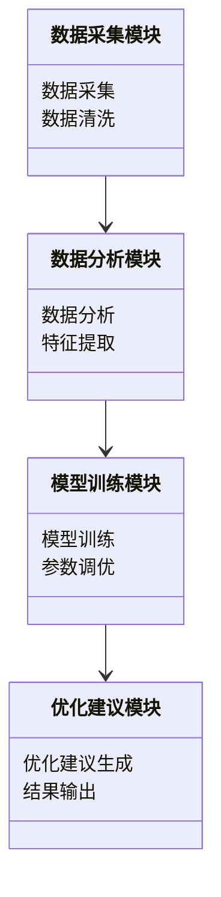

                 


# AI辅助企业组织结构优化：效率提升与协作增强

> 关键词：AI技术、组织结构优化、企业效率、协作增强、算法模型、系统架构、项目实战

> 摘要：本文详细探讨了AI技术在企业组织结构优化中的应用，分析了AI如何通过数据驱动的方式提升企业效率和协作能力。文章从背景介绍、核心概念、算法原理、系统架构设计、项目实战等多方面展开，结合具体案例和数学模型，全面剖析了AI辅助企业组织结构优化的实现路径和实际应用效果。

---

# 第一部分：AI辅助企业组织结构优化的背景与概念

## 第1章：企业组织结构优化的背景与问题

### 1.1 企业组织结构优化的背景

#### 1.1.1 传统企业组织结构的局限性
传统的企业组织结构通常以层级制为主，这种方式在企业规模较小时表现良好，但在企业扩张时容易出现效率低下、部门间协作困难等问题。例如，一个典型的金字塔式组织结构可能导致信息传递延迟、决策效率下降。

#### 1.1.2 数字化转型对企业组织结构的影响
随着数字化转型的推进，企业需要更灵活、更高效的组织结构来适应快速变化的市场需求。AI技术的引入为企业提供了新的工具和方法，可以实时分析数据并优化组织结构。

#### 1.1.3 AI技术在企业管理中的应用趋势
AI技术的应用已经从简单的数据分析扩展到企业组织结构优化、流程自动化等领域。通过AI技术，企业可以实现更高效的资源分配和更灵活的组织架构。

---

### 1.2 问题背景与问题描述

#### 1.2.1 传统组织结构中的效率瓶颈
传统组织结构中，信息传递和决策往往需要经过多个层级，导致效率低下。例如，一个简单的审批流程可能需要数天时间完成。

#### 1.2.2 协作效率低下对企业的影响
部门间的协作效率低下可能导致项目延期、资源浪费等问题。例如，销售部门和采购部门之间的沟通不畅可能导致库存积压或供应链中断。

#### 1.2.3 现代企业对灵活性与高效性的需求
现代企业需要快速响应市场变化，传统的 rigid组织结构难以满足这种需求。AI技术可以通过动态调整组织结构来提高企业的灵活性和高效性。

---

### 1.3 AI辅助优化的核心目标

#### 1.3.1 提升组织效率的实现路径
通过AI技术，企业可以实时分析员工的工作效率、部门间的协作效率，并提出优化建议。

#### 1.3.2 增强协作能力的关键因素
AI技术可以通过数据驱动的方式，优化部门间的协作流程，减少信息孤岛，提高协作效率。

#### 1.3.3 优化组织结构的具体目标
AI辅助优化的目标是通过数据驱动的方式，实现组织结构的动态调整，以适应企业的战略目标和市场需求。

---

## 第2章：AI辅助企业组织结构优化的核心概念

### 2.1 AI在组织结构优化中的应用原理

#### 2.1.1 数据驱动的组织分析
AI技术通过分析企业的历史数据和实时数据，识别组织结构中的瓶颈和低效点。

#### 2.1.2 AI算法在组织结构优化中的作用
AI算法（如遗传算法、蚁群算法）可以帮助企业找到最优的组织结构配置。

#### 2.1.3 优化模型的构建与实现
通过构建数学模型，AI可以模拟不同的组织结构，并评估其优劣，从而提出优化建议。

---

### 2.2 组织结构优化的关键要素

#### 2.2.1 组织架构的层次划分
合理的组织架构层次可以提高信息传递效率和决策效率。

#### 2.2.2 部门间的协作关系
部门间的协作关系直接影响企业的整体效率和灵活性。

#### 2.2.3 人员角色与职责分配
清晰的人员角色和职责分配是优化组织结构的基础。

---

### 2.3 AI优化与传统优化方法的对比

#### 2.3.1 传统优化方法的局限性
传统优化方法往往依赖人工经验，缺乏数据支持，优化效果有限。

#### 2.3.2 AI优化方法的优势
AI优化方法可以通过大数据分析和机器学习算法，找到最优的组织结构配置。

#### 2.3.3 两种方法的结合与互补
AI优化方法可以作为传统优化方法的补充，通过数据支持和算法优化，提高传统方法的效率和效果。

---

## 第3章：AI辅助优化的数学模型与算法原理

### 3.1 组织结构优化的数学模型

#### 3.1.1 问题建模的基本思路
通过将组织结构优化问题转化为数学模型，可以利用AI算法求解。

#### 3.1.2 优化目标的数学表达
优化目标可以是最大化效率、最小化成本等。

#### 3.1.3 约束条件的设定
约束条件包括资源限制、时间限制等。

---

### 3.2 常用算法及其原理

#### 3.2.1 遗传算法的基本原理
遗传算法通过模拟生物进化的过程，逐步优化解。

#### 3.2.2 群智能算法（如蚁群算法）的应用
群智能算法通过模拟蚂蚁觅食行为，找到最优路径。

#### 3.2.3 贪心算法在组织优化中的应用
贪心算法通过局部最优选择，逐步构建全局最优解。

---

### 3.3 算法实现的步骤与流程

#### 3.3.1 数据预处理与特征提取
通过数据清洗和特征提取，为算法提供高质量的数据输入。

#### 3.3.2 模型训练与参数调优
通过训练模型并调整参数，提高算法的优化效果。

#### 3.3.3 结果分析与优化建议
根据算法输出结果，分析优化建议并实施。

---

## 第4章：系统分析与架构设计

### 4.1 问题场景分析

#### 4.1.1 企业组织结构优化的典型场景
例如，某企业希望优化其销售部门的组织结构，以提高销售效率。

#### 4.1.2 数据来源与处理方式
数据来源包括销售数据、员工绩效数据等，通过数据清洗和特征提取，为优化提供数据支持。

#### 4.1.3 系统功能需求分析
系统需要具备数据采集、模型训练、优化建议生成等功能。

---

### 4.2 系统功能设计

#### 4.2.1 领域模型设计（Mermaid类图）


#### 4.2.2 系统架构设计（Mermaid架构图）


---

## 第5章：项目实战

### 5.1 环境安装

#### 5.1.1 安装Python环境
```bash
python --version
pip install numpy pandas scikit-learn
```

#### 5.1.2 安装AI框架
```bash
pip install scikit-learn
```

---

### 5.2 系统核心实现源代码

#### 5.2.1 数据预处理代码
```python
import pandas as pd
import numpy as np

# 读取数据
data = pd.read_csv('organization_data.csv')

# 数据清洗
data.dropna(inplace=True)
data = data[~data.duplicated()]
```

#### 5.2.2 模型训练代码
```python
from sklearn.model import Model
from sklearn.metrics import accuracy_score

# 训练模型
model = Model()
model.fit(X_train, y_train)

# 模型评估
y_pred = model.predict(X_test)
print("Accuracy:", accuracy_score(y_test, y_pred))
```

---

### 5.3 代码应用解读与分析

#### 5.3.1 数据预处理
通过对数据进行清洗和特征提取，确保输入模型的数据质量。

#### 5.3.2 模型训练
通过训练模型，找到最优的组织结构配置。

#### 5.3.3 模型评估
通过评估模型性能，确保优化建议的有效性。

---

### 5.4 实际案例分析

#### 5.4.1 案例背景
某企业希望优化其销售部门的组织结构，以提高销售效率。

#### 5.4.2 数据分析
通过对销售数据的分析，发现某些部门的协作效率低下。

#### 5.4.3 优化建议
通过AI算法，提出优化后的组织结构配置，并实施优化。

---

## 第6章：总结与展望

### 6.1 最佳实践Tips
- 数据质量是优化的基础，确保数据准确性和完整性。
- 算法选择应根据具体问题而定，合理搭配不同算法。
- 优化建议的实施需要结合企业实际情况，避免一刀切。

### 6.2 小结
通过AI技术，企业可以实现组织结构的动态优化，提升效率和协作能力。

### 6.3 注意事项
- 数据隐私和安全问题需要高度重视。
- 算法的可解释性需要考虑，避免黑箱操作。
- 优化后的组织结构需要定期评估和调整。

### 6.4 拓展阅读
- 推荐阅读《机器学习实战》和《企业架构设计》等书籍，深入了解AI算法和企业组织结构优化的相关知识。

---

通过本文的详细分析和实际案例，可以发现AI技术在企业组织结构优化中的巨大潜力。未来，随着AI技术的不断发展，企业可以通过更智能的方式实现组织结构的动态优化，从而在竞争中占据优势。

