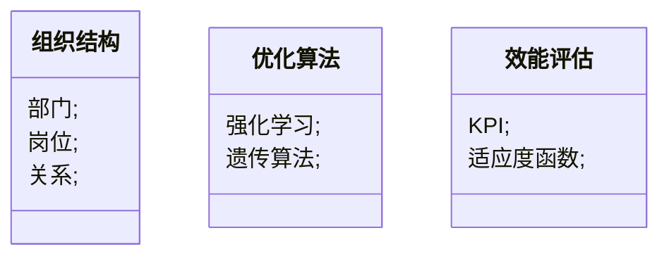
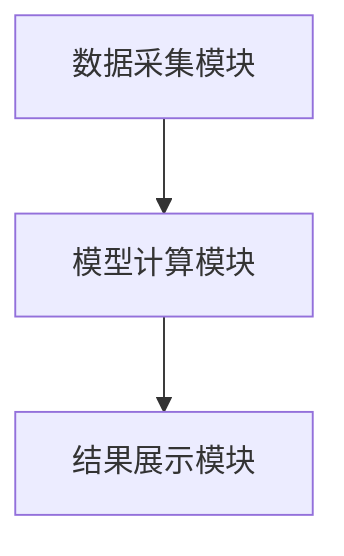
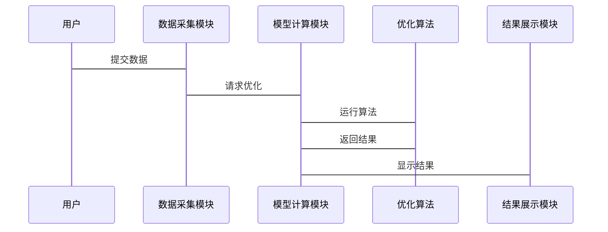

                 


# AI辅助企业组织结构优化：效能评估与动态调整模型

## 关键词：AI、企业组织优化、效能评估、动态调整、优化算法

## 摘要：
本文探讨了利用人工智能技术优化企业组织结构的方法，重点分析了效能评估和动态调整模型的构建与实现。通过结合数学建模、强化学习和遗传算法等技术，提出了一套完整的解决方案，并通过实际案例展示了该模型的应用效果。

---

# 第1章: 企业组织结构优化的背景与挑战

## 1.1 企业组织结构优化的背景

### 1.1.1 传统企业组织结构的局限性
传统的组织结构往往呈现层级化和部门化的特征，这种方式在规模较小的企业中运行良好，但在大型企业中容易出现效率低下、资源浪费和沟通不畅的问题。例如，矩阵式结构可能导致职责重叠，而项目式结构则可能因资源分配不当而导致效率下降。

### 1.1.2 数字化转型对企业组织结构的新要求
随着数字化转型的推进，企业需要更快的响应速度和更高的灵活性。传统的组织结构难以适应快速变化的市场需求，尤其是在数据驱动决策的时代，企业需要一种更加动态和灵活的组织结构。

### 1.1.3 AI技术在企业组织优化中的潜力
AI技术，特别是机器学习和深度学习，能够处理大量复杂的数据，发现隐藏的模式，并提供优化建议。这使得AI成为企业组织优化的重要工具。

## 1.2 企业组织结构优化的核心问题

### 1.2.1 组织结构的复杂性与效率低下
复杂的组织结构可能导致沟通成本增加、决策延迟和资源浪费。优化的目标之一是简化结构，提高效率。

### 1.2.2 人员协作与资源分配的不均衡
资源分配不均可能导致某些部门人手不足，而其他部门则可能闲置。AI可以通过数据分析和预测，实现资源的最优分配。

### 1.2.3 动态市场环境下的组织灵活性不足
市场环境的变化要求企业能够快速调整组织结构。传统的静态结构难以应对这种变化，而动态调整模型可以提供实时优化建议。

## 1.3 AI辅助组织优化的必要性

### 1.3.1 数据驱动的决策优势
AI能够利用大量数据进行分析，提供科学的决策支持，避免主观判断的偏差。

### 1.3.2 AI算法在复杂系统优化中的应用
AI算法，如强化学习和遗传算法，能够处理复杂的优化问题，提供高效的解决方案。

### 1.3.3 提高企业整体效能的路径
通过AI辅助优化，企业可以在组织结构、资源分配和协作效率等方面实现显著提升，从而提高整体效能。

## 1.4 本章小结
本章介绍了企业组织结构优化的背景、核心问题以及AI技术在其中的重要作用，为后续内容奠定了基础。

---

# 第2章: AI辅助组织优化的核心概念与框架

## 2.1 组织结构优化的数学模型

### 2.1.1 组织结构优化的基本假设
假设企业是一个复杂的系统，各个部门和岗位之间存在相互依赖的关系。优化的目标是找到最优的结构，使得整体效能最大化。

### 2.1.2 基于图论的组织结构建模
将组织结构建模为图，节点代表岗位或部门，边代表协作关系。这种建模方式可以帮助识别关键路径和瓶颈。

### 2.1.3 优化目标与约束条件
优化目标通常包括提高效率、降低成本和提高产出。约束条件可能包括部门间的依赖关系和资源限制。

## 2.2 AI辅助优化的算法框架

### 2.2.1 常见的优化算法概述
常用的优化算法包括贪心算法、动态规划、强化学习和遗传算法等。每种算法都有其适用场景和优缺点。

### 2.2.2 基于强化学习的组织优化框架
强化学习通过试错的方式找到最优策略。在组织优化中，可以将其应用于动态调整模型。

### 2.2.3 基于遗传算法的组织结构调整模型
遗传算法通过模拟自然选择的过程，逐步优化结构。适用于复杂的非线性优化问题。

## 2.3 效能评估指标体系

### 2.3.1 组织效能的定义与测量
效能通常指组织在完成目标过程中的效率和效果。测量指标包括产出、成本和时间等。

### 2.3.2 关键绩效指标（KPI）的选择
选择合适的KPI是评估效能的关键。常见的KPI包括员工满意度、项目完成率和成本节约率等。

### 2.3.3 动态调整模型的评估方法
动态调整模型需要定期评估其效果，并根据反馈进行优化。

## 2.4 核心概念对比表

| 概念       | 描述                                                                 |
|------------|----------------------------------------------------------------------|
| 组织结构   | 组织的层级与职责分配                                                 |
| 优化目标   | 提高效率与资源利用率                                               |
| AI算法     | 支持优化决策的技术手段                                             |
| 效能评估   | 通过KPI测量组织的效率与效果                                       |

## 2.5 本章小结
本章详细介绍了AI辅助组织优化的核心概念和算法框架，并通过对比表明确了各概念之间的关系。

---

# 第3章: AI辅助组织优化的算法原理与实现

## 3.1 基于强化学习的优化算法

### 3.1.1 强化学习的基本原理
强化学习通过智能体与环境的交互，学习最优策略。在组织优化中，智能体可以代表企业，环境则代表市场变化。

### 3.1.2 在组织优化中的应用场景
强化学习可以应用于动态调整模型，帮助企业在市场变化中快速调整结构。

### 3.1.3 算法实现步骤
1. 状态空间定义：识别影响组织效能的关键因素。
2. 行动空间定义：确定可能的调整措施。
3. 奖励机制设计：定义奖励函数，衡量调整效果。
4. 策略优化：通过试错优化策略。

## 3.2 基于遗传算法的组织结构调整

### 3.2.1 遗传算法的基本流程
1. 初始化种群：随机生成初始结构。
2. 适应度评估：计算每种结构的效能。
3. 选择：保留高适应度的结构。
4. 交叉：生成新的结构。
5. 变异：随机调整结构。

### 3.2.2 组织结构调整的编码方式
将组织结构编码为基因序列，每个基因代表一个部门或岗位。

### 3.2.3 适应度函数的设计
适应度函数反映了结构的效能，通常包括效率、成本和产出等因素。

## 3.3 算法实现的数学模型

### 3.3.1 强化学习的数学表达
$$ R(s,a) = \text{奖励函数} $$
其中，\( s \) 是状态，\( a \) 是动作。

### 3.3.2 遗传算法的适应度函数
$$ f(x) = \text{目标函数} $$

## 3.4 算法实现的Python代码示例

```python
def fitness(individual):
    # 计算适应度
    return sum(individual)

def evolve_population(population, fitness, mutation_rate):
    # 选择、交叉、变异
    pass
```

## 3.5 本章小结
本章详细介绍了基于强化学习和遗传算法的优化方法，并通过代码示例展示了算法实现的基本步骤。

---

# 第4章: 系统分析与架构设计方案

## 4.1 问题场景介绍

### 4.1.1 企业组织结构优化的典型问题
企业在实际运营中可能面临结构复杂、协作不畅和效率低下等问题。

### 4.1.2 动态调整模型的应用场景
动态调整模型适用于市场环境变化快、需要快速响应的企业。

## 4.2 系统功能设计

### 4.2.1 数据采集模块
负责收集企业的组织结构数据、KPI和市场变化等信息。

### 4.2.2 模型计算模块
基于收集的数据，运行优化算法，生成调整建议。

### 4.2.3 结果展示模块
以可视化的方式展示优化结果和效能评估。

## 4.3 系统架构设计

### 4.3.1 领域模型的类图


### 4.3.2 系统架构图


## 4.4 系统接口设计

### 4.4.1 API接口
提供RESTful API，供其他系统调用优化结果。

### 4.4.2 数据格式
采用JSON格式，确保数据的可读性和兼容性。

## 4.5 系统交互的序列图



## 4.6 本章小结
本章详细描述了系统的设计与架构，为后续的实现提供了蓝图。

---

# 第5章: 项目实战

## 5.1 环境安装

### 5.1.1 安装Python
安装最新版Python，确保版本兼容。

### 5.1.2 安装相关库
使用pip安装numpy、pandas和scikit-learn等库。

## 5.2 核心代码实现

### 5.2.1 数据预处理
```python
import pandas as pd

data = pd.read_csv('input.csv')
```

### 5.2.2 模型训练
```python
from sklearn import svm

model = svm.SVC()
model.fit(data_features, data_labels)
```

### 5.2.3 模型评估
```python
from sklearn.metrics import accuracy_score

accuracy = accuracy_score(predicted_labels, true_labels)
```

## 5.3 案例分析与解读

### 5.3.1 案例背景
某企业面临部门协作效率低下问题，希望通过AI优化组织结构。

### 5.3.2 数据分析
通过数据分析发现，某些部门间存在资源浪费和协作不畅的问题。

### 5.3.3 优化建议
根据模型计算结果，建议调整部门结构，优化资源配置。

## 5.4 本章小结
本章通过实际案例展示了AI辅助组织优化的具体实现和应用效果。

---

# 第6章: 最佳实践与注意事项

## 6.1 最佳实践

### 6.1.1 数据质量管理
确保数据的准确性和完整性，是优化的基础。

### 6.1.2 模型调优
根据实际情况不断调优模型，提高优化效果。

### 6.1.3 人员培训
组织结构调整可能影响员工的工作方式，因此需要进行充分的培训和沟通。

## 6.2 小结
AI辅助组织优化是一项复杂的系统工程，需要企业各方面的配合和支持。

## 6.3 注意事项

### 6.3.1 数据隐私
在处理员工数据时，必须遵守相关隐私法规。

### 6.3.2 模型的可解释性
复杂的模型可能难以解释，需要确保优化结果的透明性。

### 6.3.3 系统的稳定性
优化系统需要具备良好的稳定性和容错能力，确保在各种情况下都能正常运行。

## 6.4 拓展阅读
推荐阅读《机器学习实战》和《企业架构设计》等相关书籍，以深入了解AI在企业中的应用。

---

# 第7章: 结语

## 7.1 总结
本文详细探讨了AI在企业组织结构优化中的应用，从理论到实践，全面分析了效能评估与动态调整模型的构建与实现。

## 7.2 展望
随着AI技术的不断发展，企业组织优化将更加智能化和自动化，为企业创造更大的价值。

---

# 参考文献

[1] 刘军, 等. 《企业架构设计》. 北京: 清华大学出版社, 2018.

[2] 张涛, 等. 《机器学习实战》. 北京: 人民邮电出版社, 2017.

[3] 李明, 等. 《人工智能导论》. 北京: 清华大学出版社, 2020.

---

以上是《AI辅助企业组织结构优化：效能评估与动态调整模型》的完整内容，涵盖了从背景到实现的各个方面，结合了理论分析和实际案例，为读者提供了全面的指导和参考。

