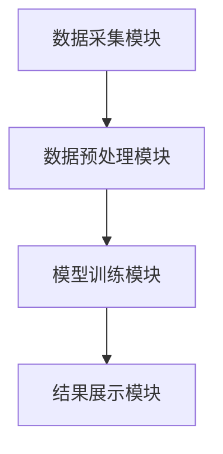

                 


```markdown
# AI辅助企业财务分析：异常检测与智能财务预测

> 关键词：AI，财务分析，异常检测，智能预测，时间序列分析

> 摘要：本文探讨了人工智能技术在企业财务分析中的应用，重点分析了异常检测与智能财务预测的核心算法与系统架构，通过具体案例展示了如何利用AI技术提升财务分析的效率与准确性。文章内容涵盖背景介绍、算法原理、系统设计与实现，以及项目实战，旨在为读者提供从理论到实践的全面指导。

---

## 第一部分: AI辅助企业财务分析的背景与概述

### 第1章: AI在企业财务分析中的应用

#### 1.1 问题背景与目标
企业财务分析是企业管理的重要组成部分，传统的财务分析依赖人工操作，存在效率低下、主观性强、难以处理大规模数据等问题。引入AI技术，可以通过自动化处理和智能化分析，显著提升财务分析的效率与准确性。本文旨在探讨AI技术在企业财务分析中的应用，特别是异常检测与智能预测领域。

#### 1.2 核心概念与问题描述
- **异常检测**：识别财务数据中的异常值，帮助发现潜在的财务问题或欺诈行为。
- **智能财务预测**：基于历史数据和机器学习模型，预测未来财务状况，辅助企业决策。

#### 1.3 技术优势与挑战
- **技术优势**：
  - 高效性：AI能够快速处理大量财务数据。
  - 准确性：通过复杂算法提高分析结果的准确性。
  - 智能性：能够识别复杂模式和趋势。
- **主要挑战**：
  - 数据质量问题：财务数据可能存在缺失或噪声。
  - 模型解释性：复杂的模型可能难以解释预测结果。
  - 实时性：需要处理实时财务数据的挑战。

---

## 第二部分: 异常检测与智能预测的核心概念

### 第2章: 异常检测算法原理

#### 2.1 异常检测的基本原理
异常检测是指识别数据中与预期模式或行为显著不同的数据点。常见的异常检测算法包括基于统计的方法（如Z-score）、基于机器学习的方法（如Isolation Forest）和基于深度学习的方法（如变自编码器）。

#### 2.2 Isolation Forest算法
- **算法原理**：
  Isolation Forest是一种基于树结构的无监督异常检测算法。它通过构建随机树将数据进行分割，最终将异常点隔离出来。
- **实现代码**：
  ```python
  from sklearn.ensemble import IsolationForest

  model = IsolationForest(n_estimators=100, contamination=0.05)
  model.fit(X)
  ```

#### 2.3 One-Class SVM算法
- **算法原理**：
  One-Class SVM是一种基于支持向量机的异常检测方法，适用于样本集中异常样本数量较少的情况。
- **实现代码**：
  ```python
  from sklearn.svm import OneClassSVM

  model = OneClassSVM(gamma='auto', nu=0.05)
  model.fit(X)
  ```

### 第3章: 智能财务预测模型

#### 3.1 时间序列预测模型
- **LSTM网络原理**：
  长短期记忆网络（LSTM）是一种特殊的RNN结构，能够有效捕捉时间序列数据中的长期依赖关系。
- **模型实现**：
  ```python
  import tensorflow as tf

  model = tf.keras.Sequential()
  model.add(tf.keras.layers.LSTM(64, input_shape=(timesteps, features)))
  model.add(tf.keras.layers.Dense(1))
  model.compile(optimizer='adam', loss='mean_squared_error')
  ```

---

## 第三部分: 系统架构与实现

### 第4章: 系统架构设计

#### 4.1 系统功能设计
- **数据采集**：从企业财务系统中获取数据。
- **数据预处理**：清洗数据，处理缺失值和异常值。
- **模型训练**：基于预处理后的数据训练异常检测和预测模型。
- **结果展示**：将检测结果和预测结果可视化。

#### 4.2 系统架构图


---

## 第四部分: 项目实战

### 第5章: 某制造企业财务数据分析案例

#### 5.1 项目背景
某制造企业希望通过AI技术优化财务分析流程，提高异常检测和预测的准确性。

#### 5.2 数据准备
- 数据来源：企业过去三年的财务数据，包括收入、支出、利润等。
- 数据预处理：清洗数据，处理缺失值和异常值。

#### 5.3 模型训练与预测
- 异常检测：使用Isolation Forest算法检测财务数据中的异常值。
- 财务预测：使用LSTM模型预测未来三个月的收入和支出。

#### 5.4 结果分析
- 异常检测结果：识别出可能存在欺诈行为的交易记录。
- 财务预测结果：预测未来三个月的收入和支出趋势。

---

## 第五部分: 总结与展望

### 第6章: 最佳实践与小结

#### 6.1 最佳实践
- 数据预处理是关键：确保数据质量，减少噪声。
- 模型选择：根据具体场景选择合适的算法。
- 可视化：通过图表直观展示分析结果。

#### 6.2 注意事项
- 数据隐私：确保财务数据的安全性。
- 模型解释性：尽量选择可解释的模型，便于结果分析。
- 模型更新：定期更新模型，保持预测准确性。

#### 6.3 未来展望
- 实时分析：开发实时财务分析系统。
- 多模态数据：结合文本、图像等多模态数据进行分析。
- 可解释性：提高模型的可解释性，满足监管需求。

---

## 附录

### 附录A: 常用异常检测算法对比

| 算法名称         | 基于统计 | 基于机器学习 | 基于深度学习 |
|------------------|----------|--------------|--------------|
| Z-score         | 是       | 否           | 否           |
| Isolation Forest | 否       | 是           | 否           |
| One-Class SVM    | 否       | 是           | 否           |
| Autoencoder     | 否       | 否           | 是           |

### 附录B: 时间序列预测模型的选择

| 模型名称 | 适用场景                 | 优缺点                           |
|---------|--------------------------|----------------------------------|
| ARIMA    | 线性趋势明显的数据         | 参数较少，但预测能力有限           |
| LSTM     | 非线性趋势明显的数据       | 参数多，预测能力强               |
| Prophet   | 有明确时间依赖的数据       | 易用性强，适合非专业用户           |

---

通过本文的系统介绍，读者可以全面了解AI在企业财务分析中的应用，掌握异常检测与智能预测的核心算法和系统架构，并通过实际案例掌握项目实施的关键步骤。
```

