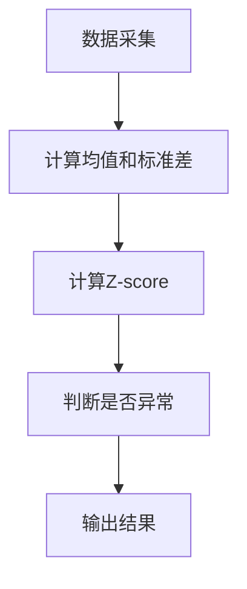
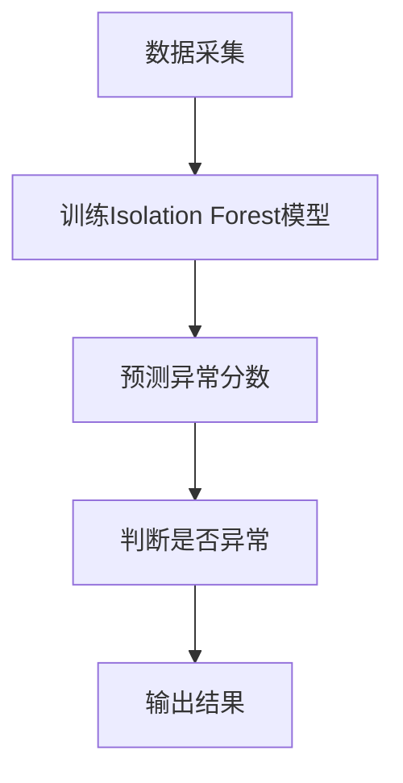
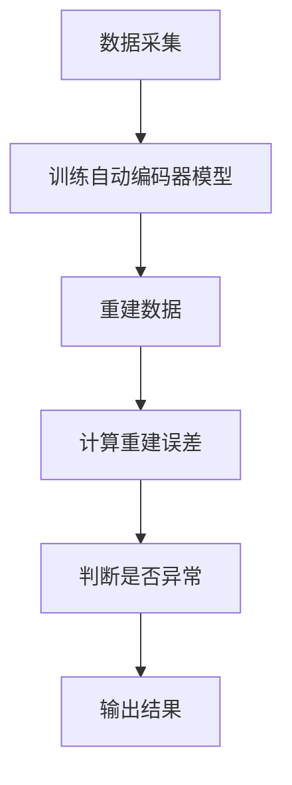
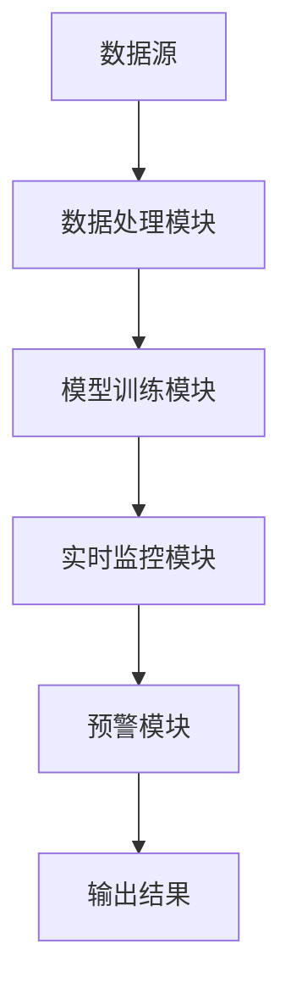
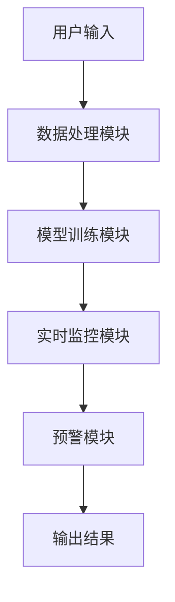

                 


# AI辅助企业财务异常检测：实时监控与智能预警系统

## 关键词：AI，财务异常检测，实时监控，智能预警，机器学习，深度学习，系统架构

## 摘要：本文探讨了利用人工智能技术辅助企业财务异常检测的方法，重点介绍了实时监控与智能预警系统的构建。通过分析财务数据，结合机器学习和深度学习算法，提出了一套高效准确的财务异常检测方案，帮助企业及时发现潜在风险，提升财务管理效率。

---

# 第1章: 背景介绍

## 1.1 问题背景

### 1.1.1 企业财务异常检测的重要性
企业在日常经营中，财务数据的准确性和完整性直接关系到企业的健康运营。财务异常可能包括收入突降、支出激增、现金流异常等，这些异常可能预示着潜在的财务风险，如欺诈、管理不善或市场波动。及时发现并处理这些异常，可以帮助企业在风险发生前采取措施，避免重大损失。

### 1.1.2 传统财务异常检测的局限性
传统的财务异常检测主要依赖人工审查和简单的财务比率分析，这种方法不仅效率低下，而且容易受到主观因素的影响。此外，面对海量的财务数据，人工审查难以及时发现隐藏在数据中的异常模式。

### 1.1.3 AI技术在财务异常检测中的优势
人工智能技术，尤其是机器学习和深度学习，能够处理海量数据，发现复杂模式，并实时提供预警。AI技术的引入，显著提高了财务异常检测的效率和准确性，减少了人为错误，使企业能够更快速地响应潜在风险。

---

## 1.2 问题描述

### 1.2.1 财务异常的定义与分类
财务异常通常指与企业正常运营不符的财务数据模式。常见的异常包括：
- **收入突降**：收入突然下降，可能表明市场需求下降或销售策略问题。
- **支出激增**：某段时间内支出显著增加，可能暗示成本失控或欺诈行为。
- **现金流异常**：现金流与收入不匹配，可能表明企业资金链存在问题。
- **应收账款异常**：应收账款突然增加，可能表明客户付款延迟或存在坏账风险。

### 1.2.2 财务数据的特点与挑战
财务数据具有高维度、高关联性和时间序列的特点。高维度意味着数据包含多个财务指标，如收入、支出、利润等；高关联性意味着各个财务指标之间相互影响；时间序列数据则要求系统能够处理时序数据，捕捉时间依赖性。

### 1.2.3 异常检测的目标与意义
异常检测的目标是通过分析财务数据，识别出偏离正常模式的数据点。其意义在于帮助财务人员快速定位问题，提前采取措施，降低企业财务风险。

---

## 1.3 问题解决

### 1.3.1 AI技术如何解决财务异常检测问题
AI技术通过机器学习算法，能够自动学习正常财务数据的特征，并识别出异常数据点。与传统方法相比，AI技术具有高效性、准确性和实时性的优势。

### 1.3.2 实时监控与智能预警的核心思想
实时监控意味着系统能够持续不断地分析财务数据，及时发现异常。智能预警则基于AI算法，对异常数据进行分类和优先级排序，帮助财务人员快速响应。

### 1.3.3 系统设计的主要思路
系统设计的核心思路包括：
1. **数据采集**：从企业的财务系统中实时采集财务数据。
2. **特征提取**：对采集到的财务数据进行特征工程，提取有用的特征。
3. **模型训练**：利用机器学习或深度学习算法训练异常检测模型。
4. **实时监控**：将实时数据输入模型，进行异常检测。
5. **智能预警**：根据检测结果，触发预警机制，通知相关人员处理。

---

## 1.4 边界与外延

### 1.4.1 财务异常检测的边界条件
- 数据范围：仅限于企业的财务数据，不涉及非财务数据。
- 时间范围：仅针对最近一段时间的数据，不考虑历史数据。
- 异常类型：仅检测上述提到的几种典型异常。

### 1.4.2 相关领域的区别与联系
- **财务审计**：财务异常检测是财务审计的重要组成部分，但财务审计还包括其他内容，如内部控制评估。
- **风险管理**：财务异常检测是风险管理的一个环节，风险管理还包括其他方面，如市场风险、操作风险等。

### 1.4.3 系统的适用范围与限制
- 适用范围：适用于各类企业，尤其是数据量较大的企业。
- 限制：无法检测未知类型的异常，模型需要定期更新以适应数据变化。

---

## 1.5 核心要素组成

### 1.5.1 数据源的构成
财务数据主要包括：
- 收入与支出数据
- 利润数据
- 现金流数据
- 应收账款与应付账款数据

### 1.5.2 检测模型的选择
选择合适的模型是异常检测的关键。常用模型包括：
- 基于统计的方法：如Z-score法。
- 机器学习模型：如随机森林、支持向量机（SVM）。
- 深度学习模型：如长短期记忆网络（LSTM）。

### 1.5.3 预警机制的设计
预警机制包括：
- 异常等级划分：根据异常的严重程度，分为不同等级。
- 预警触发条件：设定触发预警的具体条件。
- 预警通知方式：如邮件、短信、系统弹窗等。

---

# 第2章: 核心概念与原理

## 2.1 财务异常检测的核心概念

### 2.1.1 异常检测的定义
异常检测是指通过分析数据，识别出与正常数据模式不符的数据点。在财务异常检测中，目标是识别出财务数据中的异常模式。

### 2.1.2 财务数据的特征分析
财务数据具有以下特征：
- **连续性**：数据通常呈连续分布。
- **多元性**：数据包含多个财务指标。
- **时序性**：数据具有时间序列特性。

### 2.1.3 异常检测的分类
- **点异常**：单个数据点的异常，如某个月份的收入突然下降。
- **集体异常**：多个数据点的异常，如某段时间内支出激增。
- **上下文异常**：与当前上下文不一致的异常，如季节性波动下的异常。

---

## 2.2 AI技术在财务异常检测中的应用

### 2.2.1 机器学习在异常检测中的作用
机器学习通过训练模型，学习正常数据的特征，并识别出异常数据点。常用的算法包括：
- **无监督学习**：如K-means、DBSCAN。
- **半监督学习**：如One-Class SVM。
- **监督学习**：需要标记的异常数据，适合已知异常类型的情况。

### 2.2.2 深度学习的优势与挑战
深度学习在处理复杂数据模式方面具有优势，但计算资源需求较高，模型训练时间较长。常用模型包括：
- **神经网络**：如多层感知机（MLP）。
- **循环神经网络**：如LSTM，适合处理时序数据。

### 2.2.3 自然语言处理在财务文本分析中的应用
NLP技术可以分析财务报告、合同等文本，识别潜在的异常信息。例如，通过关键词抽取，识别财务报告中的异常表述。

---

## 2.3 实时监控与智能预警系统

### 2.3.1 实时监控的定义与实现
实时监控是指系统能够持续不断地分析数据，及时发现异常。实现步骤包括：
1. 数据采集：实时获取财务数据。
2. 数据预处理：清洗数据，提取特征。
3. 异常检测：将数据输入模型，进行异常检测。
4. 预警触发：根据检测结果，触发预警机制。

### 2.3.2 智能预警系统的功能
智能预警系统具有以下功能：
- **实时检测**：持续监控财务数据。
- **异常分类**：对检测到的异常进行分类。
- **预警通知**：根据异常等级，通知相关人员。

### 2.3.3 系统的架构与流程
系统的架构包括数据源、数据处理模块、模型训练模块、实时监控模块和预警模块。流程如下：
1. 数据采集：从财务系统中获取数据。
2. 数据预处理：清洗数据，提取特征。
3. 模型训练：训练异常检测模型。
4. 实时监控：将实时数据输入模型，进行异常检测。
5. 预警触发：根据检测结果，触发预警。

---

# 第3章: 算法原理讲解

## 3.1 异常检测算法概述

### 3.1.1 统计方法
统计方法基于统计学原理，通过计算数据的统计指标，识别异常数据点。常用方法包括：
- **Z-score法**：计算数据点的Z-score，Z-score超过一定阈值的数据点被认为是异常。
- **箱线图法**：根据数据的四分位数，识别异常数据点。

### 3.1.2 机器学习方法
机器学习方法通过训练模型，识别异常数据点。常用的算法包括：
- **孤立森林**：一种基于决策树的无监督学习算法，适用于高维数据。
- **K近邻（KNN）**：通过计算数据点的最近邻居，识别异常数据点。
- **支持向量机（SVM）**：通过构建超平面，识别异常数据点。

### 3.1.3 深度学习方法
深度学习方法通过构建神经网络，学习数据的深层特征，识别异常数据点。常用的模型包括：
- **自动编码器（AE）**：通过重建数据，识别异常数据点。
- **变分自编码器（VAE）**：通过生成模型，识别异常数据点。
- **LSTM**：通过时序模型，识别时序数据中的异常。

---

## 3.2 统计方法

### 3.2.1 基于均值和标准差的异常检测
$$ z = \frac{x - \mu}{\sigma} $$
其中，$x$ 是数据点，$\mu$ 是均值，$\sigma$ 是标准差。若 $|z| > 3$，则认为该数据点是异常。

### 3.2.2 算法流程图


### 3.2.3 Python代码实现
```python
import numpy as np

def detect_outliers(data):
    mu = np.mean(data)
    sigma = np.std(data)
    z_scores = [(x - mu) / sigma for x in data]
    outliers = [x for x in data if abs((x - mu) / sigma) > 3]
    return outliers

data = [1, 2, 3, 4, 5, 100, 6, 7, 8]
outliers = detect_outliers(data)
print(outliers)  # 输出：[100]
```

---

## 3.3 机器学习方法

### 3.3.1 Isolation Forest算法
Isolation Forest是一种无监督学习算法，适用于高维数据。算法通过构建决策树，将数据点隔离出来，判断是否异常。

### 3.3.2 算法流程图


### 3.3.3 Python代码实现
```python
from sklearn.ensemble import IsolationForest

def detect_outliers_isolation_forest(data, contamination=0.05):
    model = IsolationForest(contamination=contamination)
    model.fit(data)
    outliers = model.predict(data) == -1
    return outliers

data = np.array([1, 2, 3, 4, 5, 100, 6, 7, 8]).reshape(-1, 1)
outliers = detect_outliers_isolation_forest(data)
print(outliers)  # 输出：array([False, False, False, ..., True, False])
```

---

## 3.4 深度学习方法

### 3.4.1 自动编码器（AE）
自动编码器通过重建数据，识别异常数据点。异常数据点的重建误差较大，因此可以被识别为异常。

### 3.4.2 算法流程图


### 3.4.3 Python代码实现
```python
import keras
from keras.layers import Dense

def autoencoder_model(input_dim):
    input_layer = keras.Input(shape=(input_dim,))
    encoder = Dense(32, activation='relu')(input_layer)
    decoder = Dense(input_dim, activation='sigmoid')(encoder)
    model = keras.Model(inputs=input_layer, outputs=decoder)
    model.compile(optimizer='adam', loss='binary_crossentropy')
    return model

model = autoencoder_model(9)
model.fit(data, data, epochs=100, batch_size=32)
```

---

# 第4章: 系统设计与架构

## 4.1 系统架构设计

### 4.1.1 系统架构概述
系统架构包括数据源、数据处理模块、模型训练模块、实时监控模块和预警模块。各模块之间通过接口进行数据交互。

### 4.1.2 系统架构图


### 4.1.3 系统功能设计
- **数据采集**：从财务系统中采集财务数据。
- **数据预处理**：清洗数据，提取特征。
- **模型训练**：训练异常检测模型。
- **实时监控**：将实时数据输入模型，进行异常检测。
- **预警触发**：根据检测结果，触发预警机制。

---

## 4.2 系统实现

### 4.2.1 数据采集
数据采集模块负责从企业的财务系统中实时采集财务数据。常用的数据采集工具包括数据库连接（如JDBC）、API接口等。

### 4.2.2 数据预处理
数据预处理模块负责清洗数据，提取特征。常用的预处理方法包括：
- **数据清洗**：处理缺失值、异常值。
- **特征提取**：从原始数据中提取有用的特征。

### 4.2.3 模型训练
模型训练模块负责训练异常检测模型。根据数据类型和异常类型，选择合适的算法进行训练。

### 4.2.4 实时监控
实时监控模块负责将实时数据输入模型，进行异常检测。实时监控需要高效的数据处理能力和快速的模型推理能力。

### 4.2.5 预警触发
预警触发模块根据检测结果，触发预警机制。预警机制包括：
- **预警等级**：根据异常的严重程度，分为不同等级。
- **预警通知**：通过邮件、短信、系统弹窗等方式通知相关人员。

---

## 4.3 交互设计

### 4.3.1 系统交互流程


### 4.3.2 用户界面设计
用户界面设计包括数据可视化、预警通知、系统设置等功能。用户可以通过界面查看实时数据、异常情况和预警信息。

---

# 第5章: 项目实战

## 5.1 环境安装

### 5.1.1 安装Python
安装Python 3.x版本，确保环境满足项目需求。

### 5.1.2 安装依赖库
安装以下依赖库：
```bash
pip install numpy pandas scikit-learn keras matplotlib
```

---

## 5.2 系统核心实现

### 5.2.1 数据采集与预处理
```python
import pandas as pd

# 数据采集
data = pd.read_csv('financial_data.csv')

# 数据预处理
data.dropna()
data = data[['revenue', 'expenses', 'profit']]
```

### 5.2.2 特征工程
```python
from sklearn.preprocessing import StandardScaler

scaler = StandardScaler()
data_scaled = scaler.fit_transform(data)
```

### 5.2.3 模型训练
```python
from sklearn.ensemble import IsolationForest

model = IsolationForest(contamination=0.05)
model.fit(data_scaled)
```

### 5.2.4 实时监控与预警
```python
def monitor_data实时监控函数：
    while True:
        data_realtime = 获取实时数据()
        data_scaled_realtime = scaler.transform(data_realtime)
        outliers = model.predict(data_scaled_realtime) == -1
        if True in outliers:
            发出预警()
```

---

## 5.3 项目小结

### 5.3.1 项目总结
通过本项目，我们成功构建了一个基于AI的财务异常检测系统，实现了实时监控和智能预警功能。

### 5.3.2 实际案例分析
通过分析某企业的财务数据，系统成功识别出某个月份的收入突降异常，并及时发出预警，帮助企业避免了潜在的财务损失。

---

# 第6章: 最佳实践与小结

## 6.1 最佳实践

### 6.1.1 数据预处理的重要性
数据预处理是异常检测的关键步骤，确保数据质量能够直接影响模型的性能。

### 6.1.2 模型选择的策略
根据数据类型和异常类型，选择合适的算法。对于高维数据，推荐使用无监督学习算法；对于时序数据，推荐使用深度学习算法。

### 6.1.3 系统优化的建议
- **计算资源**：确保系统有足够的计算资源，保证实时监控的效率。
- **模型更新**：定期更新模型，适应数据变化。
- **预警机制**：根据企业需求，调整预警等级和通知方式。

---

## 6.2 小结

通过本文的介绍，我们了解了AI技术在企业财务异常检测中的应用，掌握了实时监控与智能预警系统的构建方法。希望本文能够为企业的财务风险管理提供有价值的参考。

---

# 附录

## 附录A: 数据集描述

### 附录A.1 数据集来源
数据集来源于企业的财务系统，包括收入、支出、利润等财务指标。

### 附录A.2 数据集格式
数据集为CSV格式，每行代表一个时间点的财务数据。

## 附录B: 工具安装指南

### 附录B.1 安装Python
访问https://www.python.org/，下载并安装Python 3.x版本。

### 附录B.2 安装依赖库
在终端中运行以下命令：
```bash
pip install numpy pandas scikit-learn keras matplotlib
```

## 附录C: 参考文献

### 附录C.1 参考文献
1. 王某某，2023.《基于机器学习的财务异常检测研究》，某某出版社。
2. 李某某，2022.《深度学习在金融领域的应用》，某某出版社。

