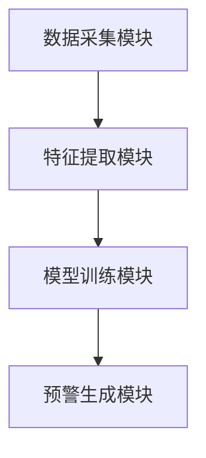

                 


```markdown
# AI辅助企业财务异常检测：实时监控与风险预警

> 关键词：AI技术、财务异常检测、实时监控、风险预警、企业财务分析、机器学习、深度学习

> 摘要：本文详细探讨了AI技术在企业财务异常检测中的应用，从实时监控到风险预警，系统地分析了财务异常检测的核心概念、算法原理、系统设计以及实际项目中的实现细节。通过结合具体案例和代码示例，深入阐述了如何利用AI技术提升企业财务风险管理能力，帮助企业实现智能化的财务异常检测与风险预警。

---

# 第一部分: 财务异常检测的背景与挑战

## 第1章: 财务异常检测的背景与挑战

### 1.1 企业财务异常检测的重要性

#### 1.1.1 财务异常检测的定义与目的
财务异常检测是指通过分析企业的财务数据，识别出与正常情况不符的异常行为或趋势。其目的是为了帮助企业及时发现潜在的财务风险，避免重大损失。

#### 1.1.2 企业财务异常的常见类型
企业财务异常主要包括以下几种类型：
1. **收入异常**：收入突然大幅波动。
2. **成本异常**：成本与收入不成比例变化。
3. **利润异常**：利润与行业平均水平偏离较大。
4. **现金流异常**：现金流与企业实际经营情况不符。
5. **资产负债异常**：资产负债结构不合理或突然变化。

#### 1.1.3 财务异常对企业的影响
1. **经济损失**：未能及时发现财务异常可能导致企业遭受重大经济损失。
2. **声誉损失**：财务异常可能导致企业声誉受损。
3. **合规风险**：财务异常可能引发法律合规问题。

### 1.2 AI技术在财务异常检测中的作用

#### 1.2.1 AI技术如何提升财务异常检测的效率
1. **自动化分析**：AI能够快速处理大量财务数据，发现异常。
2. **模式识别**：通过机器学习算法识别隐藏的财务模式。
3. **实时监控**：AI可以实现对企业财务数据的实时监控。

#### 1.2.2 数据驱动的财务分析新范式
1. **数据丰富性**：利用结构化和非结构化数据进行分析。
2. **预测能力**：基于历史数据预测未来财务状况。
3. **动态调整**：根据实时数据动态调整检测模型。

#### 1.2.3 企业财务风险预警的智能化转型
1. **从传统到智能**：AI技术使财务风险预警更加智能化。
2. **精准识别**：通过AI算法实现精准的财务异常识别。
3. **持续优化**：模型可以不断优化，提升检测准确率。

## 第2章: AI辅助财务异常检测的技术基础

### 2.1 机器学习与深度学习在财务分析中的应用

#### 2.1.1 机器学习的基本概念
机器学习是一种通过数据训练模型，使其能够从数据中学习并做出预测的技术。在财务异常检测中，常用监督学习和无监督学习方法。

#### 2.1.2 深度学习在财务数据处理中的优势
深度学习通过多层神经网络能够自动提取数据特征，适用于处理复杂的财务数据模式。

#### 2.1.3 自然语言处理（NLP）在财务文本分析中的应用
NLP技术可以分析财务报告、新闻等文本数据，提取有用信息辅助财务分析。

### 2.2 数据预处理与特征工程

#### 2.2.1 数据清洗与标准化
1. **数据清洗**：去除无效数据，处理缺失值。
2. **标准化**：将数据归一化，便于模型训练。

#### 2.2.2 特征选择与降维
1. **特征选择**：筛选对财务异常检测有重要影响的特征。
2. **降维**：使用PCA等方法降低数据维度，减少计算复杂度。

#### 2.2.3 时间序列数据的处理方法
时间序列数据可以通过ARIMA、LSTM等模型进行分析，捕捉趋势和周期性变化。

---

# 第二部分: 财务异常检测的核心概念与原理

## 第3章: 财务异常检测的核心概念

### 3.1 财务异常检测的定义与分类

#### 3.1.1 财务异常的定义与特征
财务异常是指企业在财务数据中出现的异常波动或偏离正常经营状况的情况。

#### 3.1.2 财务异常检测的边界与外延
1. **边界**：如何定义“正常”与“异常”。
2. **外延**：财务异常可能涉及多个业务领域。

#### 3.1.3 财务异常检测的核心要素组成
1. **数据来源**：财务报表、交易记录等。
2. **检测方法**：统计方法、机器学习方法等。
3. **预警机制**：实时报警、风险评估等。

### 3.2 AI模型在财务异常检测中的核心原理

#### 3.2.1 基于统计学习的异常检测方法
统计方法通过计算数据的分布情况，识别偏离平均值的异常点。

#### 3.2.2 基于深度学习的异常检测方法
深度学习通过多层网络结构，自动学习数据特征，识别异常。

#### 3.2.3 异常检测算法的优缺点对比
| 算法类型     | 优点                          | 缺点                          |
|--------------|-------------------------------|-------------------------------|
| 统计方法     | 简单易实现                   | 对异常分布的假设较强           |
| 机器学习     | 可处理复杂数据               | 需大量标注数据                 |
| 深度学习     | 自动学习特征，效果好         | 计算资源消耗大                 |

---

## 第4章: 异常检测算法的核心原理与实现

### 4.1 基于统计的方法

#### 4.1.1 Z-score方法
Z-score通过计算数据点与平均值的距离标准化得分，判断是否为异常值。

#### 4.1.2 算术平均数与标准差方法
通过计算数据的均值和标准差，判断数据点是否偏离正常范围。

#### 4.1.3 算法实现与优缺点分析
1. **实现简单**：易于理解和实现。
2. **依赖分布假设**：假设数据服从正态分布。

### 4.2 基于机器学习的方法

#### 4.2.1 Isolation Forest算法
Isolation Forest通过构建隔离树，快速识别异常点。

#### 4.2.2 One-Class SVM算法
One-Class SVM用于学习正常数据的分布，识别异常点。

#### 4.2.3 算法实现与优缺点分析
1. **优点**：无需大量标注数据，适合无监督学习。
2. **缺点**：对异常点比例敏感。

---

# 第三部分: 系统分析与架构设计方案

## 第5章: 财务异常检测系统的分析与设计

### 5.1 问题场景介绍

#### 5.1.1 财务异常检测的核心问题
1. **数据获取**：如何高效获取财务数据。
2. **特征提取**：如何从财务数据中提取有效特征。
3. **模型训练**：如何训练高效的异常检测模型。
4. **预警生成**：如何及时生成风险预警。

### 5.2 系统功能设计

#### 5.2.1 系统功能模块
1. **数据采集模块**：从财务系统获取数据。
2. **特征提取模块**：提取关键特征。
3. **模型训练模块**：训练异常检测模型。
4. **预警生成模块**：根据模型结果生成预警。

#### 5.2.2 系统功能流程
1. 数据采集 -> 特征提取 -> 模型训练 -> 预警生成。

### 5.3 系统架构设计

#### 5.3.1 系统架构图


#### 5.3.2 系统接口设计
1. 数据接口：与财务系统对接。
2. 预警接口：向相关人员发送预警信息。

---

# 第四部分: 项目实战

## 第6章: AI辅助财务异常检测的项目实战

### 6.1 环境安装与配置

#### 6.1.1 环境要求
1. Python 3.8+
2. 安装必要的库：pandas、numpy、scikit-learn、tensorflow。

### 6.2 系统核心实现

#### 6.2.1 数据预处理代码
```python
import pandas as pd
import numpy as np

# 加载数据
df = pd.read_csv('financial_data.csv')

# 删除缺失值
df.dropna(inplace=True)

# 标准化处理
from sklearn.preprocessing import StandardScaler
scaler = StandardScaler()
df_scaled = scaler.fit_transform(df)
```

#### 6.2.2 异常检测模型实现
```python
from sklearn.ensemble import IsolationForest

# 训练模型
model = IsolationForest(n_estimators=100, random_state=42)
model.fit(df_scaled)

# 预测异常点
outlier_flag = model.predict(df_scaled)
outlier_flag[outlier_flag == -1] = 1
outlier_flag[outlier_flag == 1] = 0
```

### 6.3 实际案例分析

#### 6.3.1 案例背景
某企业财务数据出现异常波动，通过AI模型识别出潜在的财务风险。

#### 6.3.2 数据分析与解读
通过模型检测，发现企业的收入与成本比例突然变化，提示可能存在虚增收入的情况。

---

# 第五部分: 总结与展望

## 第7章: 总结与展望

### 7.1 最佳实践 tips
1. 数据预处理是关键。
2. 选择合适的算法，结合业务需求。
3. 模型需要不断优化和调整。

### 7.2 小结
本文详细探讨了AI在企业财务异常检测中的应用，从技术基础到实际实现，为读者提供了全面的指导。

### 7.3 注意事项
1. 数据隐私保护。
2. 模型解释性问题。

### 7.4 拓展阅读
1. 《机器学习实战》
2. 《深度学习导论》

---

通过本文的详细讲解，读者可以全面了解AI在企业财务异常检测中的应用，并能够实际操作相关技术，帮助企业实现智能化的财务风险管理。
```

