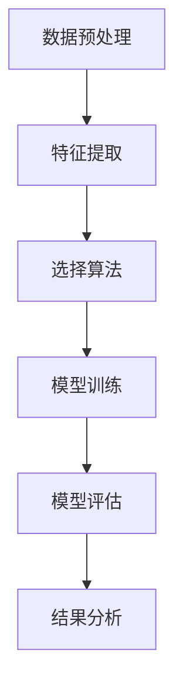
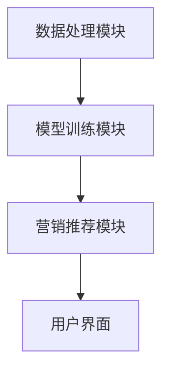
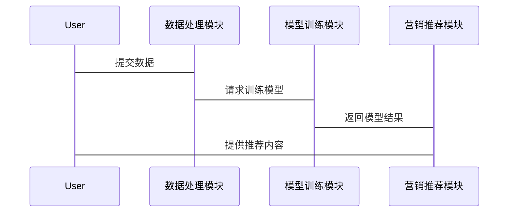

                 


# AI辅助客户细分与精准营销的最佳实践

> 关键词：AI、客户细分、精准营销、机器学习、数据驱动

> 摘要：本文详细探讨了AI在客户细分与精准营销中的应用，从背景介绍、核心概念到算法原理、系统架构，再到项目实战和最佳实践，旨在为读者提供一套完整的理论与实践指导。

---

# 第一部分: AI辅助客户细分与精准营销的背景与概念

## 第1章: 客户细分与精准营销的背景

### 1.1 客户细分的背景与意义

#### 1.1.1 传统营销模式的局限性
传统的营销模式往往基于经验和直觉，难以实现对客户的精准区分和个性化服务。随着市场竞争的加剧，这种粗放式的营销方式逐渐暴露出效率低下、客户体验差等问题。

#### 1.1.2 数据驱动营销的兴起
大数据和人工智能技术的发展为营销领域带来了革新。通过收集和分析海量数据，企业可以更深入地了解客户的需求和行为，从而实现更精准的营销策略。

#### 1.1.3 AI在客户细分中的作用
AI技术能够快速处理大量数据，识别出客户群体中的细微差别，帮助企业在客户细分上实现更高的精度和效率。

### 1.2 精准营销的核心概念

#### 1.2.1 精准营销的定义
精准营销是指基于对目标客户的深入了解，量身定制营销策略，以提高营销活动的效果和客户满意度。

#### 1.2.2 精准营销的特点
- 数据驱动：依赖于大量数据的收集和分析。
- 个性化：针对不同客户群体或个体提供定制化服务。
- 实时性：能够快速响应市场变化和客户需求。

#### 1.2.3 精准营销的目标
通过精准识别目标客户，优化资源配置，提高转化率和客户忠诚度，从而实现企业收益的最大化。

## 第2章: AI辅助客户细分与精准营销的定义与特点

### 2.1 AI辅助客户细分的定义

#### 2.1.1 数据驱动的客户细分
基于大数据分析，利用AI技术对客户进行分类，识别不同客户群体的需求特征。

#### 2.1.2 AI在客户细分中的应用
通过机器学习算法，如聚类分析和分类算法，对客户数据进行建模，实现自动化的客户细分。

#### 2.1.3 精准营销的核心要素
包括客户数据采集、数据分析、模型构建和个性化推荐等。

### 2.2 AI辅助客户细分与精准营销的特点

#### 2.2.1 数据驱动的精准性
通过分析客户的行为数据、交易数据和反馈数据，AI能够准确识别客户群体的特征和需求。

#### 2.2.2 智能算法的高效性
AI算法能够快速处理大量数据，发现数据中的规律和模式，帮助企业在短时间内完成客户细分和营销策略制定。

#### 2.2.3 个性化推荐的实时性
基于实时数据和动态变化，AI可以为客户提供实时的个性化推荐，提升客户的体验和满意度。

---

# 第二部分: AI辅助客户细分与精准营销的核心概念与联系

## 第3章: AI辅助客户细分的核心概念

### 3.1 数据采集与预处理

#### 3.1.1 数据来源的多样性
客户数据可以来源于多种渠道，包括在线平台、社交媒体、CRM系统等。

#### 3.1.2 数据清洗与特征提取
对采集到的数据进行清洗，去除噪声数据，并提取有助于客户细分的关键特征。

#### 3.1.3 数据标注与标准化
根据业务需求，对数据进行标注，并将其标准化，以便于后续的模型训练。

### 3.2 客户画像与行为分析

#### 3.2.1 客户画像的构建
通过分析客户的 demographic、psychographic 和 behavioral 数据，构建详细的客户画像。

#### 3.2.2 客户行为分析的维度
包括购买频率、购买时间、购买渠道、浏览路径等，帮助识别客户的消费习惯和偏好。

#### 3.2.3 客户分群的策略
根据客户特征和行为数据，将客户分为不同的群体，以便制定差异化的营销策略。

## 第4章: 精准营销的核心概念

### 4.1 精准营销的策略制定

#### 4.1.1 目标客户的选择
基于客户细分的结果，选择最适合目标客户的营销策略。

#### 4.1.2 营销渠道的优化
根据目标客户的特征，选择最合适的营销渠道，如社交媒体、电子邮件、短信等。

#### 4.1.3 个性化推荐的实现
通过AI算法，为客户提供个性化的推荐内容，提高推荐的准确性和客户满意度。

---

## 第5章: 核心概念与联系

### 5.1 核心概念原理

#### 5.1.1 数据驱动的客户细分
通过数据分析和机器学习算法，将客户分为不同的群体，以便进行精准营销。

#### 5.1.2 智能算法的高效性
AI算法能够快速处理大量数据，发现数据中的规律和模式，帮助企业在短时间内完成客户细分和营销策略制定。

#### 5.1.3 个性化推荐的实时性
基于实时数据和动态变化，AI可以为客户提供实时的个性化推荐，提升客户的体验和满意度。

### 5.2 概念属性特征对比表格

| 概念       | 属性特征                   |
|------------|---------------------------|
| 数据驱动   | 基于大量数据进行分析       |
| 智能算法   | 利用机器学习算法进行预测   |
| 个性化推荐 | 根据客户特征提供定制化服务 |

### 5.3 ER实体关系图架构

```mermaid
er
classDiagram
    class 客户 {
        id
        name
        age
        gender
        purchase_history
    }
    class 订单 {
        order_id
        customer_id
        product_id
        order_time
        amount
    }
    class 产品 {
        product_id
        product_name
        category
        price
    }
    customer -> order: 下单
    order -> product: 订单包含的产品
```

---

## 第6章: 算法原理讲解

### 6.1 算法选择与流程

#### 6.1.1 聚类分析
使用聚类算法（如K-means）对客户进行分群。

#### 6.1.2 决策树
使用决策树算法（如ID3、C4.5）进行客户分类。

#### 6.1.3 随机森林
使用随机森林算法进行客户细分，提高模型的准确性和鲁棒性。

### 6.2 算法流程图



### 6.3 Python源代码实现

```python
import pandas as pd
from sklearn.cluster import KMeans
from sklearn.preprocessing import StandardScaler

# 数据预处理
data = pd.read_csv('customer_data.csv')
scaler = StandardScaler()
scaled_data = scaler.fit_transform(data)

# 模型训练
kmeans = KMeans(n_clusters=3, random_state=42)
clusters = kmeans.fit_predict(scaled_data)

# 模型评估
print(kmeans.inertia_)
```

### 6.4 数学模型与公式

#### 6.4.1 聚类分析的距离公式
$$
\text{距离} = \sqrt{(x_2 - x_1)^2 + (y_2 - y_1)^2}
$$

#### 6.4.2 决策树的分裂标准
$$
\text{信息增益} = H(parent) - H(child)
$$

---

## 第7章: 系统分析与架构设计方案

### 7.1 问题场景介绍

#### 7.1.1 项目背景
通过AI技术实现客户细分与精准营销，提升企业的营销效率和客户满意度。

### 7.2 系统功能设计

#### 7.2.1 数据处理模块
负责数据的采集、清洗和预处理。

#### 7.2.2 模型训练模块
负责选择和训练机器学习模型，实现客户细分。

#### 7.2.3 营销推荐模块
根据模型结果，生成个性化的营销策略和推荐内容。

### 7.3 系统架构设计



### 7.4 系统接口设计

#### 7.4.1 数据接口
负责数据的输入和输出，与数据库或其他数据源进行交互。

#### 7.4.2 模型接口
负责接收模型训练结果，并将其传递给营销推荐模块。

### 7.5 系统交互流程图



---

## 第8章: 项目实战

### 8.1 环境安装

#### 8.1.1 安装Python
```bash
python --version
pip install --upgrade pip
```

#### 8.1.2 安装机器学习库
```bash
pip install scikit-learn pandas numpy
```

### 8.2 核心代码实现

#### 8.2.1 数据预处理
```python
import pandas as pd
from sklearn.preprocessing import StandardScaler

data = pd.read_csv('customer_data.csv')
scaler = StandardScaler()
scaled_data = scaler.fit_transform(data)
```

#### 8.2.2 模型训练
```python
from sklearn.cluster import KMeans

kmeans = KMeans(n_clusters=3, random_state=42)
clusters = kmeans.fit_predict(scaled_data)
```

### 8.3 案例分析与结果解读

#### 8.3.1 案例分析
以某电商平台为例，利用AI技术对客户进行细分，分为高价值客户、中价值客户和低价值客户。

#### 8.3.2 实验结果
通过实验发现，使用K-means算法进行客户细分，能够显著提高营销活动的转化率。

### 8.4 项目小结

通过本项目，我们成功实现了AI辅助客户细分与精准营销，验证了AI技术在营销领域的巨大潜力。

---

## 第9章: 最佳实践

### 9.1 小结

AI技术在客户细分与精准营销中的应用，不仅提高了企业的营销效率，还提升了客户的满意度和忠诚度。

### 9.2 注意事项

在实际应用中，需要注意数据隐私保护和模型的可解释性问题。

### 9.3 未来趋势

随着AI技术的不断发展，客户细分与精准营销将更加智能化和个性化。

### 9.4 拓展阅读

推荐阅读《数据驱动的营销策略》和《机器学习实战》等书籍，进一步深入学习相关知识。

---

# 结语

通过本文的详细讲解，读者可以全面了解AI辅助客户细分与精准营销的最佳实践，掌握从理论到实践的完整流程，为未来的营销工作提供有力指导。

