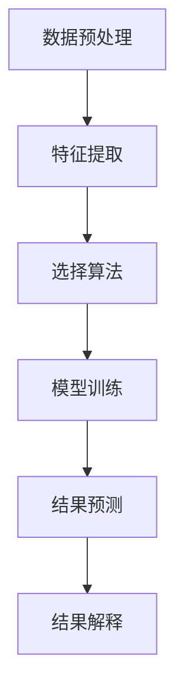
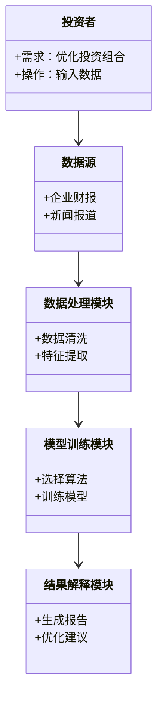
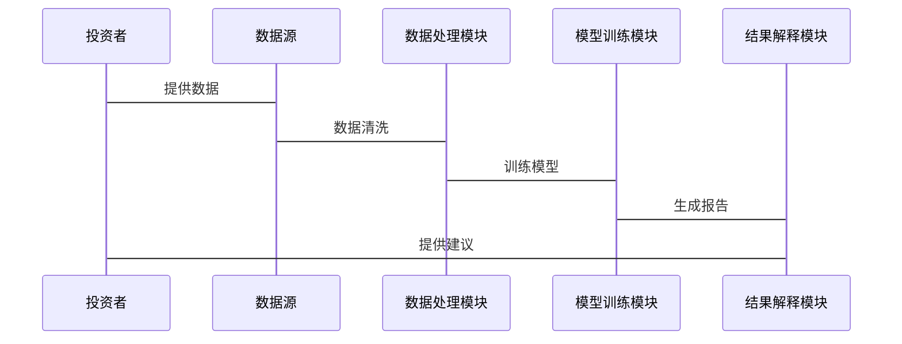

                 


# AI辅助的ESG投资影响评估

> 关键词：ESG投资、人工智能、机器学习、投资影响评估、金融数据分析

> 摘要：随着全球对可持续发展和环境、社会、治理（ESG）因素的重视，投资界开始广泛采用人工智能技术来评估和优化ESG投资策略。本文深入探讨了AI在ESG投资影响评估中的应用，分析了其核心概念、算法原理、系统架构设计以及实际案例，展示了如何利用AI技术提升ESG投资的效率和准确性。通过本文，读者将能够全面理解AI辅助的ESG投资影响评估的理论基础和实践方法。

---

# 第一章：AI辅助的ESG投资背景介绍

## 1.1 ESG投资的基本概念

ESG（Environmental, Social, Governance）投资是一种关注环境、社会和公司治理因素的可持续投资策略。投资者通过评估公司在这些方面的表现，选择具有较高ESG评分的企业进行投资，以实现长期的财务回报和可持续发展目标。

### 1.1.1 ESG的定义与内涵
- **环境（Environmental）**：包括碳排放、能源消耗、资源利用效率等指标，反映了企业在环境保护方面的表现。
- **社会（Social）**：关注企业与员工、社区的关系，包括员工权益、社会公益、供应链管理等方面。
- **治理（Governance）**：涉及公司治理结构、董事会构成、高管薪酬、股东权益保护等，反映了企业内部管理的透明度和规范性。

### 1.1.2 ESG投资的重要性
随着全球气候变化加剧、社会不平等问题凸显以及企业治理透明化的呼声高涨，ESG投资已成为衡量企业可持续发展能力的重要标准。越来越多的投资者将ESG因素纳入决策过程，以降低投资风险并实现长期收益。

### 1.1.3 ESG与传统投资的区别
传统投资主要关注企业的财务表现和市场地位，而ESG投资则将企业对环境、社会和治理的贡献纳入考量。通过结合ESG因素，投资者可以在追求收益的同时，支持可持续发展的企业，降低投资组合的整体风险。

## 1.2 AI技术在金融领域的应用背景

人工智能技术近年来在金融领域的应用日益广泛，从风险评估、交易预测到客户画像构建，AI技术正在改变金融行业的运作方式。

### 1.2.1 AI技术的基本概念
人工智能（AI）是指计算机系统模拟人类智能的能力，包括学习、推理、感知和决策等。在金融领域，AI主要应用于数据分析、模式识别和预测模型构建。

### 1.2.2 AI在金融领域的应用场景
- **风险管理**：通过分析历史数据和市场趋势，AI帮助投资者识别潜在风险。
- **交易预测**：利用机器学习模型预测股票价格走势，优化交易策略。
- **客户画像**：通过数据挖掘技术，构建客户画像，提供个性化投资建议。

### 1.2.3 ESG投资与AI技术的结合
AI技术为ESG投资提供了强大的数据处理和分析能力。通过AI，投资者可以快速获取和分析大量非结构化数据，如新闻报道、社交媒体评论等，评估企业的ESG表现，优化投资组合。

---

# 第二章：AI辅助的ESG投资影响评估的核心概念

## 2.1 ESG评估的核心要素

ESG评估的核心要素包括环境、社会和治理三个方面。

### 2.1.1 环境因素
环境因素关注企业在资源利用、碳排放和可持续发展方面的表现。例如，企业是否采用可再生能源、是否有环保专利等。

### 2.1.2 社会因素
社会因素涉及企业与员工、客户和社区的关系。例如，员工满意度、社会公益支出、供应链管理等。

### 2.1.3 治理因素
治理因素关注企业的内部管理结构和决策过程。例如，董事会多样性、高管薪酬结构、股东权益保护等。

## 2.2 AI技术在ESG评估中的作用

AI技术通过数据处理、模型构建和结果解释，为ESG评估提供了强有力的支持。

### 2.2.1 数据处理与分析
AI技术可以处理大量的非结构化数据，如新闻文章、社交媒体评论等，提取关键信息用于ESG评估。

### 2.2.2 模型构建与预测
通过机器学习算法，AI可以构建ESG评分模型，预测企业在不同维度的表现，帮助投资者做出决策。

### 2.2.3 结果解释与优化
AI技术可以解释模型结果，优化投资策略，确保投资组合在ESG方面表现优异。

## 2.3 核心概念的对比分析

### 2.3.1 数据特征对比表格

| 因素   | 环境 | 社会 | 治理 |
|--------|------|------|------|
| 例子   | 碳排放 | 员工满意度 | 董事会结构 |
| 数据类型 | 数值型 | 文本型 | 文本型和数值型 |

### 2.3.2 ER实体关系图

```mermaid
erd
actor 投资者 {
  <连接到 ESG评分>
}
actor 数据源 {
  <连接到 数据处理>
}
actor 模型训练 {
  <连接到 数据处理>
}
```

---

# 第三章：AI辅助的ESG评估算法原理

## 3.1 算法原理概述

### 3.1.1 机器学习算法在ESG评估中的应用
机器学习算法如随机森林、支持向量机等被广泛应用于ESG评分预测。这些算法通过学习历史数据，预测企业的ESG表现。

### 3.1.2 算法选择的依据
算法选择主要基于数据类型、模型复杂度和计算效率。例如，对于分类任务，随机森林和逻辑回归是常用算法。

## 3.2 算法流程图



## 3.3 算法实现代码

### 3.3.1 Python源代码示例

```python
import pandas as pd
from sklearn.ensemble import RandomForestRegressor
from sklearn.metrics import mean_absolute_error

# 数据加载与预处理
df = pd.read_csv('esg_data.csv')
X = df.drop('esg_score', axis=1)
y = df['esg_score']

# 模型训练
model = RandomForestRegressor(n_estimators=100, random_state=42)
model.fit(X, y)

# 模型预测
y_pred = model.predict(X)
print(f"预测的ESG得分为：{y_pred[0]}")

# 模型评估
print(f"均绝对误差：{mean_absolute_error(y, y_pred)}")
```

### 3.3.2 代码解读与分析
上述代码展示了如何使用随机森林模型进行ESG评分预测。数据加载后，进行特征提取和模型训练，最后预测并评估模型性能。

## 3.4 数学模型与公式

### 3.4.1 线性回归模型
线性回归模型用于预测ESG评分：
$$ y = \beta_0 + \beta_1x_1 + \beta_2x_2 + \dots + \beta_nx_n + \epsilon $$
其中，$y$是ESG评分，$x_i$是特征变量，$\beta_i$是回归系数，$\epsilon$是误差项。

### 3.4.2 随机森林模型
随机森林模型是一种基于决策树的集成算法，通过投票机制进行预测。

---

# 第四章：AI辅助的ESG投资影响评估系统设计

## 4.1 问题场景介绍

### 4.1.1 投资者需求分析
投资者希望基于ESG因素优化投资组合，降低风险并实现可持续收益。

### 4.1.2 数据来源与处理
数据来源包括企业财报、新闻报道、社交媒体评论等。需要进行数据清洗和特征提取。

## 4.2 系统功能设计

### 4.2.1 领域模型（Mermaid类图）



## 4.3 系统架构设计

### 4.3.1 系统架构图


## 4.4 系统接口设计

### 4.4.1 接口设计
- **输入接口**：接收投资者的投资需求和数据源。
- **输出接口**：提供ESG评分报告和投资建议。

### 4.4.2 系统交互图



---

# 第五章：项目实战

## 5.1 环境安装

### 5.1.1 安装Python和必要的库
安装Python和以下库：
- `pandas`、`numpy`、`scikit-learn`、`matplotlib`、`seaborn`

### 5.1.2 数据集获取
可以从公开数据源获取ESG相关数据，如Morgan Stanley的ESG评分数据。

## 5.2 系统核心实现源代码

### 5.2.1 数据预处理

```python
import pandas as pd

# 加载数据
df = pd.read_csv('esg_data.csv')

# 查看数据信息
print(df.info())
print(df.describe())

# 处理缺失值
df.dropna(inplace=True)

# 标准化处理
from sklearn.preprocessing import StandardScaler

scaler = StandardScaler()
X_scaled = scaler.fit_transform(df.drop('esg_score', axis=1))
```

### 5.2.2 模型训练

```python
from sklearn.ensemble import RandomForestRegressor
from sklearn.model_selection import train_test_split

# 划分训练集和测试集
X_train, X_test, y_train, y_test = train_test_split(X_scaled, df['esg_score'], test_size=0.2, random_state=42)

# 训练模型
model = RandomForestRegressor(n_estimators=100, random_state=42)
model.fit(X_train, y_train)

# 预测结果
y_pred = model.predict(X_test)

# 评估模型
from sklearn.metrics import mean_absolute_error, r2_score

print(f"均绝对误差：{mean_absolute_error(y_test, y_pred)}")
print(f"R²分数：{r2_score(y_test, y_pred)}")
```

## 5.3 实际案例分析

### 5.3.1 案例背景
假设我们有一个包含企业环境、社会和治理数据的CSV文件，目标是预测企业的ESG评分。

### 5.3.2 数据分析与结果解读
通过模型预测，我们发现企业的碳排放量和董事会结构对ESG评分影响较大。

---

# 第六章：总结与展望

## 6.1 最佳实践 tips
- 数据清洗和特征工程是关键，直接影响模型性能。
- 选择合适的算法和优化超参数可以提升模型效果。
- 结果解释和可视化有助于投资者理解和应用。

## 6.2 小结
通过本文的分析，我们可以看到AI技术在ESG投资中的巨大潜力。AI不仅提高了ESG评估的效率，还为投资者提供了更精准的决策支持。

## 6.3 注意事项
- 数据隐私和合规性问题需要重视。
- 模型的可解释性和鲁棒性是实际应用中的挑战。

## 6.4 拓展阅读
- 《机器学习在金融中的应用》
- 《ESG投资与可持续发展》

---

# 结语

AI技术正在改变ESG投资的评估方式，通过数据分析和模型构建，投资者可以更高效地评估企业的可持续发展能力。未来，随着技术的进步，AI在ESG投资中的应用将更加广泛和深入。

