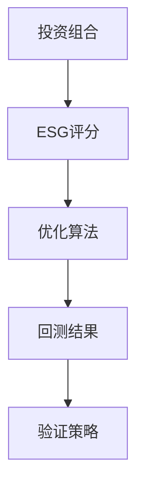
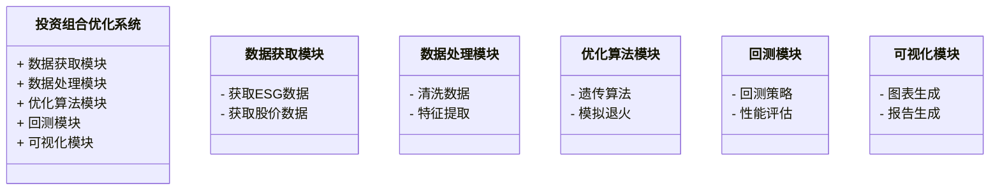
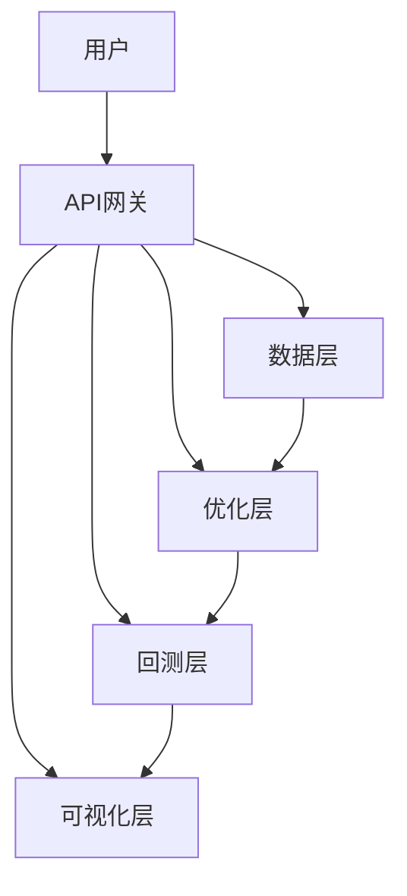
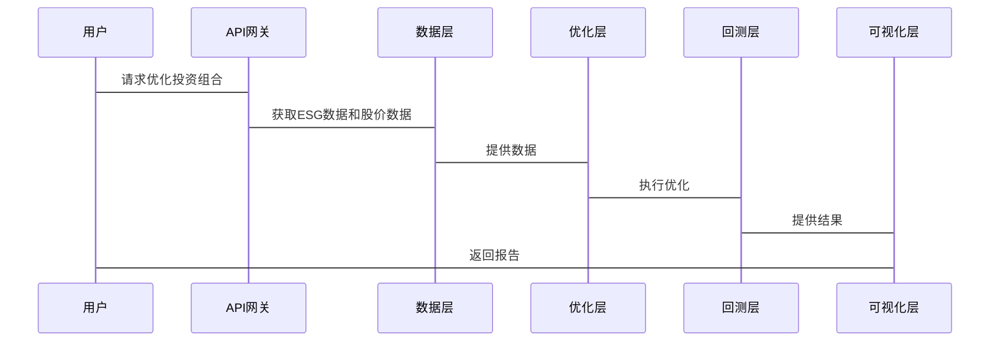

                 


# AI辅助的ESG投资组合优化与回测

## 关键词：ESG投资、人工智能、投资组合优化、回测策略、风险管理

## 摘要：本文探讨如何利用人工智能技术优化ESG投资组合，并通过回测验证其有效性。文章详细介绍了ESG评分、优化算法、回测策略以及系统架构，并通过实际案例展示AI在ESG投资中的应用。

---

# 第1章: 引言

## 1.1 问题背景

### 1.1.1 ESG投资的定义与重要性
ESG投资是指在投资决策中考虑环境、社会和公司治理因素的投资策略。随着全球对可持续发展的关注增加，ESG投资越来越受到重视。通过ESG评分，投资者可以评估公司在可持续发展方面的表现，从而做出更负责任的投资决策。

### 1.1.2 人工智能在金融领域的应用
人工智能技术在金融领域的应用日益广泛，包括风险管理、投资组合优化、市场预测等多个方面。AI能够处理大量数据，发现隐藏的模式，从而辅助投资决策。

### 1.1.3 ESG投资组合优化的挑战与机遇
ESG投资组合优化面临数据复杂性、计算复杂性等挑战，但AI技术能够有效解决这些问题，提供更高效、更准确的优化方案。

## 1.2 问题描述

### 1.2.1 投资组合优化的核心问题
投资组合优化的目标是在风险可控的前提下，最大化投资收益。ESG评分作为优化中的重要因素，需要被纳入考虑。

### 1.2.2 ESG评分的影响与作用
ESG评分反映了公司在环境、社会和治理方面的表现，直接影响投资组合的风险和收益。高ESG评分的公司通常在长期表现更优。

### 1.2.3 AI辅助优化的必要性
传统优化方法在处理复杂数据时效率较低，而AI算法如遗传算法和模拟退火能够有效优化投资组合，提高收益。

## 1.3 问题解决

### 1.3.1 AI在ESG数据处理中的应用
AI能够处理大量非结构化数据，提取ESG相关特征，生成更准确的ESG评分。

### 1.3.2 基于AI的优化算法
利用AI算法优化投资组合，考虑ESG评分和传统财务指标，找到最优投资组合。

### 1.3.3 回测策略的设计与实现
通过回测验证优化策略的有效性，评估其在不同市场条件下的表现。

## 1.4 边界与外延

### 1.4.1 ESG投资的边界条件
明确投资范围和约束条件，如资金规模、风险承受能力等。

### 1.4.2 与其他投资策略的对比
对比传统投资策略，突出ESG投资的优势和适用场景。

### 1.4.3 AI辅助的适用范围与限制
AI适用于数据驱动的优化，但在模型假设和数据质量方面存在限制。

## 1.5 概念结构与核心要素

### 1.5.1 ESG评分体系
解释ESG评分的构成，包括环境、社会和治理三个维度的具体指标。

### 1.5.2 投资组合优化模型
描述优化模型的目标函数和约束条件，说明如何将ESG评分纳入模型。

### 1.5.3 回测框架的核心要素
包括回测的时间窗口、评价指标和风险控制措施。

---

# 第2章: AI辅助ESG投资的核心概念与联系

## 2.1 核心概念原理
- ESG评分：反映公司在可持续发展方面的表现。
- 投资组合优化：通过AI算法寻找最优资产配置。
- 回测策略：验证优化策略的有效性和稳定性。

## 2.2 概念属性特征对比

| 概念   | 属性         | 特征                     |
|--------|--------------|--------------------------|
| ESG评分| 数据来源     | 公司年报、第三方评级     |
| 投资组合优化 | 目标函数   | 最大化收益，最小化风险   |
| 回测策略 | 时间窗口   | 短期、中期、长期         |

## 2.3 实体关系图（ER图）



---

# 第3章: 算法原理讲解

## 3.1 优化算法

### 3.1.1 遗传算法
- **步骤**：
  1. 初始化种群。
  2. 计算适应度（收益与风险的函数）。
  3. 选择高适应度个体。
  4. 进行交叉和变异操作。
  5. 重复迭代，直到满足终止条件。

- **公式**：
  $$ \text{适应度} = \alpha \times \text{收益} + (1-\alpha) \times \text{风险} $$
  其中，$$ \alpha $$ 是权重系数。

### 3.1.2 模拟退火算法
- **步骤**：
  1. 初始化当前解。
  2. 计算当前解的适应度。
  3. 生成新解，计算适应度。
  4. 如果新解更好，接受为当前解；否则，以概率接受。
  5. 降低温度，重复步骤，直到收敛。

- **公式**：
  $$ \text{概率} = \exp(-\Delta/\text{温度}) $$

### 3.1.3 其他优化算法
- 粒子群优化：通过粒子的运动寻找最优解。
- 均摊法：结合多种算法的优点。

## 3.2 回测算法

### 3.2.1 蒙特卡洛方法
- **步骤**：
  1. 生成大量随机投资组合。
  2. 计算每个组合的收益和风险。
  3. 统计分布，评估策略的有效性。

### 3.2.2 时间序列分析
- **步骤**：
  1. 数据预处理：去除异常值，填充缺失值。
  2. 建立ARIMA模型或LSTM模型预测未来价格。
  3. 回测策略：基于预测结果进行交易决策。

### 3.2.3 回测策略的实现
- 通过回测生成收益曲线，评估最大回撤、夏普比率等指标。

---

# 第4章: 系统分析与架构设计方案

## 4.1 问题场景介绍

### 4.1.1 ESG投资的典型场景
- 投资者希望构建一个ESG优化的投资组合。
- 使用历史数据和实时数据进行优化和回测。

### 4.1.2 AI辅助优化的系统需求
- 数据处理模块：获取和清洗ESG相关数据。
- 优化模块：实现多种优化算法。
- 回测模块：模拟投资组合的表现。

## 4.2 项目介绍

### 4.2.1 项目目标
开发一个基于AI的ESG投资组合优化系统，帮助投资者实现可持续投资。

### 4.2.2 项目范围
涵盖数据获取、处理、优化、回测和可视化五个模块。

### 4.2.3 项目约束
- 数据来源：使用公开的ESG评分和历史股价。
- 计算资源：使用云平台进行分布式计算。

## 4.3 系统功能设计

### 4.3.1 领域模型（Mermaid类图）



### 4.3.2 系统架构设计（Mermaid架构图）



### 4.3.3 系统接口设计
- API接口：提供数据获取、优化计算、回测结果查询等功能。

### 4.3.4 系统交互流程（Mermaid序列图）



---

# 第5章: 项目实战

## 5.1 环境安装

### 5.1.1 安装Python环境
使用Anaconda或virtualenv管理环境。

### 5.1.2 安装依赖库
安装numpy、pandas、scipy、matplotlib、backtrader等库。

## 5.2 系统核心实现源代码

### 5.2.1 数据获取模块

```python
import pandas as pd
import requests

def get_esg_data(ticker):
    # 模拟从API获取ESG数据
    response = requests.get(f'https://api.example.com/esg/{ticker}')
    return pd.DataFrame(response.json()['esg_scores'])
```

### 5.2.2 优化算法实现

```python
import numpy as np

def genetic_algorithm(population, fitness_func, num_generations):
    best = None
    for _ in range(num_generations):
        fitness = np.array([fitness_func(individual) for individual in population])
        best = population[np.argmax(fitness)]
        # 进行交叉和变异操作
    return best
```

### 5.2.3 回测模块实现

```python
import backtrader as bt

class ESGBacktester(bt.Strategy):
    def __init__(self):
        self.data = self.datas[0]
        self.order = None

    def next(self):
        # 回测策略逻辑
        pass
```

## 5.3 代码应用解读与分析

### 5.3.1 数据获取与处理
- 使用requests库从API获取ESG数据。
- 使用pandas进行数据清洗和处理。

### 5.3.2 优化算法实现
- 遗传算法实现投资组合优化，目标函数为夏普比率最大化。

### 5.3.3 回测策略
- 使用backtrader框架实现回测，评估策略的收益和风险。

## 5.4 实际案例分析

### 5.4.1 数据准备
获取特定时间段的ESG评分和股价数据。

### 5.4.2 优化过程
运行遗传算法，找到最优投资组合。

### 5.4.3 回测结果
评估优化后的投资组合在历史数据上的表现，计算夏普比率、最大回撤等指标。

## 5.5 项目小结

### 5.5.1 项目总结
通过AI技术实现ESG投资组合优化，验证策略的有效性。

### 5.5.2 成果展示
展示优化后的投资组合收益和风险表现。

### 5.5.3 问题与改进方向
分析项目中的问题，并提出改进建议，如引入机器学习模型提升预测能力。

---

# 第6章: 最佳实践与小结

## 6.1 小结
本文详细介绍了AI辅助的ESG投资组合优化方法，从数据处理到优化算法，再到回测验证，展示了完整的实现过程。

## 6.2 注意事项
- 数据质量对结果影响重大，需确保数据的准确性和完整性。
- 回测结果仅供参考，实际投资需谨慎。
- 模型需定期更新，以适应市场变化。

## 6.3 拓展阅读
推荐相关书籍和论文，鼓励读者深入研究AI在金融中的应用。

---

# 结语

AI技术正在改变金融行业，ESG投资作为可持续发展的关键领域，将受益于AI技术的进步。通过本文的介绍，读者可以掌握AI辅助ESG投资组合优化的核心方法，并在实际应用中不断提升优化效果。未来，随着技术的发展，AI在ESG投资中的应用将更加广泛和深入。

