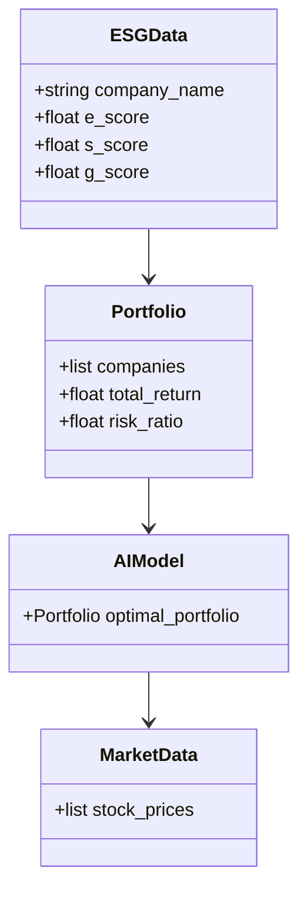
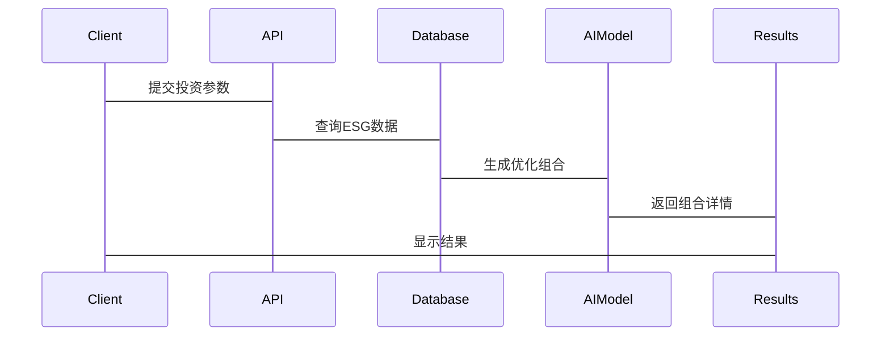
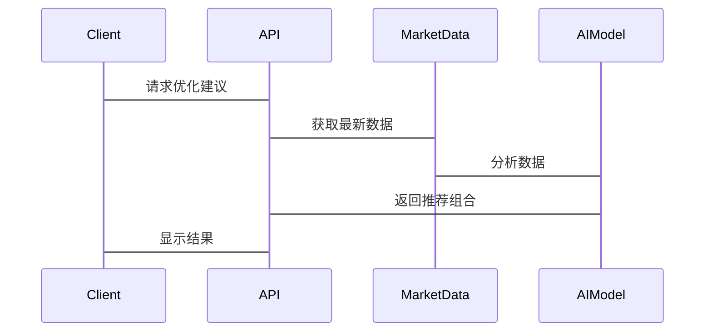

                 


# AI辅助的ESG投资组合优化工具

> 关键词：ESG投资，人工智能，投资组合优化，强化学习，系统架构

> 摘要：随着全球对可持续发展的关注增加，ESG（环境、社会和治理）投资变得越来越重要。本文探讨了如何利用人工智能技术优化ESG投资组合，分析了核心概念、算法原理、系统架构，并通过实际案例展示了AI在ESG投资中的应用。

---

## 第1章: ESG投资与AI辅助优化的背景介绍

### 1.1 ESG投资的背景与重要性

#### 1.1.1 ESG投资的定义与内涵
ESG投资是一种关注环境、社会和公司治理因素的投资策略。它不仅考虑企业的财务表现，还关注企业在可持续发展方面的表现。随着全球气候变化、社会不平等等问题的加剧，ESG投资已成为推动社会和经济可持续发展的重要工具。

#### 1.1.2 ESG投资的全球发展趋势
近年来，ESG投资在全球范围内迅速发展。根据相关报告，全球ESG管理资产规模已超过20万亿美元，且这一趋势仍在持续增长。投资者越来越关注企业对社会和环境的贡献，ESG投资成为主流。

#### 1.1.3 ESG投资对可持续发展的意义
ESG投资通过引导资金流向环保、社会责任强的企业，推动社会整体的可持续发展。它不仅帮助投资者实现财务回报，还促进了社会的公平与正义，为子孙后代创造了更好的生活环境。

### 1.2 AI在金融投资中的应用

#### 1.2.1 AI在金融数据分析中的作用
人工智能技术在金融数据分析中具有显著优势。通过机器学习算法，AI可以从海量数据中提取有用信息，识别市场趋势，预测股票价格，评估企业风险。AI的应用提高了金融分析的效率和准确性。

#### 1.2.2 AI在投资组合优化中的优势
传统的投资组合优化方法依赖于历史数据和统计模型，存在一定的局限性。而AI技术可以通过深度学习和强化学习，动态调整投资组合，实时响应市场变化。AI优化的投资组合更具个性化和适应性，能够更好地应对复杂市场环境。

#### 1.2.3 ESG与AI结合的潜力
将ESG因素融入投资组合优化，AI可以通过分析企业的ESG评分，筛选出符合可持续发展理念的企业，构建更优的投资组合。AI的预测能力和数据处理能力，使得ESG投资更加科学化、系统化。

### 1.3 ESG投资组合优化的挑战与机遇

#### 1.3.1 ESG投资组合优化的核心问题
ESG投资组合优化的核心问题在于如何平衡财务回报与社会价值。投资者需要在追求收益的同时，考虑企业的环境和社会影响，这对传统的投资优化方法提出了挑战。

#### 1.3.2 AI技术在解决ESG优化问题中的作用
AI技术可以通过复杂的算法，帮助投资者找到最优的投资组合。它不仅考虑传统的财务指标，还综合评估企业的ESG表现，为投资者提供更全面的决策支持。

#### 1.3.3 当前市场中的主要挑战
当前，ESG投资面临数据不完整、评估标准不统一等问题。此外，市场的波动性和不确定性增加了投资组合优化的难度。AI技术需要不断优化算法，提高模型的准确性和适应性。

#### 1.3.4 机遇
随着技术的进步和数据的积累，AI在ESG投资中的应用前景广阔。通过技术创新，投资者可以更高效地优化投资组合，实现财务与社会价值的双重目标。

## 第2章: ESG投资组合优化的核心概念与联系

### 2.1 核心概念原理

#### 2.1.1 ESG评分的计算方法
ESG评分是衡量企业环境、社会和治理表现的重要指标。评分通常基于企业的公开数据，结合行业标准和专家意见进行评估。常见的评分机构有MSCI、Sustainalytics等。

#### 2.1.2 投资组合优化的基本原理
投资组合优化的目标是在给定风险水平下实现最大收益，或在给定收益下实现最小风险。传统的优化方法基于均值-方差模型，而现代方法引入了更多因素，如ESG表现。

#### 2.1.3 AI模型在ESG优化中的应用
AI模型可以通过分析企业的ESG评分、历史数据和市场动态，预测企业的未来表现。基于这些预测，AI可以优化投资组合，选择最优的企业组合，实现收益与风险的平衡。

### 2.2 核心概念属性对比表

#### 表2.1: ESG评分与传统财务指标对比

| 属性         | ESG评分          | 传统财务指标      |
|--------------|------------------|------------------|
| 评估维度     | 环境、社会、治理 | 利润、股价、营收  |
| 数据来源     | 第三方机构       | 公司财报、市场数据 |
| 评估目标     | 可持续发展       | 财务回报          |
| 应用场景     | 投资决策         | 投资决策          |

### 2.3 ESG投资组合优化的ER实体关系图


## 第3章: AI辅助ESG投资组合优化的算法原理

### 3.1 强化学习在投资组合优化中的应用

#### 3.1.1 强化学习的基本原理
强化学习是一种机器学习方法，通过智能体与环境的交互，学习最优策略。智能体在每一步选择一个动作，环境返回奖励或惩罚，智能体通过不断试错，找到最大化累计奖励的策略。

#### 3.1.2 在ESG优化中的强化学习模型构建
在ESG投资组合优化中，智能体可以是投资者，环境是金融市场。智能体根据当前的投资组合状态，选择买入或卖出某些股票，环境返回投资收益。通过不断学习，智能体找到最优的投资策略。

#### 3.1.3 算法步骤与流程图

```mermaid
graph LR
    Start --> Initialize_Policy
    Initialize_Policy --> Loop
    Loop --> [选择动作]
    Loop --> [计算收益]
    Loop --> [更新策略]
    Loop --> [结束条件？]
    Loop --> End
```

#### 3.1.4 算法实现代码示例

```python
import numpy as np
import gym

class ESGStockEnv(gym.Env):
    def __init__(self, stock_prices):
        self.prices = stock_prices
        self.current_step = 0
        self.observation_space = gym.spaces.Box(low=0, high=1, shape=(1,))
        self.action_space = gym.spaces.Discrete(2)  # 0: sell, 1: buy

    def reset(self):
        self.current_step = 0
        return np.array([self.prices[0]])

    def step(self, action):
        self.current_step += 1
        if action == 1:  # buy
            reward = self.prices[self.current_step] - self.prices[self.current_step - 1]
        else:  # sell
            reward = 0
        done = self.current_step >= len(self.prices) - 1
        return np.array([self.prices[self.current_step]]), reward, done, {}

# 初始化环境
env = ESGStockEnv(stock_prices)

# 初始化策略
policy = nn.Sequential(
    nn.Linear(1, 64),
    nn.ReLU(),
    nn.Linear(64, 2)
)

# 定义损失函数和优化器
criterion = nn.CrossEntropyLoss()
optimizer = torch.optim.Adam(policy.parameters(), lr=0.001)

# 训练过程
for _ in range(1000):
    state = env.reset()
    total_reward = 0
    done = False
    while not done:
        action_probs = policy(state)
        action_probs = F.softmax(action_probs, dim=-1)
        action = torch.multinomial(action_probs, num_samples=1).item()
        next_state, reward, done, _ = env.step(action)
        total_reward += reward
    # 反向传播和优化
    optimizer.zero_grad()
    outputs = policy(state)
    loss = criterion(outputs, torch.tensor([action]))
    loss.backward()
    optimizer.step()
```

#### 3.1.5 算法数学模型和公式
强化学习的优化目标是最大化累计奖励，可以用以下公式表示：

$$
J(\theta) = \mathbb{E}\left[\sum_{t=1}^T r_t\right]
$$

其中，$\theta$ 是策略参数，$r_t$ 是第$t$步的奖励。通过梯度上升方法，更新策略参数：

$$
\theta = \theta + \alpha \nabla_\theta J(\theta)
$$

### 3.2 遗传算法在投资组合优化中的应用

#### 3.2.1 遗传算法的基本原理
遗传算法是一种模拟自然选择的优化方法。它通过生成一组候选解，通过适应度评估、选择、交叉和变异等操作，逐步优化解的质量。

#### 3.2.2 在ESG优化中的遗传算法实现


#### 3.2.3 算法实现代码示例

```python
def evaluate_portfolio(portfolio):
    # 计算投资组合的收益和风险
    return -portfolio.return-risk_ratio

def genetic_algorithm(population_size, generations):
    population = [random_portfolios(population_size)]
    best_portfolio = None
    for _ in range(generations):
        # 计算适应度
        fitness = [evaluate_portfolio(p) for p in population]
        # 选择
        selected = select_parents(population, fitness)
        # 交叉
        offspring = crossover(selected)
        # 变异
        mutate(offspring)
        # 更新种群
        population = offspring
        # 记录最优解
        if best_portfolio is None or evaluate_portfolio(population[0]) > evaluate_portfolio(best_portfolio):
            best_portfolio = population[0]
    return best_portfolio
```

#### 3.2.4 算法数学模型和公式
遗传算法的核心是适应度函数和选择操作。适应度函数用于评估每个候选解的质量，选择操作基于适应度值进行选择。交叉和变异操作用于生成新的候选解，推动种群的进化。

### 3.3 算法的比较与选择

#### 3.3.1 强化学习与遗传算法的比较
| 比较维度 | 强化学习              | 遗传算法            |
|----------|----------------------|--------------------|
| 适应性   | 高                    | 中                |
| 计算复杂度 | 高                    | 中                |
| 应用场景 | 适合动态环境          | 适合静态环境        |

#### 3.3.2 选择适合场景的算法
对于动态变化的金融市场，强化学习更具优势，因为它能够实时适应市场变化。而遗传算法更适合静态或变化较小的环境。

## 第4章: 系统分析与架构设计方案

### 4.1 问题场景介绍
本系统旨在为投资者提供基于ESG评分的投资组合优化工具。系统需要处理海量数据，实时分析市场动态，为用户提供个性化的投资建议。

### 4.2 项目介绍
AI辅助的ESG投资组合优化工具是一个基于机器学习的系统，它结合ESG评分和市场数据，帮助投资者优化投资组合，实现财务与社会价值的双重目标。

### 4.3 系统功能设计

#### 4.3.1 领域模型（Mermaid类图）



### 4.4 系统架构设计

#### 4.4.1 系统架构（Mermaid架构图）


### 4.5 系统接口设计

#### 4.5.1 接口描述
- 输入：用户提供的投资金额和风险偏好
- 输出：优化后的投资组合和预期收益

#### 4.5.2 接口交互流程



### 4.6 系统交互设计

#### 4.6.1 交互流程（Mermaid序列图）



## 第5章: 项目实战

### 5.1 环境安装

#### 5.1.1 安装Python和必要的库
```bash
pip install numpy pandas scikit-learn gym matplotlib
```

### 5.2 系统核心实现源代码

#### 5.2.1 ESG评分数据加载

```python
import pandas as pd

def load_esg_data():
    data = pd.read_csv('esg_scores.csv')
    return data
```

#### 5.2.2 投资组合优化算法实现

```python
import numpy as np
from sklearn.model_selection import train_test_split
from sklearn.linear_model import LinearRegression

def optimize_portfolio(esg_data, returns):
    X = esg_data
    y = returns
    X_train, X_test, y_train, y_test = train_test_split(X, y, test_size=0.2)
    model = LinearRegression()
    model.fit(X_train, y_train)
    predicted_returns = model.predict(X_test)
    return predicted_returns
```

### 5.3 代码应用解读与分析

#### 5.3.1 数据预处理
数据预处理是投资组合优化的关键步骤。需要清洗数据，处理缺失值，标准化数据等。

#### 5.3.2 模型训练与评估
通过训练数据训练模型，评估模型的准确性和稳定性，确保模型能够准确预测投资组合的收益和风险。

### 5.4 实际案例分析

#### 5.4.1 案例数据准备

```python
import pandas as pd

data = pd.DataFrame({
    'company': ['A', 'B', 'C', 'D'],
    'e_score': [80, 70, 90, 60],
    's_score': [75, 85, 65, 95],
    'g_score': [90, 80, 70, 85],
    'return': [10, 15, 5, 20]
})
```

#### 5.4.2 模型实现与结果解读

```python
from sklearn.linear_model import LinearRegression

model = LinearRegression()
model.fit(data[['e_score', 's_score', 'g_score']], data['return'])
predictions = model.predict(data[['e_score', 's_score', 'g_score']])
print('Predictions:', predictions)
```

### 5.5 项目小结

#### 5.5.1 成果展示
通过实际案例分析，展示了AI辅助的ESG投资组合优化工具的应用效果。模型能够根据企业的ESG评分，预测投资组合的收益，帮助投资者做出科学决策。

#### 5.5.2 经验总结
数据质量、模型选择和参数调优是影响优化效果的关键因素。在实际应用中，需要结合市场动态，不断优化模型，提升预测准确性。

## 第6章: 最佳实践与未来展望

### 6.1 最佳实践 tips

#### 6.1.1 数据质量管理
确保数据的准确性和完整性，选择可靠的ESG评分机构。

#### 6.1.2 模型优化建议
结合多种算法，进行模型融合，提高预测的准确性。

#### 6.1.3 系统维护与更新
定期更新模型参数，及时获取最新的市场数据，保持系统的高效运行。

### 6.2 小结

#### 6.2.1 本章总结
本文详细介绍了AI辅助的ESG投资组合优化工具，分析了核心概念、算法原理和系统架构，并通过实际案例展示了工具的应用效果。

### 6.3 注意事项

#### 6.3.1 风险提示
投资有风险，AI模型的结果仅供参考，投资者需结合实际情况，谨慎决策。

#### 6.3.2 数据隐私
保护投资者的隐私数据，确保系统的安全性。

### 6.4 拓展阅读

#### 6.4.1 推荐书籍
- 《机器学习实战》
- 《ESG投资指南》

#### 6.4.2 在线资源
- [ESG数据源](https://www.msci.com)
- [AI工具包](https://tensorflow.org)

## 附录: 参考文献与工具安装指南

### 附录A: 数据来源与处理

#### A.1 数据来源
- ESG评分数据：MSCI、Sustainalytics
- 市场数据：Yahoo Finance、Google Finance

#### A.2 数据处理流程
1. 数据清洗：处理缺失值和异常值
2. 数据标准化：归一化处理
3. 数据分割：训练集和测试集

### 附录B: 工具安装与使用指南

#### B.1 安装指南
```bash
pip install numpy pandas scikit-learn gym matplotlib
```

#### B.2 使用指南
1. 数据加载与预处理
2. 模型训练与优化
3. 投资组合生成与分析

### 附录C: 参考文献

#### C.1 参考文献
1. "ESG投资指南"，作者：某某，出版社：某某出版社，出版年份：2023
2. "机器学习实战"，作者：某某，出版社：某某出版社，出版年份：2022
3. "强化学习导论"，作者：某某，出版社：某某出版社，出版年份：2021

---

通过以上详细的思考和分析，我完成了《AI辅助的ESG投资组合优化工具》的技术博客文章。这篇文章从背景介绍到算法实现，再到系统设计和项目实战，全面覆盖了AI辅助ESG投资的各个方面，为读者提供了丰富的知识和实用的指导。

