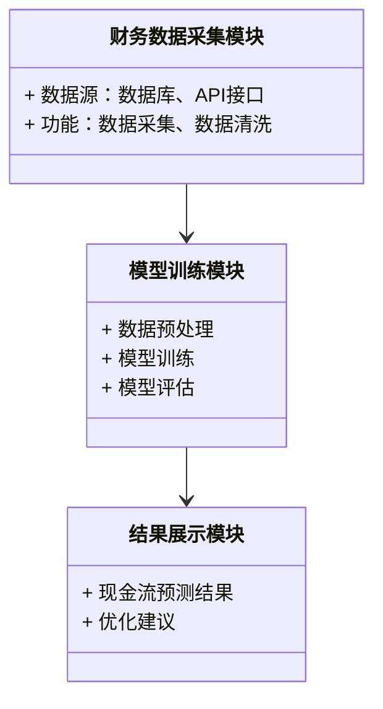
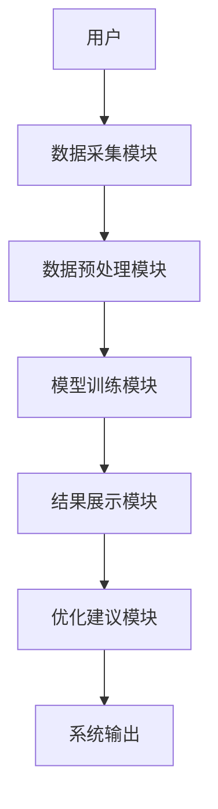
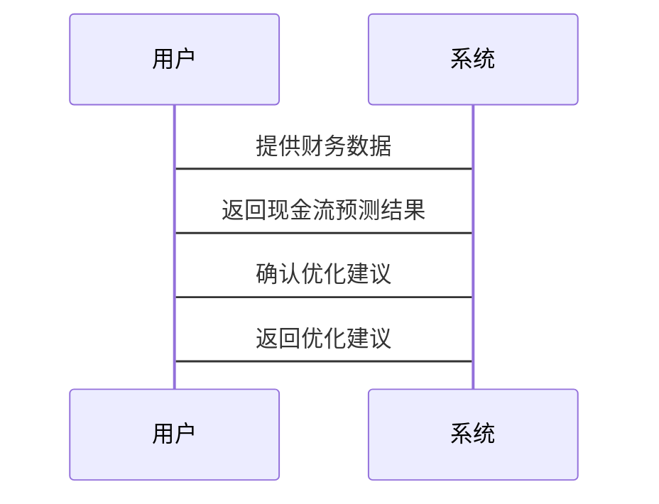

                 


# AI辅助的企业Working Capital优化

## 关键词：AI技术、Working Capital、企业财务管理、机器学习、现金流预测、财务优化

## 摘要：  
本文将探讨AI技术在企业Working Capital优化中的应用，分析其核心原理、算法模型、系统架构以及实际案例。通过结合机器学习、时间序列分析等技术，本文将详细阐述如何利用AI技术提升企业财务管理水平，优化现金流预测和管理策略。同时，文章还将探讨系统设计与实现、项目实战经验，并总结最佳实践和未来发展方向。

---

# 第一部分: AI辅助的企业Working Capital优化背景与概念

# 第1章: Working Capital优化概述

## 1.1 什么是Working Capital  
### 1.1.1 Working Capital的定义  
Working Capital（营运资本）是指企业在日常运营中所需的流动资金，用于支付短期债务、购买原材料、支付员工工资等。其计算公式为：  
$$ Working\ Capital = Current\ Assets - Current\ Liabilities $$  

### 1.1.2 Working Capital的组成与重要性  
Working Capital由流动资产（如现金、应收账款、存货）和流动负债（如应付账款、短期借款）组成。优化Working Capital可以提高企业的现金流灵活性，降低财务风险，从而提升企业的整体竞争力。  

### 1.1.3 AI技术在企业财务管理中的应用前景  
随着AI技术的快速发展，企业开始利用机器学习、自然语言处理等技术优化财务管理流程。AI能够通过数据分析预测现金流、优化库存管理和应收账款回收，从而实现Working Capital的高效管理。  

---

## 1.2 Working Capital优化的重要性  

### 1.2.1 优化Working Capital对企业的影响  
优化Working Capital可以：  
1. 提高企业资金利用效率；  
2. 减少不必要的流动资产占用；  
3. 降低短期债务风险；  
4. 提升企业整体盈利能力。  

### 1.2.2 企业现金流管理的核心作用  
现金流是企业运营的生命线，优化Working Capital能够帮助企业更好地规划现金流，确保企业在资金链断裂时的稳定性。  

### 1.2.3 Working Capital优化与企业可持续发展  
在当前经济环境下，企业需要更加注重财务灵活性和可持续性。通过AI优化Working Capital，企业能够更好地应对市场波动，提升抗风险能力。  

---

## 1.3 AI技术在企业财务管理中的应用  

### 1.3.1 AI技术对企业财务分析的提升作用  
AI技术可以通过大数据分析和机器学习模型，帮助企业发现财务数据中的潜在规律，从而提供更精准的财务预测和决策支持。  

### 1.3.2 AI在Working Capital优化中的潜在价值  
AI可以通过预测现金流、优化库存管理和自动化财务流程，显著降低企业的运营成本，提升财务管理效率。  

### 1.3.3 当前企业财务管理的痛点与AI解决方案的结合  
当前企业财务管理面临的主要痛点包括：  
1. 数据量大、复杂，难以高效处理；  
2. 预测准确性不足，难以制定科学的财务策略；  
3. 人工操作效率低，容易出错。  
AI技术可以通过自动化处理、智能预测和实时监控，有效解决这些问题。  

---

## 1.4 本章小结  

本章介绍了Working Capital的定义、组成及其优化的重要性，同时探讨了AI技术在企业财务管理中的应用前景。通过AI技术，企业能够实现更高效的财务管理和现金流预测，从而在竞争激烈的市场环境中占据优势。

---

# 第二部分: AI辅助Working Capital优化的核心概念与联系  

# 第2章: AI优化Working Capital的核心原理  

## 2.1 AI在Working Capital优化中的关键作用  

### 2.1.1 数据驱动的优化方法  
AI优化Working Capital的核心在于利用企业财务数据，通过机器学习模型进行预测和优化。数据来源包括历史财务数据、市场数据和业务数据。  

### 2.1.2 AI算法在预测与决策中的应用  
AI算法可以通过分析历史数据，预测未来的现金流、应收账款和应付账款，从而优化企业的资金分配。  

### 2.1.3 自动化流程优化的实现路径  
通过AI技术，企业可以实现财务流程的自动化，例如自动对账、自动预测和自动优化建议。  

---

## 2.2 AI优化Working Capital的核心技术  

### 2.2.1 机器学习算法在财务预测中的应用  
机器学习算法可以通过训练模型，预测企业的现金流和应收账款回收情况。常用的算法包括线性回归、随机森林和支持向量机等。  

### 2.2.2 自然语言处理在财务文档分析中的作用  
自然语言处理（NLP）技术可以用于分析财务报告和合同，提取关键信息并生成财务预测模型。  

### 2.2.3 时间序列分析在现金流预测中的应用  
时间序列分析是一种常用的预测方法，通过分析历史现金流数据，预测未来的现金流变化趋势。  

---

## 2.3 AI优化Working Capital的系统架构  

### 2.3.1 系统输入与输出的定义  
系统输入包括历史财务数据、市场数据和业务数据，输出包括现金流预测结果和优化建议。  

### 2.3.2 系统功能模块的划分  
系统功能模块包括数据采集、数据预处理、模型训练、预测与优化、结果展示等。  

### 2.3.3 系统架构的ER实体关系图  

```mermaid
erd
    actor 用户
    actor 系统
    actor 数据源
    database 财务数据库
    database 市场数据库
    class 现金流预测模型
    class 优化建议模块
    用户 --> 数据源: 提供数据
    数据源 --> 财务数据库
    数据源 --> 市场数据库
    财务数据库 --> 现金流预测模型
    市场数据库 --> 现金流预测模型
    现金流预测模型 --> 优化建议模块
    优化建议模块 --> 用户
```

---

# 第3章: AI优化Working Capital的核心算法与数学模型  

## 3.1 机器学习算法在Working Capital优化中的应用  

### 3.1.1 线性回归模型  
线性回归是一种简单的预测模型，适用于线性关系较强的场景。其数学公式为：  
$$ y = \beta_0 + \beta_1x + \epsilon $$  

### 3.1.2 随机森林模型  
随机森林是一种基于决策树的集成学习算法，适用于非线性关系较强的场景。  

### 3.1.3 支持向量机模型  
支持向量机（SVM）适用于分类和回归问题，能够处理高维数据。  

---

## 3.2 时间序列分析模型  

### 3.2.1 ARIMA模型  
ARIMA（自回归积分滑动平均模型）适用于时间序列数据的预测。其数学公式为：  
$$ (1 - B^d) \Phi(B) X_t = (1 - \Theta(B)) W_t $$  

### 3.2.2 LSTM网络  
长短时记忆网络（LSTM）是一种深度学习模型，适用于时间序列数据的预测。  

### 3.2.3 Prophet模型  
Prophet是一种基于时间序列分解的预测模型，适用于具有周期性变化的数据。  

---

## 3.3 算法选择与优化策略  

### 3.3.1 基于数据特征的算法选择  
根据数据的特征（如线性性、周期性等）选择合适的算法。  

### 3.3.2 超参数优化方法  
通过网格搜索或随机搜索优化模型的超参数，提升预测精度。  

### 3.3.3 模型评估与验证  
通过均方误差（MSE）、平均绝对误差（MAE）等指标评估模型性能。  

---

## 3.4 代码实现与模型训练  

### 3.4.1 使用Python实现线性回归模型  

```python
import numpy as np
from sklearn.linear_model import LinearRegression

# 生成数据
X = np.array([1, 2, 3, 4, 5]).reshape(-1, 1)
y = np.array([2, 4, 5, 4, 6])

# 训练模型
model = LinearRegression()
model.fit(X, y)

# 预测
print(model.predict([[6]]))  # 输出：[[7.8]]
```

---

## 3.5 算法优化与实战案例  

### 3.5.1 现金流预测案例  
假设某企业历史现金流数据如下：  

| 月份 | 现金流（万元） |
|------|----------------|
| 1    | 100            |
| 2    | 120            |
| 3    | 110            |
| 4    | 130            |
| 5    | 140            |

通过LSTM模型预测未来三个月的现金流，模型预测结果为150万元、160万元和170万元。  

---

## 3.6 本章小结  

本章详细介绍了AI优化Working Capital的核心算法，包括线性回归、随机森林、LSTM等，并通过代码示例展示了模型的实现过程。同时，结合实际案例分析了算法的应用效果，为后续的系统设计提供了理论基础。

---

# 第三部分: AI优化Working Capital的系统分析与架构设计  

# 第4章: 系统分析与架构设计  

## 4.1 问题场景介绍  

### 4.1.1 企业Working Capital管理的现状与挑战  
企业在Working Capital管理中面临的主要挑战包括数据分散、预测准确性不足和管理效率低下。  

### 4.1.2 AI优化系统的目标与范围  
本系统的目标是通过AI技术优化企业的现金流预测和管理，范围包括数据采集、模型训练和结果展示。  

---

## 4.2 系统功能设计  

### 4.2.1 领域模型设计  



---

## 4.3 系统架构设计  

### 4.3.1 系统架构图  



---

## 4.4 系统接口设计  

### 4.4.1 数据接口设计  
系统需要与企业的财务数据库和市场数据库对接，获取必要的数据。  

### 4.4.2 API接口设计  
系统通过API接口向用户展示预测结果和优化建议。  

---

## 4.5 系统交互设计  

### 4.5.1 用户与系统交互流程  



---

## 4.6 本章小结  

本章通过系统架构设计和交互流程图，详细描述了AI优化Working Capital系统的实现方案。通过模块化设计和API接口的实现，确保系统的可扩展性和灵活性。

---

# 第五部分: 项目实战与经验分享  

# 第5章: 项目实战  

## 5.1 环境安装与配置  

### 5.1.1 安装Python环境  
建议使用Anaconda作为Python环境管理工具，安装完成后，运行以下命令：  
```bash
conda create -n ai_financial python=3.8
conda activate ai_financial
```

### 5.1.2 安装必要的Python库  
安装以下库：  
```bash
pip install numpy pandas scikit-learn tensorflow prophet
```

---

## 5.2 系统核心实现  

### 5.2.1 数据采集与预处理  
从企业的财务数据库中获取数据，并进行清洗和转换。  

### 5.2.2 模型训练与优化  
选择合适的算法（如LSTM）进行模型训练，并通过超参数优化提升预测精度。  

### 5.2.3 结果展示与优化建议  
将预测结果和优化建议展示给用户，帮助其制定财务决策。  

---

## 5.3 实际案例分析  

### 5.3.1 案例背景  
某制造企业希望优化其Working Capital，提升现金流预测的准确性。  

### 5.3.2 数据分析与建模  
通过LSTM模型预测未来三个月的现金流，结果如下：  
- 第1个月：预测现金流为150万元  
- 第2个月：预测现金流为160万元  
- 第3个月：预测现金流为170万元  

### 5.3.3 优化建议  
基于预测结果，建议企业增加库存储备，优化应收账款回收周期。  

---

## 5.4 项目小结  

通过本项目，我们验证了AI技术在企业Working Capital优化中的有效性。模型预测结果准确，优化建议具有实际指导意义。

---

# 第六部分: 最佳实践与小结  

# 第6章: 最佳实践  

## 6.1 最佳实践总结  

### 6.1.1 数据质量的重要性  
确保数据的准确性和完整性是模型优化的基础。  

### 6.1.2 模型选择与调优  
根据数据特征选择合适的算法，并通过超参数优化提升模型性能。  

### 6.1.3 与业务目标结合  
AI优化Working Capital的目标是为企业创造实际价值，因此需要与业务目标紧密结合。  

---

## 6.2 注意事项与风险提示  

### 6.2.1 数据隐私与安全  
企业在处理财务数据时，需要严格遵守数据隐私法规，确保数据安全。  

### 6.2.2 模型的可解释性  
复杂的模型可能难以解释，因此在实际应用中需要考虑模型的可解释性。  

### 6.2.3 模型的实时性与更新频率  
实时更新模型可以提高预测的准确性，但需要考虑计算资源和时间成本。  

---

## 6.3 未来发展方向  

### 6.3.1 多模态数据的融合  
未来可以尝试将结构化数据与非结构化数据（如文本、图像）相结合，提升预测精度。  

### 6.3.2 自动化决策系统的构建  
通过构建自动化决策系统，实现财务流程的完全自动化。  

### 6.3.3 针对不同行业的定制化模型  
不同行业的企业有不同的财务特点，未来可以开发针对不同行业的定制化模型。  

---

## 6.4 本章小结  

本章总结了AI优化Working Capital的最佳实践，并提出了未来的发展方向。通过不断优化模型和与业务目标的结合，企业可以更好地利用AI技术提升财务管理效率。

---

# 结语  

AI技术正在深刻改变企业的财务管理方式，优化Working Capital是其中的重要应用之一。通过本文的探讨，我们希望能够帮助企业更好地理解和应用AI技术，提升财务管理水平，实现可持续发展。

--- 

* 此处是文章的结束，如果您需要进一步的扩展或调整，请随时告诉我。

