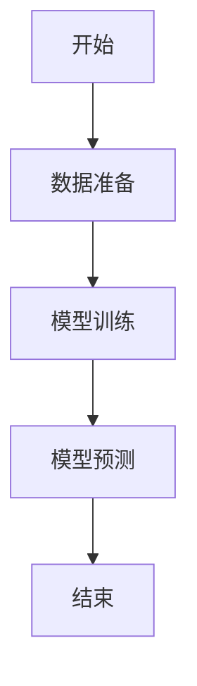
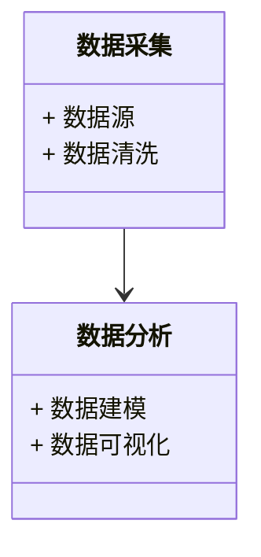

                 


# AI辅助的企业价值链分析

> 关键词：人工智能, 企业价值链, 数据分析, 机器学习, 系统架构, 项目实战

> 摘要：本文深入探讨了人工智能技术在企业价值链分析中的应用，分析了传统价值链分析方法的局限性，并详细介绍了基于AI的分析方法和实现过程。通过系统架构设计和项目实战，展示了AI如何有效优化企业价值链分析流程，提升企业竞争力。

---

## 第一章: 企业价值链分析基础

### 1.1 企业价值链的基本概念

#### 1.1.1 价值链的基本概念
企业的价值链是指企业内部从原材料采购到最终产品交付给客户的一系列价值创造活动。这些活动包括研发、生产、销售、服务等环节，每个环节都为最终产品或服务增加价值。

#### 1.1.2 价值链的核心构成要素
企业价值链的核心构成要素包括：
- **输入**：包括原材料、资金、人力资源等。
- **过程**：包括研发、生产、销售、服务等核心业务流程。
- **输出**：包括产品、服务、利润等。

#### 1.1.3 价值链的分类与特点
价值链可以分为内部价值链和外部价值链。内部价值链关注企业内部的生产流程，而外部价值链关注与供应商和客户的交互。AI技术可以优化内部和外部价值链的效率。

---

### 1.2 企业价值链分析的重要性

#### 1.2.1 价值链分析的目的与意义
价值链分析的目的是识别企业价值链中的关键环节，优化资源配置，提高效率，降低成本，从而提升企业的竞争力。

#### 1.2.2 价值链分析在企业管理中的作用
- **成本控制**：通过分析价值链中的成本结构，优化成本。
- **效率提升**：通过流程优化，提高企业的运营效率。
- **价值创造**：通过优化价值链，为企业创造更大的价值。

#### 1.2.3 价值链分析的常见应用场景
- 制造业：优化生产流程。
- 零售业：优化供应链管理。
- 金融行业：优化风险控制。

---

## 第二章: AI技术在企业价值链分析中的应用背景

### 2.1 人工智能技术的发展与现状

#### 2.1.1 人工智能的基本概念与发展历程
人工智能（AI）是指计算机系统模拟人类智能的能力，包括学习、推理、自我修正等。近年来，AI技术发展迅速，应用广泛。

#### 2.1.2 当前AI技术的主要应用领域
AI技术在企业价值链分析中的应用领域包括：
- 数据分析与预测。
- 流程自动化。
- 风险管理。

#### 2.1.3 AI技术在企业价值链分析中的潜力
AI技术可以帮助企业从大量数据中提取有价值的信息，优化决策过程，提升效率。

---

### 2.2 企业价值链分析的传统方法与挑战

#### 2.2.1 传统价值链分析方法的局限性
传统价值链分析方法依赖人工操作，效率低，且难以处理复杂的数据。

#### 2.2.2 数据量与复杂性对企业分析的影响
随着企业规模的扩大，数据量和复杂性也在增加，传统方法难以应对。

#### 2.2.3 传统方法在现代企业中的不足
传统方法难以实时分析数据，且缺乏灵活性。

---

### 2.3 AI技术如何解决企业价值链分析的痛点

#### 2.3.1 AI在数据处理与分析中的优势
AI技术可以快速处理大量数据，提取有价值的信息。

#### 2.3.2 AI在优化企业流程中的作用
AI可以通过自动化流程优化，减少人工干预，提高效率。

#### 2.3.3 AI在提升决策效率中的应用
AI可以帮助企业做出更快速、更准确的决策。

---

## 第三章: AI辅助价值链分析的核心概念

### 3.1 数据驱动的分析方法

#### 3.1.1 数据采集与处理的基本流程
- 数据采集：从各种来源获取数据。
- 数据清洗：去除无效数据。
- 数据预处理：格式化数据，准备分析。

#### 3.1.2 数据清洗与预处理的关键步骤
- 数据清洗：去除重复、错误数据。
- 数据转换：将数据转换为适合分析的格式。

#### 3.1.3 数据分析的基本方法与工具
- 数据可视化：使用图表展示数据。
- 数据挖掘：从数据中提取模式。

---

### 3.2 机器学习在价值链分析中的应用

#### 3.2.1 机器学习的基本概念
机器学习是一种人工智能技术，通过数据训练模型，使其能够进行预测或分类。

#### 3.2.2 机器学习在价值链分析中的具体应用
- 预测需求：基于历史数据预测未来需求。
- 识别瓶颈：识别价值链中的瓶颈环节。

#### 3.2.3 机器学习算法的分类与选择
- 监督学习：用于预测任务。
- 非监督学习：用于聚类任务。

---

## 第四章: AI辅助价值链分析的算法原理

### 4.1 算法原理讲解

#### 4.1.1 线性回归算法
- **原理**：通过最小化误差平方和，找到最佳拟合直线。
- **公式**：$$y = \beta_0 + \beta_1x + \epsilon$$

#### 4.1.2 聚类分析
- **原理**：将数据分为若干组，使组内数据相似度高，组间相似度低。

#### 4.1.3 支持向量机（SVM）
- **原理**：在高维空间中找到一个超平面，将数据分为两类。

---

### 4.2 算法实现与流程图

#### 4.2.1 线性回归算法流程图


#### 4.2.2 机器学习算法的实现代码
```python
import numpy as np
from sklearn.linear_model import LinearRegression

# 数据准备
X = np.array([1, 2, 3, 4, 5])
y = np.array([2, 4, 5, 4, 5])

# 模型训练
model = LinearRegression()
model.fit(X.reshape(-1, 1), y)

# 模型预测
print(model.predict([[6]]))  # 输出：[[7.5]]
```

---

## 第五章: 系统分析与架构设计

### 5.1 系统功能设计

#### 5.1.1 领域模型


#### 5.1.2 系统架构


---

## 第六章: 项目实战

### 6.1 环境安装

```bash
pip install numpy pandas scikit-learn matplotlib
```

### 6.2 核心代码实现

#### 6.2.1 数据预处理
```python
import pandas as pd

# 读取数据
data = pd.read_csv('data.csv')

# 数据清洗
data.dropna(inplace=True)
```

#### 6.2.2 模型训练
```python
from sklearn.model import LinearRegression

model = LinearRegression()
model.fit(X_train, y_train)
```

#### 6.2.3 模型评估
```python
from sklearn.metrics import mean_squared_error

y_pred = model.predict(X_test)
print(mean_squared_error(y_test, y_pred))
```

---

## 第七章: 总结与展望

### 7.1 总结
通过AI技术优化企业价值链分析，可以显著提升企业的效率和竞争力。

### 7.2 未来展望
随着AI技术的发展，企业价值链分析将更加智能化和自动化。

### 7.3 最佳实践
- 数据预处理是关键，确保数据质量。
- 选择合适的算法，提高分析效率。

---

通过以上步骤，您可以系统地理解和应用AI技术在企业价值链分析中的作用。希望这篇文章能为您提供有价值的见解和实践指导。

