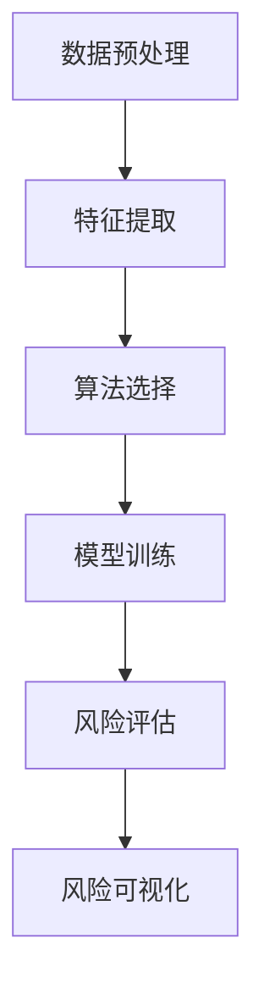
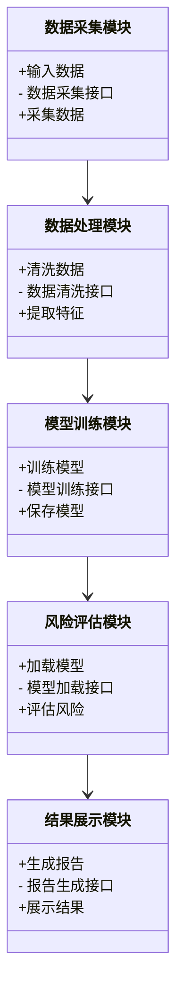
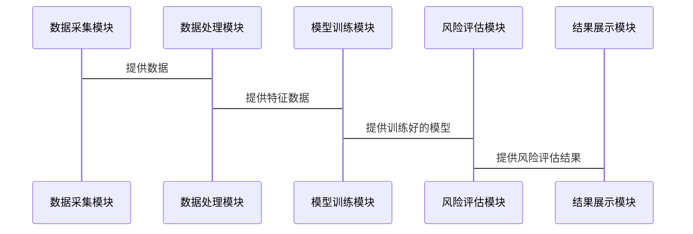

                 


# AI辅助的企业价值链风险分析

> 关键词：企业价值链，人工智能，风险分析，系统架构，算法原理，数学模型

> 摘要：本文探讨了人工智能在企业价值链风险分析中的应用，从核心概念、算法原理、系统架构到项目实战，详细分析了AI如何辅助企业识别、评估和管理风险，提供了丰富的技术细节和实际案例。

---

## 第1章: 引言

### 1.1 什么是企业价值链
企业价值链是指企业从原材料采购、生产、销售到售后服务的整个过程中的价值创造链。它包括了企业内外部的所有活动，旨在通过优化每个环节来提升整体价值。

#### 1.1.1 企业价值链的定义
企业价值链是一个系统，涵盖了企业从初始资源获取到最终产品或服务交付的所有环节。它包括：

- **输入**：原材料、资金、人力资源等。
- **过程**：研发、生产、销售、服务等。
- **输出**：产品或服务，以及价值的实现。

#### 1.1.2 企业价值链的核心要素
企业价值链的核心要素包括：

1. **资源**：企业所需的原材料、资金、技术等。
2. **过程**：企业的生产、销售、服务等流程。
3. **价值**：通过优化价值链，企业能够创造更大的价值。

#### 1.1.3 企业价值链的外延
企业价值链的外延包括了与企业价值链相关的外部因素，如市场环境、政策法规等。

### 1.2 AI在企业价值链中的作用
AI技术通过数据分析、模式识别和自动化决策，能够显著提升企业价值链的效率和效果。

#### 1.2.1 AI技术对企业价值链的赋能
AI可以通过以下方式赋能企业价值链：

- **数据处理**：AI能够快速处理大量数据，提取有价值的信息。
- **决策支持**：AI可以通过数据分析提供决策支持，优化企业运营。
- **风险预测**：AI能够预测潜在风险，帮助企业提前采取措施。

#### 1.2.2 AI在企业价值链中的应用场景
AI在企业价值链中的应用场景包括：

- **供应链管理**：优化供应链流程，降低库存成本。
- **市场营销**：通过数据分析制定精准的营销策略。
- **风险管理**：预测和识别潜在风险，制定应对策略。

#### 1.2.3 AI辅助企业价值链的优势与挑战
优势：

- **高效性**：AI能够快速处理数据，提高效率。
- **准确性**：AI可以通过数据分析提供准确的决策支持。
- **可扩展性**：AI能够处理大量数据，适用于不同规模的企业。

挑战：

- **数据质量**：AI的效果依赖于数据的质量和完整性。
- **技术复杂性**：AI技术的实施需要专业技能和资源。
- **成本**：AI技术的引入可能需要较高的初期投资。

---

## 第2章: 企业价值链风险分析的背景与意义

### 2.1 企业价值链中的风险类型
企业价值链中的风险类型主要包括市场风险、运营风险、财务风险和法律风险。

#### 2.1.1 市场风险
市场风险是指由于市场需求变化、竞争加剧等因素对企业价值链带来的风险。例如，市场需求的突然下降可能导致库存积压，进而影响企业的资金流动。

#### 2.1.2 运营风险
运营风险是指由于企业内部管理、生产流程等因素不稳定导致的风险。例如，生产过程中的设备故障可能导致生产延迟，影响交货时间。

#### 2.1.3 财务风险
财务风险是指由于财务状况变化、资金链断裂等因素对企业带来的风险。例如，原材料价格上涨可能导致生产成本增加，进而影响企业的盈利能力。

#### 2.1.4 法律风险
法律风险是指由于政策法规变化、合规性问题等因素对企业带来的风险。例如，新法规的出台可能导致企业需要调整生产流程，增加合规成本。

### 2.2 风险分析的传统方法与AI辅助方法的对比
传统方法与AI辅助方法在风险分析中的对比：

#### 2.2.1 传统风险分析方法的局限性
- **数据处理能力有限**：传统方法通常依赖于少量数据，难以捕捉复杂的风险因素。
- **主观性较高**：传统方法依赖于人的经验和判断，可能存在主观偏差。
- **效率低下**：传统方法需要大量人工分析，效率较低。

#### 2.2.2 AI辅助风险分析的优势
- **数据处理能力强**：AI能够处理大量数据，发现潜在的风险因素。
- **客观性高**：AI通过数据分析得出结论，减少了人为主观因素的影响。
- **效率高**：AI能够快速分析数据，提高风险分析的效率。

#### 2.2.3 AI在风险分析中的创新应用
- **实时监控**：AI可以实时监控企业价值链中的风险因素，及时发出预警。
- **动态调整**：AI能够根据实时数据动态调整风险评估模型，提高准确性。
- **情景分析**：AI可以通过情景分析，模拟不同情况下的风险影响，帮助企业制定应对策略。

### 2.3 企业价值链风险分析的意义
企业价值链风险分析的意义主要体现在以下几个方面：

#### 2.3.1 提高企业决策的准确性
通过AI辅助的风险分析，企业可以更加准确地识别和评估风险，从而做出更明智的决策。

#### 2.3.2 优化企业资源配置
风险分析可以帮助企业识别哪些环节存在风险，从而优化资源配置，降低风险的影响。

#### 2.3.3 提升企业抗风险能力
通过提前识别和评估风险，企业可以制定相应的应对策略，从而提升整体抗风险能力。

---

## 第3章: AI辅助企业价值链风险分析的核心概念与联系

### 3.1 AI辅助风险分析的核心概念
AI辅助风险分析的核心概念包括数据驱动的风险识别、智能算法的风险评估和可视化风险展示。

#### 3.1.1 数据驱动的风险识别
数据驱动的风险识别是指通过收集和分析大量数据，识别潜在的风险因素。例如，通过分析销售数据，识别市场需求下降的风险。

#### 3.1.2 智能算法的风险评估
智能算法的风险评估是指利用机器学习算法，对潜在风险进行评估，确定其影响程度。例如，使用聚类算法识别客户群体中的高风险客户。

#### 3.1.3 可视化风险展示
可视化风险展示是指通过图表、仪表盘等形式，将风险分析的结果直观地展示出来，方便决策者理解和决策。

### 3.2 核心概念的属性特征对比
以下是核心概念的属性特征对比：

| 概念 | 数据驱动的风险识别 | 智能算法的风险评估 | 可视化风险展示 |
|------|---------------------|---------------------|----------------|
| 数据来源 | 结构化数据（如销售数据、生产数据） | 结构化和非结构化数据（如文本数据、图像数据） | 数据分析结果 |
| 分析方法 | 数据清洗、特征提取 | 机器学习算法（如聚类、分类、回归） | 数据可视化工具（如图表、仪表盘） |
| 输出结果 | 风险因素识别 | 风险概率评估 | 风险可视化图表 |

### 3.3 ER实体关系图架构
以下是ER实体关系图：

```mermaid
erd
    顾客
    产品
    风险
    AI模型
    风险分析结果
    顾客 --> 风险
    产品 --> 风险
    AI模型 --> 风险分析结果
    风险 --> 风险分析结果
```

---

## 第4章: AI辅助企业价值链风险分析的算法原理

### 4.1 数据预处理
数据预处理是AI辅助风险分析的第一步，主要包括数据清洗和特征提取。

#### 4.1.1 数据清洗
数据清洗是指对原始数据进行处理，去除噪声数据和异常值。例如，删除重复数据、填充缺失值等。

#### 4.1.2 特征提取
特征提取是指从原始数据中提取有用的特征，用于后续的模型训练。例如，从销售数据中提取销售额、销量等特征。

### 4.2 算法选择与实现
根据具体的风险类型和数据特征，选择合适的算法进行风险评估。

#### 4.2.1 聚类算法
聚类算法可以将相似的客户或供应商聚类，识别潜在的高风险群体。例如，使用K-means算法将客户分为不同群体，识别高风险客户。

#### 4.2.2 分类算法
分类算法可以将客户或供应商分为不同类别，识别潜在的风险。例如，使用逻辑回归算法对客户进行信用评分，识别高风险客户。

#### 4.2.3 回归算法
回归算法可以预测风险的影响程度。例如，使用线性回归算法预测市场需求下降对企业利润的影响。

### 4.3 数学模型
以下是常用的数学模型：

#### 4.3.1 聚类模型
聚类模型可以使用K-means算法，公式如下：

$$
\text{目标函数} = \sum_{i=1}^{k} \sum_{j=1}^{n_i} (x_{ij} - c_i)^2
$$

其中，$k$ 是聚类数，$n_i$ 是第 $i$ 个聚类中的样本数，$x_{ij}$ 是第 $i$ 个聚类中的第 $j$ 个样本，$c_i$ 是第 $i$ 个聚类的中心。

#### 4.3.2 分类模型
分类模型可以使用逻辑回归算法，公式如下：

$$
P(y=1|x) = \frac{1}{1 + e^{-(\beta_0 + \beta_1 x)}}
$$

其中，$\beta_0$ 和 $\beta_1$ 是模型参数，$x$ 是输入变量，$y$ 是输出变量。

#### 4.3.3 回归模型
回归模型可以使用线性回归算法，公式如下：

$$
y = \beta_0 + \beta_1 x_1 + \beta_2 x_2 + \dots + \beta_n x_n + \epsilon
$$

其中，$y$ 是目标变量，$x_i$ 是输入变量，$\beta_i$ 是模型参数，$\epsilon$ 是误差项。

### 4.4 算法流程图
以下是AI辅助风险分析的算法流程图：



---

## 第5章: 系统分析与架构设计方案

### 5.1 项目介绍
本项目旨在开发一个AI辅助企业价值链风险分析系统，帮助企业识别、评估和管理风险。

### 5.2 系统功能设计
系统功能设计包括数据采集、数据处理、模型训练、风险评估和结果展示。

#### 5.2.1 数据采集
数据采集模块负责从企业价值链中的各个环节采集数据，包括销售数据、生产数据、财务数据等。

#### 5.2.2 数据处理
数据处理模块负责对采集到的数据进行清洗和特征提取，为后续的模型训练提供高质量的数据。

#### 5.2.3 模型训练
模型训练模块负责选择合适的算法，训练风险分析模型。

#### 5.2.4 风险评估
风险评估模块负责利用训练好的模型，对潜在风险进行评估，并生成风险报告。

#### 5.2.5 结果展示
结果展示模块负责将风险评估结果以可视化的方式展示出来，方便决策者理解和决策。

### 5.3 系统架构设计
系统架构设计包括类图、架构图和序列图。

#### 5.3.1 类图
以下是系统类图：



#### 5.3.2 架构图
以下是系统架构图：


#### 5.3.3 序列图
以下是系统交互序列图：



---

## 第6章: 项目实战

### 6.1 环境安装
以下是项目实战所需的环境安装步骤：

1. **安装Python**：确保安装了Python 3.6或更高版本。
2. **安装依赖库**：安装以下依赖库：

   ```bash
   pip install numpy pandas scikit-learn matplotlib
   ```

### 6.2 系统核心实现源代码

以下是系统核心实现的源代码：

```python
import numpy as np
import pandas as pd
from sklearn.cluster import KMeans
from sklearn.linear_model import LogisticRegression
from sklearn.metrics import accuracy_score
import matplotlib.pyplot as plt

# 数据采集模块
class DataCollector:
    def collect_data(self):
        # 模拟数据采集
        data = {
            '销售额': [100, 200, 300, 400, 500],
            '成本': [50, 60, 70, 80, 90],
            '利润': [20, 30, 40, 50, 60]
        }
        return pd.DataFrame(data)

# 数据处理模块
class DataProcessor:
    def __init__(self):
        self.data = None

    def process_data(self, data):
        self.data = data.dropna()  # 删除缺失值
        self.data = self.data[self.data['销售额'] > 0]  # 删除负数销售额

# 模型训练模块
class ModelTrainer:
    def __init__(self):
        self.model = None

    def train_model(self, data, n_clusters=2):
        # 使用K-means算法进行聚类
        self.model = KMeans(n_clusters=n_clusters)
        self.model.fit(data)

# 风险评估模块
class RiskAssessor:
    def __init__(self):
        self.model = None

    def assess_risk(self, data):
        # 使用逻辑回归进行风险评估
        model = LogisticRegression()
        model.fit(data[['销售额', '成本']], data['利润'])
        return model.predict(data[['销售额', '成本']])

# 结果展示模块
class ResultDisplay:
    def __init__(self):
        pass

    def display_results(self, data, predictions):
        plt.scatter(data['销售额'], data['成本'], c=predictions)
        plt.xlabel('销售额')
        plt.ylabel('成本')
        plt.show()

# 主程序
if __name__ == '__main__':
    # 数据采集
    collector = DataCollector()
    data = collector.collect_data()

    # 数据处理
    processor = DataProcessor()
    processed_data = processor.process_data(data)

    # 模型训练
    trainer = ModelTrainer()
    trainer.train_model(processed_data[['销售额', '成本']], n_clusters=2)

    # 风险评估
    assessor = RiskAssessor()
    predictions = assessor.assess_risk(processed_data)

    # 结果展示
    display = ResultDisplay()
    display.display_results(processed_data[['销售额', '成本']], predictions)
```

### 6.3 代码应用解读与分析
1. **数据采集模块**：通过`DataCollector`类收集企业价值链中的数据，包括销售额、成本和利润等。

2. **数据处理模块**：通过`DataProcessor`类对采集到的数据进行清洗和特征提取，确保数据质量。

3. **模型训练模块**：通过`ModelTrainer`类选择合适的算法（如K-means算法）进行模型训练。

4. **风险评估模块**：通过`RiskAssessor`类利用训练好的模型对潜在风险进行评估，生成风险预测结果。

5. **结果展示模块**：通过`ResultDisplay`类将风险评估结果以可视化的方式展示出来，方便决策者理解和决策。

### 6.4 案例分析和详细讲解
假设我们有一个企业的销售数据如下：

| 销售额 | 成本 | 利润 |
|-------|------|------|
| 100   | 50   | 20   |
| 200   | 60   | 30   |
| 300   | 70   | 40   |
| 400   | 80   | 50   |
| 500   | 90   | 60   |

通过上述代码，我们可以进行以下分析：

1. **数据采集**：将上述数据作为输入，通过`DataCollector`类进行数据采集。

2. **数据处理**：通过`DataProcessor`类对数据进行清洗和特征提取，确保数据质量。

3. **模型训练**：使用K-means算法对数据进行聚类，将客户分为高风险和低风险两类。

4. **风险评估**：使用逻辑回归算法对高风险客户进行预测，生成风险评估结果。

5. **结果展示**：将风险评估结果以图表形式展示，方便决策者理解和决策。

---

## 第7章: 总结与展望

### 7.1 总结
本文详细探讨了AI辅助企业价值链风险分析的应用，从核心概念、算法原理到系统架构，提供了全面的技术细节和实际案例。

### 7.2 展望
未来，随着AI技术的不断发展，AI辅助企业价值链风险分析将更加智能化和自动化。例如，可以利用深度学习算法（如神经网络）进行更复杂的风险分析，或者通过实时数据分析实现动态风险监控。

---

## 第8章: 最佳实践与注意事项

### 8.1 最佳实践
1. **数据质量管理**：确保数据的准确性和完整性，避免噪声数据和异常值的影响。
2. **模型选择与调优**：根据具体的风险类型和数据特征，选择合适的算法，并进行模型调优。
3. **可视化展示**：通过直观的图表和仪表盘，将风险分析结果展示出来，方便决策者理解和决策。

### 8.2 小结
本文通过详细的技术分析和实际案例，展示了AI在企业价值链风险分析中的广泛应用和巨大潜力。

### 8.3 注意事项
1. **数据隐私与安全**：在处理企业数据时，需要注意数据隐私和安全问题，避免数据泄露和滥用。
2. **模型解释性**：在选择和使用AI模型时，需要关注模型的解释性，以便更好地理解和优化模型。
3. **持续学习与更新**：AI技术不断发展，需要持续学习和更新，以应对新的挑战和需求。

---

## 第9章: 拓展阅读

### 9.1 推荐书籍
1. 《机器学习实战》——周志华
2. 《数据挖掘导论》——Jiawei Han

### 9.2 推荐博客和资源
1. [Kaggle](https://www.kaggle.com/)：提供丰富的数据集和机器学习竞赛。
2. [Towards Data Science](https://towardsdatascience.com/)：分享数据科学领域的最新技术和实践。

---

通过以上章节的详细分析，我们可以看到AI辅助企业价值链风险分析的广泛应用和巨大潜力。希望本文能够为读者提供有价值的技术指导和实践参考。

