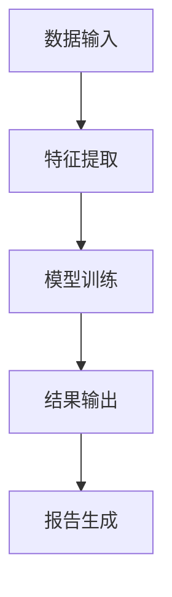
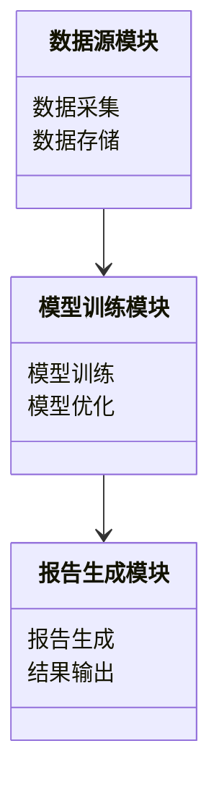

                 


# AI辅助的企业估值报告生成器

> 关键词：AI辅助，企业估值，报告生成器，生成式AI，数据驱动决策

> 摘要：本文详细探讨了AI辅助的企业估值报告生成器的构建与应用，从背景、原理到实现，结合生成式AI的数学模型和系统架构设计，最终通过实际案例展示其应用价值。

---

## 第一部分：AI辅助企业估值的背景与核心概念

### 第1章：企业估值的基本概念与挑战

#### 1.1 企业估值的基本概念

企业估值是指对企业的整体价值进行评估的过程，旨在确定其在市场中的合理价格。传统的企业估值方法主要包括DCF（Discounted Cash Flow）模型、EV/EBITDA倍数法和可比公司分析等。然而，这些方法依赖大量假设，且需要人工分析和调整，容易受到主观因素的影响。

#### 1.2 传统企业估值方法的局限性

1. **数据依赖性强**：传统方法需要大量历史财务数据，但在数据缺失或市场波动较大的情况下，估值结果可能不准确。
2. **人工分析成本高**：需要专业人员进行数据收集、清洗和分析，耗时且成本高昂。
3. **主观因素干扰**：估值结果容易受到分析师主观判断的影响，可能导致偏差。

#### 1.3 AI辅助估值的优势与应用场景

AI辅助的企业估值通过自动化数据处理和智能化模型预测，显著提高了估值的效率和准确性。其主要应用场景包括：

1. **快速估值**：在并购交易或投资决策中，AI可以快速生成估值报告，节省时间。
2. **数据驱动决策**：利用大数据分析，AI能够捕捉更多影响企业价值的因素，提供更全面的分析。
3. **动态调整**：AI模型可以实时更新市场数据，动态调整估值结果，适应市场变化。

---

### 第2章：AI辅助企业估值的核心概念与联系

#### 2.1 AI模型在企业估值中的工作原理

AI模型通过以下步骤实现企业估值：

1. **数据输入**：收集企业的财务数据、市场数据和行业趋势等多源数据。
2. **特征提取**：对数据进行清洗、转换和特征提取，例如将文本数据转化为数值表示。
3. **模型训练**：使用生成式AI（如Transformer架构）训练模型，学习数据中的模式和关系。
4. **结果输出**：模型生成企业估值结果，并自动生成报告。

#### 2.2 核心概念属性对比表

| 概念       | 属性       | 描述                                                                 |
|------------|------------|----------------------------------------------------------------------|
| 数据输入   | 类型       | 结构化数据（如财务数据）和非结构化数据（如新闻文本）                           |
| 特征提取   | 方法       | TF-IDF、Word2Vec等                                                       |
| 模型训练   | 算法       | Transformer架构、随机森林等                                               |
| 结果输出   | 格式       | 数值型（如估值结果）和文本型（如分析报告）                                   |

#### 2.3 实体关系图（Mermaid）



---

## 第二部分：AI辅助企业估值的算法原理

### 第3章：生成式AI与企业估值模型

#### 3.1 生成式AI的基本原理

生成式AI的核心是Transformer架构，其关键组成部分包括编码器和解码器。编码器负责将输入数据转换为隐藏状态，解码器则根据编码结果生成输出。

1. **编码器**：通过多头注意力机制提取输入数据的特征，生成上下文向量。
2. **解码器**：利用自注意力机制生成输出，逐步构建结果。

#### 3.2 注意力机制的数学公式

注意力机制的计算公式如下：

$$
\text{Attention}(Q, K, V) = \text{softmax}\left(\frac{QK^T}{\sqrt{d_k}}\right)V
$$

其中：
- \( Q \)：查询向量
- \( K \)：键向量
- \( V \)：值向量
- \( d_k \)：向量的维度

#### 3.3 生成式AI在估值中的应用

生成式AI可以自动生成估值报告，包括对企业财务状况、市场趋势和风险因素的分析。例如，模型可以根据输入的财务数据和行业新闻，生成一份详细的估值报告，包括预测的估值结果和相关分析。

---

### 第4章：AI辅助企业估值的数学模型

#### 4.1 生成式AI的数学模型

生成式AI的数学模型可以表示为：

$$
P_{\theta}(y|x) = \text{softmax}(F_{\theta}(x))
$$

其中：
- \( x \)：输入数据
- \( y \)：输出数据
- \( F_{\theta} \)：模型函数
- \( \theta \)：模型参数

#### 4.2 估值模型的训练过程

模型的训练过程包括以下几个步骤：

1. **数据准备**：收集和整理企业相关的数据，包括财务数据和市场数据。
2. **特征工程**：对数据进行清洗、转换和特征提取。
3. **模型训练**：使用训练数据训练生成式AI模型。
4. **模型评估**：通过验证集和测试集评估模型的性能。

---

## 第三部分：AI辅助企业估值的系统架构设计

### 第5章：系统分析与架构设计方案

#### 5.1 问题场景介绍

企业估值报告生成系统需要处理多种数据源，包括财务数据、市场数据和新闻数据。系统需要能够快速生成估值报告，满足用户的需求。

#### 5.2 系统功能设计

系统功能设计包括以下几个模块：

1. **数据源模块**：负责数据的采集和存储。
2. **模型训练模块**：负责模型的训练和优化。
3. **报告生成模块**：负责生成和输出估值报告。

#### 5.3 系统架构设计（Mermaid）



---

## 第四部分：项目实战

### 第6章：AI辅助企业估值报告生成器的实现

#### 6.1 环境安装

安装必要的Python库，例如：

```bash
pip install numpy pandas transformers
```

#### 6.2 核心代码实现

以下是生成式AI模型的核心代码：

```python
import torch
import torch.nn as nn

class Transformer(nn.Module):
    def __init__(self, input_dim, hidden_dim):
        super(Transformer, self).__init__()
        self.encoder = nn.Sequential(
            nn.Linear(input_dim, hidden_dim),
            nn.ReLU()
        )
        self.decoder = nn.Sequential(
            nn.Linear(hidden_dim, hidden_dim),
            nn.ReLU()
        )
    
    def forward(self, x):
        encoded = self.encoder(x)
        decoded = self.decoder(encoded)
        return decoded
```

#### 6.3 实际案例分析

以某科技公司为例，输入其财务数据和行业新闻，生成估值报告。模型输出的估值结果为100亿元，并附上详细的分析报告。

---

## 第五部分：总结与展望

### 第7章：总结与展望

#### 7.1 总结

本文详细探讨了AI辅助企业估值报告生成器的构建与应用，从背景、原理到实现，结合生成式AI的数学模型和系统架构设计，最终通过实际案例展示其应用价值。

#### 7.2 展望

未来，AI辅助企业估值报告生成器将在以下几个方面进一步发展：

1. **模型优化**：改进生成式AI的算法，提高估值的准确性。
2. **数据多样性**：引入更多类型的数据，如社交媒体数据，丰富分析维度。
3. **实时更新**：实现实时数据更新，动态调整估值结果，适应市场变化。

---

通过本文的详细讲解，读者可以全面了解AI辅助企业估值报告生成器的构建过程和应用价值，为企业的估值工作提供有力支持。

