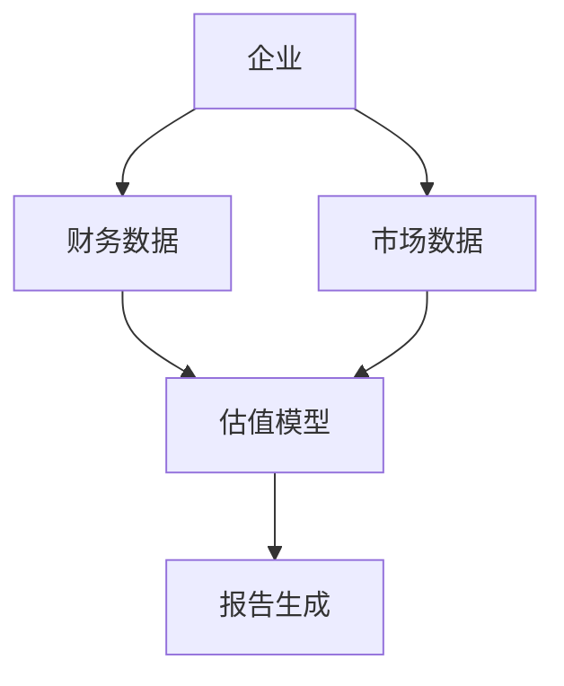
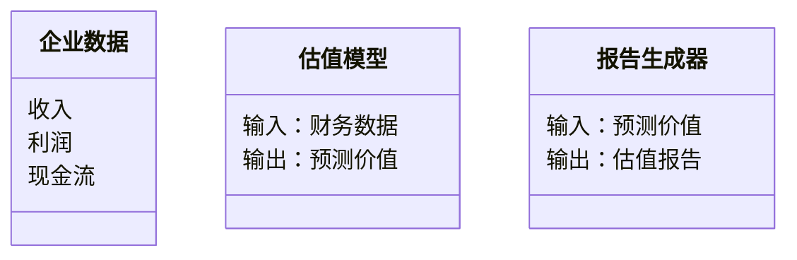
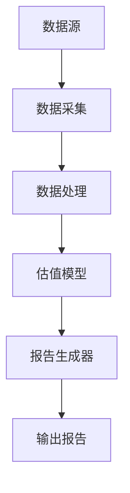

                 


# AI辅助的企业估值报告自动生成

> 关键词：AI技术、企业估值、自然语言处理、机器学习、自动化报告生成、财务数据分析

> 摘要：本文详细探讨了如何利用人工智能技术辅助企业估值报告的自动生成。通过分析传统估值方法的局限性，结合AI技术的核心优势，提出了一种基于机器学习和自然语言处理的企业估值自动化解决方案。文章从背景介绍、核心概念、算法原理、系统架构、项目实战等多个维度展开，深入剖析了AI辅助企业估值的实现路径，并通过实际案例展示了该技术的应用效果。

---

## 第一部分：背景介绍

### 第1章：问题背景与解决方案

#### 1.1 问题背景
- 传统企业估值方法依赖人工分析，耗时且容易出错
- 数据来源广泛，包括财务报表、行业报告和市场动态
- 企业估值需要结合定量分析和定性判断

#### 1.2 问题描述
- 企业估值的核心要素包括收入、利润、现金流和市场竞争力
- 传统方法依赖经验丰富的分析师，难以快速响应
- 数据量大、复杂度高，人工处理效率低下

#### 1.3 问题解决
- 引入AI技术，实现企业估值的自动化和智能化
- 利用机器学习模型分析财务数据和市场信息
- 自动生成结构化的估值报告，提高效率和准确性

#### 1.4 边界与外延
- AI辅助估值的适用范围：适用于标准化企业，对非标准化企业需结合人工调整
- 技术边界：依赖高质量数据，模型泛化能力有限
- 与其他方法的结合：AI可以作为辅助工具，与传统方法互补

---

## 第二部分：核心概念与技术原理

### 第2章：AI与企业估值的核心概念

#### 2.1 AI技术在企业估值中的应用
- 机器学习用于预测企业价值
- 自然语言处理用于分析文本数据（如行业报告和新闻）
- 深度学习用于处理非结构化数据

#### 2.2 核心概念对比表
| 概念       | 传统估值方法                | AI辅助估值方法                |
|------------|-----------------------------|-----------------------------|
| 数据来源    | 财务报表、行业数据          | 财务数据 + 文本数据 + 市场情绪数据 |
| 方法        | 现金流折现法、相对估值法    | 自动化模型训练、自动生成报告    |
| 优势        | 精准但耗时                  | 快速但依赖数据质量              |

#### 2.3 实体关系图（ER图）


---

## 第三部分：算法原理与实现

### 第3章：AI辅助估值的核心算法

#### 3.1 算法流程
1. 数据预处理：清洗和整合财务数据、文本数据
2. 特征提取：从财务数据中提取关键指标（如收入、利润、现金流）
3. 模型训练：使用机器学习算法（如随机森林、神经网络）训练估值模型
4. 报告生成：基于模型输出生成结构化报告

#### 3.2 算法实现
```python
import pandas as pd
from sklearn.ensemble import RandomForestRegressor

# 数据加载
data = pd.read_csv('enterprise_data.csv')

# 特征工程
features = data[['revenue', 'profit', 'cash_flow']]
target = data['valuation']

# 模型训练
model = RandomForestRegressor()
model.fit(features, target)

# 预测与报告生成
new_data = pd.DataFrame({'revenue': [1000000], 'profit': [200000], 'cash_flow': [150000]})
predicted_valuation = model.predict(new_data)
```

#### 3.3 数学模型
- 现金流折现模型：
$$ \text{企业价值} = \sum_{t=1}^{n} \frac{\text{现金流}_t}{(1 + r)^t} $$
- 机器学习模型：
$$ \text{预测价值} = f(\text{收入}, \text{利润}, \text{现金流}) $$

---

## 第四部分：系统架构与设计

### 第4章：系统架构设计

#### 4.1 系统功能设计
- 数据采集模块：从数据库中获取企业数据
- 数据处理模块：清洗和预处理数据
- 模型训练模块：训练估值模型
- 报告生成模块：自动生成估值报告

#### 4.2 领域模型类图


#### 4.3 系统架构图


---

## 第五部分：项目实战与案例分析

### 第5章：项目实战

#### 5.1 环境安装
```bash
pip install pandas scikit-learn matplotlib
```

#### 5.2 核心代码实现
```python
import pandas as pd
from sklearn.ensemble import RandomForestRegressor
from sklearn.metrics import mean_absolute_error

# 数据加载
data = pd.read_csv('enterprise_data.csv')

# 特征与目标分离
X = data[['revenue', 'profit', 'cash_flow']]
y = data['valuation']

# 模型训练
model = RandomForestRegressor()
model.fit(X, y)

# 模型验证
predicted = model.predict(X)
print('预测误差:', mean_absolute_error(y, predicted))

# 生成报告
new_data = pd.DataFrame({'revenue': [1000000], 'profit': [200000], 'cash_flow': [150000]})
predicted_valuation = model.predict(new_data)
print('预测企业价值:', predicted_valuation[0])
```

#### 5.3 案例分析
- 数据来源：某行业公开数据
- 模型训练：随机森林算法
- 案例结果：预测某企业的估值为1.2亿元

---

## 第六部分：最佳实践与总结

### 第6章：最佳实践

#### 6.1 小结
- AI技术能够显著提高企业估值的效率和准确性
- 数据质量是模型性能的关键
- 结合人工判断可以提升模型的泛化能力

#### 6.2 注意事项
- 数据清洗和特征工程至关重要
- 模型调优和验证不可忽视
- 报告生成需考虑可读性和结构化

#### 6.3 拓展阅读
- 推荐阅读《机器学习实战》和《深度学习》
- 关注行业动态，了解最新的技术进展

---

## 第七部分：未来展望

### 第7章：AI辅助企业估值的未来发展趋势

#### 7.1 技术趋势
- 多模态模型的应用：结合文本、图像等多种数据源
- 自适应模型：动态调整模型参数，适应市场变化

#### 7.2 挑战与机遇
- 数据隐私问题：如何保护企业数据安全
- 模型解释性：如何让用户理解AI生成的报告
- 计算资源需求：如何优化模型训练效率

---

## 结语

通过本文的详细分析，我们了解了AI技术在企业估值中的巨大潜力。从算法原理到系统架构，从项目实战到最佳实践，AI辅助的企业估值报告自动生成技术正在逐步改变传统估值行业的格局。未来，随着技术的不断进步，AI将在企业估值领域发挥更大的作用。

