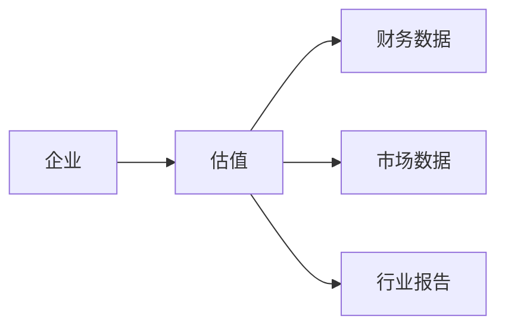
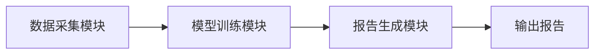
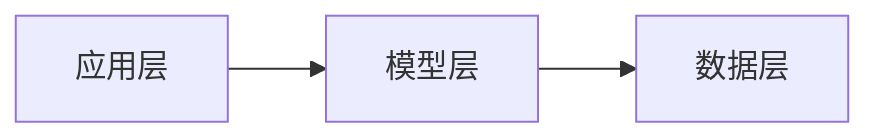

                 


# AI辅助的企业估值报告自动生成与分析

## 关键词：
AI辅助，企业估值，自动生成，报告分析，机器学习，深度学习，自然语言处理

## 摘要：
随着人工智能技术的迅速发展，企业估值报告的生成与分析正逐步从传统的手动模式转向智能化的AI辅助模式。本文深入探讨了如何利用生成式AI技术实现企业估值报告的自动生成，并结合具体案例分析其应用场景和优势。文章详细阐述了AI辅助企业估值的核心概念、算法原理、系统架构设计以及实际项目实施过程，旨在为技术从业者和企业管理者提供有价值的参考和实践指导。

---

## 目录大纲：
1. **企业估值与AI辅助概述**
   - 1.1 企业估值的基本概念与挑战
   - 1.2 AI在企业估值中的作用

2. **AI辅助企业估值的核心概念**
   - 2.1 AI辅助企业估值的核心原理
   - 2.2 关键技术对比分析

3. **算法原理与数学模型**
   - 3.1 生成式AI的算法原理
   - 3.2 数学模型与公式

4. **系统架构与设计**
   - 4.1 问题场景介绍
   - 4.2 系统功能设计
   - 4.3 系统架构设计

5. **项目实战与案例分析**
   - 5.1 项目实战
   - 5.2 案例分析

6. **最佳实践与总结**
   - 6.1 小结
   - 6.2 注意事项
   - 6.3 拓展阅读

---

## 1. 企业估值与AI辅助概述

### 1.1 企业估值的基本概念与挑战

企业估值是指对企业整体价值的评估，通常用于企业并购、融资、上市等场景。传统的企业估值方法包括DCF模型、可比公司法、先例交易法等，这些方法依赖大量历史数据和人工分析，耗时且容易受主观因素影响。

- **挑战**：
  - 数据量大且复杂，难以快速处理。
  - 人工分析容易出现偏差，影响估值准确性。
  - 不同行业的估值标准差异大，难以统一。

### 1.2 AI在企业估值中的作用

AI技术，尤其是生成式AI，能够通过大数据分析和模式识别，快速生成初步估值报告，并提供数据支持和优化建议，显著提升估值效率和准确性。

- **优势**：
  - 提高估值速度，减少人工错误。
  - 通过历史数据挖掘发现潜在规律，提供更精准的估值模型。
  - 支持多维度分析，帮助企业做出更明智的决策。

---

## 2. AI辅助企业估值的核心概念

### 2.1 AI辅助企业估值的核心原理

AI辅助企业估值主要依赖以下技术：

- **数据采集与处理**：从多种来源（如财务报表、市场数据）收集企业相关信息，并进行清洗和特征提取。
- **模型训练与优化**：基于历史估值数据，训练生成式AI模型，使其能够理解和生成估值报告。
- **生成与分析**：模型根据输入的企业信息生成估值报告，并进行多维度分析，提供优化建议。

### 2.2 关键技术对比分析

以下是几种常见AI技术在企业估值中的对比分析：

| 技术 | 优点 | 缺点 |
|------|------|------|
| 生成式AI（如GPT） | 能够生成自然语言文本，适合报告撰写 | 对数据质量要求高，生成内容需人工校对 |
| 支持向量机（SVM） | 分类能力强，适合模式识别 | 对非线性问题处理能力有限 |
| 神经网络 | 适合复杂模式识别，训练效果好 | 训练时间长，需要大量数据 |

（Mermaid图：企业估值实体关系图）



---

## 3. 算法原理与数学模型

### 3.1 生成式AI的算法原理

生成式AI通过概率模型生成文本，核心在于训练模型理解和生成特定格式的文本。

- **输入与输出**：模型接收企业财务数据和行业信息，输出估值报告。
- **训练过程**：模型通过大量历史估值报告和相关数据进行预训练，掌握报告的结构和内容规律。
- **模型结构**：使用Transformer架构，通过自注意力机制捕捉上下文信息。

### 3.2 数学模型与公式

生成式AI的损失函数用于衡量模型生成文本的质量：

$$ \text{损失函数} = -\sum_{i=1}^{n} \log P(w_i) $$

其中，$P(w_i)$ 是第i个词的概率。训练目标是最小化该损失函数。

---

## 4. 系统架构与设计

### 4.1 问题场景介绍

系统目标是实现AI辅助企业估值报告的自动生成，解决传统方法效率低、耗时长的问题。

### 4.2 系统功能设计

- **数据采集模块**：从多种来源获取企业数据。
- **模型训练模块**：训练生成式AI模型。
- **报告生成模块**：根据输入生成估值报告。

（Mermaid类图）



### 4.3 系统架构设计

系统采用分层架构，包括数据层、模型层和应用层。

（Mermaid架构图）



---

## 5. 项目实战与案例分析

### 5.1 项目实战

- **环境安装**：安装Python、TensorFlow等工具。
- **核心代码实现**：编写数据预处理和模型训练代码。

（Python代码示例）

```python
import tensorflow as tf
from tensorflow.keras import layers

# 数据预处理
def preprocess(data):
    # 数据清洗和特征提取
    pass

# 模型训练
def train_model():
    model = tf.keras.Sequential([
        layers.Dense(64, activation='relu'),
        layers.Dense(1, activation='linear')
    ])
    model.compile(optimizer='adam', loss='mean_squared_error')
    model.fit(train_data, train_labels, epochs=10)
    return model

# 生成报告
def generate_report(model, input_data):
    prediction = model.predict(input_data)
    return prediction
```

### 5.2 案例分析

以某科技公司为例，AI模型根据其财务数据和市场信息，生成详细的估值报告，帮助企业做出并购决策。

---

## 6. 最佳实践与总结

### 6.1 小结

AI辅助企业估值显著提升了效率和准确性，但需注意数据质量和模型优化。

### 6.2 注意事项

- 数据隐私保护
- 模型的可解释性
- 定期模型更新

### 6.3 拓展阅读

建议阅读《深度学习》和《生成式AI应用指南》等书籍，深入了解相关技术细节。

---

通过以上分析和撰写，我们系统地探讨了AI辅助企业估值报告生成的关键技术、应用场景和实际案例，为技术实践和企业应用提供了有价值的参考。

