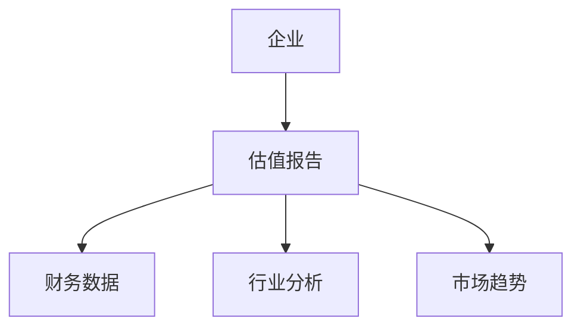
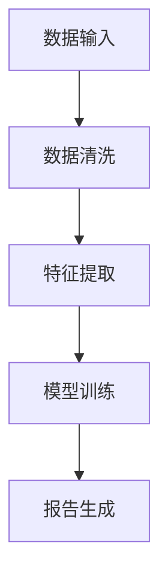
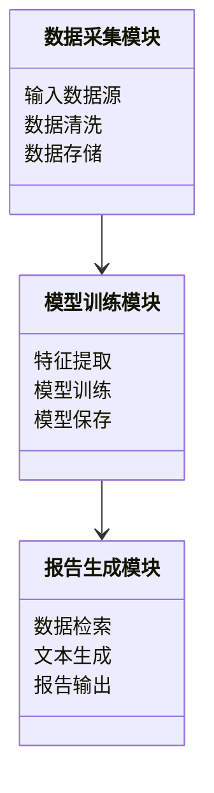
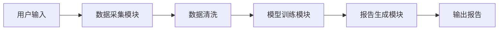
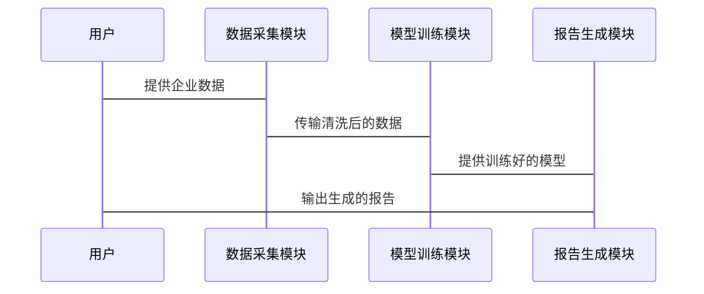

                 


# AI辅助的企业估值报告自动生成系统

## 关键词：AI、企业估值、报告生成、大数据分析、自然语言处理

## 摘要：本文详细探讨了如何利用AI技术自动生成企业估值报告。通过分析传统估值方法的局限性，提出了基于机器学习和自然语言处理的解决方案，涵盖了系统设计、算法实现和实际应用等多个方面，为读者提供了一套完整的AI辅助企业估值系统。

## 第一部分：背景与核心概念

### 第1章：企业估值与AI辅助系统背景

#### 1.1 问题背景

- 1.1.1 传统企业估值方法的局限性
  - 现有方法依赖人工分析，耗时且成本高
  - 数据量大，难以快速提取关键信息
  - 专家经验依赖性强，主观因素较多

- 1.1.2 AI技术在企业估值中的潜力
  - 自动化处理大量数据，提高效率
  - 利用机器学习模型，提供客观分析
  - 自动生成报告，节省人力资源

#### 1.2 问题描述

- 1.2.1 企业估值的核心要素
  - 财务数据、行业分析、市场趋势、竞争环境
  - 公司治理、管理团队、研发能力

- 1.2.2 现有系统的主要痛点
  - 数据处理效率低
  - 分析结果主观性强
  - 报告生成耗时长

#### 1.3 问题解决

- 1.3.1 AI辅助系统的解决方案
  - 利用机器学习模型进行数据分析
  - 自然语言处理生成报告
  - 结合多源数据提高估值准确性

- 1.3.2 系统的目标与预期效果
  - 提供自动化、智能化的企业估值服务
  - 降低人为误差，提高估值效率
  - 为决策者提供数据支持

#### 1.4 系统的边界与外延

- 1.4.1 系统适用的范围
  - 中小型企业估值
  - 初期阶段的创业公司估值

- 1.4.2 系统的限制与不足
  - 依赖高质量数据，数据不足可能影响准确性
  - 不能完全替代专家判断，需人工审核

#### 1.5 核心概念结构

- 1.5.1 系统架构的核心要素
  - 数据采集模块、模型训练模块、报告生成模块

- 1.5.2 各要素之间的关系
  - 数据驱动模型，模型生成报告
  - 模块之间相互依赖，协同工作

## 第二部分：核心概念与联系

### 第2章：AI与企业估值的核心概念

#### 2.1 AI技术基础

- 2.1.1 机器学习的基本原理
  - 监督学习、无监督学习、强化学习
  - 训练数据、特征提取、模型优化

- 2.1.2 深度学习的典型模型
  - CNN、RNN、BERT、GPT
  - 模型结构、训练方法、应用场景

#### 2.2 大数据分析在企业估值中的应用

- 2.2.1 数据采集与处理
  - 数据清洗、预处理、特征提取
  - 数据标准化、数据增强

- 2.2.2 数据分析方法
  - 统计分析、趋势分析、聚类分析
  - 可视化分析、预测分析

#### 2.3 自然语言处理（NLP）在报告生成中的作用

- 2.3.1 NLP的基本概念
  - 词法分析、句法分析、语义分析
  - 文本生成、文本摘要、问答系统

- 2.3.2 NLP在文本生成中的应用
  - 基于规则的生成、基于模板的生成
  - 基于统计模型的生成、基于深度学习的生成

#### 2.4 核心概念的对比分析

- 2.4.1 AI与传统数据分析的对比
  - 数据处理能力、计算效率、结果客观性

- 2.4.2 NLP与其他生成技术的优劣
  - 生成质量、生成速度、可定制性

#### 2.5 ER实体关系图



## 第三部分：算法原理讲解

### 第3章：AI辅助系统的算法原理

#### 3.1 算法概述

- 3.1.1 系统的整体流程
  - 数据输入、数据清洗、特征提取、模型训练、报告生成

- 3.1.2 算法的选择与优化
  - 选择合适的算法，优化模型参数
  - 处理过拟合、欠拟合问题

#### 3.2 算法流程图



#### 3.3 算法实现

```python
def generate_report(company_data):
    # 数据清洗
    cleaned_data = preprocess(company_data)
    # 特征提取
    features = extract_feature(cleaned_data)
    # 模型训练
    model = train_model(features)
    # 报告生成
    report = generate_document(model)
    return report
```

#### 3.4 算法原理的数学模型

- 损失函数：
  $$ L = \frac{1}{m}\sum_{i=1}^{m} (y_i - \hat{y_i})^2 $$
  
- 优化器：
  $$ \theta = \theta - \eta \frac{\partial L}{\partial \theta} $$

#### 3.5 算法优化

- 参数调整：
  - 学习率、批量大小、正则化参数
- 模型调优：
  - 模型结构、激活函数、初始化方法
- 性能优化：
  - 并行计算、分布式训练、缓存优化

## 第四部分：系统分析与架构设计方案

### 第4章：系统架构设计

#### 4.1 问题场景介绍

- 数据来源：企业财务报表、行业报告、市场数据
- 使用场景：企业估值、投资决策、并购评估

#### 4.2 项目介绍

- 项目目标：构建AI辅助企业估值系统
- 项目范围：涵盖数据处理、模型训练、报告生成

#### 4.3 系统功能设计



#### 4.4 系统架构设计



#### 4.5 系统接口设计

- 数据接口：API接口定义
- 报告接口：生成报告的格式和输出方式

#### 4.6 系统交互设计



## 第五部分：项目实战

### 第5章：项目实战

#### 5.1 环境安装

```bash
pip install numpy pandas scikit-learn transformers
```

#### 5.2 系统核心实现源代码

```python
import numpy as np
import pandas as pd
from sklearn.model import LinearRegression
from transformers import pipeline

def preprocess(data):
    # 数据清洗代码
    return processed_data

def extract_feature(data):
    # 特征提取代码
    return features

def train_model(features, labels):
    model = LinearRegression()
    model.fit(features, labels)
    return model

def generate_document(model):
    # 使用NLP生成报告
    nlp = pipeline('text-generation', model='gpt2')
    return nlp.generate('基于以下数据生成报告：' + str(model))
```

#### 5.3 代码应用解读与分析

- 数据预处理：处理缺失值、异常值、重复数据
- 特征提取：选择关键特征，如收入、利润、增长率
- 模型训练：使用回归模型预测估值
- 文本生成：利用GPT生成报告内容

#### 5.4 实际案例分析

- 数据准备：加载财务报表、行业数据
- 数据清洗：处理缺失值，填充异常值
- 特征提取：提取收入、利润等关键指标
- 模型训练：训练线性回归模型
- 报告生成：生成企业估值分析报告

#### 5.5 项目小结

- 项目实现的关键步骤
- 每个模块的功能实现
- 系统的整体流程

## 第六部分：总结与展望

### 第6章：总结与展望

#### 6.1 系统的优缺点

- 优点：
  - 自动化处理，提高效率
  - 准确性高，减少人为误差
- 缺点：
  - 数据依赖性强
  - 生成内容可能缺乏深度

#### 6.2 系统的改进建议

- 数据优化：引入更多数据源，提高模型准确性
- 模型优化：使用更复杂的模型，如深度学习模型
- 系统扩展：增加多语言支持，适应不同地区的企业

#### 6.3 未来的发展方向

- 结合更多数据源，如社交媒体数据、专利数据
- 引入实时数据流，提供实时估值
- 与其他系统集成，如ERP、CRM系统

#### 6.4 最佳实践Tips

- 数据清洗是关键，确保数据质量
- 模型选择要根据具体问题，选择合适的算法
- 文本生成要结合上下文，确保报告的连贯性
- 系统上线后，要持续监控和优化

## 第七部分：总结

### 第7章：总结

- AI技术在企业估值中的应用前景广阔
- 通过自动化处理和智能分析，显著提升估值效率和准确性
- 未来，随着技术进步，AI辅助系统将更加智能化和个性化

---

通过以上内容，我们详细讲解了AI辅助企业估值报告自动生成系统的各个方面，从背景到实现，从算法到系统架构，再到项目实战，为读者提供了一个全面的技术指南。

