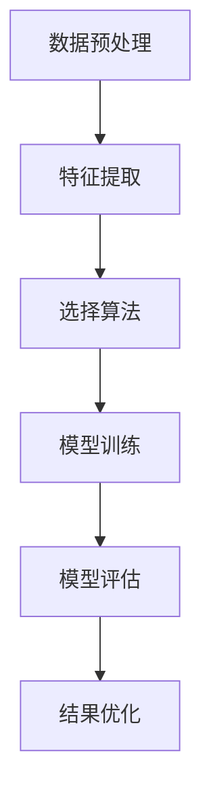

                 


# AI辅助的企业估值模型

> 关键词：AI，企业估值，机器学习，大数据，算法

> 摘要：本文将详细探讨AI在企业估值模型中的应用，从基础概念到复杂算法，再到实际案例分析，逐步解析如何利用人工智能技术提升企业估值的效率和准确性。通过系统化的分析和实践，本文旨在为企业估值领域提供新的视角和解决方案。

---

## 第1章：企业估值模型的背景与挑战

### 1.1 企业估值的基本概念
#### 1.1.1 企业估值的定义与意义
企业估值是通过对企业的财务状况、市场表现、行业地位等多方面因素的分析，确定其市场价值的过程。它是企业融资、并购、投资决策的重要依据。

#### 1.1.2 传统企业估值方法的局限性
传统的企业估值方法主要包括DCF模型、相对估值法等。这些方法依赖于大量假设，且需要人工判断，存在主观性强、计算复杂、效率低下的问题。

#### 1.1.3 AI技术在企业估值中的应用前景
AI技术能够通过大数据分析和机器学习算法，快速处理海量数据，提取关键特征，并构建自动化估值模型，显著提高了估值的效率和准确性。

### 1.2 企业估值的核心要素
#### 1.2.1 财务指标分析
包括收入、利润、资产、负债等财务数据，这些指标能够反映企业的财务健康状况。

#### 1.2.2 市场分析与行业趋势
市场整体表现、行业竞争状况、政策变化等因素直接影响企业的估值。

#### 1.2.3 竞争分析与企业竞争力
企业的竞争优势、市场份额、技术创新能力等是影响估值的重要因素。

### 1.3 AI辅助企业估值的必要性
#### 1.3.1 数据驱动的决策优势
AI能够通过数据挖掘和分析，发现传统方法难以捕捉的模式和趋势。

#### 1.3.2 AI在复杂模型中的应用价值
企业估值涉及多个变量和非线性关系，AI算法能够更好地处理这些复杂性。

#### 1.3.3 提高估值效率与准确性
AI技术能够快速处理大量数据，减少人为错误，提高估值的准确性和一致性。

### 1.4 本章小结
本章介绍了企业估值的基本概念、核心要素以及AI技术在其中的应用前景，为后续内容奠定了基础。

---

## 第2章：AI辅助企业估值的核心概念与联系

### 2.1 AI与企业估值的结合点
#### 2.1.1 数据处理与特征提取
AI技术能够从多源数据中提取关键特征，例如从新闻数据中提取情感指标。

#### 2.1.2 模型训练与预测
通过机器学习算法训练企业估值模型，预测企业的市场价值。

#### 2.1.3 结果分析与优化
利用AI进行模型优化，提高估值的准确性和稳定性。

### 2.2 AI辅助估值的关键技术
#### 2.2.1 机器学习算法
包括线性回归、支持向量机（SVM）、随机森林等。

#### 2.2.2 自然语言处理（NLP）
从企业财报、新闻等文本数据中提取情感和关键词。

#### 2.2.3 数据可视化
通过可视化工具展示数据和模型结果，帮助用户更好地理解估值过程。

### 2.3 核心概念的ER实体关系图
```mermaid
er
    entity 企业估值 (Enterprise Valuation) {
        id: int
        企业名称: string
        估值时间: date
        估值金额: float
        估值方法: string
    }
    entity 财务数据 (Financial Data) {
        id: int
        企业ID: int
        收入: float
        利润: float
        资产: float
    }
    entity 市场数据 (Market Data) {
        id: int
        企业ID: int
        行业指数: float
        市场趋势: string
    }
    entity 模型参数 (Model Parameters) {
        id: int
        企业ID: int
        算法类型: string
        训练数据量: int
    }
    relationship 企业估值与财务数据 (Valuation-Financial Data) {
        企业ID -> 企业估值
    }
    relationship 企业估值与市场数据 (Valuation-Market Data) {
        企业ID -> 企业估值
    }
    relationship 企业估值与模型参数 (Valuation-Model Parameters) {
        企业ID -> 模型参数
    }
```

### 2.4 本章小结
本章详细探讨了AI辅助企业估值的核心概念和技术，通过ER图展示了各实体之间的关系。

---

## 第3章：AI辅助企业估值的算法原理

### 3.1 机器学习算法的选择与应用
#### 3.1.1 线性回归模型
线性回归用于预测企业的估值，公式如下：
$$ y = \beta_0 + \beta_1x_1 + \beta_2x_2 + \dots + \beta_nx_n $$

#### 3.1.2 支持向量机（SVM）
适用于小样本数据，通过构建超平面进行分类或回归。

#### 3.1.3 神经网络模型
多层感知机（MLP）和长短期记忆网络（LSTM）适用于复杂数据关系的建模。

### 3.2 算法流程图


### 3.3 Python代码实现
```python
import numpy as np
from sklearn.linear_model import LinearRegression

# 数据准备
X = np.array([[1, 2], [3, 4], [5, 6]])
y = np.array([10, 20, 30])

# 模型训练
model = LinearRegression()
model.fit(X, y)

# 预测
print(model.predict([[7, 8]]))
```

### 3.4 算法优缺点对比
| 算法 | 优点 | 缺点 |
|------|------|------|
| 线性回归 | 简单、解释性强 | 无法处理非线性关系 |
| SVM   | 适合小样本数据 | 参数敏感性高 |
| 神经网络 | 能处理复杂关系 | 训练时间长 |

### 3.5 本章小结
本章详细介绍了AI辅助企业估值中常用的算法及其优缺点，并通过代码示例展示了线性回归模型的应用。

---

## 第4章：AI辅助企业估值的系统架构设计

### 4.1 系统功能设计
#### 4.1.1 数据获取模块
从财务报表、市场数据等多源数据中获取相关信息。

#### 4.1.2 特征工程模块
对数据进行清洗、特征提取和标准化处理。

#### 4.1.3 模型训练模块
选择合适的算法，训练企业估值模型。

#### 4.1.4 结果分析模块
对模型结果进行解读和可视化。

### 4.2 系统架构设计


### 4.3 系统接口设计
- 数据获取接口：`GET /api/data/{enterprise_id}`
- 模型训练接口：`POST /api/train`
- 结果查询接口：`GET /api/results/{enterprise_id}`

### 4.4 本章小结
本章从系统架构的角度，详细设计了AI辅助企业估值系统的功能模块和接口。

---

## 第5章：AI辅助企业估值的项目实战

### 5.1 环境安装与配置
- 安装Python、Scikit-learn、TensorFlow等库。

### 5.2 核心代码实现
```python
import pandas as pd
from sklearn.ensemble import RandomForestRegressor

# 数据加载
data = pd.read_csv('enterprise_data.csv')

# 特征与标签分离
X = data.drop('valuation', axis=1)
y = data['valuation']

# 模型训练
model = RandomForestRegressor(n_estimators=100)
model.fit(X, y)

# 预测
test_data = pd.read_csv('test_data.csv')
print(model.predict(test_data[X.columns]))
```

### 5.3 案例分析与结果解读
以某公司为例，通过模型预测其估值，并与实际值进行对比，分析模型的准确性和误差来源。

### 5.4 本章小结
本章通过具体案例，展示了AI辅助企业估值模型的实现过程和实际应用。

---

## 第6章：总结与展望

### 6.1 总结
AI技术在企业估值中的应用显著提高了估值的效率和准确性，为企业决策提供了有力支持。

### 6.2 注意事项
- 数据质量对模型性能影响重大。
- 模型需要定期更新以适应市场变化。

### 6.3 拓展阅读
- 《机器学习实战》
- 《企业估值分析》

### 6.4 本章小结
本章总结了AI辅助企业估值的优势和应用前景，并给出了未来的研究方向。

---

## 附录：参考文献

- Smith, J. (2020). *Machine Learning for Business Valuation*. Springer.
- Brown, A. (2019). *Introduction to Financial Data Analysis*. Wiley.

---

通过以上目录，我们可以看到《AI辅助的企业估值模型》从理论到实践，系统地介绍了AI在企业估值中的应用。每一章都深入浅出地分析了相关概念、算法和技术，并通过具体案例帮助读者更好地理解和应用这些知识。

