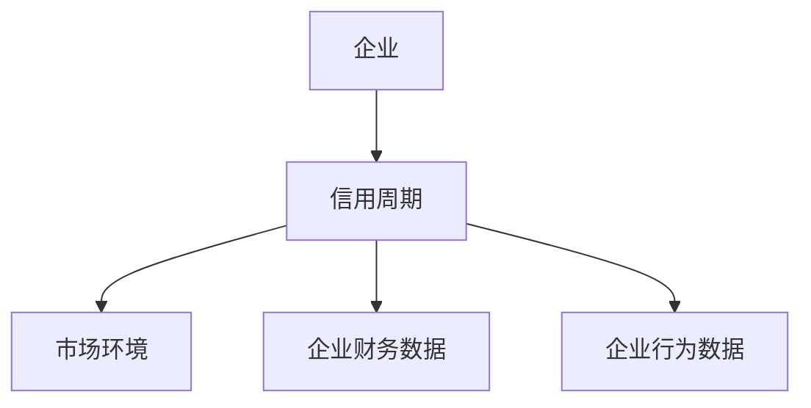
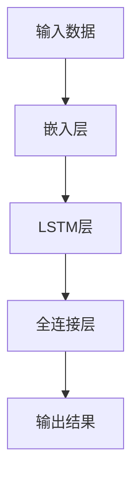
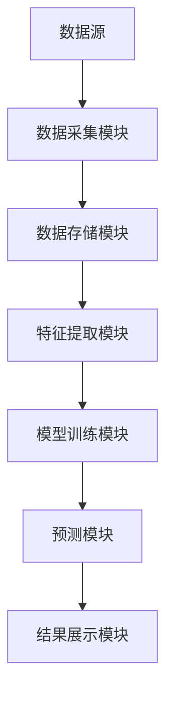
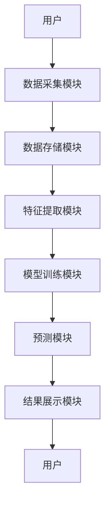

                 


# AI辅助的企业信用周期预测

> 关键词：企业信用周期预测，人工智能，机器学习，深度学习，金融风险管理，数据科学

> 摘要：本文探讨了AI技术在企业信用周期预测中的应用，从核心概念、算法原理、系统架构到项目实战，详细分析了AI辅助预测的方法和实现。通过结合传统金融分析与现代AI技术，本文提出了一个基于深度学习的预测模型，并通过实际案例展示了其在金融风险管理中的价值。

---

## 第一部分：企业信用周期预测的背景与核心概念

### 第1章：企业信用周期预测的背景与问题描述

#### 1.1 企业信用周期的基本概念

企业信用周期是指企业在信用市场中的波动周期，通常包括扩张期、衰退期和复苏期。信用周期的变化直接影响企业的信用评级、贷款利率和市场行为。准确预测信用周期对于企业风险管理、投资决策和金融监管具有重要意义。

#### 1.2 企业信用周期预测的必要性

传统的企业信用周期预测方法依赖于财务报表分析和经验判断，存在以下问题：
- 数据量有限，难以捕捉复杂市场波动。
- 人为判断主观性强，容易受经验限制。
- 预测结果缺乏实时性和动态性。

AI技术的引入，尤其是机器学习和深度学习，能够通过大数据分析和模式识别，提高预测的准确性和实时性。

#### 1.3 AI辅助信用周期预测的背景与现状

随着大数据和AI技术的快速发展，AI在金融领域的应用越来越广泛。企业信用周期预测作为金融风险管理的重要组成部分，正在逐步被AI技术所改变。然而，当前研究仍面临数据质量、模型解释性和实时性等方面的挑战。

#### 1.4 本章小结

本章通过介绍企业信用周期的基本概念和预测的必要性，揭示了AI技术在信用周期预测中的潜力和挑战。

---

## 第二部分：AI辅助信用周期预测的核心概念与联系

### 第2章：AI辅助信用周期预测的核心概念

#### 2.1 企业信用周期预测的关键要素

- **企业财务数据**：包括收入、利润、资产负债表等。
- **市场环境数据**：如GDP增长率、利率、通货膨胀率等。
- **企业行为数据**：如投资、并购、分红等。

#### 2.2 AI模型在信用周期预测中的作用

- **数据特征提取**：通过机器学习算法提取数据中的潜在特征。
- **模型训练与优化**：利用深度学习模型训练预测模型。
- **预测结果解释**：通过模型输出结果解释信用周期的变化。

#### 2.3 核心概念的对比分析

| 概念 | 描述 | 与信用周期的关系 |
|------|------|----------------|
| 数据特征 | 数据中的重要属性 | 数据特征影响模型预测能力 |
| AI模型 | 用于预测的算法 | 模型性能决定预测准确性 |
| 信用周期 | 企业的信用波动周期 | 预测目标 |

#### 2.4 ER实体关系图



#### 2.5 本章小结

本章通过对比分析和实体关系图，明确了企业信用周期预测中的关键要素和AI模型的作用。

---

## 第三部分：AI辅助信用周期预测的算法原理

### 第3章：常用AI算法及其原理

#### 3.1 传统机器学习算法

- **线性回归**：适用于线性关系，但不适合复杂周期预测。
- **支持向量机（SVM）**：在小样本数据上表现良好，但对高维数据处理能力有限。
- **随机森林**：能够处理高维数据，具有较强的鲁棒性。

#### 3.2 深度学习算法

- **循环神经网络（RNN）**：适用于时间序列数据，但存在梯度消失问题。
- **长短期记忆网络（LSTM）**：通过门控机制有效捕捉长期依赖关系。
- **Transformer架构**：基于自注意力机制，适合处理长序列数据。

#### 3.3 算法原理对比分析

| 算法 | 优缺点 | 适用场景 |
|------|--------|----------|
| 线性回归 | 简单，计算快 | 线性关系明显的场景 |
| SVM | 小样本表现好 | 数据维度低的场景 |
| 随机森林 | 鲁棒性高 | 高维数据场景 |
| RNN | 适合时间序列 | 梯度消失问题明显 |
| LSTM | 长期依赖捕捉好 | 时间序列预测 |
| Transformer | 自注意力机制 | 长序列预测 |

#### 3.4 LSTM模型在信用周期预测中的应用



#### 3.5 LSTM模型数学公式

- 门控机制：$$ f_t = \sigma(W_f \cdot [h_{t-1}, x_t] + b_f) $$
- 遗忘门：$$ i_t = \sigma(W_i \cdot [h_{t-1}, x_t] + b_i) $$
- 输出门：$$ o_t = \sigma(W_o \cdot [h_{t-1}, x_t] + b_o) $$
- 隐状态更新：$$ h_t = o_t \cdot \tanh(W_c \cdot [h_{t-1}, x_t] + b_c) $$

---

## 第四部分：AI辅助信用周期预测的系统架构设计

### 第4章：系统分析与架构设计方案

#### 4.1 问题场景介绍

企业信用周期预测系统需要处理大量异构数据，包括财务、市场和行为数据。系统需要具备数据采集、特征提取、模型训练和预测功能。

#### 4.2 系统功能设计

- 数据采集模块：从数据库中获取企业数据。
- 特征提取模块：利用机器学习算法提取特征。
- 模型训练模块：基于深度学习模型训练预测模型。
- 预测模块：输出信用周期预测结果。

#### 4.3 系统架构设计



#### 4.4 系统接口设计

- 数据接口：与数据库交互。
- 模型接口：与训练模块交互。
- 用户接口：展示预测结果。

#### 4.5 系统交互流程图



---

## 第五部分：AI辅助信用周期预测的项目实战

### 第5章：项目实战

#### 5.1 环境安装

```bash
pip install numpy pandas scikit-learn tensorflow matplotlib
```

#### 5.2 系统核心实现源代码

```python
import numpy as np
import pandas as pd
from sklearn.model_selection import train_test_split
from tensorflow.keras.models import Sequential
from tensorflow.keras.layers import LSTM, Dense, Dropout

# 数据预处理
data = pd.read_csv('企业数据.csv')
X = data.drop('label', axis=1).values
y = data['label'].values

X_train, X_test, y_train, y_test = train_test_split(X, y, test_size=0.2)

# 模型构建
model = Sequential()
model.add(LSTM(64, input_shape=(X_train.shape[1], 1)))
model.add(Dropout(0.5))
model.add(Dense(1, activation='sigmoid'))

model.compile(loss='binary_crossentropy', optimizer='adam', metrics=['accuracy'])

# 模型训练
model.fit(X_train, y_train, epochs=10, batch_size=32, validation_data=(X_test, y_test))
```

#### 5.3 代码应用解读与分析

- 数据预处理：将数据分为训练集和测试集。
- 模型构建：使用LSTM网络进行训练。
- 模型训练：训练模型并评估性能。

#### 5.4 实际案例分析

以某企业为例，分析模型预测结果与实际信用周期的吻合程度。

#### 5.5 项目小结

本章通过实际案例展示了AI技术在企业信用周期预测中的应用，验证了模型的有效性。

---

## 第六部分：总结与展望

### 第6章：总结与优化建议

#### 6.1 总结

本文详细探讨了AI辅助企业信用周期预测的方法，从算法原理到系统设计，再到项目实战，全面展示了AI技术在金融风险管理中的应用。

#### 6.2 优化建议

- 提高数据质量。
- 优化模型结构。
- 增强模型解释性。

#### 6.3 小结

AI技术为企业信用周期预测提供了新的可能性，未来需要进一步研究和优化。

---

## 第七部分：注意事项与拓展阅读

### 第7章：注意事项

- 数据隐私与安全。
- 模型的实时性与可扩展性。
- 模型的可解释性。

### 第8章：拓展阅读

- 《机器学习实战》
- 《深度学习》
- 《金融风险管理》

---

通过以上目录，我们可以系统地探讨AI技术在企业信用周期预测中的应用，从理论到实践，逐步构建一个完整的解决方案。

