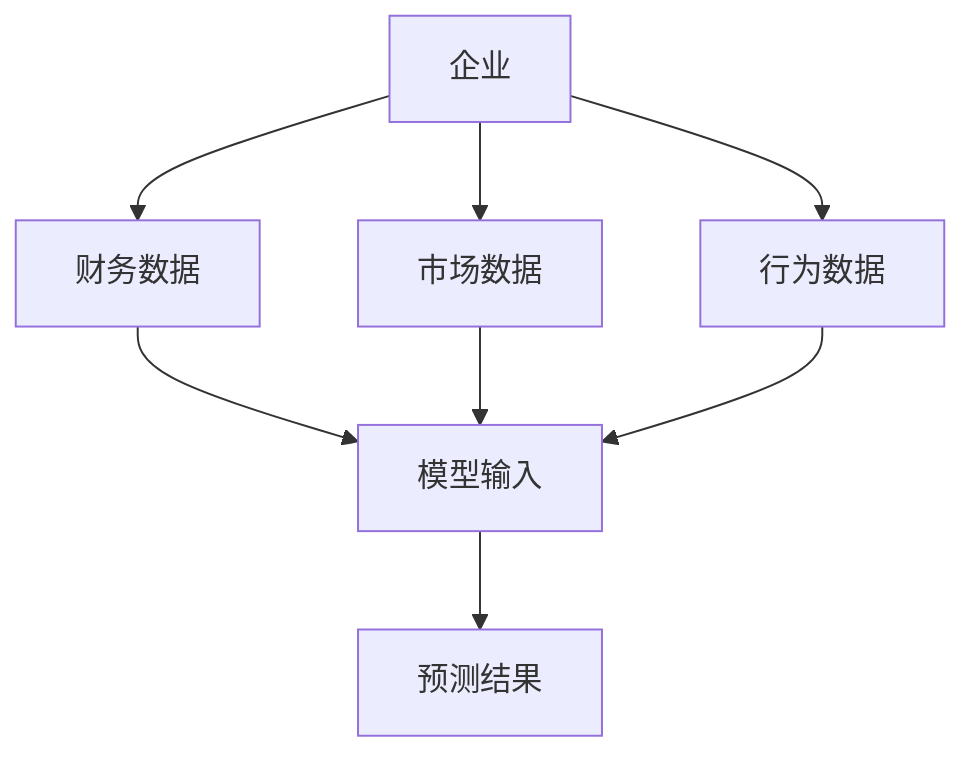
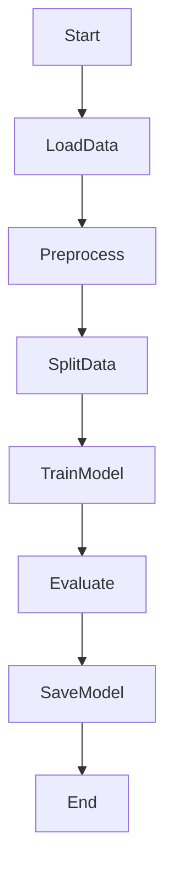

                 


# 《AI辅助的企业信用周期预测模型》

## 关键词：
- 企业信用周期预测
- 人工智能
- 机器学习
- 深度学习
- 数据分析

## 摘要：
随着全球经济的快速发展，企业信用周期预测成为企业风险管理的重要组成部分。本文将探讨如何利用人工智能技术，特别是机器学习和深度学习算法，构建高效的信用周期预测模型。通过分析企业财务数据、市场环境和企业行为数据，结合系统设计和实际项目案例，本文详细阐述了AI辅助信用周期预测的核心概念、算法原理、系统架构以及实战应用，为读者提供全面的技术指导。

---

# 第1章: 企业信用周期预测的背景与挑战

## 1.1 企业信用周期预测的背景
### 1.1.1 企业信用周期的基本概念
- 信用周期的定义
- 信用周期对企业经营的影响
- 信用周期预测的经济意义

### 1.1.2 问题背景
- 全球经济波动对企业信用周期的影响
- 企业信用风险的增加
- 传统信用评估方法的局限性

### 1.1.3 信用周期预测的重要性
- 提前识别企业信用风险
- 优化企业财务决策
- 提高企业风险管理能力

## 1.2 核心问题与挑战
### 1.2.1 信用周期预测的核心问题
- 数据特征提取
- 模型选择与优化
- 预测结果的可解释性

### 1.2.2 数据的复杂性与不完整性
- 数据维度高
- 数据稀疏性
- 数据噪声

### 1.2.3 模型的可解释性与稳定性要求
- 预测结果需具备可解释性
- 模型需具备稳定性
- 预测结果的实时性要求

## 1.3 传统方法的局限性
### 1.3.1 传统信用评估方法
- 财务比率分析法
- Z-score模型
- 专家评分法

### 1.3.2 传统方法的不足
- 数据依赖性高
- 计算复杂度高
- 预测精度有限

### 1.3.3 引入AI技术的必要性
- AI技术在信用周期预测中的优势
- 数据驱动的预测方法
- 自适应学习能力

## 1.4 本章小结
- 介绍了企业信用周期预测的背景和重要性
- 分析了传统方法的局限性
- 强调了引入AI技术的必要性

---

# 第2章: AI辅助企业信用周期预测的核心概念

## 2.1 核心概念与原理
### 2.1.1 数据特征
- 财务数据
- 市场数据
- 行为数据

### 2.1.2 模型结构
- 机器学习模型
- 深度学习模型
- 混合模型

### 2.1.3 算法选择
- 监督学习与无监督学习
- 分类与回归算法
- 时间序列预测方法

## 2.2 数据特征分析
### 2.2.1 数据特征提取
- 财务比率分析
- 市场趋势分析
- 行为模式识别

### 2.2.2 数据特征的对比
- 表格对比不同特征的重要性
- 数据特征的权重分析

### 2.2.3 数据预处理
- 数据清洗
- 数据标准化
- 数据增强

## 2.3 模型构建与优化
### 2.3.1 模型选择
- 逻辑回归
- 支持向量机
- 随机森林
- LSTM网络

### 2.3.2 模型优化
- 超参数调优
- 模型集成
- 正则化技术

## 2.4 本章小结
- 探讨了AI辅助预测的核心概念
- 分析了数据特征与模型结构
- 介绍了算法选择与优化策略

---

# 第3章: 基于机器学习的信用周期预测算法

## 3.1 机器学习算法概述
### 3.1.1 监督学习
- 线性回归
- 支持向量机
- 决策树

### 3.1.2 非监督学习
- 聚类分析
- 主成分分析

### 3.1.3 深度学习
- 神经网络
- LSTM网络
- Transformer模型

## 3.2 算法实现
### 3.2.1 逻辑回归模型
- 模型结构
- 损失函数
- 优化算法

### 3.2.2 随机森林模型
- 树结构
- 特征重要性
- 模型调优

## 3.3 算法对比与选择
### 3.3.1 算法性能对比
- 分类准确率
- 召回率
- F1分数

### 3.3.2 算法适用场景
- 时间序列预测
- 数据特征复杂性
- 模型可解释性

## 3.4 本章小结
- 介绍了机器学习算法的基本原理
- 分析了不同算法的优缺点
- 探讨了算法选择与优化策略

---

# 第4章: 基于深度学习的信用周期预测模型

## 4.1 深度学习模型概述
### 4.1.1 RNN与LSTM网络
- RNN结构
- LSTM机制
- 应用场景

### 4.1.2 Transformer模型
- 注意力机制
- 编码器-解码器结构
- 应用优势

## 4.2 LSTM网络实现
### 4.2.1 模型结构
- 输入层
- LSTM层
- 全连接层
- 输出层

### 4.2.2 损失函数与优化算法
- 交叉熵损失
- Adam优化器
- 学习率调整

## 4.3 模型训练与评估
### 4.3.1 数据集划分
- 训练集
- 验证集
- 测试集

### 4.3.2 模型评估指标
- 准确率
- 召回率
- F1分数
- AUC曲线

## 4.4 本章小结
- 介绍了深度学习模型的基本原理
- 分析了LSTM网络与Transformer模型的应用
- 探讨了模型训练与评估方法

---

# 第5章: 企业信用周期预测系统的架构设计

## 5.1 系统设计概述
### 5.1.1 系统目标
- 实时预测
- 高效计算
- 易用性

### 5.1.2 系统架构
- 分层架构
- 模块化设计
- 可扩展性

## 5.2 系统功能设计
### 5.2.1 数据采集模块
- 数据接口
- 数据预处理
- 数据存储

### 5.2.2 模型训练模块
- 数据加载
- 模型构建
- 模型训练

### 5.2.3 预测与分析模块
- 输入接口
- 预测结果输出
- 结果分析

## 5.3 系统实现
### 5.3.1 系统架构图
- Mermaid图展示系统架构

### 5.3.2 模块交互流程
- 序列图展示模块交互

## 5.4 本章小结
- 介绍了系统的架构设计
- 分析了系统功能模块
- 探讨了模块交互流程

---

# 第6章: 项目实战——构建企业信用周期预测模型

## 6.1 项目背景
### 6.1.1 项目目标
- 构建预测模型
- 验证模型性能
- 实际应用测试

### 6.1.2 数据来源
- 公开数据集
- 企业财务数据
- 市场数据

## 6.2 项目实施
### 6.2.1 环境搭建
- 安装Python
- 安装机器学习库
- 安装深度学习框架

### 6.2.2 核心代码实现
- 数据预处理代码
- 模型训练代码
- 预测与评估代码

## 6.3 项目结果分析
### 6.3.1 模型性能评估
- 准确率分析
- 召回率分析
- 案例分析

### 6.3.2 模型优化
- 调整超参数
- 改进模型结构
- 提升预测精度

## 6.4 本章小结
- 介绍了项目的实施过程
- 分析了模型性能
- 探讨了优化策略

---

# 第7章: 最佳实践与注意事项

## 7.1 最佳实践
### 7.1.1 数据处理
- 数据清洗
- 数据标准化
- 数据增强

### 7.1.2 模型选择
- 根据数据特征选择模型
- 结合业务需求选择算法
- 定期更新模型

### 7.1.3 结果解读
- 理解模型预测结果
- 分析预测误差
- 提供改进建议

## 7.2 注意事项
### 7.2.1 数据质量问题
- 数据缺失
- 数据偏差
- 数据噪声

### 7.2.2 模型风险
- 过度拟合
- 模型解释性
- 模型稳定性

## 7.3 拓展阅读
### 7.3.1 相关书籍
- 《机器学习实战》
- 《深度学习》
- 《时间序列分析》

### 7.3.2 技术博客
- Towards Data Science
- Medium AI专栏
- 知乎专栏

## 7.4 本章小结
- 总结了最佳实践
- 提出了注意事项
- 指导了进一步学习

---

# 参考文献
- 列出相关的书籍、论文和技术文档

---

# 附录
## 附录A: 核心代码实现
### A.1 数据预处理代码
```python
import pandas as pd
import numpy as np

# 加载数据
data = pd.read_csv('credit.csv')

# 数据清洗
data.dropna(inplace=True)
data = data.drop_duplicates()

# 标准化处理
from sklearn.preprocessing import StandardScaler
scaler = StandardScaler()
data_scaled = scaler.fit_transform(data)
```

### A.2 模型训练代码
```python
from tensorflow.keras import layers
from tensorflow.keras.models import Sequential

# 构建LSTM模型
model = Sequential()
model.add(LSTM(64, input_shape=(timesteps, features)))
model.add(Dense(1, activation='sigmoid'))
model.compile(loss='binary_crossentropy', optimizer='adam', metrics=['accuracy'])
model.fit(x_train, y_train, epochs=10, batch_size=32)
```

---

## 附录B: Mermaid流程图
### B.1 实体关系图


### B.2 算法流程图


---

通过以上目录结构，文章将从企业信用周期预测的背景、核心概念、算法原理、系统架构到项目实战，进行全面而深入的探讨，为读者提供系统的技术指导和实践参考。

