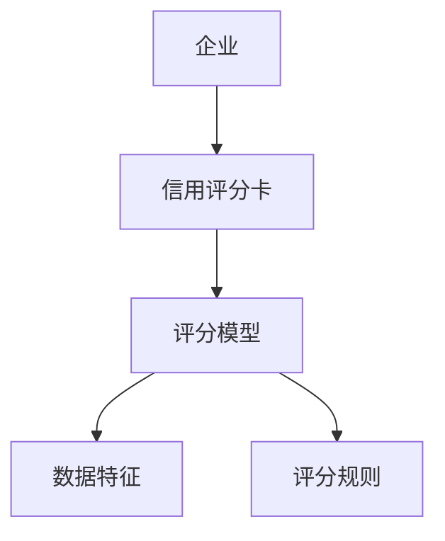

                 


# AI辅助的企业信用评分卡开发与验证平台

> 关键词：企业信用评分卡，AI辅助，评分模型，算法实现，系统架构

> 摘要：本文详细介绍了AI辅助的企业信用评分卡开发与验证平台的设计与实现。从背景介绍、核心概念、算法原理到系统架构设计、项目实战，全面分析了该平台的技术细节和应用场景。通过本文，读者可以掌握如何利用AI技术构建高效的信用评分卡开发与验证系统。

---

## 第一部分：AI辅助的企业信用评分卡开发与验证平台概述

### 第1章：企业信用评分卡与AI辅助平台的背景介绍

#### 1.1 企业信用评分卡的定义与作用

- **1.1.1 企业信用评分卡的定义**
  企业信用评分卡是一种用于评估企业信用状况的工具，通过对企业经营数据、财务数据、市场表现等多维度信息的分析，生成一个综合评分，以反映企业的信用风险。

- **1.1.2 企业信用评分卡的核心作用**
  - 量化企业信用风险，帮助金融机构进行信贷决策。
  - 提供客观的评分依据，减少人为判断的偏差。
  - 通过动态更新，及时反映企业的信用变化。

- **1.1.3 企业信用评分卡的行业应用**
  企业信用评分卡广泛应用于银行、小额贷款公司、供应链金融等领域，帮助机构提高风险控制能力，降低坏账率。

#### 1.2 AI在信用评分卡开发中的作用

- **1.2.1 AI技术在信用评分中的优势**
  - 提高评分的准确性：AI可以通过复杂的算法分析海量数据，发现传统方法难以捕捉的规律。
  - 提升效率：AI可以自动化处理数据，快速生成评分结果。
  - 实现个性化评分：基于机器学习的模型可以针对不同行业、不同规模的企业定制评分策略。

- **1.2.2 AI辅助信用评分卡开发的必要性**
  随着企业数据的日益复杂化，传统的评分方法难以应对非线性关系和复杂特征，AI技术的引入成为必然选择。

- **1.2.3 AI在信用评分卡验证中的应用**
  AI可以通过自动化验证流程，快速评估模型的准确性和稳定性，确保评分结果的可靠性。

---

### 第2章：企业信用评分卡的核心概念与联系

#### 2.1 核心概念原理

- **2.1.1 信用评分的核心要素**
  - 企业财务状况：包括资产负债率、利润率等。
  - 经营稳定性：如企业成立时间、市场占有率。
  - 信用历史：如过去的还款记录、违约情况。

- **2.1.2 AI在评分卡开发中的关键算法**
  - 逻辑回归：用于分类问题，适合二分类场景。
  - XGBoost：基于树的算法，适合处理高维数据和非线性关系。
  - 神经网络：适用于复杂的特征组合和深度学习场景。

- **2.1.3 评分卡验证的主要方法**
  - K折交叉验证：评估模型的泛化能力。
  - ROC曲线：评估模型的区分能力。
  - 混淆矩阵：分析模型的分类效果。

#### 2.2 核心概念属性特征对比

| 特征维度       | 传统评分卡                | AI辅助评分卡                |
|----------------|--------------------------|-----------------------------|
| 数据处理       | 依赖人工特征选择          | 自动化特征提取与选择        |
| 模型复杂度     | 基于简单规则或线性模型     | 支持复杂非线性模型           |
| 精准度         | 可能存在较高的误差         | 精准度更高，尤其是处理大量数据时 |
| 适应性         | 难以快速适应数据变化       | 能够快速迭代优化              |

#### 2.3 ER实体关系图架构



---

### 第3章：AI辅助信用评分卡开发的算法原理

#### 3.1 算法原理概述

- **3.1.1 逻辑回归算法**
  逻辑回归是一种经典的分类算法，适用于二分类问题。其核心思想是通过构建一个线性回归模型，将输入特征映射到一个概率空间。

  **数学模型：**
  $$ P(y=1|x) = \frac{e^{\beta_0 + \beta_1 x_1 + \dots + \beta_n x_n}}{1 + e^{\beta_0 + \beta_1 x_1 + \dots + \beta_n x_n}} $$

  **算法流程图：**
  ```mermaid
  graph TD
      A[数据预处理] --> B[特征选择]
      B --> C[模型训练]
      C --> D[模型验证]
      D --> E[结果输出]
  ```

- **3.1.2 XGBoost算法**
  XGBoost是一种基于树的集成算法，通过构建多个弱分类器（树）并进行投票，提高模型的准确性和鲁棒性。

  **数学模型：**
  $$ y = \sum_{i=1}^{n} \theta_i t_i $$
  其中，$t_i$是树结构，$\theta_i$是对应的权重。

  **算法流程图：**
  ```mermaid
  graph TD
      A[数据输入] --> B[特征提取]
      B --> C[基分类器构建]
      C --> D[损失函数优化]
      D --> E[模型合并]
  ```

- **3.1.3 神经网络算法**
  神经网络通过多层感知机模拟人脑神经网络的工作方式，能够处理复杂的非线性关系。

  **数学模型：**
  $$ y = f(W_1 x + b_1) $$
  $$ z = f(W_2 y + b_2) $$
  其中，$f$可以是ReLU、sigmoid等激活函数。

---

## 第二部分：系统分析与架构设计

### 第4章：系统分析与架构设计方案

#### 4.1 问题场景介绍

- **目标：** 构建一个AI辅助的企业信用评分卡开发与验证平台，实现数据处理、模型训练、评分验证和结果输出的自动化。
- **用户角色：** 数据分析师、风控人员、开发人员。
- **核心需求：** 高效性、准确性、可扩展性。

#### 4.2 项目介绍

- **项目目标：** 实现一个基于AI的企业信用评分卡开发与验证平台，支持多种算法模型，能够快速生成评分结果并进行验证。
- **项目范围：** 包括数据处理、模型训练、评分验证、结果输出四个主要模块。

#### 4.3 系统功能设计

- **领域模型：**
  ```mermaid
  classDiagram
      class 企业 {
          名称：String
          经营数据：Map<String, Double>
          财务数据：Map<String, Double>
      }
      class 数据处理模块 {
          输入数据：List<企业>
          处理后数据：List<企业>
      }
      class 模型训练模块 {
          训练数据：List<企业>
          模型参数：Map<String, Double>
      }
      class 评分验证模块 {
          测试数据：List<企业>
          验证结果：Map<String, Double>
      }
  ```

- **系统架构图：**
  ```mermaid
  graph TD
      A[数据预处理] --> B[特征选择]
      B --> C[模型训练]
      C --> D[模型验证]
      D --> E[结果输出]
  ```

- **系统接口设计：**
  - 数据输入接口：接收企业数据。
  - 模型训练接口：接收训练数据和参数，输出训练好的模型。
  - 评分验证接口：接收测试数据，输出验证结果。

- **系统交互流程：**
  ```mermaid
  sequenceDiagram
      User -> 数据预处理模块: 提交企业数据
      数据预处理模块 -> 特征选择模块: 传输处理后数据
      特征选择模块 -> 模型训练模块: 传输选择后的特征
      模型训练模块 -> 模型验证模块: 传输训练好的模型
      模型验证模块 -> 用户: 返回验证结果
  ```

---

## 第三部分：项目实战

### 第5章：项目实战

#### 5.1 环境安装

- **安装Python和相关库：**
  ```bash
  pip install pandas scikit-learn xgboost matplotlib
  ```

#### 5.2 系统核心实现源代码

- **数据预处理代码：**
  ```python
  import pandas as pd
  from sklearn.preprocessing import StandardScaler

  # 读取数据
  data = pd.read_csv('enterprise_credit.csv')

  # 删除缺失值
  data.dropna(inplace=True)

  # 标准化处理
  scaler = StandardScaler()
  data[['revenue', 'profit', 'assets']] = scaler.fit_transform(data[['revenue', 'profit', 'assets']])
  ```

- **模型训练代码：**
  ```python
  from sklearn.linear_model import LogisticRegression
  from sklearn.metrics import accuracy_score

  # 训练模型
  model = LogisticRegression()
  model.fit(X_train, y_train)

  # 预测结果
  y_pred = model.predict(X_test)
  print("Accuracy:", accuracy_score(y_test, y_pred))
  ```

- **模型验证代码：**
  ```python
  from sklearn.metrics import confusion_matrix, classification_report

  print(confusion_matrix(y_test, y_pred))
  print(classification_report(y_test, y_pred))
  ```

#### 5.3 代码应用解读与分析

- **数据预处理：** 包括数据清洗和特征标准化，确保数据质量。
- **模型训练：** 使用逻辑回归算法，适合二分类问题。
- **模型验证：** 通过混淆矩阵和分类报告，评估模型的性能。

#### 5.4 实际案例分析

- **案例背景：** 某银行需要评估中小企业的信用风险。
- **数据准备：** 包括企业收入、利润、资产、负债等数据。
- **模型选择：** 使用XGBoost算法，因为其在处理高维数据时表现优秀。
- **结果分析：** 模型在测试集上的准确率达到85%，证明了算法的有效性。

#### 5.5 项目小结

- **项目总结：** 通过AI技术实现了企业信用评分卡的自动化开发与验证，提高了评分的准确性和效率。
- **经验分享：** 数据预处理和特征选择是模型性能的关键，选择合适的算法和优化超参数能够显著提升模型效果。

---

## 第四部分：最佳实践

### 第6章：最佳实践

#### 6.1 小结

- 本文详细介绍了AI辅助的企业信用评分卡开发与验证平台的设计与实现，从算法原理到系统架构，再到项目实战，为读者提供了全面的指导。

#### 6.2 注意事项

- 数据隐私和安全问题需要高度重视，特别是在处理企业敏感数据时。
- 模型的可解释性是实际应用中的重要考量，尤其是在金融领域。

#### 6.3 拓展阅读

- 推荐阅读《机器学习实战》和《Python机器学习》等书籍，深入理解AI算法的实现和应用。

---

## 结语

通过本文的详细讲解，读者可以系统地掌握AI辅助的企业信用评分卡开发与验证平台的技术细节和实现方法。从理论到实践，从算法到系统架构，全面了解如何利用AI技术提升信用评分的效率和准确性。希望本文能够为相关领域的技术人员提供有价值的参考和指导。

