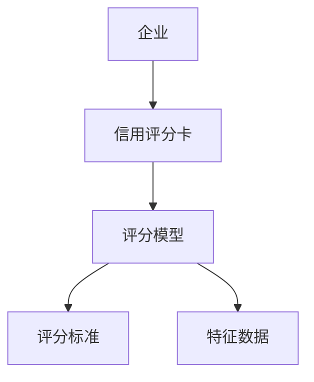
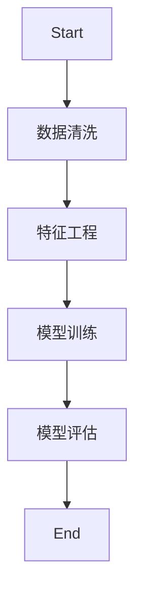
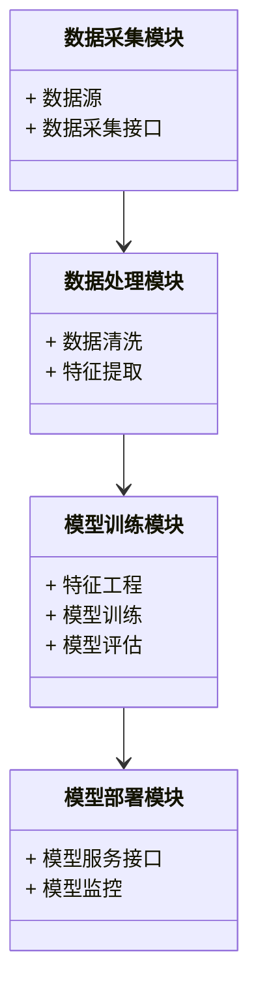
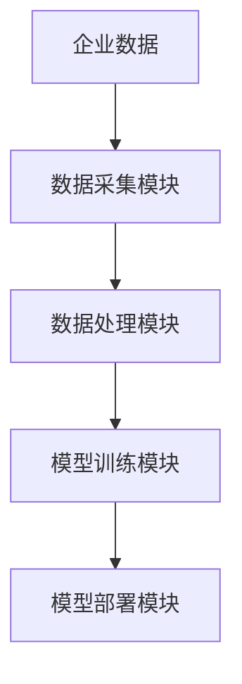
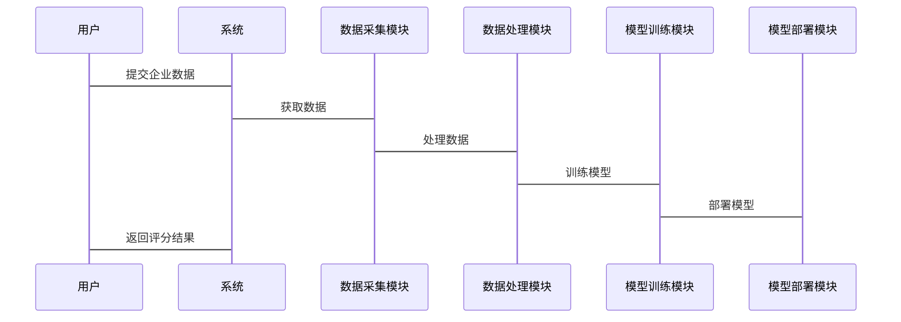

                 


# 《AI辅助的企业信用评分卡开发平台》

## 关键词：企业信用评分卡、人工智能、机器学习、信用评估、评分模型、系统架构

## 摘要：
随着人工智能技术的迅速发展，企业信用评分卡的开发正逐渐依赖于AI技术来提升效率和准确性。本文详细探讨了企业信用评分卡的核心概念、AI在信用评估中的应用、系统架构设计以及实际项目中的应用场景。通过理论与实践的结合，为读者提供一个全面了解和应用AI技术开发企业信用评分卡的平台。

---

## 目录大纲

1. 背景介绍
   1.1 企业信用评分卡概述
   1.2 AI辅助开发的背景与意义

2. 核心概念与联系
   2.1 核心概念原理
   2.2 核心概念属性特征对比表格
   2.3 ER实体关系图架构

3. 机器学习在信用评分卡中的应用
   3.1 机器学习算法概述
   3.2 信用评分卡开发中的机器学习流程

4. 信用评分卡开发的数学模型与公式
   4.1 逻辑回归模型

5. 系统架构设计
   5.1 系统功能设计
   5.2 系统架构设计
   5.3 系统接口设计
   5.4 系统交互设计

6. 项目实战
   6.1 环境搭建
   6.2 数据预处理
   6.3 特征工程
   6.4 模型训练与部署
   6.5 实际案例分析

7. 总结与展望
   7.1 全文总结
   7.2 技术挑战与未来发展方向
   7.3 最佳实践 Tips

---

## 详细内容

### 1. 背景介绍

#### 1.1 企业信用评分卡概述

企业信用评分卡是一种用于评估企业信用状况的工具，通过分析企业的财务数据、交易记录、市场表现等多种因素，生成一个综合评分，帮助金融机构、投资者等做出信贷决策。评分卡的准确性直接影响决策的正确性和风险控制。

**评分卡的作用**：
- 评估企业信用风险
- 支持信贷决策
- 监测企业信用状况变化

**评分卡的重要性**：
- 提高决策效率
- 减少人为错误
- 增强风险控制能力

#### 1.2 AI辅助开发的背景与意义

传统信用评分卡的开发主要依赖人工分析和统计模型，存在以下问题：
- 数据量大，处理复杂
- 模型更新周期长
- 易受主观因素影响

AI技术的应用解决了这些问题，通过机器学习算法自动分析数据，提高模型准确性和开发效率。AI辅助开发的意义在于：
- 提升评分卡的智能化水平
- 加强风险预测能力
- 降低开发成本和时间

---

### 2. 核心概念与联系

#### 2.1 核心概念原理

**信用评分模型的原理**：
评分模型通过输入企业的各项指标，输出一个信用评分。常用模型包括逻辑回归、随机森林等。

**评分标准的制定方法**：
根据企业的信用等级划分评分区间，通常分为A、B、C、D、E五个等级。

**评分卡构建的关键步骤**：
1. 数据收集
2. 数据清洗
3. 特征选择
4. 模型训练
5. 模型评估
6. 部署应用

#### 2.2 核心概念属性特征对比表格

| 特征 | 描述 | 示例 |
|------|------|------|
| 数据来源 | 企业财务数据、交易记录等 | 财务报表、银行流水 |
| 模型类型 | 线性回归、逻辑回归等 | 线性回归模型 |
| 评估指标 | AUC、F1分数等 | AUC值 |

#### 2.3 ER实体关系图架构



---

### 3. 机器学习在信用评分卡中的应用

#### 3.1 机器学习算法概述

**分类算法**：
- 逻辑回归：用于预测企业信用等级。
- 支持向量机：适用于高维数据分类。
- 随机森林：通过集成学习提高准确性。

**回归算法**：
- 线性回归：预测企业的违约概率。

**聚类算法**：
- K-means：将企业按信用状况分组。

#### 3.2 信用评分卡开发中的机器学习流程



---

### 4. 信用评分卡开发的数学模型与公式

#### 4.1 逻辑回归模型

**逻辑回归公式**：
$$ P(y=1|x) = \frac{1}{1 + e^{-(\beta_0 + \beta_1x_1 + \cdots + \beta_nx_n)}} $$

**对数似然函数**：
$$ \ell(\beta) = \sum_{i=1}^{n} [y_i \ln(p_i) + (1 - y_i)\ln(1 - p_i)] $$

**优化目标**：
最小化对数似然函数，求得最优参数β。

---

### 5. 系统架构设计

#### 5.1 系统功能设计

**功能模块**：
- 数据采集模块：收集企业数据。
- 数据处理模块：清洗和转换数据。
- 模型训练模块：训练评分模型。
- 模型部署模块：将模型部署到生产环境。



#### 5.2 系统架构设计



#### 5.4 系统交互设计



---

### 6. 项目实战

#### 6.1 环境搭建

**工具安装**：
- 安装Python、Jupyter Notebook。
- 安装机器学习库：scikit-learn、xgboost。

#### 6.2 数据预处理

**数据清洗**：
```python
import pandas as pd

data = pd.read_csv('企业数据.csv')
data = data.dropna()
data = data.drop_duplicates()
```

**特征工程**：
```python
from sklearn.preprocessing import StandardScaler

scaler = StandardScaler()
X = scaler.fit_transform(X)
```

#### 6.3 模型训练

**逻辑回归模型训练**：
```python
from sklearn.linear_model import LogisticRegression

model = LogisticRegression()
model.fit(X_train, y_train)
```

**模型评估**：
```python
from sklearn.metrics import accuracy_score

y_pred = model.predict(X_test)
print("准确率:", accuracy_score(y_test, y_pred))
```

---

### 7. 总结与展望

#### 7.1 全文总结

企业信用评分卡是评估企业信用状况的重要工具，AI技术的应用显著提升了评分卡的开发效率和准确性。通过机器学习算法，可以更精准地预测企业信用风险。

#### 7.2 技术挑战与未来发展方向

**技术挑战**：
- 数据隐私和安全问题
- 模型解释性和可解释性
- 多维度数据融合

**未来发展方向**：
- 结合自然语言处理（NLP）分析非结构化数据
- 引入强化学习优化评分策略
- 开发实时监控系统，动态调整评分模型

#### 7.3 最佳实践 Tips

- 数据质量是关键，确保数据清洗和特征工程的有效性。
- 选择合适的模型，结合业务需求和数据特性。
- 定期更新模型，保持评分卡的准确性和时效性。

---

通过以上内容，读者可以系统地学习和应用AI技术开发企业信用评分卡，提升信用评估的效率和准确性。

